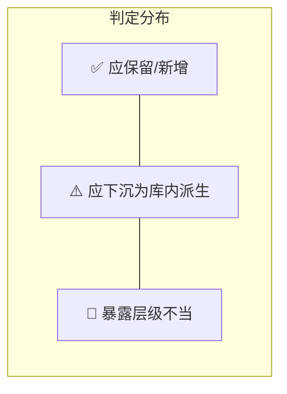

# Config 对外结构体 API 面审查报告

> **审查范围**: `include/1q/{airborne_radar,electro_optical_sensor,electronic_surveillance_radar}/config` 及其直接引用的 `environment/`、`model/` 公开类型  
> **审查日期**: 2026-04-17  
> **判定依据**:  
> 1. 来自外部世界、库内无法可靠自造的量，必须有输入通道  
> 2. 输入通道应为高层语义输入，不应把中间物理参数和调参项直接摊给用户

---

## 总览



| 模块 | ✅ 保留/新增 | ⚠️ 应下沉 | 🔴 暴露不当 |
|------|:-----------:|:---------:|:----------:|
| Airborne Radar | 28 | 10 | 5 |
| Electro-Optical Sensor | 14 | 2 | 0 |
| Electronic Surveillance Radar | 18 | 7 | 3 |
| **合计** | **60** | **19** | **8** |

> [!IMPORTANT]
> 近期 `fa46ae4` (semantic config api migration) 已完成了一轮大幅度的语义化提升——将 `TransmitterConfig`/`AntennaConfig`/`ReceiverConfig`/`DetectionPolicy` 等工程参数从顶层 config 下沉至 `engineering` 命名空间，引入 `RadarHardwareProfile`/`DetectionIntentProfile`/`TrackingPolicyProfile`/`LifecyclePolicyProfile` 等语义档位。本报告在该基础上识别**残留问题**。

## 复审结论（2026-04-18）

> [!SUCCESS]
> 本轮 API 面整备可判定为**实质性收官**。当前 Config 对外输入以业务语义和客观事实为主，残留问题不阻塞功能闭环。
> 下文历史问题条目用于保留审查上下文；若与复审状态不一致，以本节状态为准。

### 已处理状态（P2/P3）

| 级别 | 问题 / 行动项 | 最新状况 | 验证结果 |
| :--- | :--- | :--- | :--- |
| **P2** | **AR 环境模型双重结构体去重** | 使用 `using EnvironmentModelConfig = EnvironmentScenarioConfig;` 强绑定。 | ✅ **已低成本解决** |
| **P2** | **AR 补齐 `Swerling` 模型缺失** | `SignalDetectionConfig` 已新增 `SwerlingModel swerling_model{kSwerling0};`。 | ✅ **已补齐输入通道** |
| **P3** | **EOS 物理调参项下沉映射** | `base_aerosol_density_factor` 与 `base_turbulence_factor` 已从公开输入面移除。 | ✅ **已完成** |
| **P3** | **EOS 预留光学对抗场景输入扩展位** | 暂未引入 AR/ESR 同级扩展位。 | ⏳ **暂不影响功能** |

### 遗留跟踪项（P2 Backlog）

| 级别 | 问题 / 行动项 | 当前判断 |
| :--- | :--- | :--- |
| **P2** | **跨模块统一气象输入类型到 `foundation/`** | 作为长线架构一致性优化保留；建议后续独立立项，不作为当前收官阻塞条件。 |

---

## 一、Airborne Radar (AR)

### 1.1 SignalDetectionConfig — `config/SignalDetectionConfig.h`

| 字段 | 判定 | 说明 |
|------|------|------|
| `enable_physics_detection` | ✅ 保留 | 功能开关，外部决策 |
| `hardware_profile` | ✅ 保留 | 装备能力档位，外部事实 |
| `intent_profile` | ✅ 保留 | 任务意图，外部语义 |
| `antenna_pattern.profile` | ✅ 保留 | 天线能力档位，外部 |
| `antenna_pattern.boresight_offset_deg` | ✅ 保留 | 外部标定零偏，外部事实 |
| `rcs_fusion_profile` | ✅ 保留 | RCS 融合策略，外部语义 |
| `min_detection_margin_db` | ⚠️ **应下沉** | 这是一个 dB 级调参门限。`intent_profile` 已承载「探测优先/跟踪优先/平衡」语义，该裕量应由 `intent_profile` → 内部映射自动推导。若保留，至少应改名为 `detection_sensitivity_bias_db` 并明确文档说在何种场景下需要手动覆盖 |
| `SwerlingModel` enum | ✅ 保留 | 已通过 `SignalDetectionConfig.swerling_model` 提供输入通道，默认值为 `kSwerling0` |

> [!WARNING]
> **`engineering` 子命名空间仍留在公开 include**  
> `engineering::TransmitterConfig`、`engineering::AntennaConfig`、`engineering::ReceiverConfig`、`engineering::DetectionPolicy`、`engineering::RcsPhysicsConfig`、`engineering::DetectionConfig` 共 6 个结构体约 30+ 个工程参数字段（峰值功率、脉宽、PRF、CFAR Pfa、噪声系数等）仍在 [SignalDetectionConfig.h](file:///Users/aurora/Code/1q/include/1q/airborne_radar/config/SignalDetectionConfig.h#L67-L117) 中对外可见。  
> **判定：🔴 暴露层级不当**。即使用户不直接填写，把工程参数放在公开 include 中会导致：  
> - 用户发现后尝试直传，绕过语义层，破坏制约不变量  
> - 增加 include 依赖链的编译扇出  
> **建议**：将 `engineering` 结构体迁移至 `src/airborne_radar/` 内部头文件，仅在需要二层注入的高级 Builder 中通过 forward-declaration 暴露。

### 1.2 AntennaPatternConfig — `config/AntennaPatternConfig.h`

| 字段 | 判定 | 说明 |
|------|------|------|
| `AntennaPatternProfile` enum | ✅ 保留 | 能力档位，高层语义 |
| `boresight_offset_deg` | ✅ 保留 | 标定零偏，外部事实 |
| `engineering::AntennaPatternModelType` | 🔴 **暴露不当** | 主瓣模型类型（Gaussian / Parabolic / CosinePower）是纯内部算法选择 |
| `engineering::AntennaPatternConfig` 5 个字段 | 🔴 **暴露不当** | `max_sidelobe_level_db`、`backlobe_level_db`、`scan_loss_coeff_db_per_deg2`、`max_scan_loss_db`、`boresight_offset_deg` 均为内部方向图调参项。应与 `AntennaPatternProfile` 映射自动推导 |

### 1.3 SignalBeamControlConfig / RadarOrientationConfig

[SignalBeamControlConfig](file:///Users/aurora/Code/1q/include/1q/airborne_radar/config/SignalBeamControlConfig.h) 只持有一个 `RadarOrientationConfig`，核心审查对象是 [RadarOrientationConfig](file:///Users/aurora/Code/1q/include/1q/airborne_radar/model/RadarOrientationConfig.h)：

| 字段 | 判定 | 说明 |
|------|------|------|
| `mount_angles_deg` | ✅ 保留 | 安装偏置，外部事实 |
| `scan_center_deg` | ✅ 保留 | 运行期指令，外部 |
| `mechanical_scan_limits_deg` | ✅ 保留 | 硬件物理限位，外部 |
| `electronic_scan_limits_deg` | ✅ 保留 | 硬件物理限位，外部 |
| `scan_start_position` | ✅ 保留 | 操作偏好 |
| `scan_sequence` | ✅ 保留 | 操作偏好 |
| `work_sub_mode` | ✅ 保留 | 运行期指令 |
| `dwell_center_deg` | ⚠️ **应下沉** | 注释明确指出「启用周期扫描调度时会被运行时覆盖」——它的生命周期语义是**运行期派生量**，不应作为初始化配置项暴露。如需初始化驻留指向，用 `scan_center_deg` 即可 |
| `commanded_beamwidth_enabled` | ✅ 保留 | 使能开关 |
| `commanded_beamwidth_deg` | ✅ 保留 | 战术控制量 |
| `stabilization_mode` | ✅ 保留 | 操作策略 |

### 1.4 SignalTrackingConfig — `config/SignalTrackingConfig.h`

| 字段 | 判定 | 说明 |
|------|------|------|
| `enable_tracking_filter` | ✅ 保留 | 功能开关 |
| `policy_profile` | ✅ 保留 | 高层策略档位 |
| `engineering::KalmanUpdateBackend` | 🔴 **暴露不当** | 滤波器后端实现选择（Joseph / UD / SRIF）是纯内部算法决策 |
| `engineering::TrackingConfig` | 🔴 **暴露不当** | `kalman_measurement_noise_std` 是内部滤波器调参项，应由 `policy_profile` 映射推导 |

### 1.5 SignalLifecycleConfig — `config/SignalLifecycleConfig.h`

| 字段 | 判定 | 说明 |
|------|------|------|
| `policy_profile` | ✅ 保留 | 高层策略档位 |
| `enable_imm_fusion` | ✅ 保留 | 功能开关 |
| `engineering::LifecycleConfig` 3 字段 | ⚠️ **应下沉**（但目前已在 `engineering` 中） | `confirm_hits`/`max_miss_before_lost`/`max_lost_cycles` 是生命周期内部阈值，已由 `policy_profile` 语义覆盖。当前在 `engineering` 命名空间中虽降低了误用风险，但仍**暴露在公开 include** |

### 1.6 EnvironmentConfig — `environment/EnvironmentConfig.h`

| 类型/字段 | 判定 | 说明 |
|-----------|------|------|
| `JammerEmitterState` 全部字段 | ✅ 保留 | 干扰源场景事实，外部输入 |
| `AtmosphericPhysicsConfig.enable_physical_model` | ✅ 保留 | 功能开关 |
| `AtmosphericPhysicsConfig.pressure_hpa` | ✅ 保留 | 外部气象观测 |
| `AtmosphericPhysicsConfig.temperature_k` | ✅ 保留 | 外部气象观测 |
| `AtmosphericPhysicsConfig.relative_humidity` | ✅ 保留 | 外部气象观测 |
| `AtmosphericDerivedContext.k_factor` | ⚠️ **应下沉** | 地球有效半径因子可由大气折射率梯度（进而由 temperature/pressure/humidity）推导。ITU-R P.453 给出标准公式。不应要求用户直填 |
| `AtmosphericDerivedContext.day_of_year` | ⚠️ **应下沉** | 可从仿真时间戳自动派生。如需外部输入，应改为 `epoch_unix_seconds` 或 `simulation_date` 高层语义 |
| `AtmosphericDerivedContext.solar_flux_f107a/f107` | ✅ 保留（条件性） | 空间天气数据，外部事实。但应设为 optional 或加 `has_` 标志；绝大多数用户无此数据 |
| `AtmosphericDerivedContext.geomagnetic_ap` | ✅ 保留（条件性） | 同上 |
| `VegetationScatterPhysicsConfig.enable_physical_model` | ✅ 保留 | 功能开关 |
| `VegetationScatterPhysicsConfig.leaf_size_m` | ⚠️ **应下沉** | 叶片尺度是物理模型内部参数 |
| `VegetationScatterPhysicsConfig.dielectric_constant_real` | ⚠️ **应下沉** | 介电常数是物理参数，用户不具备可靠填写能力 |
| `VegetationScatterPhysicsConfig.leaf_count` | ⚠️ **应下沉** | 叶片数量是模型内部参数 |
| `VegetationScatterPhysicsConfig.canopy_radius_m` | ⚠️ **应下沉** | 冠层半径是模型内部参数 |
| `VegetationScatterPhysicsConfig.canopy_height_m` | ⚠️ **应下沉** | 冠层高度是模型内部参数 |
| `EnvironmentDefaultConfig.jamming_detection_threshold_db` | ⚠️ **应下沉** | dB 级阈值调参项。建议引入 `JammingSensitivityProfile { kRelaxed, kBalanced, kStrict }` 语义档位，由库内映射到具体 dB 值 |

> [!NOTE]
> **结构冗余已处理**: `EnvironmentModelConfig` 与 `EnvironmentScenarioConfig` 已通过类型别名强绑定（`using EnvironmentModelConfig = EnvironmentScenarioConfig;`），避免双结构体长期漂移。

### 1.7 AR 缺失的输入通道

| 缺失项 | 建议 |
|--------|------|
| `SwerlingModel` 输入承接 | ✅ 已在 `SignalDetectionConfig` 中补齐 `swerling_model` 字段 |
| 植被散射无高层语义入口 | 新增 `VegetationCoverProfile { kOpen, kGrassland, kDeciduousForest, kConiferousForest }` 语义枚举，取代 5 个裸物理参数 |
| 大气高级上下文无 optional 语义 | `AtmosphericDerivedContext` 各字段加 `has_` 标志或改为 `std::optional`（C++17）/ 哨兵值模式，避免用户必须填写空间天气数据 |

---

## 二、Electro-Optical Sensor (EOS)

### 2.1 EosSessionConfig 各子配置

| 子配置 / 字段 | 判定 | 说明 |
|---------------|------|------|
| `EosOpticalHardwareConfig.wavelength_lower_um` | ✅ 保留 | 硬件规格 |
| `EosOpticalHardwareConfig.wavelength_upper_um` | ✅ 保留 | 硬件规格 |
| `EosOpticalHardwareConfig.optical_aperture_m` | ✅ 保留 | 硬件规格 |
| `EosOpticalHardwareConfig.focal_length_m` | ✅ 保留 | 硬件规格 |
| `EosScanPolicyConfig.work_mode` | ✅ 保留 | 操作指令 |
| `EosScanPolicyConfig.horizontal_fov_deg` | ✅ 保留 | 硬件/任务规格 |
| `EosScanPolicyConfig.vertical_fov_deg` | ✅ 保留 | 硬件/任务规格 |
| `EosScanPolicyConfig.scan_rate_deg_per_sec` | ✅ 保留 | 操作参数 |
| `EosScanPolicyConfig.frame_rate_hz` | ✅ 保留 | 硬件/操作参数 |
| `EosPointingConfig` 全部 4 字段 | ✅ 保留 | 安装/指向事实 |
| `EosDetectionPolicyConfig.profile` | ✅ 保留 | 高层语义 |
| `EosStrayLightPolicyConfig.profile` | ✅ 保留 | 高层语义 |
| `EosEnvironmentPolicyConfig.model_type` | ✅ 保留 | 模型策略选择 |
| `EosEnvironmentPolicyConfig.preset` | ✅ 保留 | 高层环境语义 |

### 2.2 EosEnvironmentTypes — `environment/EosEnvironmentTypes.h`

| 字段 | 判定 | 说明 |
|------|------|------|
| `EosEnvironmentModelInputs.model_type` | ✅ 保留 | 模型选择 |
| `EosEnvironmentModelInputs.platform_altitude_m` | ✅ 保留 | 运行期平台状态 |
| `EosEnvironmentModelInputs.cloud_coverage_ratio` | ✅ 保留 | 外部气象观测 |
| `EosEnvironmentModelInputs.wind_speed_mps` | ✅ 保留 | 外部气象观测 |
| `EosEnvironmentModelInputs.base_aerosol_density_factor` | ✅ 已下沉 | 已从公开输入面移除，改由 preset/内部映射承担 |
| `EosEnvironmentModelInputs.base_turbulence_factor` | ✅ 已下沉 | 已从公开输入面移除，改由 preset/内部映射承担 |

### 2.3 EOS 缺失的输入通道

| 缺失项 | 建议 |
|--------|------|
| 外部威胁/干扰注入 | AR 和 ESR 均有干扰源注入通道，EOS 缺少对应的光学对抗场景输入（如定向红外对抗 DIRCM、激光致盲等）。如当前不建模可暂不新增，但应在 `EosEnvironmentPolicyConfig` 中预留扩展位 |
| 背景辐射/目标红外特征 | EOS 作为被动探测传感器，目标红外辐射特征（红外特征等级或辐射强度）是探测概率的核心驱动量，当前无输入通道 |

### 2.4 EOS 总评

> [!TIP]
> EOS 模块的 config 层设计是三个模块中**最干净的**：顶层全部为高层语义或硬件事实，无 engineering 命名空间泄漏，环境侧面问题仅 2 个中间物理因子。可作为 AR/ESR config 整治的参照范本。

---

## 三、Electronic Surveillance Radar (ESR)

### 3.1 EsrHardwareConfig — `config/EsrHardwareConfig.h`

| 字段 | 判定 | 说明 |
|------|------|------|
| `receiver_band_lower_hz` | ✅ 保留 | 硬件规格 |
| `receiver_band_upper_hz` | ✅ 保留 | 硬件规格 |
| `receiver_sensitivity_w` | ✅ 保留 | 硬件规格（虽用 W 单位，但对 ESR 来说灵敏度是核心指标） |
| `integrated_receive_loss_db` | ✅ 保留 | 系统级标定量，外部事实 |
| `beam_az_width_deg` | ✅ 保留 | 硬件规格 |
| `beam_el_width_deg` | ✅ 保留 | 硬件规格 |
| `az_scan_range_deg` | ✅ 保留 | 硬件限位 |
| `el_scan_range_deg` | ✅ 保留 | 硬件限位 |
| `antenna_mount_az_deg` | ✅ 保留 | 安装事实 |
| `antenna_mount_el_deg` | ✅ 保留 | 安装事实 |

### 3.2 EsrMissionControlConfig / EsrScanPolicyConfig

| 字段 | 判定 | 说明 |
|------|------|------|
| `power_on` | ✅ 保留 | 操作指令 |
| `work_mode` | ✅ 保留 | 操作指令 |
| `EsrScanPolicyConfig` 全部 10 字段 | ✅ 保留 | 操作指令/偏好 |

### 3.3 EsrDetectionPolicyConfig / EsrEnvironmentPolicyConfig

| 字段 | 判定 | 说明 |
|------|------|------|
| `EsrDetectionProfile` | ✅ 保留 | 高层语义 |
| `EsrEnvironmentPreset` | ✅ 保留 | 高层语义 |

### 3.4 EsrEnvironmentConfig — `environment/EsrEnvironmentConfig.h`

> [!CAUTION]
> 这是三模块中**暴露问题最集中的**公开头文件。

| 类型/字段 | 判定 | 说明 |
|-----------|------|------|
| `EsrAtmosphericPhysicsConfig.enable_physical_model` | ✅ 保留 | 功能开关 |
| `EsrAtmosphericPhysicsConfig.frequency_hz` | ⚠️ **应下沉** | 当前工作频率应由 `EsrHardwareConfig` 或运行期辐射源频率自动派生，不应让用户在环境配置中重复填写 |
| `EsrAtmosphericPhysicsConfig.path_length_m` | ⚠️ **应下沉** | 传播路径长度应由平台–辐射源几何关系运行期计算 |
| `EsrAtmosphericPhysicsConfig.radar_altitude_m` | ⚠️ **应下沉** | 应从运行期平台状态获取 |
| `EsrAtmosphericPhysicsConfig.target_altitude_m` | ⚠️ **应下沉** | 应从运行期目标状态获取 |
| `EsrAtmosphericPhysicsConfig.elevation_deg` | ⚠️ **应下沉** | 传播仰角由平台–目标几何自动计算 |
| `EsrAtmosphericPhysicsConfig.pressure_hpa` | ✅ 保留 | 外部气象观测 |
| `EsrAtmosphericPhysicsConfig.temperature_k` | ✅ 保留 | 外部气象观测 |
| `EsrAtmosphericPhysicsConfig.relative_humidity` | ✅ 保留 | 外部气象观测 |
| `EsrAtmosphericPhysicsConfig.k_factor` | ⚠️ **应下沉** | 同 AR，可由气象参数推导 |
| `EsrAtmosphericPhysicsConfig.day_of_year` | ⚠️ **应下沉** | 可由仿真时间推导 |
| `EsrAtmosphericPhysicsConfig.solar_flux_f107a/f107` | ✅ 保留（条件性） | 空间天气外部数据，应加 optional 语义 |
| `EsrAtmosphericPhysicsConfig.geomagnetic_ap` | ✅ 保留（条件性） | 同上 |
| `EsrClutterBaselinePolicy` | 🔴 **暴露不当** | 内部杂波基线策略。用户已在 `EsrEnvironmentPreset` 中表达了「低杂波/高杂波」语义，该 enum 应为库内派生 |
| `EsrJammingSensitivityPolicy` | 🔴 **暴露不当** | 内部干扰敏感性策略。应由 `EsrDetectionProfile` + `EsrEnvironmentPreset` 组合推导 |
| `EsrEnvironmentModelConfig` | 🔴 **暴露不当** | 该结构聚合了上述两个内部策略枚举和完整的 `EsrAtmosphericPhysicsConfig`，整体不适合作为公开 API 面 |

### 3.5 ESR 缺失/冗余

| 项目 | 类型 | 说明 |
|------|------|------|
| `EsrAtmosphericPhysicsConfig` 与 AR `AtmosphericPhysicsConfig` 结构高度相似但不统一 | 冗余 | 建议抽取到 `foundation/` 公共气象输入类型，跨模块复用 |
| ESR 环境运行期 `EsrEnvironmentRuntimeConfigPatch` 只能更新整个 `model_config` | 粒度过粗 | 无法单独更新气象观测或干扰场景，与 AR 的细粒度补丁模式不一致 |

---

## 四、跨模块系统性问题

### 4.1 `engineering` 命名空间泄漏至公开 include

| 文件 | 泄漏的 engineering 类型 |
|------|------------------------|
| [SignalDetectionConfig.h](file:///Users/aurora/Code/1q/include/1q/airborne_radar/config/SignalDetectionConfig.h#L67-L117) | `TransmitterConfig`, `AntennaConfig`, `ReceiverConfig`, `DetectionPolicy`, `RcsPhysicsConfig`, `DetectionConfig` |
| [AntennaPatternConfig.h](file:///Users/aurora/Code/1q/include/1q/airborne_radar/config/AntennaPatternConfig.h#L31-L55) | `AntennaPatternModelType`, `AntennaPatternConfig` |
| [SignalTrackingConfig.h](file:///Users/aurora/Code/1q/include/1q/airborne_radar/config/SignalTrackingConfig.h#L30-L45) | `KalmanUpdateBackend`, `TrackingConfig` |
| [SignalLifecycleConfig.h](file:///Users/aurora/Code/1q/include/1q/airborne_radar/config/SignalLifecycleConfig.h#L32-L45) | `LifecycleConfig`, `LifecycleRuntimeConfig` |

**建议**: 将所有 `engineering` 命名空间类型迁移至 `src/airborne_radar/` 内部头文件。如果需要为高级用户保留工程级注入能力，提供独立的 `<module>/engineering/` include 路径，并在文档中明确标注为「高级 / 不稳定 API」。

### 4.2 大气/气象输入类型跨模块不统一

```
AR:  AtmosphericPhysicsConfig  {pressure_hpa, temperature_k, relative_humidity}
     AtmosphericDerivedContext {k_factor, day_of_year, solar_flux_*, geomagnetic_ap}

ESR: EsrAtmosphericPhysicsConfig {上述全部 + frequency_hz, path_length_m, altitudes, elevation}

EOS: (无独立气象输入, 由 EosEnvironmentPreset 内聚)
```

**建议**: 在 `foundation/` 下定义统一的 `AtmosphericObservation`（气象事实）和 `SpaceWeatherContext`（空间天气），各模块复用。将 ESR 中混入的运行期几何量（frequency_hz、path_length_m、altitudes、elevation）从公开气象配置中移除。

### 4.3 植被散射物理参数缺语义包装

`VegetationScatterPhysicsConfig` 的 5 个裸物理参数（`leaf_size_m`、`dielectric_constant_real`、`leaf_count`、`canopy_radius_m`、`canopy_height_m`）是当前最突出的「中间物理参数直摊用户」案例。

**建议**:
```cpp
enum class VegetationCoverProfile {
  kDisabled = 0,       ///< 无植被散射
  kOpenGrassland,      ///< 开阔草地
  kSparseWoodland,     ///< 稀疏林地
  kDeciduousForest,    ///< 落叶林
  kConiferousForest,   ///< 针叶林
  kTropicalDense       ///< 热带密林
};
```
用户选档位，库内映射到具体物理参数。

### 4.4 干扰检测阈值类语义化不足

AR 的 `jamming_detection_threshold_db` 和 ESR 的 `EsrJammingSensitivityPolicy` 在解决同一个问题（干扰判定灵敏度），但抽象层级不同。前者直接暴露 dB 值，后者已语义化为策略枚举。

**建议**: AR 也引入类似的 `JammingSensitivityProfile { kRelaxed, kBalanced, kStrict }` 取代裸 dB 阈值，与 ESR 对齐。

---

## 五、优先级排序建议

| 优先级 | 行动项 | 影响面 |
|--------|--------|--------|
| **P0** | 将 AR `engineering` 命名空间类型迁出公开 include | 消除最大面积的不当暴露 |
| **P0** | ESR `EsrAtmosphericPhysicsConfig` 剥离运行期几何量（frequency/path/altitudes/elevation） | 消除最严重的「中间物理量摊给用户」问题 |
| **P0** | ESR `EsrClutterBaselinePolicy` + `EsrJammingSensitivityPolicy` 下沉至内部，由 preset 映射 | 与 ESR 自身的 `EsrEnvironmentPreset` 语义层对齐 |
| **P1** | AR `VegetationScatterPhysicsConfig` → `VegetationCoverProfile` 语义枚举化 | 消除 5 个裸物理参数 |
| **P1** | AR `jamming_detection_threshold_db` → `JammingSensitivityProfile` 对齐 | 跨模块一致性 |
| **P1** | AR `AtmosphericDerivedContext.k_factor` / `day_of_year` 下沉为可自动推导 | 减少用户必填项 |
| **P2** | 跨模块统一气象输入类型到 `foundation/` | 长远架构一致性 |
| **P2** | AR `EnvironmentModelConfig` / `EnvironmentScenarioConfig` 去重 | ✅ 已完成（2026-04-18） |
| **P2** | AR `SwerlingModel` 为 `SignalDetectionConfig` 新增字段 | ✅ 已完成（2026-04-18） |
| **P3** | EOS 预留光学对抗场景输入扩展位 | 前瞻性 |
| **P3** | EOS `base_aerosol_density_factor` / `base_turbulence_factor` 下沉到 preset 映射 | ✅ 已完成（2026-04-18） |

---

## 附录：近期 Config 变化对照

近期关键提交 `fa46ae4` (semantic config api migration) 的核心变化：

```diff
- SignalDetectionConfig 原直接包含 TransmitterConfig / AntennaConfig / ReceiverConfig / DetectionPolicy
+ 引入 RadarHardwareProfile / DetectionIntentProfile / RcsFusionProfile 语义枚举
+ 工程参数下沉至 engineering 子命名空间

- SignalTrackingConfig 原直接包含 kalman_measurement_noise_std / KalmanUpdateBackend
+ 引入 TrackingPolicyProfile 语义枚举
+ 工程参数下沉至 engineering 子命名空间

- SignalLifecycleConfig 原直接包含 confirm_hits / max_miss_before_lost / max_lost_cycles
+ 引入 LifecyclePolicyProfile 语义枚举
+ 工程参数下沉至 engineering 子命名空间

- SignalBeamControlConfig 原持有 platform_attitude_deg
+ platform_attitude_deg 移至运行期外部输入，不再作为静态配置
```

该轮重构**方向正确**，已消除了顶层 config 中最严重的工程参数直暴问题。本报告识别的均为该轮重构的**残留尾巴**。
