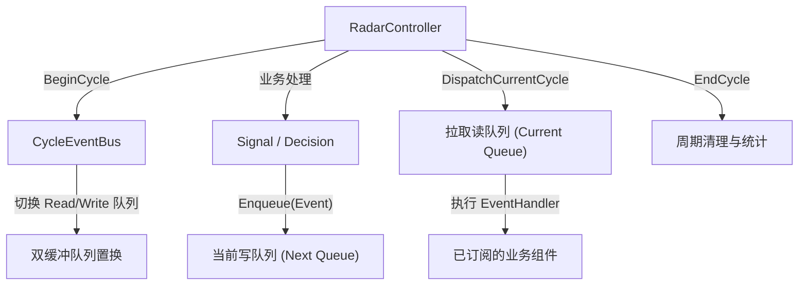
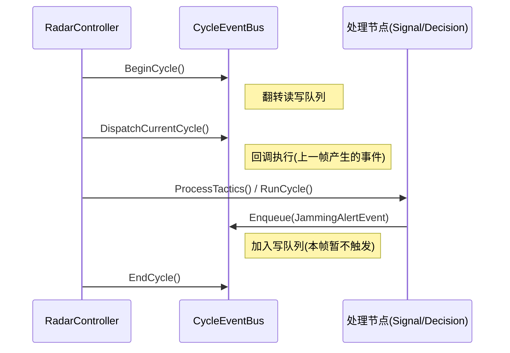
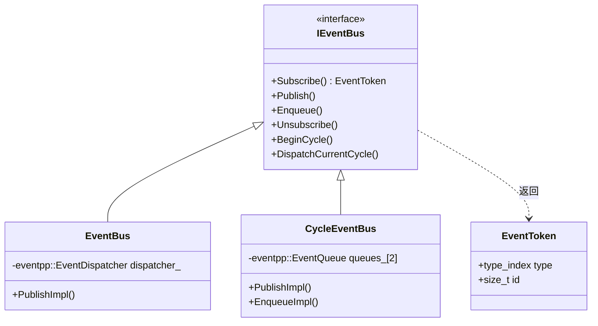

# EventBus 层架构说明

## 1. 简介

EventBus 模块为雷达核心流程提供**跨层消息传递能力**，负责实现模块间的解耦与异步数据通信。

EventBus 层遵循三条关键设计原则：

1. **统一的订阅发布模型** — 采用 `EventToken` 作为跨类型的统一撤销凭证。
2. **多语义支持** — 提供即时分发（Publish）和周期队列入队（Enqueue）语义。
3. **接口与实现彻底隔离** — 核心层仅依赖 `IEventBus` 接口，底层可透明替换为基于 `eventpp` 的即时或周期队列实现。

## 2. 目录结构

```text
src/airborne_radar/core/event/
├── IEventBus.h                  # [核心接口] 定义总路线、订阅机制和周期钩子
├── RadarEvents.h                # [事件定义] 全局事件载体 (TracksUpdatedEvent 等)
├── EventBus.h/.cpp              # [即时总线] 基于 EventDispatcher 的实现
└── CycleEventBus.h/.cpp         # [周期总线] 基于 EventQueue 的双缓冲队列实现

tests/
├── event_bus_test.cpp           # [测试] 各类总线行为测试
```

## 3. 主处理链路

单周期执行协同流程如下：



### 3.1 编排机制

`RadarController` 通过显式挂钩驱动总线：
1. `BeginCycle()`：开启新的一帧，对于周期总线，切换双缓冲状态。
2. `DispatchCurrentCycle()`：触发上一周期积攒的事件消费。
3. 业务代码通过 `Enqueue` 或 `Publish` 产生下行事件。
4. `EndCycle()`：通知周期收尾。

## 4. 核心机制详解

| 组件 / 机制 | 特性与实现 | 时间复杂度 |
|------|------|--------|
| `IEventBus` | 封装泛型的 `Subscribe` / `Publish` 和类型擦除逻辑，派发到虚函数 `SubscribeImpl`。 | O(1) 分发 |
| `EventBus` | 即时总线，基于 `eventpp::EventDispatcher`，调用 `Publish` 即刻触发回调函数。适合同步阻断式通知。 | O(N) 其中 N 为订阅者数 |
| `CycleEventBus` | 周期总线，基于 `eventpp::EventQueue` 双数组缓冲。`Enqueue` 压入备队列，周期反转后由 `DispatchCurrentCycle` 执行。 | O(1) 压入, O(N) 消费 |
| `EventToken` | 保存 `type_index` 与自增 ID，确保安全地在 `std::unordered_map` 或 eventpp 内部取消订阅。 | O(1) |

## 5. 与 RadarController 的协作关系

RadarController 是 EventBus 的核心驱动器。它确保总线的“心跳”与雷达硬件/仿真环境的处理周期严密对齐。



## 6. 职责边界



## 7. 测试覆盖

| 测试套件 | 测试数 | 覆盖范围 |
|---------|--------|---------|
| `EventBusTest` | 5 | 即时总线的订阅、广播、重复订阅、取消订阅、边界异常 |
| `CycleEventBusTest` | > 1 (集成) | 周期切换可见性语义（集成在 CoreControllerTest 中） |
| **合计** | **6+** | |

## 8. 当前状态与待完善事项

### 已完成 ✅

- 统一的类型擦除范式与 `EventToken`
- 基于 `eventpp` 的即时同步派发 (`EventBus`)
- 基于双缓冲的周期延时派发 (`CycleEventBus`)
- 在全 C++11 环境下的规范构建

### 待完善 🔲

- 多线程/并发推送情况下的队列锁定机制（当前为单线程主循环驱动）
- `EndCycle()` 的监控指标与统计探针扩充
