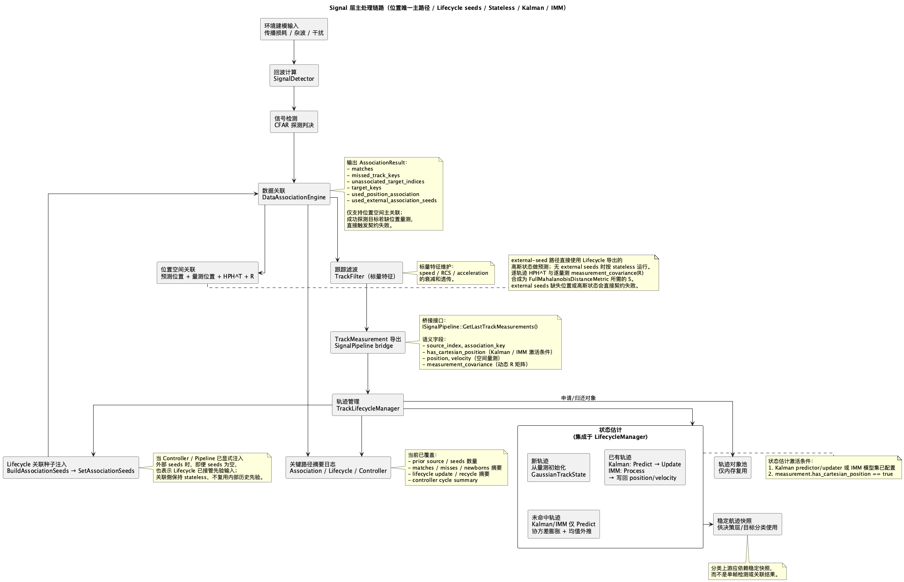
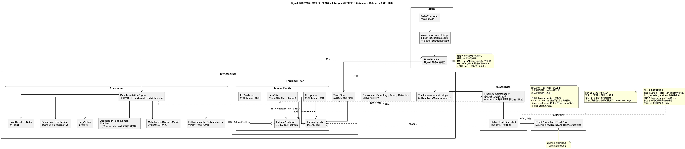

# Signal Docs Index

Signal 层负责机载雷达仿真中的单周期信号处理，输入为目标特征与环境快照，输出为探测、关联、跟踪量测和稳定航迹快照。

## Files

| File | Description |
|------|-------------|
| `signal-architecture.md` | **核心文档**：模块定位、目录分层、处理流程、关键机制、边界与测试 |
| `signal-processing-flow.puml` | 主处理链路图源文件 |
| `signal-processing-flow.png` | 主处理链路图导出图 |
| `signal-module-layering.puml` | 模块分层图源文件 |
| `signal-module-layering.png` | 模块分层图导出图 |
| `signal-algorithms.md` | 探测、关联、Kalman/EKF/IMM 等算法细节 |
| `signal-data-contracts.md` | 公共契约、封装边界、失败策略与并发语义 |
| `signal-antenna-pattern.md` | 天线方向图建模语义与工程限制 |

## Recommended Reading Order

1. `signal-architecture.md`
2. `signal-module-layering.puml/png`
3. `signal-processing-flow.puml/png`
4. `signal-data-contracts.md`
5. `signal-algorithms.md`
6. `signal-antenna-pattern.md`

落代码时，优先对照以下入口：
- `include/1q/airborne_radar/signal/pipeline/ISignalPipeline.h`
- `include/1q/airborne_radar/signal/pipeline/SignalPipeline.h`
- `include/1q/airborne_radar/signal/tracking/ITrackLifecycleManager.h`
- `src/airborne_radar/signal/pipeline/SignalComponentFactory.h`
- `src/airborne_radar/signal/association/DataAssociation.h`
- `src/airborne_radar/signal/tracking/TrackLifecycleManager.h`

## Extension Docs

- `signal-data-contracts.md` - 公共契约、封装边界与失败策略
- `signal-algorithms.md` - 算法与公式细节
- `signal-antenna-pattern.md` - 方向图模型与输入输出链路

## Flow Preview

## Layering Preview

