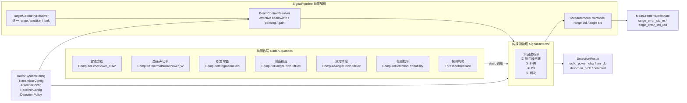
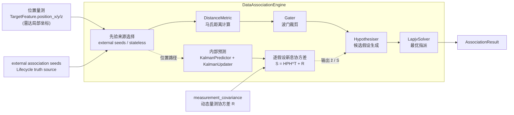
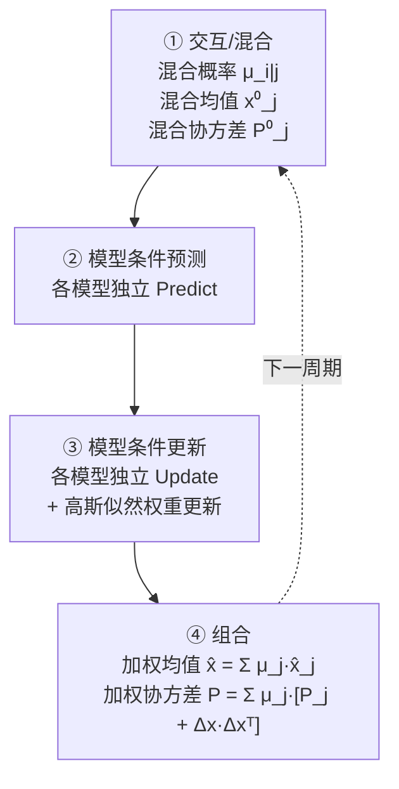
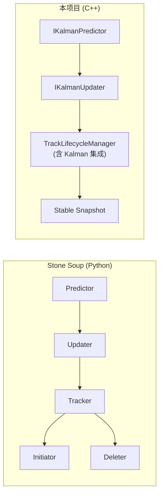
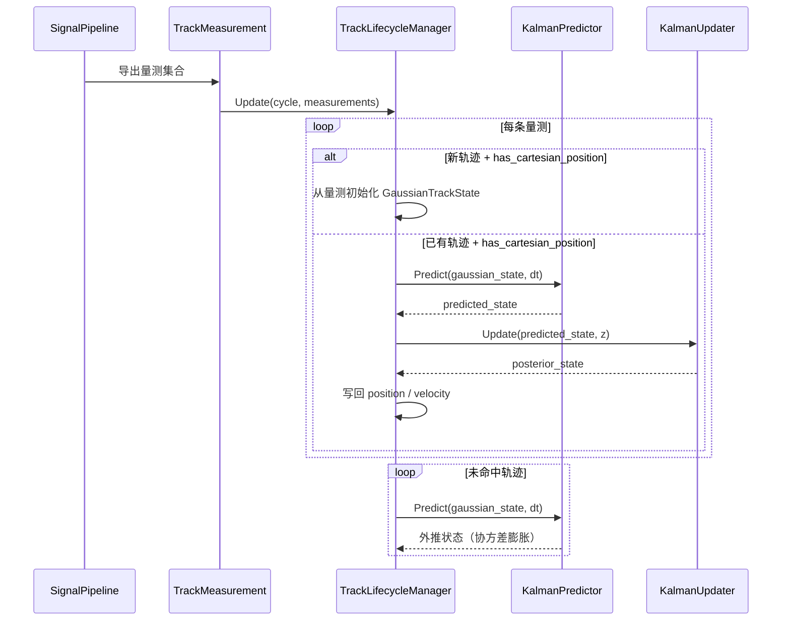
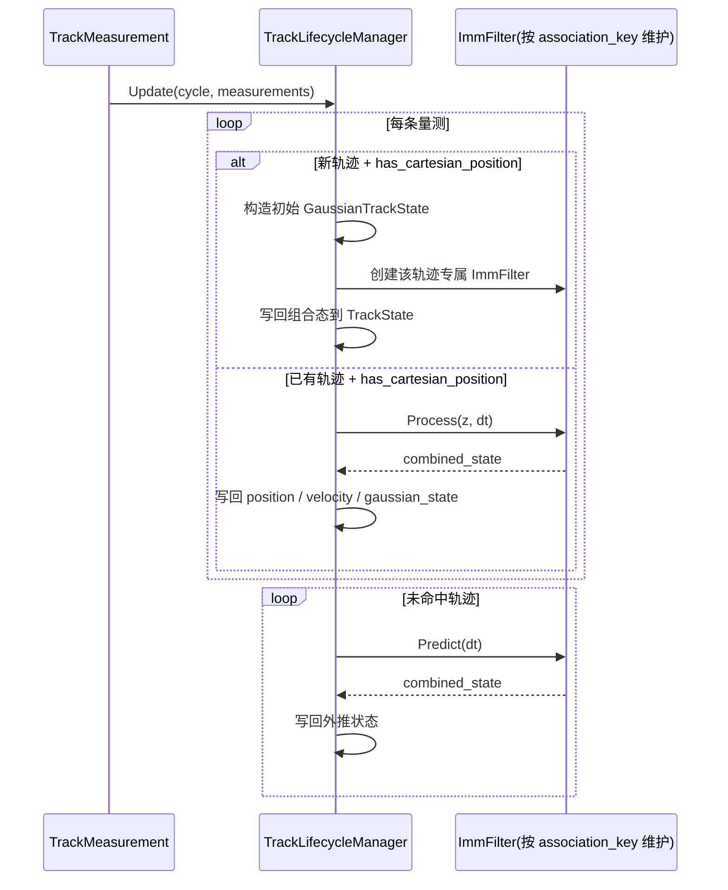

# Signal 层算法与实现细节

本文件集中放置算法与实现细节，避免在 `signal-architecture.md` 中堆叠过多推导与时序内容。

## 图形索引（Mermaid）

| 图 ID | 用途 | 段落锚点 |
|------|------|---------|
| M1 | 物理化信号检测链路 | `#diagram-m1-detection` |
| M2 | 数据关联机制 | `#diagram-m2-association` |
| M3 | IMM 四步流程 | `#diagram-m3-imm` |
| M4 | Stone Soup 架构差异 | `#diagram-m4-stonesoup` |
| M5 | 单模型 Kalman 路径时序 | `#diagram-m5-kalman-seq` |
| M6 | 每轨 IMM 路径时序 | `#diagram-m6-imm-seq` |

## 1. 信号检测（物理化路径）

信号检测层当前由“前置解析”与“纯探测物理”两段构成：

<a id="diagram-m1-detection"></a>
图 ID: M1



当前版本对波束宽度采用“双层语义 + 单一消费入口”的约定：

- `AntennaConfig::nominal_*_beamwidth_deg` 表示体制/硬件标称波束宽度
- `RadarOrientationConfig::commanded_*_beamwidth_deg` 表示控制链路下发的指令态波束宽度
- `ResolveEffectiveBeamwidth(...)` 是唯一解析入口：当 `commanded_beamwidth_enabled = true` 时优先使用 `commanded_*`，否则回退 `nominal_*`

`SignalDetector` 现在不再直接消费某一个原始 beamwidth 字段，也不再直接解析方向图和波束指向。`SignalPipeline` 会先通过 `BeamControlResolver` 解析 `effective beamwidth` 和单程天线增益，再由 `MeasurementErrorModel` 根据 `effective beamwidth + SNR` 计算 `range_error_std_m / angle_error_std_rad`。其中 `angle_error_std_rad` 不是单独某一轴的测角精度，而是面向后续笛卡尔量测协方差构造的等效角误差近似。

当 `AntennaConfig::enable_directional_pattern = true` 且目标具备雷达局部坐标位置时，`SignalPipeline` 会先经 `TargetGeometryResolver` 和 `BeamControlResolver` 调用 `EvaluateAntennaPattern(...)`，将主瓣离轴衰减、旁瓣/后瓣截平和扫描损失折算到单程天线增益，再进入单站雷达方程。也就是说，`commanded_*_beamwidth_deg` 现在不仅影响测角误差，也会影响离轴目标的回波功率和 SNR。

另外，`ISignalPipeline` 已对外提供平台姿态更新接口。搭载该机载雷达的平台可在每个处理周期前调用 `UpdatePlatformAttitude(...)`，由 `BeamControlResolver` 按当前 `stabilization_mode` 参与波束指向解析；其中 `kGroundStabilized` 当前先按对惯性空间稳定近似处理，待接入地理参考后再细化。

### 核心公式（Skolnik 交叉验证）

| 公式 | 数学表达 | 参考 |
|------|----------|------|
| 单站雷达方程 | Pr = Pt + 2Gt + 2λ + σ - 30·lg(4π) - 4·R - L | Skolnik eq.1.6 |
| 热噪声功率 | N₀ = k·T₀·B·F | IEEE 标准 |
| 相参积累 | G = N；非相参: G = √N | Skolnik Ch.2 |
| 测距精度 | σ_R ≈ 0.5·c/(2B) / √(SNR) + bias | Skolnik eq.11.2 工程近似 |
| 测角精度 | σ_θ ≈ 0.317·θ_bw / √(SNR) + θ_bw/30 | Skolnik eq.11.27 工程近似 |
| 检测概率 | Swerling 0~4 精确公式 (Boost.Math) | Richards/M&M 定理 |

## 2. 数据关联

<a id="diagram-m2-association"></a>
图 ID: M2



图中强调当前仅保留一个先验入口：`external association seeds`。当不存在 external seeds 时，关联阶段不消费内部历史副本，直接以 stateless 方式完成本周期匹配。`measurement_covariance` 已通过 `SignalCycleContext` 前移到 `AssociationStage`，并直接进入 `DataAssociationEngine` 的逐假设 $S$ 计算。

`DataAssociationEngine` 当前收敛为单一位置空间路径：

1. **位置空间路径（唯一主路径）**
2. 量测来源：`TargetFeature.position_x / position_y / position_z`（雷达局部笛卡尔坐标）
3. 历史轨迹状态：`TrackSignature.position + gaussian_state`
4. 距离度量：`FullMahalanobisDistanceMetric`
5. 协方差来源：内部 `KalmanPredictor` 预测得到 $P$，与来自 `SignalPipeline` 的动态量测协方差 $R$ 在假设生成阶段合成为
   $$S = HPH^T + R$$
6. 契约要求：所有成功探测目标必须携带笛卡尔位置量测；缺失时直接失败，而不是静默退回历史特征空间

当前 `SignalPipeline::BuildMeasurementCovariance(...)` 对动态量测协方差 $R$ 的构造规则为：

- 径向方向使用 `range_error_std_m²`
- 横向方向使用 `range² × angle_error_std_rad²`
- 其中 `angle_error_std_rad` 来自 `MeasurementErrorModel` 基于 `effective beamwidth` 的统一解析结果
- 由于当前输出接口仍为单标量角误差，横向协方差在 LOS 正交平面上采用各向同性近似，而不是显式区分 az/el 两个主轴

这意味着 `commanded_*_beamwidth_deg` 一旦启用，不仅会改变探测结果中的角误差估计，也会同步改变关联与生命周期更新阶段共享的动态量测协方差 $R$。

| 组件 | 算法 | 复杂度 |
|------|------|--------|
| `FullMahalanobisDistanceMetric` | d² = Δzᵀ S⁻¹ Δz （LLT 分解） | O(D³) |
| `CostThresholdGater` | 代价 > 阈值则裁剪 | O(MN) |
| `DenseCostHypothesiser` | 生成所有通过波门的 (轨迹, 量测) 对；支持逐轨迹 $HPH^T$ 与逐量测 $R$ 合成 | O(MN) |
| `LapjvSolver` | Jonker-Volgenant 线性指派 | O(N³) |

### 2.1 当前位置空间关联的实现边界

当前版本已经完成 `FullMahalanobisDistanceMetric` 与轨迹级 $S$ 的联动，但需要注意：

- `RadarController` 已通过 `AssociationTrackSeed` 将 Lifecycle 侧活跃轨迹状态注入关联阶段，关联真理源正在向 `TrackLifecycleManager` 收敛
- 关联域已移除内部历史先验消费路径，仅接收 external seeds；无 seeds 时为 stateless 关联
- `SignalPipeline` 会在 `SignalCycleContext` 中提前构造 `measurement_covariance`，供关联与 Lifecycle 更新共享同一份动态 $R$
- `TrackMeasurement` 当前明确拆分为 `raw_measurement` 与 `filtered_feature` 两段：前者承载位置量测与关联语义，后者承载 `TrackFilter` 回写后的动态特征
- `SignalPipeline` 只有在输入 `TargetFeature` 已携带 `position_x/y/z` 时，才会导出 `raw_measurement.has_cartesian_position = true` 的 `TrackMeasurement`
- `TrackLifecycleManager` 的状态估计步长优先读取外部模型注入的 `CycleContext.dt_sec`；当 `dt_sec <= 0` 时，才回退到基于 `cycle_index` 差分的兜底规则
- 当成功探测目标位置量测不完整时，当前实现会直接触发契约失败
- external seeds 缺失位置或高斯状态时，当前实现会直接触发契约失败
- `RadarController` 绑定 `TrackLifecycleManager` 时，会强制维持 external seeds 主路径；解绑后会显式回到 stateless 关联
- `DataAssociationEngine` / `TrackLifecycleManager` / `RadarController` 已补充关键路径摘要日志，用于排查 prior 来源、匹配数量和生命周期推进结果
- 因此当前位置空间关联已经是唯一正式路径，但内部状态所有权仍属于**已主化的关联能力 + 待进一步统一的数据流**

### 2.2 先验来源约定（终态）

当前实现仅存在如下两种先验来源组合：

| 先验来源 | 匹配空间 | 语义 |
|---------|---------|------|
| Lifecycle external seeds | 位置空间主关联 | 唯一先验主路径（必须含位置+高斯态） |
| 无 external seeds | 位置空间主关联 | stateless（不消费内部历史先验） |

另外，`TargetFeature` 与对象池内的 `TrackState` 当前保持明确分层：
- `TargetFeature` 服务于外部输入、Signal 输入和 Decision 输出
- `TrackState` 仅服务于 Lifecycle 内部状态机、Gaussian 状态与对象池复用
- 若未来要减少重复构造，应引入共享轻量观测/运动学结构，而不是直接把 `TrackState` 暴露为公共输入类型

## 3. 状态估计滤波器

Signal 层提供三级滤波器，复杂度递增。

### KalmanFilter（标准 Kalman）

状态模型：3D 恒速（Constant Velocity），状态向量 `[x, vx, y, vy, z, vz]`。

| 步骤 | 公式 | 实现 |
|------|------|------|
| 预测均值 | x̂ = F·x | `KalmanPredictor::Predict` |
| 预测协方差 | P̂ = F·P·Fᵀ + Q | 同上 |
| 新息 | y = z - H·x̂ | `KalmanUpdater::Update` |
| 新息协方差 | S = H·P̂·Hᵀ + R | 同上 |
| Kalman 增益 | K = P̂·Hᵀ·S⁻¹ | LLT 分解求解 |
| 后验均值 | x = x̂ + K·y | 同上 |
| 后验协方差 | P = (I-KH)P̂(I-KH)ᵀ + KRKᵀ | Joseph 形式 |

Q 矩阵（单轴 CV 连续白噪声加速度离散化）：

```
Q_1d = q × | dt³/3  dt²/2 |
            | dt²/2  dt    |
```

### EKF（扩展 Kalman）

| 差异 | KF | EKF |
|------|----|-----|
| 转移 | x̂ = F·x | x̂ = f(x, dt) |
| 协方差传播 | F 为常数矩阵 | F = ∂f/∂x (Jacobian) |
| 量测预测 | ẑ = H·x̂ | ẑ = h(x̂) |
| 量测矩阵 | H 为常数矩阵 | H = ∂h/∂x (Jacobian) |

通过 `ITransitionModel` / `IMeasurementModel` 虚函数接口注入非线性模型，避免 `std::function` + Eigen 的 alignment 问题。

提供默认线性实现（与标准 KF 数学等价）：

- `LinearCvTransitionModel`
- `LinearPositionMeasurementModel`

### IMM（交互多模型）

实现 Bar-Shalom 标准 4 步 IMM 算法（Chapter 11.6）：

<a id="diagram-m3-imm"></a>
图 ID: M3



当前实现支持两种装配方式：

1. 手工依赖注入：通过构造参数传入 `IKalmanPredictor* / IKalmanUpdater*` 或 IMM 模型集合。
2. 自动装配（推荐路径）：由 `SignalPipeline` 基于配置创建 Lifecycle 服务并由 `RadarController` 自动绑定。

当前 `TrackLifecycleManager` 已支持**每轨一份 `ImmFilter` 运行态**：

- 以 `association_key` 为键维护 `imm_filters_by_key_`
- 新轨时初始化对应模型集合与初始权重
- 命中时执行 `ImmFilter::Process()`
- 失配时执行 `ImmFilter::Predict()`
- 回收时同步清理该轨迹绑定的 IMM 运行态

## 4. 与 Stone Soup 的对照

### 4.1 概念映射

| Stone Soup 概念 | 本项目对应 | 备注 |
|----------------|-----------|------|
| `Measure` (Euclidean/Mahalanobis) | `MahalanobisDistanceMetric` / `FullMahalanobisDistanceMetric` | 支持对角和完整协方差 |
| `Gater` | `CostThresholdGater` | 代价阈值波门 |
| `Hypothesiser` | `DenseCostHypothesiser` | 暴力枚举所有通过波门的假设 |
| `DataAssociator` | `DataAssociationEngine` + `LapjvSolver` | 分离编排与指派求解 |
| `GaussianState` | `GaussianTrackState` | 6D：[x,vx,y,vy,z,vz] + 协方差 |
| `ConstantVelocity` | `KalmanPredictor` | 3 轴独立 CV，block_diag(Q) |
| `KalmanPredictor` | `KalmanPredictor` | 标准线性预测 |
| `KalmanUpdater` | `KalmanUpdater` | Joseph 形式后验协方差 |
| `ExtendedKalmanPredictor` | `EkfPredictor` | 虚函数接口替代 Python 的 duck typing |
| `ExtendedKalmanUpdater` | `EkfUpdater` | 同上 |
| `TransitionModel.jacobian()` | `ITransitionModel::Jacobian()` | 纯虚函数 |
| `MeasurementModel.jacobian()` | `IMeasurementModel::Jacobian()` | 纯虚函数 |
| `Tracker` (multi-model) | `ImmFilter` + `TrackLifecycleManager` | `ImmFilter` 提供每轨多模型估计，Lifecycle 管理状态机与对象生命周期 |
| `Initiator / Deleter` | `TrackLifecycleManager` | 合并为统一状态机 |

### 4.2 架构差异

<a id="diagram-m4-stonesoup"></a>
图 ID: M4



关键差异：

1. **生命周期内聚**：Stone Soup 拆为 Initiator + Deleter + Tracker，本项目统一收敛到 `TrackLifecycleManager`。
2. **Kalman 集成点**：Stone Soup 的 Predictor/Updater 在 Tracker 外部调用，本项目通过依赖注入嵌入 `TrackLifecycleManager.Update()` 内部。
3. **类型安全**：Stone Soup 使用 Python duck typing + `Property`，本项目使用 C++ 虚函数 + Eigen 固定维度矩阵。
4. **IMM 实现方式**：Stone Soup 用粒子滤波版多模型，本项目实现标准高斯 IMM。

## 5. Kalman / IMM 集成机制

`TrackLifecycleManager` 当前支持两类状态估计接入方式：

1. **单模型路径**：通过构造函数注入 `IKalmanPredictor*` 和 `IKalmanUpdater*`
2. **多模型路径**：通过构造函数注入 `vector<IKalmanPredictor*>`、`vector<IKalmanUpdater*>` 以及转移矩阵/初始权重，按轨迹创建 `ImmFilter`

### 5.1 单模型 Kalman 路径

<a id="diagram-m5-kalman-seq"></a>
图 ID: M5



激活条件：

- `kalman_predictor_` 和 `kalman_updater_` 均不为 `nullptr`
- `measurement.has_cartesian_position == true`

### 5.2 每轨 IMM 路径

<a id="diagram-m6-imm-seq"></a>
图 ID: M6



激活条件：

- `imm_predictors_` 与 `imm_updaters_` 成对配置
- `measurement.has_cartesian_position == true`

### 5.3 关联侧 $S$ 联动机制

`FullMahalanobisDistanceMetric` 的轨迹级 $S$ 联动当前由 `DataAssociationEngine` 内部完成：

1. 根据 external seed 的 `gaussian_state` 做位置预测
2. 提取预测位置量测均值 $\hat{z} = [x, y, z]^T$
3. 通过
   $$S = HPH^T + R$$
   计算该轨迹的新息协方差
4. 将 `S` 逐轨迹注入 `DenseCostHypothesiser`
5. 由 `FullMahalanobisDistanceMetric` 计算位置空间关联代价

当前实现里，步骤 1 所使用的 `gaussian_state` 来自 `RadarController -> TrackLifecycleManager::BuildAssociationSeeds() -> SignalPipeline::SetAssociationSeeds()` 这条桥接链；当未接入 Lifecycle 管理器时，控制器会显式调用 `ResetAssociationSeedModeToStateless()`，关联阶段按无先验模式运行。
