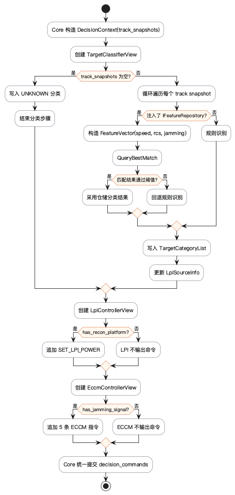
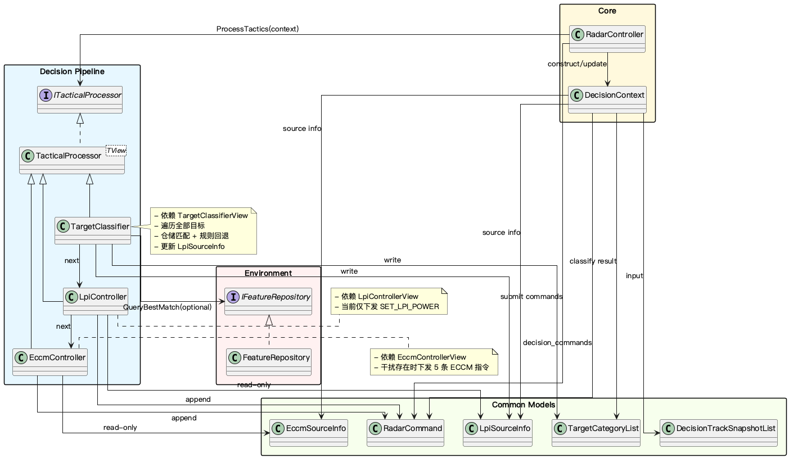

# Decision 层文档目录

Decision 层是机载雷达仿真系统的战术大脑，负责在单个处理周期内完成 **目标分类 → LPI 控制 → ECCM 对抗**，并把 proposal 归并成下一周期生效的 `RadarControlProfile`。

## 文件说明

| 文件 | 说明 |
|------|------|
| `decision-architecture.md` | **核心文档**：当前实现链路、ECCM/环境职责边界、策略叠加与信号层落点 |
| `decision-cycle-flow.puml` | Decision 周期处理链路流程图（PlantUML 源文件） |
| `decision-cycle-flow.png` | 流程图导出图 |
| `decision-architecture.puml` | Decision 模块架构图（PlantUML 源文件） |
| `decision-architecture.png` | 架构图导出图 |

## 建议阅读顺序

1. 先看 `decision-architecture.md` — 了解当前 `TacticalCoordinator -> ControlReducer -> RadarControlProfile` 链路，以及 ECCM 与环境/信号层的边界。
2. 再看 `decision-architecture.puml` 或 PNG — 建立整体流水线的层次视图。
3. 然后看 `decision-cycle-flow.puml` 或 PNG — 补足单周期内策略生效的数据流动视图。
4. 需要落代码时，回到源码核对以下入口：
   - `ITacticalDecisionEngine` — 决策引擎接口与共享状态契约
   - `TacticalCoordinator` — 默认 evaluator 编排
   - `ThreatAssessmentEvaluator` — 威胁评估
   - `EmissionControlEvaluator` — LPI 控制
   - `SurvivabilityEvaluator` — ECCM 生存性评估
   - `ControlReducer` — 提案归并为控制真值

## 算法与控制层级

```text
Level 1: ThreatAssessmentEvaluator（威胁识别与跨周期威胁记忆）
Level 2: EmissionControlEvaluator（LPI 控制建议）
Level 3: SurvivabilityEvaluator（ECCM 组合策略建议）
Level 4: ControlReducer（proposal -> RadarControlProfile）
```

## 周期流程图预览



## 架构图预览


