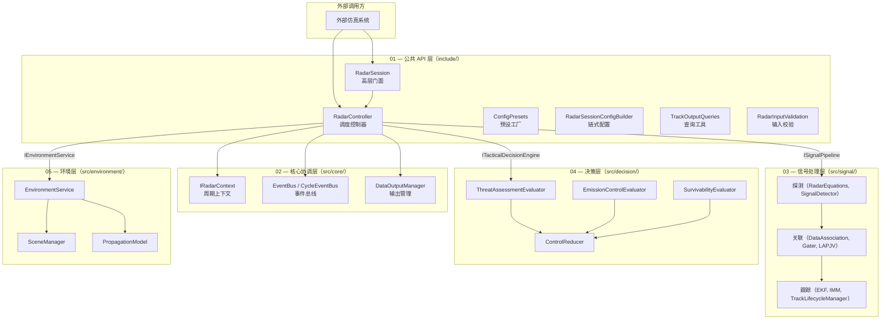

# 机载雷达仿真库 — 五层架构总览

本目录记录 1Q 机载雷达仿真库的**设计架构与模块交互**。接口/代码级文档由 Doxygen 生成，此处聚焦"为什么这样设计"以及"模块之间如何协作"。

## 分层架构

## 各层概述

| 层级 | 目录 | 职责 |
|------|------|------|
| [01-api](./01-api/) | 公共 API 层 | 面向外部调用方的门面封装：Session 门面、Builder 链式配置、预设工厂、查询工具、输入校验 |
| [02-core](./02-core/) | 核心协调层 | 调度编排中枢：Controller 周期调度、Context 上下文、EventBus 事件总线、输出管理 |
| [03-signal](./03-signal/) | 信号处理层 | 单周期信号处理链路：探测 → 关联 → 跟踪，输出轨迹快照 |
| [04-decision](./04-decision/) | 决策层 | 战术大脑：威胁评估 → LPI 控制 → ECCM 对抗 → 控制规约归约 |
| [05-environment](./05-environment/) | 环境层 | 环境建模：传播损耗、杂波、干扰事实输出，供信号层与决策层消费 |

## 建议阅读顺序

1. **01-api** — 从外部调用方视角理解库的使用接口和配置方式
2. **02-core** — 理解 Controller 如何编排各执行层
3. **03-signal** — 信号处理链路的算法与数据流
4. **04-decision** — 决策引擎的评估器层次与控制规约生成
5. **05-environment** — 环境建模如何为上层提供事实输入

## 顶层设计文档

| 文件 | 说明 |
|------|------|
| [airborne-radar-modular-design.md](./airborne-radar-modular-design.md) | 模块化设计原理与依赖关系 |
| [public-api-boundary.md](./public-api-boundary.md) | 公共 API 边界守卫规则 |
