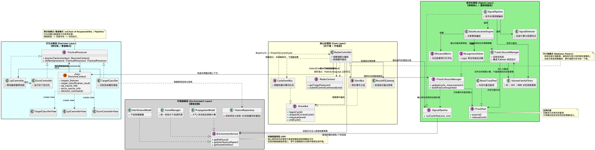

# 机载雷达系统：模块化架构设计说明

本文档旨在针对机载雷达系统的原有设计进行结构性优化与重构，应用经典软件设计原则对四大核心业务层（行为决策、核心处理、信号处理、环境建模）进行解耦，从而解决先前因局限性带来的模块混乱与职责不清的痛点。

## 1. 原设计核心痛点分析

基于原有文档内容分析，当前架构存在以下典型设计问题：
* **职责交叉与高耦合**：“场景设置”同时作为独立的模块存在于【核心处理层】（2.3）和【环境建模层】（4.1）中，职责重叠导致重复造轮子和数据同步困难。
* **各层间依赖混乱**：行为决策层依赖信号提取后的目标数据，又要干预核心层面的雷达发射与波束控制。如果没有良好的中间抽象，这很容易变成网状的依赖图（Spaghetti Code）。
* **可替换性差**：信号处理层的核心计算（如回波探测）直接与底层具体的环境衰减参数计算耦合在一起，后续很难平滑过渡到仿真系统验证或演习支持。

## 2. 架构重构策略与设计原则

新的架构设计重点分离控制平面与数据平面，梳理清晰各模块边界，并注入以下重要机制：

1. **单一职责原则 (SRP)**
   - 【核心处理层】转化为纯粹的**中介者与流程调度器**，不再夹杂具体的物理建模与算法工作。
   - 【环境建模层】统一收口所有的“场景设置”、“传播模型”、“干扰特征”，作为全局的物理基础设施。

2. **依赖倒置原则 (DIP)**
   - 信号处理层与行为决策层**不再依赖具体的实体类**。取而代之的是依赖抽象接口（如`IEnvironmentService`、`IRadarContext`）。这使得具体环境模块的修改不会波及核心雷达处理流程。

3. **责任链与中介者模式 (Chain of Responsibility & Mediator)**
   - 对于【行为决策】层，考虑到“情报获取→生存控制→对抗措施”属于先后依存的顺序链，采用**责任链模式（又称管道模式/Pipeline）**，让决策上下文数据在各处理阶段（`ITacticalProcessor`）依次流转。
   - 以【核心处理层-雷达调度控制器】（Mediator）居中统筹，避免信号处理和环境建模的直接互相调用。

4. **决策上下文与数据解耦 (Context Object & CQRS 思想)**
   - 引入 **决策上下文 (`DecisionContext`)**，封装单次探测处理周期的输入特征、中间结果与指令输出，并在节点间传递。
   - 处理器节点绝不直接修改硬件状态，而是将动作以**指令对象 (Command Object)** 的形式追加至上下文中（CQRS 的命令/查询分离思路），统一由核心层拉取执行。

5. **高速信息源架构 (Repository & EventBus)**
   - **静态特征数据库**：使用**仓储模式 (Repository + Memory Cache)**，防止流水线高频直接进行 SQL/磁盘 I/O 阻塞。
   - **跨层级动态告警**：采用**事件总线 (EventBus / Pub-Sub)** 进行松耦合的跨层异步消息传递。

6. **基础设施与领域服务边界 (Infrastructure vs Domain Service)**
   - **对象池 (ObjectPool/ITrackPool)** 仅承担内存复用职责（Acquire/Release/Prewarm），不承担目标业务生命周期语义。
   - **目标生命周期管理 (TrackLifecycleManager)** 承担目标状态机、批号分配、丢失判定与回收策略，是信号跟踪域服务。
   - 核心调度层（`RadarController`）只做编排与调用，不承载目标生命周期策略，避免业务语义污染控制层。

## 3. 模块化设计类与包架构图

下图摒弃了特定类内部的具体字段和函数，仅聚焦如何定义接口、包裹职责和进行模块间通信的设计。

*(原图使用 PlantUML 生成，详情可参考同目录下的 `airborne-radar-modular-design.puml`)*

### 3.1 行为决策层 (Behavior Decision Layer)
作为雷达的战术“大脑”，它是一条严格流转的战术处理管线（Pipeline）。
- 输入由核心层构造 `DecisionContext` 后注入决策链，节点通过受限视图（TargetClassifier/LPI/ECCM）读取各自可见字段，避免跨模块读写污染。
- 包含模块：目标分类、LPI控制、ECCM对抗。应用**责任链模式（Chain of Responsibility）**代替了最开始误用的策略模式。因为这三者不是“面对同种情况多选一”的同构算法，而是具有明显“先后因果”的链路（如：得先进行目标分类特征获取，才能做出相应的 LPI、ECCM 对抗组合）。

### 3.2 核心处理层 (Core Processing Layer)
作为雷达系统的“心脏”或系统总线（Facade/Mediator）。
- 此层中完全剥离了原乱入的【场景设置】。主要专注于执行循环调度、事件编排、初始化配置以及外部接口对接。
- 核心组件为 `RadarController`，它负责驱动 `ISignalPipeline` 处理循环、组织事件与命令流转。
- 约束：`RadarController` 不直接承担目标状态机、批号与回收策略，这些由信号跟踪域服务 `TrackLifecycleManager` 负责。

### 3.3 信号处理层 (Signal Processing Layer)
作为雷达系统的“数据泵”与领域核心。
- 提供从回波计算、检测判决、数据关联、状态估计到轨迹生命周期管理的完整处理链路。
- **关键设计**：需要获取传播损耗和多径干扰时，通过调用 `IEnvironmentService` 抽象接口取得，而不知晓具体的物理计算类。
- **模块边界**：数据关联负责输出“量测-航迹匹配结果”，跟踪滤波负责状态预测与更新，轨迹生命周期管理负责建轨、确认、丢失、回收与批号推进。
- **生命周期主责**：目标状态迁移、批号分配、丢失与回收策略统一收敛于 `TrackLifecycleManager`；对象池仅作为其下层内存复用基础设施。

### 3.4 环境建模层 (Environment Modeling Layer)
作为底层“基础设施”（Infrastructure）。
- **统一整顿**：原 2.3 节和 4.1 节重复的场景设置工作，全部下沉到此层，统称为 `SceneManager`。作为 `IEnvironmentService` 的一部分向外提供服务。
- 包含物理传播、地海杂波环境、电子干扰模型的仿真模拟基础能力。
- **特征仓储 (Feature Repository)**：封装对于目标分类所需的特征数据库，对外提供防腐的高速内存访问接口。

## 4. 信息源与核心数据流架构 (Tactical Context & 数据流)

为了保证流水线（业务逻辑）在极其苛刻的微秒级/毫秒级雷达实时环境下运转，必须极高程度地解耦数据抓取与硬件读写，故引入以下信息获取架构设计：

### 4.1 方案 A：静态信息源与防腐读取 —— 仓储模式 (Repository)
主要针对 **目标分类 (TargetClassifier)** 所需的庞大特征数据库。
- **避免 I/O 阻塞**：禁止在微秒级的责任链处理中直接写入 SQL。
- **设计结构**：通过 `IFeatureRepository` 进行门面包装。系统初始化阶段将磁盘或远程数据库中的雷达/平台特征参数加载到内存索引，工作时流水线仅进行内存比对计算。

### 4.2 方案 B：跨层动态数据投递 —— 事件总线 (EventBus / Pub-Sub)
针对 **信号处理层** 到 **核心层**、外界侦察到 **决策层** 的高速异构数据流动。
- **发布-订阅解耦**：当前实现采用强类型事件：`TracksUpdatedEvent`、`JammingAlertEvent`、`CommandsSubmittedEvent`、`RadarCycleCompletedEvent`。
- **响应机制**：核心调度器在每周期执行 `BeginCycle -> DispatchCurrentCycle`，信号/决策完成后 `Enqueue` 本周期结果事件，并在 `EndCycle` 结束。对于 `CycleEventBus`，本周期发布事件在下一周期消费。

### 4.3 方案 C：战术上下文模式与双向控制解耦 (CQRS 思想体现)
对于整个“情报获取→生存控制→对抗执行”执行链内。
- **Context 的富血有效载荷**：由核心层将本周期目标特征包装为 `DecisionContext`，并生成模块视图（TargetClassifierView/LpiControllerView/EccmControllerView）传给各责任链节点。
- **Command Sink (指令反向暂存)**：各策略节点不直接操作硬件 API，而是在 `DecisionContext.decision_commands` 中追加命令。
- **统一处理延缓**：责任链结束后，由 `RadarController` 统一遍历 `decision_commands`，通过 `IRadarContext::SubmitControlCommand(...)` 下推执行。

## 5. 组件级落地架构特性（2026-03更新）

随着核心链路的打通，各层级的微观边界已经完全形成并落地，各域呈现出极高内聚特质：

### 5.1 决策层 (Decision)：严格视图管线

- **链式流转与视图隔离**：`TargetClassifier`、`LpiController`、`EccmController` 三阶串行。各接点只能处理为其开辟的专用视图（如 `EccmControllerView`），从根源防止了模块越权读取修改全局环境特征数据。
- **Command 缓存收集**：各模块在评估时将战术对策转为统一雷达指令存入 Context，不直接调用底层硬件层 API，而是统一通过 `RadarController` 在总控循环里下推。

### 5.2 核心层 (Core)：强解耦双路总线驱动

- **EventBus 差异化语义**：除了支持即时执行同步分派的 `EventBus`，新增了基于双缓冲数组切换的 `CycleEventBus`（异步周期分派）。彻底规避了同周期引发的事件回调死循环重入风险，配合单线程的主循环推进机制使用。
- **配置与生命周期隔离**：`RadarController` 驱动全局运转，不再亲自掌管航迹列表的批号生命周期，而是通过接口 `ITrackLifecycleManager` 绑定跟踪域的专业生命周期服务。

### 5.3 信号层 (Signal)：“Stone Soup” C++ 重塑

- **四步关联域拆分**：原笼统的 `DataAssociator` 退化为编排壳，内聚切分为 `DistanceMetric`（支持完整协方差的高斯马氏距离）、`Gater`（代价波门）、`Hypothesiser`（假设生成）、`Solver`（全局指派）四套标准抽象。此模式极大便利了后续关联法则的无缝热拔插。
- **多级滤波架构并存 (KF/EKF/IMM)**：全面落地基于 C++11 特性的矩阵估计器。支持带 Joseph 形式协方差更新的标准 `Kalman`，支持通过纯虚函数计算雅可比的非线性 `EKF`，并实现了 Bar-Shalom 4 步组合算法（混合→预测→更新→组合）的交互多模型滤波器 `IMM`。这些滤波器不保有状态控制逻辑。
- **统一的连续性出口**：信号层将量测特征、状态滤波彻底压合到 `TrackLifecycleManager` 生命周期状态机。向上提供稳定的高内聚快照集合，不再对外直接散落碎片化事件。

### 5.4 现阶段已知约束

- 当前 `TrackMeasurement.association_key` 仍采用按输入顺序生成的临时策略，后续可替换为跨传感器全域稳定关联键（如 track seed/网联航迹 ID）。
