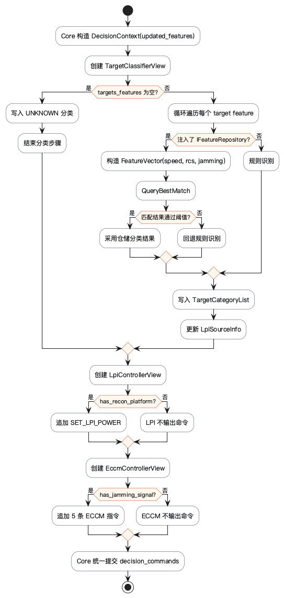
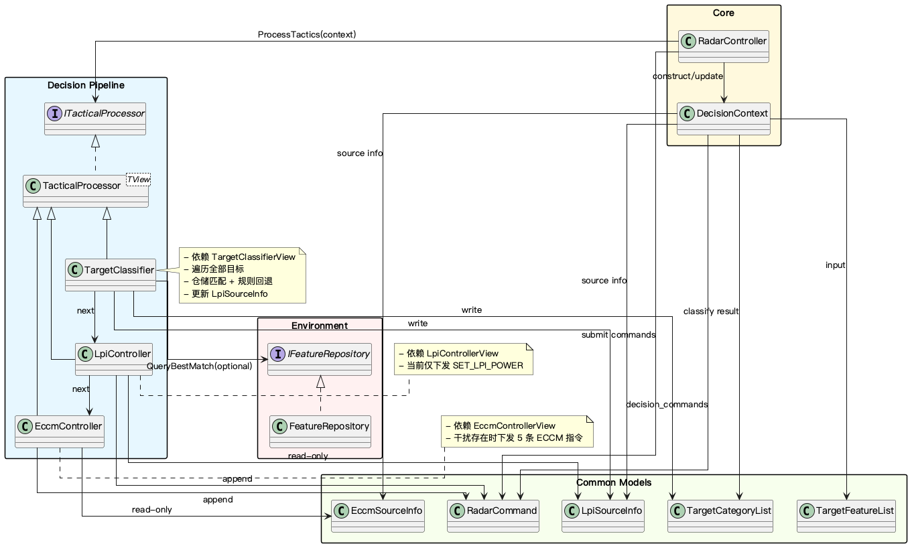

# Decision 层文档目录

Decision 层是机载雷达仿真系统的战术大脑，负责在单个处理周期内完成 **目标分类 → LPI控制 → ECCM对抗** 的流水线决策。

## 文件说明

| 文件 | 说明 |
|------|------|
| `decision-architecture.md` | **核心文档**：架构概览、责任链编排、特征提取与决策流、类图和演进目标 |
| `decision-cycle-flow.puml` | Decision 周期处理链路流程图（PlantUML 源文件） |
| `decision-cycle-flow.png` | 流程图导出图 |
| `decision-architecture.puml` | Decision 模块架构图（PlantUML 源文件） |
| `decision-architecture.png` | 架构图导出图 |

## 建议阅读顺序

1. 先看 `decision-architecture.md` — 了解基于视图隔离的责任链架构及未来分类器的演进目标。
2. 再看 `decision-architecture.puml` 或 PNG — 建立整体流水线的层次视图。
3. 然后看 `decision-cycle-flow.puml` 或 PNG — 补足单周期内策略生效的数据流动视图。
4. 需要落代码时，回到源码核对以下入口：
   - `DecisionContext` — 上下文载体与视图生成
   - `ITacticalProcessor` — 策略处理器抽象
   - `TargetClassifier` — 特征分类器
   - `LpiController` — 低截获概率控制
   - `EccmController` — 电子防卫控制

## 算法与控制层级

```text
Level 1: TargetClassifier（基于特征评分与高斯基线的分类推断）
Level 2: LpiController（环境感知与自适应功率波束约束）
Level 3: EccmController（干扰抗性调度与跳频控制）
```

## 周期流程图预览



## 架构图预览


