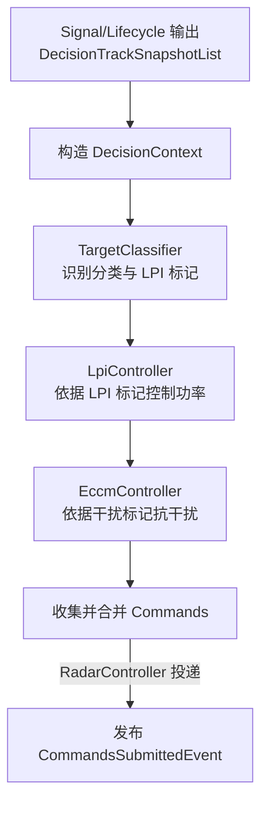
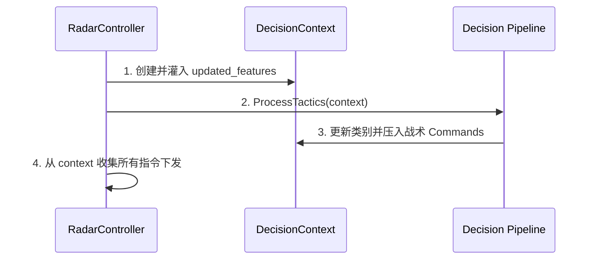
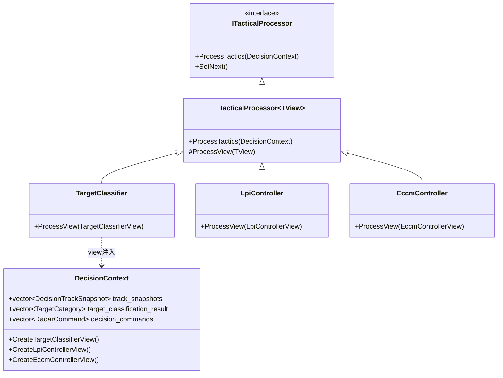

# Decision 层架构说明

## 1. 简介

Decision 层负责在单个处理周期内完成**目标识别 -> 低截获控制（LPI）-> 抗干扰控制（ECCM）** 的顺序决策，并输出统一的雷达控制命令列表供底层硬件模拟器或底层驱动执行。

Decision 层遵循三条关键设计原则：

1. **逻辑解耦与视图隔离** — 各节点不直接相互依赖，必须通过 `DecisionContext` 以及为其开辟的专用视图传递上下文。
2. **数据单向流动** — 输入特征从核心层单向进入决策链，决策节点生成增量命令。
3. **策略即拦截器（Pipeline/Chain模式）** — 控制节点组织为一条管线，便于拔插修改战术评估顺位。

## 2. 目录结构

```text
src/airborne_radar/decision/
├── pipeline/                       # [管线编排层]
│   └── ITacticalProcessor.h        #   └─ 战术处理责任链抽象节点
│
├── classifier/                     # [目标分类与推断]
│   └── TargetClassifier.h/.cpp     #   └─ 基于特征/仓储的分类打分机制
│
├── lpi/                            # [低截获概率控制]
│   └── LpiController.h/.cpp        #   └─ LPI 源感知及管控命令下发
│
└── eccm/                           # [电子防卫对抗]
    └── EccmController.h/.cpp       #   └─ 干扰感知与自适应跳频/波束重组决策

include/1q/airborne_radar/core/context/
├── DecisionContext.h               # [上下文与视图] 全局决策上下文载体及视图构造器
```

## 3. 主处理链路

单周期执行流程如下：



### 3.1 编排机制

决策管线采用 **Chain of Responsibility (责任链框架)** 编排战术阶段：

```
TargetClassifier → LpiController → EccmController
```

每个控制节点派生自 `TacticalProcessor<TView>`，通过 `ChainProcessorWithView` 桥接，节点只能对专门开放给自己的结构（如 `EccmControllerView`）进行读写，防止了跨域错改目标原始特征的情况。

## 4. 核心组件详解

### 4.1 TargetClassifier (目标分类)

| 组件性质 | 特性描述 | 输出变更 |
|------|------|--------|
| **处理手段** | 遍历目标，利用阈值和评分逻辑（速度、RCS、干扰标）判定 HIGH_THREAT 或 LOW_THREAT | `target_classification_result` |
| **可接入存储** | 支持注入 `IFeatureRepository` 进行仓储命中判定 | 无 |
| **副武器联动** | 高威胁往往触发 LPI 标签（侦察平台标记） | `LpiSourceInfo` |

> **未来演进**：分类器设计目标是通过统一的特征提取（均值、机动过载等），套用高斯分布+贝叶斯后验概率基线，输出完整的（Top-1概率，拒识状态）推断结果。

### 4.2 LpiController (低截获控制)

| 组件性质 | 特性描述 | 决策产出 |
|------|------|--------|
| **驱动源** | 仅依赖 `LpiSourceInfo.has_recon_platform` | 触发时进入警戒 |
| **控制力** | 执行压低雷达暴露面积的决策 | `SET_LPI_POWER` 等控制指令 |

### 4.3 EccmController (抗干扰防卫)

| 组件性质 | 特性描述 | 决策产出 |
|------|------|--------|
| **驱动源** | 依赖 `EccmSourceInfo.has_jamming_signal` | 触发时进入反干扰环节 |
| **控制力** | 执行旁瓣相消、自适应波束、功率烧穿等综合对策 | 包含 `SET_AGILITY_FREQ`, `SET_ECCM_BURNTHROUGH_GAIN` 等多项指令组合 |

## 5. 与 RadarController 的协作关系

RadarController 是 Decision 管线的载体：



所有硬件相关的指令动作在这一层形成最终确认的数据条目，供下行发射管线或设备硬件去具体拆解执行。

## 6. 职责边界



## 7. 测试覆盖

| 测试套件 | 测试数 | 覆盖范围 |
|---------|--------|---------|
| `DecisionLayerTest` | 7 | 高度威胁/干扰叠加时的完整流水线状态、命令产生数校验、仓储匹配 |
| **合计** | **7** | 涵盖 Pipeline 所有核心协同环节 |

## 8. 当前状态与待完善事项

### 已完成 ✅

- 责任链编排及视图（View）数据的严格隔离
- TargetClassifier 高危目标评分判定及其向 LPI 的前向追踪馈送
- LpiController 及 EccmController 对于上下指令下发体系的具体对接
- C++11 全面改造适应

### 待完善 🔲

- 目标分类模型向完整的概率形式演进（高斯基线+贝叶斯计算推断，历史窗口统计聚合提炼）
- 具体的 `SET_LPI_BEAMFORMING` 和 `SET_LPI_DWELL` 指令生成完善
- 分类结果增加熵评估或拒识机制，而不是只输出类别项
