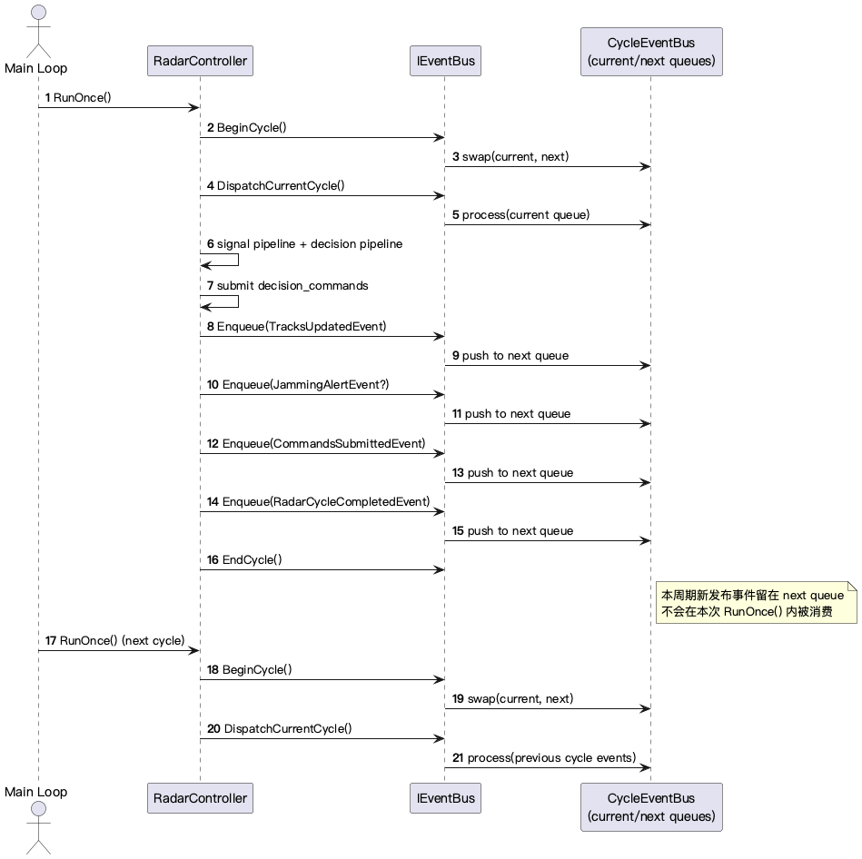
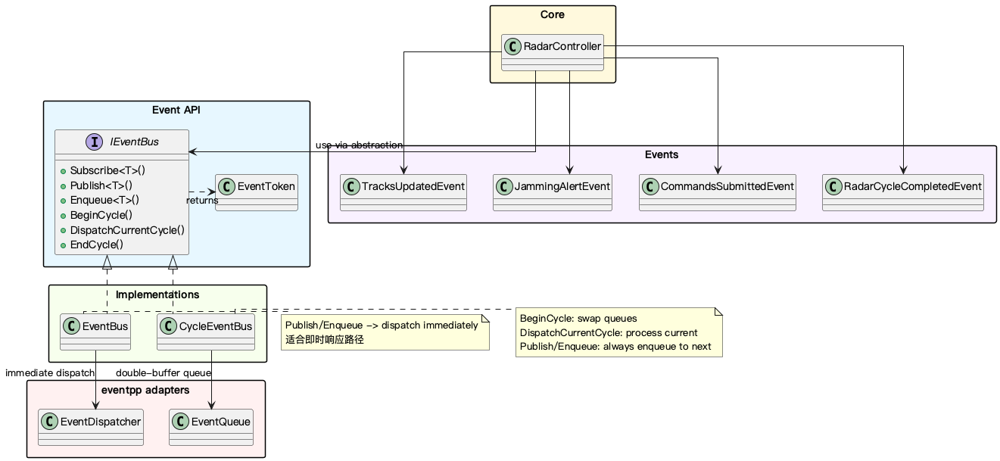

# EventBus 层文档目录

EventBus 模块为雷达核心流程提供跨层消息传递能力，支持**即时分发**与**周期队列**两种语义，统一抽象隔离具体实现。

## 文件说明

| 文件 | 说明 |
|------|------|
| `eventbus-architecture.md` | **核心文档**：架构概览、目录结构、分发机制详解、类图和时序图 |
| `eventbus-cycle-flow.puml` | EventBus 周期处理链路流程图（PlantUML 源文件） |
| `eventbus-cycle-flow.png` | 流程图导出图 |
| `eventbus-architecture.puml` | EventBus 模块架构图（PlantUML 源文件） |
| `eventbus-architecture.png` | 架构图导出图 |

## 建议阅读顺序

1. 先看 `eventbus-architecture.md` — 全面了解架构边界、接口设计、分发机制和实现状态。
2. 再看 `eventbus-architecture.puml` 或 PNG — 建立架构抽象视图。
3. 然后看 `eventbus-cycle-flow.puml` 或 PNG — 补足周期与即时控制视图。
4. 需要落代码时，回到源码核对以下入口：
   - `IEventBus` — 总线接口与通用能力
   - `EventBus` — 即时总线实现
   - `CycleEventBus` — 周期总线实现
   - `RadarController` — 周期协同与集成

## 分发机制抽象层级

```text
Level 0: IEventBus（基础订阅/发布抽象与生命周期钩子）
Level 1: EventBus（基于 eventpp::EventDispatcher 的同步即时触发）
Level 2: CycleEventBus（基于 eventpp::EventQueue 的双缓冲队列延时触发）
```

## 周期流程图预览



## 架构图预览


