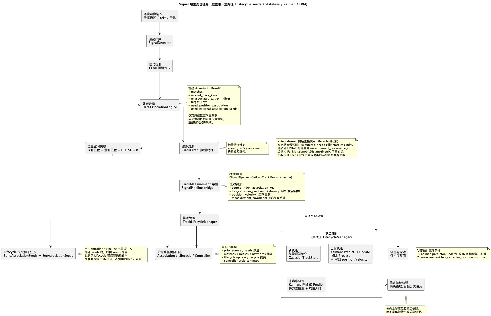
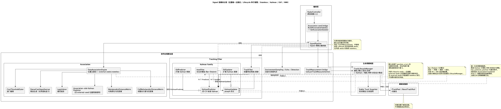

# Signal 层文档目录

Signal 层是机载雷达仿真系统的信号处理核心，负责 **探测 → 关联 → 滤波 → 航迹管理** 完整链路。

当前文档已同步到以下实现状态：

- 位置空间关联已成为唯一正式路径，成功探测目标缺位置量测时直接失败
- `FullMahalanobisDistanceMetric` 支持逐轨迹新息协方差 $S$ 联动
- `TrackLifecycleManager` 已支持每轨 IMM 运行态
- `RadarController` 会在每周期开始前把 Lifecycle 导出的关联种子注入 `SignalPipeline`
- `DataAssociationEngine` 仅消费 external seeds 作为关联先验；无 seeds 时按 stateless 模式运行
- external seeds 进入关联前已收紧为强契约：必须同时携带位置与高斯状态
- 关联契约失败路径已接入 `spdlog::critical`，并保持 fail-fast（`abort`）
- `DataAssociationEngine` / `TrackLifecycleManager` / `RadarController` 已补充关键路径摘要日志

## 文件说明

| 文件 | 说明 |
|------|------|
| `signal-architecture.md` | **核心文档**：架构概览、目录结构、算法详解、Stone Soup 对照、类图和时序图 |
| `signal-processing-flow.puml` | Signal 主处理链路流程图（PlantUML 源文件） |
| `signal-processing-flow.png` | 流程图导出图 |
| `signal-module-layering.puml` | Signal 模块分层图（PlantUML 源文件） |
| `signal-module-layering.png` | 模块分层图导出图 |

## 建议阅读顺序

1. 先看 `signal-architecture.md` — 全面了解架构边界、算法原理和实现状态。
2. 再看 `signal-module-layering.puml` 或 PNG — 建立模块分层视图。
3. 然后看 `signal-processing-flow.puml` 或 PNG — 补足单周期执行链路视图。
4. 需要落代码时，回到源码核对以下入口：
   - `SignalPipeline` — 周期编排
   - `DataAssociationEngine` — 关联编排
   - `DenseCostHypothesiser` — 逐轨迹 S 注入点
   - `KalmanPredictor / KalmanUpdater` — 标准 Kalman
   - `EkfPredictor / EkfUpdater` — 扩展 Kalman
   - `ImmFilter` — 交互多模型
   - `TrackLifecycleManager` — 轨迹生命周期 + Kalman / 每轨 IMM 集成

## 算法层级

```
Level 0: TrackFilter（标量特征的最小预测/更新）
Level 1: DataAssociationEngine（位置唯一主路径 + external seeds/stateless 双态语义）
Level 2: KalmanPredictor + KalmanUpdater（标准线性 Kalman，3D CV）
Level 3: EkfPredictor + EkfUpdater（扩展 Kalman，非线性模型支持）
Level 4: ImmFilter（交互多模型，Bar-Shalom 4 步算法）
```

## 流程图预览



## 模块分层图预览


