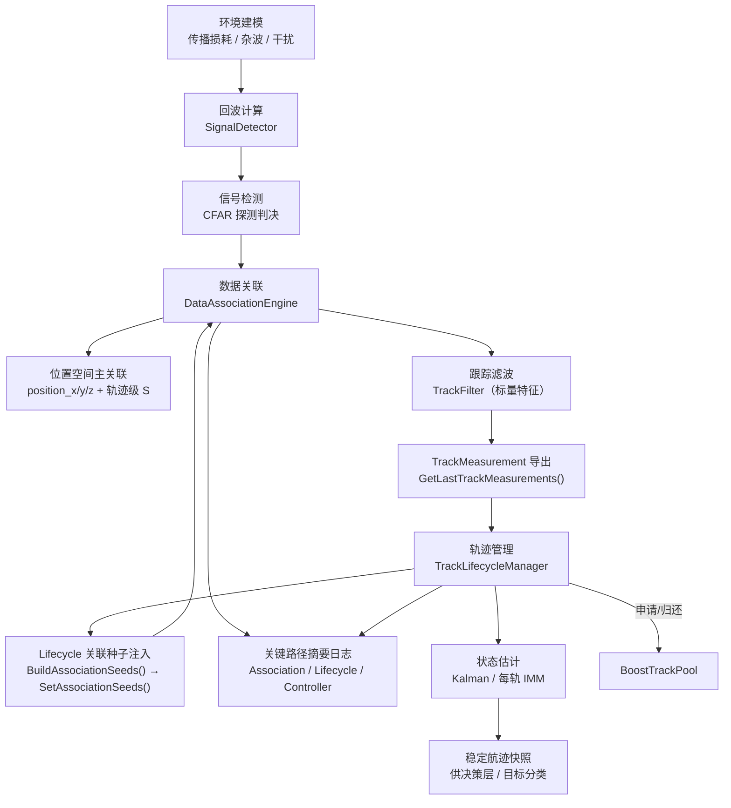

# Signal 层架构说明

## 1. 简介

Signal 层是机载雷达仿真系统的**信号处理核心**，负责从原始目标特征出发，完成完整的 **探测 → 关联 → 滤波 → 航迹管理** 处理链路。

Signal 层遵循三条关键设计原则：

1. **控制面与数据面分离** — 编排逻辑与算法实现通过接口隔离，Pipeline 节点只传递上下文、不直接耦合底层算法。
2. **关联、滤波、生命周期三者解耦** — 每个子域有独立的数据契约和职责边界，通过 `TrackMeasurement` 结构在域间传递。
3. **参考 Stone Soup 的算法分层** — 借鉴 Stone Soup 的职责拆分思路（Measure / Gater / Hypothesiser / Associator / Predictor / Updater / Tracker），在 C++ 中重新实现为高性能静态分发版本。

## 2. 图形索引（Mermaid）

| 图 ID | 用途 | Mermaid 段落锚点 | 生成文件 |
|------|------|------------------|---------|
| M1 | 主处理链路 | `#diagram-m1-main-flow` | `./signal-m1-main-flow.png` |
| M2 | 职责边界类图 | `#diagram-m2-boundary` | `./signal-m2-boundary.png` |

## 3. 目录结构

```text
src/airborne_radar/signal/
├── association/                    # [数据关联层]
│   ├── DistanceMetric.h/.cpp       #   ├─ MahalanobisDistanceMetric（对角简化）
│   │                               #   └─ FullMahalanobisDistanceMetric（完整协方差 S⁻¹）
│   ├── Gater.h                     #   └─ CostThresholdGater（波门裁剪）
│   ├── Hypothesiser.h/.cpp         #   └─ DenseCostHypothesiser（假设生成）
│   ├── AssignmentSolver.h          #   └─ IAssignmentSolver 接口
│   ├── LapjvSolver.h/.cpp          #   └─ LapjvSolver（Jonker-Volgenant 最优指派）
│   └── DataAssociation.h/.cpp      #   └─ DataAssociationEngine（位置主路径 + external seeds 单一先验）
│
├── detection/                      # [信号检测层]
│   ├── RadarEquations.h/.cpp       #   ├─ 雷达物理方程纯函数库（回波功率、噪声底、积累增益、测量精度、检测概率）
│   │                               #   ├─ TransmitterConfig / AntennaConfig / ReceiverConfig / DetectionPolicy
│   │                               #   └─ RadarSystemConfig（组合配置）
│   └── SignalDetector.h/.cpp       #   └─ SignalDetector（6 步检测链：功率→SNR→Pd→判决→误差）
│
├── pipeline/                       # [编排层]
│   └── SignalPipeline.h/.cpp       #   └─ 周期主编排器（ChainProcessor 模式）
│
└── tracking/                       # [跟踪滤波层]
    ├── GaussianTrackState.h        # [公共] 高斯状态表示（6D CV: x,vx,y,vy,z,vz）
    ├── KalmanPredictor.h/.cpp      #   ├─ IKalmanPredictor 接口
    │                               #   └─ KalmanPredictor（3D 恒速模型）
    ├── KalmanUpdater.h/.cpp        #   ├─ IKalmanUpdater 接口
    │                               #   └─ KalmanUpdater（标准 Kalman，Joseph 形式）
    ├── EkfFilter.h/.cpp            #   ├─ EkfPredictor（扩展 Kalman 预测器）
    │                               #   ├─ EkfUpdater（扩展 Kalman 更新器）
    │                               #   ├─ ITransitionModel / IMeasurementModel 接口
    │                               #   └─ LinearCv / LinearPosition 默认模型
    ├── ImmFilter.h/.cpp            #   └─ ImmFilter（交互多模型滤波器，Bar-Shalom）
    ├── TrackFilter.h/.cpp          #   └─ TrackFilter（标量特征预测/更新编排）
    ├── TrackLifecycleManager.h/.cpp #   └─ 轨迹生命周期状态机（Kalman / 每轨 IMM 集成）
    ├── BoostTrackPool.h/.cpp       #   └─ 基于 Boost.Pool 的对象池
    └── ITrackPool.h                #   └─ 对象池抽象接口

include/1q/airborne_radar/signal/
├── pipeline/
│   └── ISignalPipeline.h           # SignalPipeline 公共接口
└── tracking/
    ├── GaussianTrackState.h         # 高斯状态类型定义（公共 API）
    ├── ITrackLifecycleManager.h     # 生命周期管理器接口
    ├── ITrackPool.h                 # 对象池接口
    ├── TrackLifecycleManager.h      # 生命周期管理器（含 Kalman / IMM 注入）
    └── TrackLifecycleTypes.h        # 轨迹数据类型定义
```

## 4. 主处理链路

<a id="diagram-m1-main-flow"></a>
图 ID: M1 -> 生成文件：`./signal-m1-main-flow.png`



图中 `SEEDS` 表示当前已落地的 Lifecycle → Association 先验接桥；`ASSOC -> POS_ASSOC` 表示当前唯一正式的关联主路径。

## 5. 关键机制

- `SignalPipeline` 采用 **ChainProcessor（责任链）** 编排单周期处理。
- 位置空间关联是唯一主路径，`external seeds` 为唯一先验来源，无 seeds 时按 stateless 关联执行。
- `TrackLifecycleManager` 提供生命周期管理与 Kalman/IMM 集成，支持自动装配与可配置启用。
- 动态量测协方差 `R` 由检测链路生成并前移复用，供关联与滤波共享。
- 关键路径日志已覆盖 Association / Lifecycle / Controller，便于溯源。

## 6. 关键契约与边界

- 成功探测目标必须具备 `position_x / position_y / position_z`，否则 fail-fast。
- external seeds 必须同时携带位置与高斯状态，否则 fail-fast。
- 关联先验仅来自 external seeds；未注入时按 stateless 语义执行。
- 并发语义在文档中未声明，默认按主循环单线程驱动；若引入并发需补充同步策略与可见性约束。

## 7. 与其他模块协作关系

- `RadarController` 在每周期前注入 Lifecycle seeds，驱动 `SignalPipeline::RunCycle()`。
- `TrackLifecycleManager` 负责输出稳定航迹快照，供决策层分类与控制逻辑使用。
- 关联质量指标由 `SignalPipeline` 暴露，`RadarController` 汇总周期日志。

## 8. 职责边界（类图）

<a id="diagram-m2-boundary"></a>
图 ID: M2 -> 生成文件：`./signal-m2-boundary.png`


## 9. 测试覆盖

| 测试套件 | 测试数 | 覆盖范围 |
|---------|--------|---------|
| `SignalPipelineTest` | 5 | 端到端周期处理、探测裕量衰减、TrackMeasurement 导出、默认位置关联主路径 |
| `TrackFilterTest` | 2 | 标量特征稳定传递、损耗衰减 + 干扰惩罚 |
| `DataAssociationEngineTest` | 14 | 稳定关联、交叉匹配、新目标分配、匹配/失配报告、位置空间关联、external seeds 单周期语义、无 external seeds 的 stateless 行为、external seed 缺高斯态 fail-fast |
| `CostThresholdGaterTest` | 1 | 超阈值裁剪 |
| `DenseCostHypothesiserTest` | 2 | 波门内假设、逐轨迹 S 注入 |
| `TrackLifecycleManagerTest` | 4 | 确认阈值、超时回收、每轨 IMM 漏检预测、AssociationSeeds 导出位置与高斯状态 |
| `CoreControllerTest` | 11 | Controller 调度、事件发布、Lifecycle 消费真实量测、RunCycle 前注入 Lifecycle seeds、自动装配成功与非法配置 fail-fast |
| `KalmanPredictorTest` | 7 | 零步长恒等、位置传播、协方差增长、对称性、Q 矩阵公式 |
| `KalmanUpdaterTest` | 8 | 协方差收缩、均值收敛、新息正确性、动态R矩阵自适应、正定性 |
| `KalmanPredictUpdateTest` | 2 | 预测-更新集成、速度收敛 |
| `FullMahalanobisTest` | 4 | 对角等价、非对角正确性、单位阵 = 欧氏、动态更新 |
| `EkfPredictorTest` | 1 | 线性场景与标准 KF 数学等价 |
| `EkfUpdaterTest` | 1 | 同上 |
| `ImmFilterTest` | 4 | 单模型等价 KF、双模型权重收敛、机动切换、权重归一化 |
| `RadarEquationsTest` | 8 | 回波功率手算、R⁴规律、玻尔兹曼噪声、相参/非相参积累、测距/测角精度 |
| `SignalDetectorTest` | 4 | 高/低 SNR 探测、确定性种子、干扰降级 |
| `SwerlingDetectionTest` | 11| Swerling 0~4 边界、极限定理、多脉冲增益平滑对比 |
| **合计（Signal 相关 + 跨层集成）** | **89** | 上表覆盖当前 Signal 相关算法与 Controller 集成测试 |

补充说明：当前仓库全量回归已达到 **103 / 103** 绿灯；其余测试主要覆盖决策层、事件总线与环境服务等非 Signal 专属模块。

## 10. 当前状态与待完善事项

### 已完成 ✅

- 结构化关联结果 + 波门 + 假设生成 + 最优指派
- 完整协方差马氏距离（`FullMahalanobisDistanceMetric`）
- 标准 Kalman 预测器/更新器（3D CV，Joseph 形式）
- EKF 扩展（虚函数接口）
- IMM 多模型滤波器（Bar-Shalom 4 步）
- `TrackLifecycleManager` 中的 Kalman 集成
- `TrackLifecycleManager` 中的每轨 IMM 运行态集成
- `SignalPipeline` 中 Kalman 组件的配置化创建
- `SignalPipeline` 中 external seeds 先验透传与笛卡尔位置量测导出
- 物理化信号检测（`RadarEquations` + `SignalDetector`）
- 动态量测噪声协方差（R 矩阵）传递链路
- 位置空间关联与轨迹级新息协方差联动
- Lifecycle external seeds 接桥 + 关联侧内部历史先验消费路径下线
- `DataAssociationEngine` / `TrackLifecycleManager` / `RadarController` 关键路径摘要日志
- external seeds 单一入口收敛与 stateless 关联语义
- 关联质量观测指标闭环与周期日志输出
- Lifecycle 自动装配落地与非法配置 fail-fast

### 待完善 🔲

- 杂波图与动态门限环境适配机制

### 当前已知限制 ⚠️

- 位置空间关联已是**唯一正式主路径**，成功探测目标若缺位置量测会直接失败
- 位置空间关联当前要求输入 `TargetFeature` 已提供 `position_x / position_y / position_z`
- external seeds 已成为关联先验唯一来源；无 seeds 时关联为 stateless
- 动态量测协方差当前已直接进入 `DataAssociationEngine` 的位置空间关联 $S$ 计算，并与 Lifecycle / Kalman / EKF 更新共享同一份动态 $R$
- 一旦 `RadarController` / `SignalPipeline` 已显式注入 external association seeds，则即便 seeds 为空，也表示 Lifecycle 当前无可供关联的活跃轨迹；此时关联侧保持 stateless
- `SignalPipeline` 当前除导出位置量测与位置关联配置外，也导出最近周期的关联质量指标；IMM 自动装配默认关闭，需显式配置开启

## 11. 扩展阅读

- `signal-algorithms.md`：算法、公式推导、对照分析与时序细节
- `signal-antenna-pattern.md`：天线方向图模型语义、输入输出链路与工程近似边界
