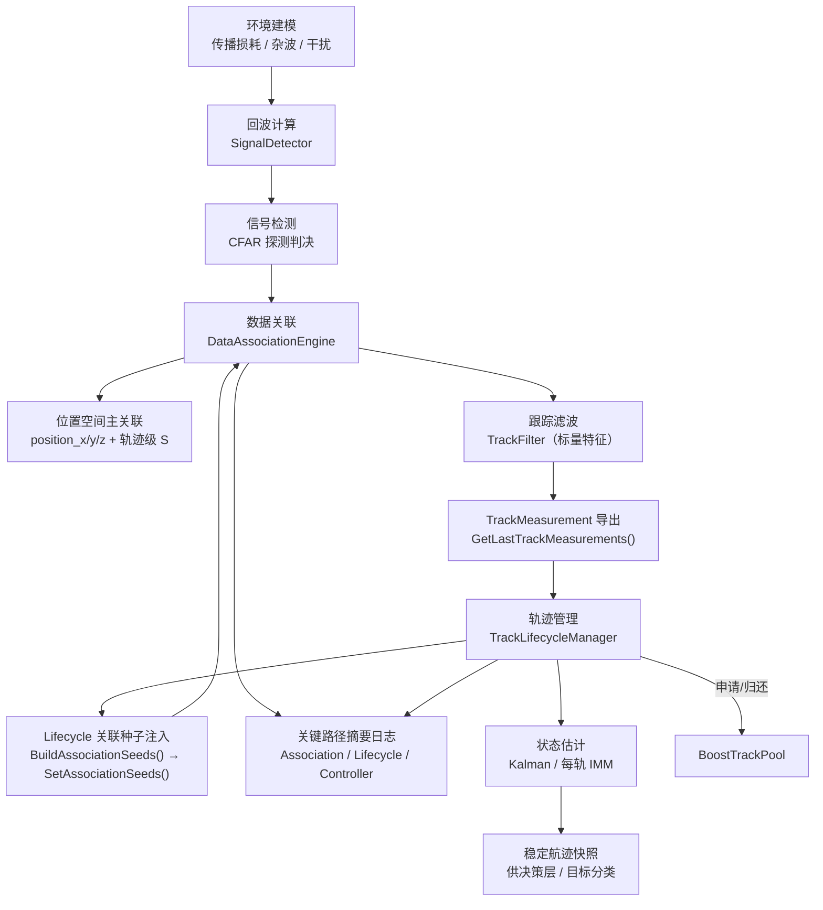
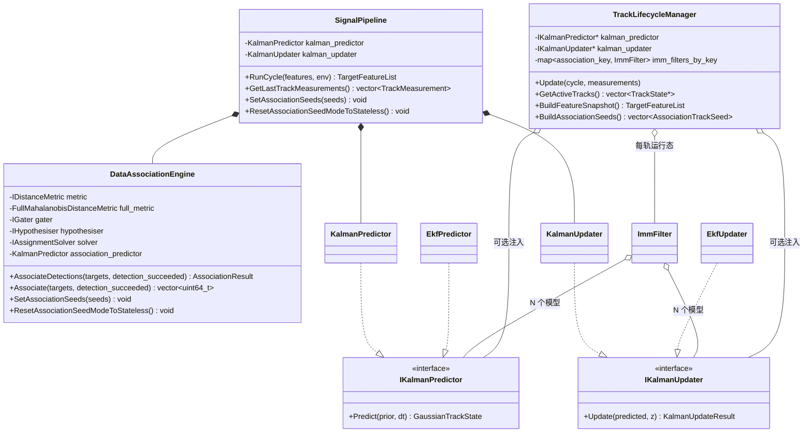

# Signal 层架构说明

## 1. 简介

Signal 层是机载雷达仿真系统的**信号处理核心**，负责从原始目标特征出发，完成完整的 **探测 → 关联 → 滤波 → 航迹管理** 处理链路。

Signal 层遵循三条关键设计原则：

1. **控制面与数据面分离** — 编排逻辑与算法实现通过接口隔离，`SignalPipeline` 仅负责单周期显式步骤编排，不把几何、方向图和探测方程揉进同一类。
2. **关联、滤波、生命周期三者解耦** — 每个子域有独立的数据契约和职责边界，通过 `TrackMeasurement(raw_measurement + filtered_feature)` 在域间传递。
3. **参考 Stone Soup 的算法分层** — 借鉴 Stone Soup 的职责拆分思路（Measure / Gater / Hypothesiser / Associator / Predictor / Updater / Tracker），在 C++ 中重新实现为高性能静态分发版本。

## 2. 图形索引（Mermaid）

| 图 ID | 用途 | Mermaid 段落锚点 | 生成文件 |
|------|------|------------------|---------|
| M1 | 主处理链路 | `#diagram-m1-main-flow` | `./signal-m1-main-flow.png` |
| M2 | 职责边界类图 | `#diagram-m2-boundary` | `./signal-m2-boundary.png` |

## 3. 目录结构

```text
src/airborne_radar/signal/
├── association/                    # [数据关联层]
│   ├── DistanceMetric.h/.cpp       #   ├─ MahalanobisDistanceMetric（对角简化）
│   │                               #   └─ FullMahalanobisDistanceMetric（完整协方差 S⁻¹）
│   ├── Gater.h                     #   └─ CostThresholdGater（波门裁剪）
│   ├── Hypothesiser.h/.cpp         #   └─ DenseCostHypothesiser（假设生成）
│   ├── AssignmentSolver.h          #   └─ IAssignmentSolver 接口
│   ├── LapjvSolver.h/.cpp          #   └─ LapjvSolver（Jonker-Volgenant 最优指派）
│   └── DataAssociation.h/.cpp      #   └─ DataAssociationEngine（位置主路径 + external seeds 单一先验）
│
├── detection/                      # [信号检测层]
│   ├── RadarEquations.h/.cpp       #   ├─ 雷达物理方程纯函数库（回波功率、噪声底、积累增益、测量精度、检测概率）
│   │                               #   ├─ TransmitterConfig / AntennaConfig / ReceiverConfig / DetectionPolicy
│   │                               #   └─ RadarSystemConfig（组合配置）
│   ├── SignalDetector.h/.cpp       #   └─ SignalDetector（纯探测物理：功率→噪声→SNR→Pd→判决）
│   ├── TargetGeometryResolver.h    #   └─ 统一 range / position / look 真值源
│   ├── TargetLookResolver.h        #   └─ 目标局部坐标 -> look az/el
│   ├── BeamControlResolver.h       #   └─ 波束宽度/指向/方向图增益解析
│   └── MeasurementErrorModel.h     #   └─ 有效波束宽度 + SNR -> 量测误差
│
├── pipeline/                       # [编排层]
│   ├── SignalPipeline.h/.cpp       #   └─ 周期主编排器（显式步骤编排）
│   └── SignalComponentFactory.h    #   └─ 配置映射与组件装配工厂
│
└── tracking/                       # [跟踪滤波层]
    ├── GaussianTrackState.h        # [公共] 高斯状态表示（6D CV: x,vx,y,vy,z,vz）
    ├── KalmanPredictor.h/.cpp      #   ├─ IKalmanPredictor 接口
    │                               #   └─ KalmanPredictor（3D 恒速模型）
    ├── KalmanUpdater.h/.cpp        #   ├─ IKalmanUpdater 接口
    │                               #   └─ KalmanUpdater（标准 Kalman，Joseph 形式）
    ├── EkfFilter.h/.cpp            #   ├─ EkfPredictor（扩展 Kalman 预测器）
    │                               #   ├─ EkfUpdater（扩展 Kalman 更新器）
    │                               #   ├─ ITransitionModel / IMeasurementModel 接口
    │                               #   └─ LinearCv / LinearPosition 默认模型
    ├── ImmFilter.h/.cpp            #   └─ ImmFilter（交互多模型滤波器，Bar-Shalom）
    ├── TrackFilter.h/.cpp          #   └─ TrackFilter（标量特征预测/更新编排）
    ├── TrackLifecycleManager.h/.cpp #   └─ 轨迹生命周期状态机（Kalman / 每轨 IMM 集成）
    ├── BoostTrackPool.h/.cpp       #   └─ 基于 Boost.Pool 的对象池
    └── ITrackPool.h                #   └─ 对象池抽象接口

include/1q/airborne_radar/signal/
├── pipeline/
│   ├── ISignalPipeline.h           # SignalPipeline 公共接口
│   └── SignalPipeline.h            # SignalPipeline 默认实现与四域配置
└── tracking/
    ├── GaussianTrackState.h         # 高斯状态类型定义（公共 API）
    ├── ITrackLifecycleManager.h     # 生命周期管理器接口
    ├── ITrackPool.h                 # 对象池接口
    ├── TrackLifecycleManager.h      # 生命周期管理器（含 Kalman / IMM 注入）
    └── TrackLifecycleTypes.h        # 轨迹数据类型定义
```

## 4. 主处理链路

<a id="diagram-m1-main-flow"></a>
图 ID: M1 -> 生成文件：`./signal-m1-main-flow.png`



图中 `SEEDS` 表示当前已落地的 Lifecycle → Association 先验接桥；`ASSOC -> POS_ASSOC` 表示当前唯一正式的关联主路径。

## 5. 关键机制

- `SignalPipeline` 保留单周期 orchestrator 角色，但内部已改为**显式步骤编排**，不再使用责任链节点。
- `SignalPipeline` 的配置映射与组件创建已收口到 `SignalComponentFactory`，避免构造、热更新与 Lifecycle 自动装配三条路径重复拼装。
- `ISignalPipeline` / `SignalPipeline` 已对外暴露平台姿态更新接口，供搭载平台在周期间刷新姿态。
- `TrackLifecycleManager` 的时间步长优先由外部平台通过 `IRadarContext -> CycleContext.dt_sec` 提供；当外部输入无效时，才回退到基于 `cycle_index` 的内部兜底规则。
- 位置空间关联是唯一主路径，`external seeds` 为唯一先验来源，无 seeds 时按 stateless 关联执行。
- `TrackLifecycleManager` 提供生命周期管理与 Kalman/IMM 集成，支持自动装配与可配置启用。
- IMM 激活策略支持 `kAllTracks` 与 `kConfirmedTracksOnly`；默认采用 `kConfirmedTracksOnly`，即仅对进入本周期前已确认且再次命中的轨迹懒创建并启用 IMM，其余阶段回退到首个模型对应的单模型预测/更新路径。
- `TrackLifecycleManager::Update()` 已按 `PreparePhase -> EnsurePhase -> ComputePhase -> CommitPhase -> RecyclePhase` 五阶段收口：前两阶段负责量测路由、轨迹/IMM 运行态补齐，`ComputePhase` 仅消费每轨工作单元且不触碰对象池申请/释放与容器插删，最后两阶段统一提交写回与回收。
- `LifecycleConfig.track_pool_thread_safety_mode` 明确对象池线程安全策略；默认 `kSingleThreadNoLock` 沿用当前单线程模式，未来若启用生命周期并行更新，可切换到 `kMultiThreadGlobalLock` 以全局互斥包装 `ITrackPool`。
- 动态量测协方差 `R` 由检测链路生成并前移复用，供关联与滤波共享。
- 关键路径日志已覆盖 Association / Lifecycle / Controller，便于溯源。

## 6. 关键契约与边界

- `TargetFeature.position_x / position_y / position_z` 的公共契约已经收口为**雷达局部笛卡尔坐标**。
- `range / position / look angle` 在 `SignalPipeline` 内已统一经 `TargetGeometryResolver` 解析，避免 SNR 与量测协方差使用不同距离真值源。
- `TrackMeasurement` 已明确拆分为：
  - `raw_measurement`：关联后的原始位置量测、关联键、关联代价、动态量测协方差
  - `filtered_feature`：`TrackFilter` 回写后的速度、加速度、RCS、干扰标记
- `TargetFeature` 与 `TrackState` 不直接互相替代：
  - `TargetFeature` 是外部输入 / Signal 输入 / Decision 输出的轻量公共载荷
  - `TrackState` 是 Lifecycle 内部重对象，承载状态机、Gaussian 状态和对象池复用语义
- `BeamControlResolver` 中：
  - `kBodyStabilized` 走机体稳定路径
  - `kInertialStabilized` 走完整 3D 姿态逆变换
  - `kGroundStabilized` 当前无地理参考输入，代码上显式等同于 `kInertialStabilized`
- 成功探测目标必须具备上述局部坐标位置，否则 fail-fast。
- external seeds 必须同时携带位置与高斯状态，否则 fail-fast。
- 关联先验仅来自 external seeds；未注入时按 stateless 语义执行。
- 并发语义当前仍默认按主循环单线程驱动；本轮仅固定并行化前置条件，不承诺现阶段 `TrackLifecycleManager` 已具备可并发调用的线程安全保证。
- 后续若要在 `Update()` 内部引入每轨并行，只能并行 `ComputePhase`；`Prepare/Ensure/Commit/Recycle` 继续保持串行，以保证 `tracks_by_key_ / imm_filters_by_key_` 的写入与回收可见性边界明确。

## 7. 与其他模块协作关系

- `RadarController` 在每周期前注入 Lifecycle seeds，驱动 `SignalPipeline::RunCycle()`。
- `TrackLifecycleManager` 负责输出稳定航迹快照，供决策层分类与控制逻辑使用。
- 关联质量指标由 `SignalPipeline` 暴露，`RadarController` 汇总周期日志。

## 8. 职责边界（类图）

<a id="diagram-m2-boundary"></a>
图 ID: M2 -> 生成文件：`./signal-m2-boundary.png`



## 9. 测试覆盖

当前 Signal 层回归重点覆盖以下方面：

- `SignalPipelineTest` / `CoreControllerTest`：验证单周期编排、Lifecycle seeds 注入、自动装配与 controller 集成行为。
- `SignalDetectorTest` / `RadarEquationsTest` / `SwerlingDetectionTest`：验证雷达方程、SNR/Pd、积累增益和 Swerling 模型边界。
- `TargetLookResolverTest` / `BeamControlResolverTest` / `MeasurementErrorModelTest`：验证雷达局部坐标 look angle 解析、波束控制解析以及误差建模拆分后的职责边界。
- `DataAssociationEngineTest` / `TrackLifecycleManagerTest`：验证位置空间关联、external seeds 单一先验、Lifecycle 更新与 fail-fast 契约。
- `TrackFilterTest` / Kalman/EKF/IMM 相关测试：验证标量特征更新与状态估计器数学正确性。

本次重构验收以全量 `ctest --preset llvm-ninja-debug-local --output-on-failure` 通过为准。

## 10. 当前状态与待完善事项

### 已完成 ✅

- 结构化关联结果 + 波门 + 假设生成 + 最优指派
- 完整协方差马氏距离（`FullMahalanobisDistanceMetric`）
- 标准 Kalman 预测器/更新器（3D CV，Joseph 形式）
- EKF 扩展（虚函数接口）
- IMM 多模型滤波器（Bar-Shalom 4 步）
- `TrackLifecycleManager` 中的 Kalman 集成
- `TrackLifecycleManager` 中的每轨 IMM 运行态集成
- `SignalPipeline` 中 Kalman 组件的配置化创建
- `SignalPipeline` 中 external seeds 先验透传与笛卡尔位置量测导出
- 物理化信号检测（`RadarEquations` + `SignalDetector`）
- 动态量测噪声协方差（R 矩阵）传递链路
- 位置空间关联与轨迹级新息协方差联动
- Lifecycle external seeds 接桥 + 关联侧内部历史先验消费路径下线
- `DataAssociationEngine` / `TrackLifecycleManager` / `RadarController` 关键路径摘要日志
- external seeds 单一入口收敛与 stateless 关联语义
- 关联质量观测指标闭环与周期日志输出
- Lifecycle 自动装配落地与非法配置 fail-fast

### 待完善 🔲

- 杂波图与动态门限环境适配机制

### 当前已知限制 ⚠️

- 位置空间关联已是**唯一正式主路径**，成功探测目标若缺位置量测会直接失败
- 位置空间关联当前要求输入 `TargetFeature` 已提供 `position_x / position_y / position_z`
- external seeds 已成为关联先验唯一来源；无 seeds 时关联为 stateless
- 动态量测协方差当前已直接进入 `DataAssociationEngine` 的位置空间关联 $S$ 计算，并与 Lifecycle / Kalman / EKF 更新共享同一份动态 $R$
- 一旦 `RadarController` / `SignalPipeline` 已显式注入 external association seeds，则即便 seeds 为空，也表示 Lifecycle 当前无可供关联的活跃轨迹；此时关联侧保持 stateless
- `SignalPipeline` 当前除导出位置量测与位置关联配置外，也导出最近周期的关联质量指标；IMM 自动装配默认关闭，需显式配置开启
- `kGroundStabilized` 当前只是 `kInertialStabilized` 的实现别名，尚未接入真正的地理/地平参考
- `TargetFeature` 的原点位置当前仍会落入“缺失位置”语义；本轮仿真模型不处理该限制

## 11. 扩展阅读

- `signal-algorithms.md`：算法、公式推导、对照分析与时序细节
- `signal-antenna-pattern.md`：天线方向图模型语义、输入输出链路与工程近似边界
