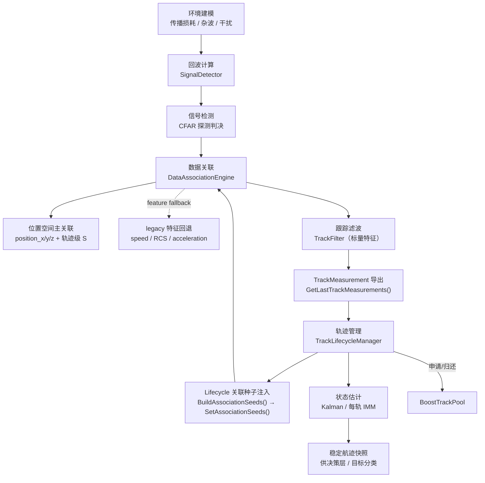
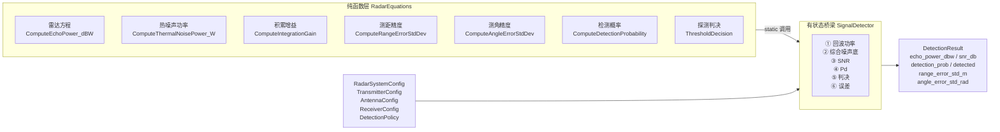
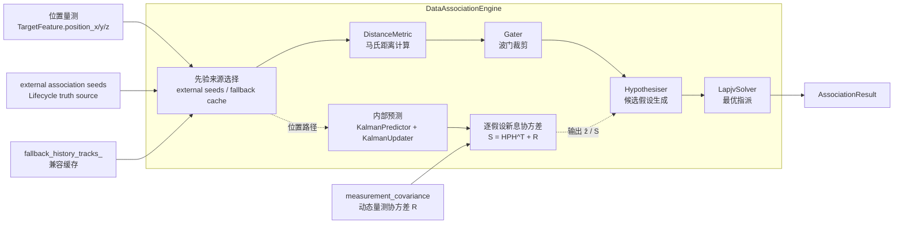
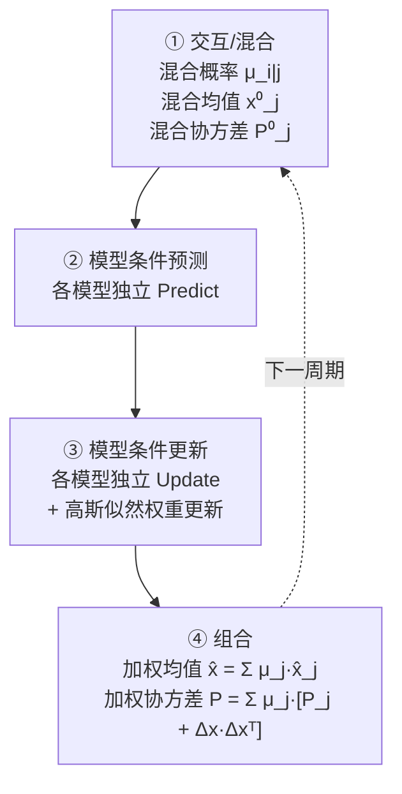
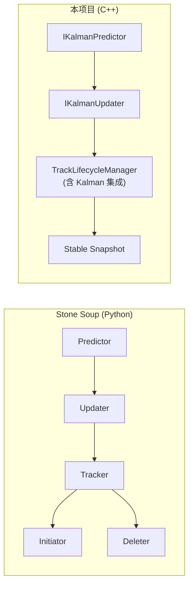
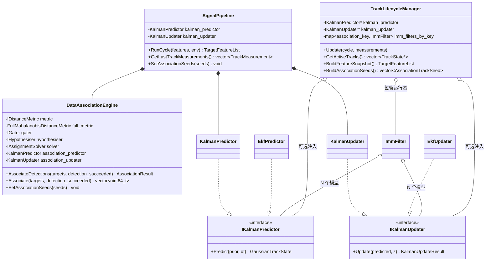
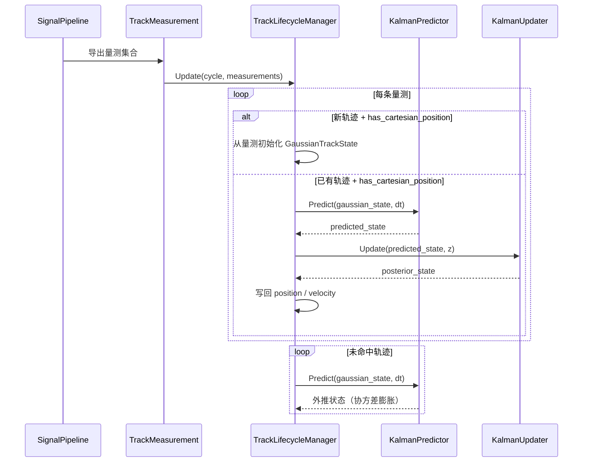
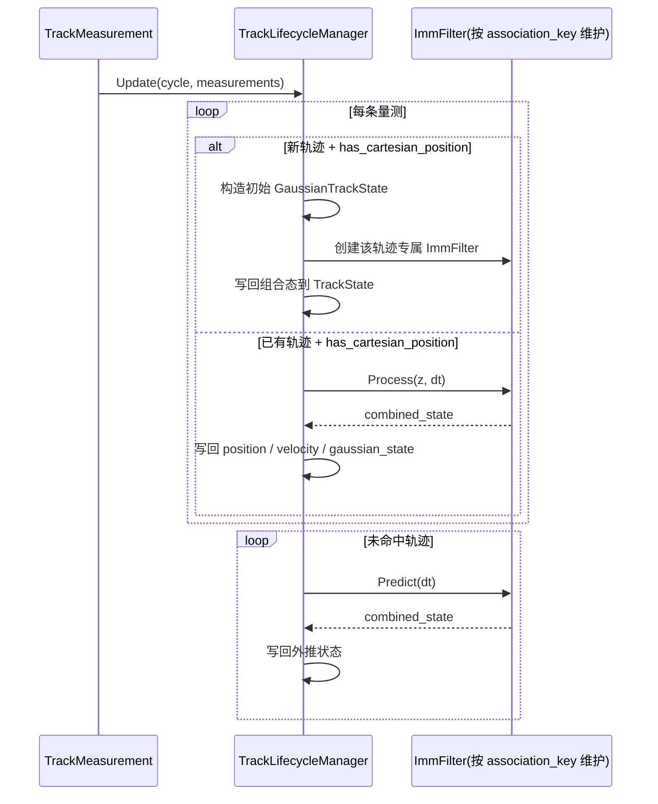

# Signal 层架构说明

## 1. 简介

Signal 层是机载雷达仿真系统的**信号处理核心**，负责从原始目标特征出发，完成完整的 **探测 → 关联 → 滤波 → 航迹管理** 处理链路。

截至当前版本，Signal 层已经同时支持：

- 基于 `TargetFeature.position_x/y/z` 的**位置空间关联主路径**（默认启用）
- 基于 `[speed, rcs, acceleration]` 的**标量特征关联回退路径**（兼容旧实现）
- `TrackLifecycleManager` 内部的**单模型 Kalman**与**每轨 IMM 多模型运行态**
- `FullMahalanobisDistanceMetric` 对轨迹级新息协方差 $S$ 的直接消费

Signal 层遵循三条关键设计原则：

1. **控制面与数据面分离** — 编排逻辑与算法实现通过接口隔离，Pipeline 节点只传递上下文、不直接耦合底层算法。
2. **关联、滤波、生命周期三者解耦** — 每个子域有独立的数据契约和职责边界，通过 `TrackMeasurement` 结构在域间传递。
3. **参考 Stone Soup 的算法分层** — 借鉴 Stone Soup 的职责拆分思路（Measure / Gater / Hypothesiser / Associator / Predictor / Updater / Tracker），在 C++ 中重新实现为高性能静态分发版本。

## 2. 目录结构

```text
src/airborne_radar/signal/
├── association/                    # [数据关联层]
│   ├── DistanceMetric.h/.cpp       #   ├─ MahalanobisDistanceMetric（对角简化）
│   │                               #   └─ FullMahalanobisDistanceMetric（完整协方差 S⁻¹）
│   ├── Gater.h                     #   └─ CostThresholdGater（波门裁剪）
│   ├── Hypothesiser.h/.cpp         #   └─ DenseCostHypothesiser（假设生成）
│   ├── AssignmentSolver.h          #   └─ IAssignmentSolver 接口
│   ├── LapjvSolver.h/.cpp          #   └─ LapjvSolver（Jonker-Volgenant 最优指派）
│   └── DataAssociation.h/.cpp      #   └─ DataAssociationEngine（位置主路径 + legacy 回退关联编排器）
│
├── detection/                      # [信号检测层]
│   ├── RadarEquations.h/.cpp       #   ├─ 雷达物理方程纯函数库（回波功率、噪声底、积累增益、测量精度、检测概率）
│   │                               #   ├─ TransmitterConfig / AntennaConfig / ReceiverConfig / DetectionPolicy
│   │                               #   └─ RadarSystemConfig（组合配置）
│   └── SignalDetector.h/.cpp       #   └─ SignalDetector（6 步检测链：功率→SNR→Pd→判决→误差）
│
├── pipeline/                       # [编排层]
│   └── SignalPipeline.h/.cpp       #   └─ 周期主编排器（ChainProcessor 模式）
│
└── tracking/                       # [跟踪滤波层]
    ├── GaussianTrackState.h        # [公共] 高斯状态表示（6D CV: x,vx,y,vy,z,vz）
    ├── KalmanPredictor.h/.cpp      #   ├─ IKalmanPredictor 接口
    │                               #   └─ KalmanPredictor（3D 恒速模型）
    ├── KalmanUpdater.h/.cpp        #   ├─ IKalmanUpdater 接口
    │                               #   └─ KalmanUpdater（标准 Kalman，Joseph 形式）
    ├── EkfFilter.h/.cpp            #   ├─ EkfPredictor（扩展 Kalman 预测器）
    │                               #   ├─ EkfUpdater（扩展 Kalman 更新器）
    │                               #   ├─ ITransitionModel / IMeasurementModel 接口
    │                               #   └─ LinearCv / LinearPosition 默认模型
    ├── ImmFilter.h/.cpp            #   └─ ImmFilter（交互多模型滤波器，Bar-Shalom）
    ├── TrackFilter.h/.cpp          #   └─ TrackFilter（标量特征预测/更新编排）
    ├── TrackLifecycleManager.h/.cpp #   └─ 轨迹生命周期状态机（Kalman / 每轨 IMM 集成）
    ├── BoostTrackPool.h/.cpp       #   └─ 基于 Boost.Pool 的对象池
    └── ITrackPool.h                #   └─ 对象池抽象接口

include/1q/airborne_radar/signal/
├── pipeline/
│   └── ISignalPipeline.h           # SignalPipeline 公共接口
└── tracking/
    ├── GaussianTrackState.h         # 高斯状态类型定义（公共 API）
    ├── ITrackLifecycleManager.h     # 生命周期管理器接口
    ├── ITrackPool.h                 # 对象池接口
    ├── TrackLifecycleManager.h      # 生命周期管理器（含 Kalman / IMM 注入）
    └── TrackLifecycleTypes.h        # 轨迹数据类型定义
```

## 3. 主处理链路

单周期执行流程如下：



图中 `SEEDS` 表示当前已经落地的 Lifecycle → Association 先验接桥；`ASSOC -> POS_ASSOC` 表示默认位置主路径，`ASSOC -. feature fallback .-> LEGACY_ASSOC` 表示当位置量测不完整或显式关闭位置路径时，关联阶段退回 legacy 标量特征空间。至于 `prior fallback`，则发生在 `DataAssociationEngine` 内部：若当前周期没有外部 seeds 接管，才退回使用内部 `fallback_history_tracks_` 兼容缓存。

### 3.1 编排机制

`SignalPipeline` 采用 **ChainProcessor（责任链）模式**组织单周期的各处理阶段：

**占位符路径**（`enable_physics_detection = false`，默认）：
```
EnvironmentSamplingStage
  → EchoEstimationStage          # 线性占位符公式
    → DetectionStage              # 简单 margin 比较
            → AssociationStage          # 默认位置空间关联（必要时回退）
        → TrackingFilterStage
```

**物理路径**（`enable_physics_detection = true`）：
```
EnvironmentSamplingStage
  → PhysicsEchoEstimationStage   # 雷达方程 + CFAR 检测概率 + 蒙特卡洛判决
                → AssociationStage           # 位置空间关联（缺位置直接失败）
      → TrackingFilterStage
```

每个 Stage 实现 `IChainProcessor<SignalCycleContext>` 接口，通过 `SignalCycleContext` 共享上下文数据。

当前 `AssociationStage` 仍然是 Pipeline 链路中的单一节点；**位置预测、逐轨迹预测协方差 $HPH^T$ 与逐量测动态协方差 $R$ 的合成，发生在 `DataAssociationEngine` 内部**，而不是新增一个独立的前置 Stage。当前实现已移除 legacy 标量特征回退路径；若成功探测目标缺失 `position_x / y / z`，关联阶段会直接触发契约失败。

当前版本中，`RadarController` 会在调用 `SignalPipeline::RunCycle()` 之前，先从 `TrackLifecycleManager` 拉取上一周期活跃轨迹的 `AssociationTrackSeed`，再注入 `SignalPipeline` 作为本周期关联的先验种子；因此位置空间关联的预测真理源已开始从 `DataAssociationEngine` 内部缓存，向 Lifecycle 侧收敛。

为方便调试与测试，关联结果和 `TrackMeasurement` 现已显式暴露 `used_external_association_seeds` 标记，用于区分“本周期位置关联来自 Lifecycle 外部种子”还是“使用关联引擎内部兼容缓存”。

当 `RadarController` / `SignalPipeline` 已显式注入外部种子时，即便该周期种子列表为空，也表示“Lifecycle 当前没有可供关联的活跃轨迹”；此时 `DataAssociationEngine` 不会再回退复用内部历史缓存，而是把自身内部缓存视为 fallback-only 机制，仅在**未接入 Lifecycle 种子提供者**的场景下启用。

## 4. 核心算法详解

### 4.1 信号检测（物理化路径）

信号检测层由两个组件层叠构成：



#### 核心公式（Skolnik 交叉验证）

| 公式 | 数学表达 | 参考 |
|------|----------|------|
| 单站雷达方程 | Pr = Pt + 2Gt + 2λ + σ - 30·lg(4π) - 4·R - L | Skolnik eq.1.6 |
| 热噪声功率 | N₀ = k·T₀·B·F | IEEE 标准 |
| 相参积累 | G = N；非相参: G = √N | Skolnik Ch.2 |
| 测距精度 | σ_R ≈ 0.5·c/(2B) / √(SNR) + bias | Skolnik eq.11.2 工程近似 |
| 测角精度 | σ_θ ≈ 0.317·θ_bw / √(SNR) + θ_bw/30 | Skolnik eq.11.27 工程近似 |
| 检测概率 | Swerling 0~4 精确公式 (Boost.Math) | Richards/M&M 定理 |

### 4.2 数据关联



图中将 `external association seeds` 与 `fallback_history_tracks_` 拆开显示，是为了强调当前仅保留 **prior fallback** 这一个回退维度：它只回答“关联先验从哪里来”，不再承担“切换到另一套特征空间匹配”的职责。另外，`measurement_covariance` 已通过 `SignalCycleContext` 前移到 `AssociationStage`，并直接进入 `DataAssociationEngine` 的逐假设 $S$ 计算。

`DataAssociationEngine` 当前收敛为单一位置空间路径：

1. **位置空间路径（唯一主路径）**
    - 量测来源：`TargetFeature.position_x / position_y / position_z`
    - 历史轨迹状态：`TrackSignature.position + gaussian_state`
    - 距离度量：`FullMahalanobisDistanceMetric`
    - 协方差来源：内部 `KalmanPredictor` 预测得到 $P$，与来自 `SignalPipeline` 的动态量测协方差 $R$ 在假设生成阶段合成为
      $$S = HPH^T + R$$
    - 契约要求：所有成功探测目标必须携带笛卡尔位置量测；缺失时直接失败，而不是静默退回 legacy 特征空间

| 组件 | 算法 | 复杂度 |
|------|------|--------|
| `FullMahalanobisDistanceMetric` | d² = Δzᵀ S⁻¹ Δz （LLT 分解） | O(D³) |
| `CostThresholdGater` | 代价 > 阈值则裁剪 | O(MN) |
| `DenseCostHypothesiser` | 生成所有通过波门的 (轨迹, 量测) 对；支持逐轨迹 $HPH^T$ 与逐量测 $R$ 合成 | O(MN) |
| `LapjvSolver` | Jonker-Volgenant 线性指派 | O(N³) |

#### 4.2.1 当前位置空间关联的实现边界

当前版本已经完成 `FullMahalanobisDistanceMetric` 与轨迹级 $S$ 的联动，但需要注意：

- `RadarController` 已通过 `AssociationTrackSeed` 将 Lifecycle 侧活跃轨迹状态注入关联阶段，关联真理源正在向 `TrackLifecycleManager` 收敛
- 关联域仍保留内部签名缓存作为无 Lifecycle 管理器场景下的兼容路径，尚未完全删除内部状态副本
- `SignalPipeline` 会在 `SignalCycleContext` 中提前构造 `measurement_covariance`，供关联与 Lifecycle 更新共享同一份动态 $R$
- `SignalPipeline` 只有在输入 `TargetFeature` 已携带 `position_x/y/z` 时，才会导出 `has_cartesian_position = true` 的 `TrackMeasurement`
- 当成功探测目标位置量测不完整时，当前实现会直接触发契约失败
- 因此当前位置空间关联已经是唯一正式路径，但内部状态所有权仍属于**已主化的关联能力 + 待进一步统一的数据流**

#### 4.2.2 当前文档中的 fallback 术语约定

为避免后续讨论中将不同层次的“回退”混为一谈，本文当前只保留 `prior fallback` 这一术语：

1. **prior fallback（先验来源回退）**
    - 含义：当前周期没有 `TrackLifecycleManager -> BuildAssociationSeeds() -> SetAssociationSeeds()` 这条外部 seeds 接管链时，`DataAssociationEngine` 退回使用自身内部维护的 `fallback_history_tracks_` 作为关联先验。
    - 作用：为“尚未接入 Lifecycle 真理源”的兼容场景保留最小可运行能力。
    - 非作用：一旦外部 seeds 已显式接管，即便 seeds 为空，也**不会**再回退复用内部历史缓存。

当前实现不再保留 `feature fallback`；成功探测目标若缺失位置量测，会直接失败而不是切换到 `[speed, rcs, acceleration]` 的 legacy 标量特征关联。

因此，当前实现仅存在如下两种先验来源组合：

| 先验来源 | 匹配空间 | 语义 |
|---------|---------|------|
| Lifecycle external seeds | 位置空间主关联 | 理想主路径 |
| fallback history cache | 位置空间主关联 | 尚未接入 Lifecycle，但内部缓存仍可支撑位置预测 |

### 4.3 状态估计滤波器

Signal 层提供三级滤波器，复杂度递增：

#### KalmanFilter（标准 Kalman）

状态模型：3D 恒速（Constant Velocity），状态向量 `[x, vx, y, vy, z, vz]`。

| 步骤 | 公式 | 实现 |
|------|------|------|
| 预测均值 | x̂ = F·x | `KalmanPredictor::Predict` |
| 预测协方差 | P̂ = F·P·Fᵀ + Q | 同上 |
| 新息 | y = z - H·x̂ | `KalmanUpdater::Update` |
| 新息协方差 | S = H·P̂·Hᵀ + R | 同上 |
| Kalman 增益 | K = P̂·Hᵀ·S⁻¹ | LLT 分解求解 |
| 后验均值 | x = x̂ + K·y | 同上 |
| 后验协方差 | P = (I-KH)P̂(I-KH)ᵀ + KRKᵀ | Joseph 形式 |

Q 矩阵（单轴 CV 连续白噪声加速度离散化）：

```
Q_1d = q × | dt³/3  dt²/2 |
            | dt²/2  dt    |
```

#### EKF（扩展 Kalman）

| 差异 | KF | EKF |
|------|----|-----|
| 转移 | x̂ = F·x | x̂ = f(x, dt) |
| 协方差传播 | F 为常数矩阵 | F = ∂f/∂x (Jacobian) |
| 量测预测 | ẑ = H·x̂ | ẑ = h(x̂) |
| 量测矩阵 | H 为常数矩阵 | H = ∂h/∂x (Jacobian) |

通过 `ITransitionModel` / `IMeasurementModel` 虚函数接口注入非线性模型，避免 `std::function` + Eigen 的 alignment 问题。

提供默认线性实现（与标准 KF 数学等价）：
- `LinearCvTransitionModel`
- `LinearPositionMeasurementModel`

#### IMM（交互多模型）

实现 Bar-Shalom 标准 4 步 IMM 算法（Chapter 11.6）：



通过依赖注入接收 N 个 `IKalmanPredictor*` / `IKalmanUpdater*`，支持 KF + EKF 混合模型集。

当前 `TrackLifecycleManager` 已支持**每轨一份 `ImmFilter` 运行态**：

- 以 `association_key` 为键维护 `imm_filters_by_key_`
- 新轨时初始化对应模型集合与初始权重
- 命中时执行 `ImmFilter::Process()`
- 失配时执行 `ImmFilter::Predict()`
- 回收时同步清理该轨迹绑定的 IMM 运行态

## 5. 与 Stone Soup 的对照

### 5.1 概念映射

| Stone Soup 概念 | 本项目对应 | 备注 |
|----------------|-----------|------|
| `Measure` (Euclidean/Mahalanobis) | `MahalanobisDistanceMetric` / `FullMahalanobisDistanceMetric` | 支持对角和完整协方差 |
| `Gater` | `CostThresholdGater` | 代价阈值波门 |
| `Hypothesiser` | `DenseCostHypothesiser` | 暴力枚举所有通过波门的假设 |
| `DataAssociator` | `DataAssociationEngine` + `LapjvSolver` | 分离编排与指派求解 |
| `GaussianState` | `GaussianTrackState` | 6D：[x,vx,y,vy,z,vz] + 协方差 |
| `ConstantVelocity` | `KalmanPredictor` | 3 轴独立 CV，block_diag(Q) |
| `KalmanPredictor` | `KalmanPredictor` | 标准线性预测 |
| `KalmanUpdater` | `KalmanUpdater` | Joseph 形式后验协方差 |
| `ExtendedKalmanPredictor` | `EkfPredictor` | 虚函数接口替代 Python 的 duck typing |
| `ExtendedKalmanUpdater` | `EkfUpdater` | 同上 |
| `TransitionModel.jacobian()` | `ITransitionModel::Jacobian()` | 纯虚函数 |
| `MeasurementModel.jacobian()` | `IMeasurementModel::Jacobian()` | 纯虚函数 |
| `Tracker` (multi-model) | `ImmFilter` + `TrackLifecycleManager` | `ImmFilter` 提供每轨多模型估计，Lifecycle 管理状态机与对象生命周期 |
| `Initiator / Deleter` | `TrackLifecycleManager` | 合并为统一状态机 |

### 5.2 架构差异



关键差异：
1. **生命周期内聚**：Stone Soup 拆为 Initiator + Deleter + Tracker，本项目统一收敛到 `TrackLifecycleManager`。
2. **Kalman 集成点**：Stone Soup 的 Predictor/Updater 在 Tracker 外部调用，本项目通过依赖注入嵌入 `TrackLifecycleManager.Update()` 内部。
3. **类型安全**：Stone Soup 使用 Python duck typing + `Property`，本项目使用 C++ 虚函数 + Eigen 固定维度矩阵。
4. **IMM 实现方式**：Stone Soup 用粒子滤波版多模型，本项目实现标准高斯 IMM。

## 6. 职责边界



## 7. Kalman / IMM 集成机制

`TrackLifecycleManager` 当前支持两类状态估计接入方式：

1. **单模型路径**：通过构造函数注入 `IKalmanPredictor*` 和 `IKalmanUpdater*`
2. **多模型路径**：通过构造函数注入 `vector<IKalmanPredictor*>`、`vector<IKalmanUpdater*>` 以及转移矩阵/初始权重，按轨迹创建 `ImmFilter`

### 7.1 单模型 Kalman 路径



**激活条件**：
- `kalman_predictor_` 和 `kalman_updater_` 均不为 `nullptr`
- `measurement.has_cartesian_position == true`

### 7.2 每轨 IMM 路径



**激活条件**：
- `imm_predictors_` 与 `imm_updaters_` 成对配置
- `measurement.has_cartesian_position == true`

### 7.3 关联侧 $S$ 联动机制

`FullMahalanobisDistanceMetric` 的轨迹级 $S$ 联动当前由 `DataAssociationEngine` 内部完成：

1. 根据 `TrackSignature.gaussian_state` 做位置预测
2. 提取预测位置量测均值 $\hat{z} = [x, y, z]^T$
3. 通过
   $$S = HPH^T + R$$
   计算该轨迹的新息协方差
4. 将 `S` 逐轨迹注入 `DenseCostHypothesiser`
5. 由 `FullMahalanobisDistanceMetric` 计算位置空间关联代价

当前实现里，步骤 1 所使用的 `TrackSignature.gaussian_state` 优先来自 `RadarController -> TrackLifecycleManager::BuildAssociationSeeds() -> SignalPipeline::SetAssociationSeeds()` 这条桥接链；只有在未接入 Lifecycle 管理器时，才退回 `DataAssociationEngine` 自身缓存的历史签名。

## 8. 测试覆盖

| 测试套件 | 测试数 | 覆盖范围 |
|---------|--------|---------|
| `SignalPipelineTest` | 4 | 端到端周期处理、探测裕量衰减、TrackMeasurement 导出、默认位置关联主路径 |
| `TrackFilterTest` | 2 | 标量特征稳定传递、损耗衰减 + 干扰惩罚 |
| `DataAssociationEngineTest` | 9 | 稳定关联、交叉匹配、新目标分配、匹配/失配报告、位置空间关联、外部 seeds 单周期语义、空 seeds 抑制内部 fallback |
| `CostThresholdGaterTest` | 1 | 超阈值裁剪 |
| `DenseCostHypothesiserTest` | 2 | 波门内假设、逐轨迹 S 注入 |
| `TrackLifecycleManagerTest` | 3 | 确认阈值、超时回收、每轨 IMM 漏检预测 |
| `CoreControllerTest` | 6 | Controller 调度、事件发布、Lifecycle 消费真实量测、RunCycle 前注入 Lifecycle seeds |
| `KalmanPredictorTest` | 7 | 零步长恒等、位置传播、协方差增长、对称性、Q 矩阵公式 |
| `KalmanUpdaterTest` | 8 | 协方差收缩、均值收敛、新息正确性、动态R矩阵自适应、正定性 |
| `KalmanPredictUpdateTest` | 2 | 预测-更新集成、速度收敛 |
| `FullMahalanobisTest` | 4 | 对角等价、非对角正确性、单位阵 = 欧氏、动态更新 |
| `EkfPredictorTest` | 1 | 线性场景与标准 KF 数学等价 |
| `EkfUpdaterTest` | 1 | 同上 |
| `ImmFilterTest` | 4 | 单模型等价 KF、双模型权重收敛、机动切换、权重归一化 |
| `RadarEquationsTest` | 8 | 回波功率手算、R⁴规律、玻尔兹曼噪声、相参/非相参积累、测距/测角精度 |
| `SignalDetectorTest` | 4 | 高/低 SNR 探测、确定性种子、干扰降级 |
| `SwerlingDetectionTest` | 11| Swerling 0~4 边界、极限定理、多脉冲增益平滑对比 |
| **合计（Signal 相关 + 跨层集成）** | **77** | 上表覆盖当前 Signal 相关算法与 Controller 集成测试 |

补充说明：当前仓库全量回归已达到 **91 / 91** 绿灯；其余测试主要覆盖决策层、事件总线与环境服务等非 Signal 专属模块。

## 9. 当前状态与待完善事项

### 已完成 ✅

- 结构化关联结果 + 波门 + 假设生成 + 最优指派
- 完整协方差马氏距离（`FullMahalanobisDistanceMetric`）
- 标准 Kalman 预测器/更新器（3D CV，Joseph 形式）
- EKF 扩展（虚函数接口）
- IMM 多模型滤波器（Bar-Shalom 4 步）
- `TrackLifecycleManager` 中的 Kalman 集成
- `TrackLifecycleManager` 中的每轨 IMM 运行态集成
- `SignalPipeline` 中 Kalman 组件的配置化创建
- `SignalPipeline` 中位置空间关联开关透传与笛卡尔位置量测导出
- 物理化信号检测（`RadarEquations` + `SignalDetector`）
  - 单站雷达方程回波功率计算（对数域）
  - 接收机热噪声功率底（kTBF）
  - 相参/非相参脉冲积累增益
  - SNR → Swerling 0~4 模型多脉冲检测概率（Richards 准确公式）
  - 基于 SNR 的测距/测角误差标准差计算
  - `SignalDetector` 上下文 DTO（TargetReturn / EnvironmentState）重构
  - `PhysicsEchoEstimationStage` 集成到 Pipeline
- 动态量测噪声协方差（R 矩阵）传递链路
  - `SignalDetector` 极坐标物理误差 → 笛卡尔空间 R 矩阵转换（Jacobian 近似投影）
  - `TrackMeasurement` 加入动态协方差并外传给 LifecycleManager
  - `KalmanUpdater` 和 `EkfUpdater` 自适应更新 R 权重增益
- 位置空间关联与轨迹级新息协方差联动
    - `DataAssociationEngine` 支持位置空间关联模式
    - `DenseCostHypothesiser` 支持逐轨迹新息协方差注入
    - `FullMahalanobisDistanceMetric` 可直接消费轨迹级 $S$

### 待完善 🔲

- 完成关联侧内部高斯状态向 `TrackLifecycleManager` 单一真源的最终收敛（当前已完成 external seeds 接桥与 fallback 降格，但尚未删除关联侧兼容状态副本）
- 将动态量测协方差 `measurement_covariance` 直接接入位置空间关联的 $S$ 计算
- 随位置量测输入契约继续收敛，进一步压缩 legacy 标量特征关联的兼容兜底角色，并评估其后续保留范围
- `SignalPipeline` / `RadarController` 层面对 IMM 生命周期服务的自动装配
- 杂波图与动态门限环境适配机制

### 当前已知限制 ⚠️

- 位置空间关联已是**默认主路径**，但当位置量测不完整时仍会回退到旧的标量特征关联路径；后者当前仅作为位置量测契约尚未完全收敛时的兼容兜底方案
- 位置空间关联当前要求输入 `TargetFeature` 已提供 `position_x / position_y / position_z`
- 统一状态源收敛仍在进行中：Lifecycle 已开始主导关联先验输入，但 `DataAssociationEngine` 仍保留兼容性的高斯状态缓存
- 动态量测协方差当前已用于 Lifecycle / Kalman / EKF 更新阶段，但尚未直接进入 `DataAssociationEngine` 的位置空间关联 $S$ 计算
- 一旦 `RadarController` / `SignalPipeline` 已显式注入 external association seeds，则即便 seeds 为空，也表示 Lifecycle 当前无可供关联的活跃轨迹；此时关联侧不会再回退复用内部 `fallback_history_tracks_`
- `SignalPipeline` 当前只负责导出位置量测与位置关联配置；`TrackLifecycleManager` 的 IMM 实例化仍由上层显式创建/注入
