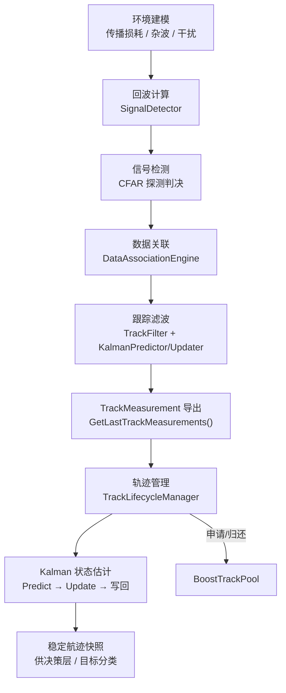
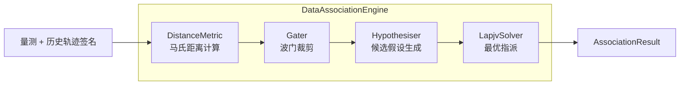
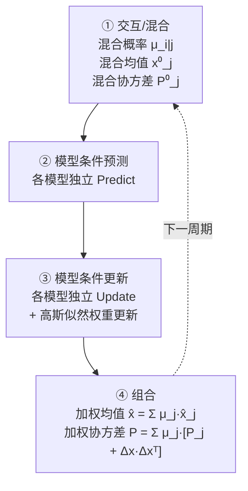
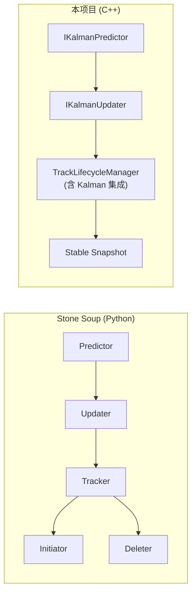
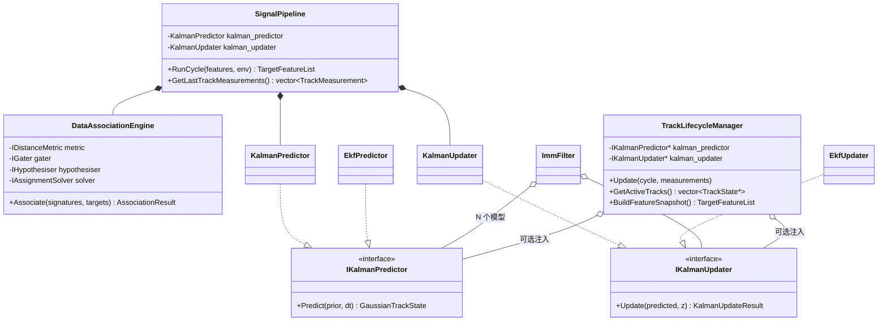
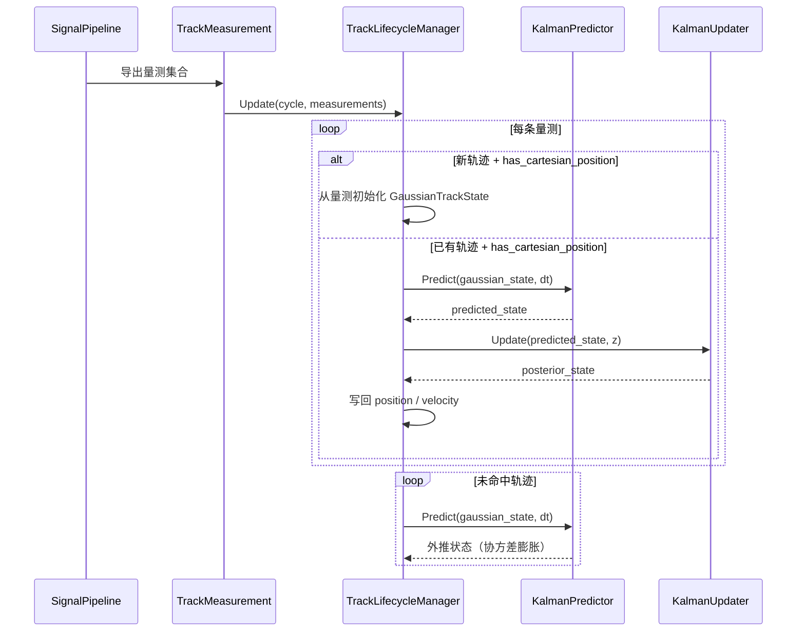

# Signal 层架构说明

## 1. 简介

Signal 层是机载雷达仿真系统的**信号处理核心**，负责从原始目标特征出发，完成完整的 **探测 → 关联 → 滤波 → 航迹管理** 处理链路。

Signal 层遵循三条关键设计原则：

1. **控制面与数据面分离** — 编排逻辑与算法实现通过接口隔离，Pipeline 节点只传递上下文、不直接耦合底层算法。
2. **关联、滤波、生命周期三者解耦** — 每个子域有独立的数据契约和职责边界，通过 `TrackMeasurement` 结构在域间传递。
3. **参考 Stone Soup 的算法分层** — 借鉴 Stone Soup 的职责拆分思路（Measure / Gater / Hypothesiser / Associator / Predictor / Updater / Tracker），在 C++ 中重新实现为高性能静态分发版本。

## 2. 目录结构

```text
src/airborne_radar/signal/
├── association/                    # [数据关联层]
│   ├── DistanceMetric.h/.cpp       #   ├─ MahalanobisDistanceMetric（对角简化）
│   │                               #   └─ FullMahalanobisDistanceMetric（完整协方差 S⁻¹）
│   ├── Gater.h                     #   └─ CostThresholdGater（波门裁剪）
│   ├── Hypothesiser.h/.cpp         #   └─ DenseCostHypothesiser（假设生成）
│   ├── AssignmentSolver.h          #   └─ IAssignmentSolver 接口
│   ├── LapjvSolver.h/.cpp          #   └─ LapjvSolver（Jonker-Volgenant 最优指派）
│   └── DataAssociation.h/.cpp      #   └─ DataAssociationEngine（关联编排器）
│
├── detection/                      # [信号检测层]
│   └── SignalDetector.h/.cpp       #   └─ 回波计算 + 探测判决
│
├── pipeline/                       # [编排层]
│   └── SignalPipeline.h/.cpp       #   └─ 周期主编排器（ChainProcessor 模式）
│
└── tracking/                       # [跟踪滤波层]
    ├── GaussianTrackState.h        # [公共] 高斯状态表示（6D CV: x,vx,y,vy,z,vz）
    ├── KalmanPredictor.h/.cpp      #   ├─ IKalmanPredictor 接口
    │                               #   └─ KalmanPredictor（3D 恒速模型）
    ├── KalmanUpdater.h/.cpp        #   ├─ IKalmanUpdater 接口
    │                               #   └─ KalmanUpdater（标准 Kalman，Joseph 形式）
    ├── EkfFilter.h/.cpp            #   ├─ EkfPredictor（扩展 Kalman 预测器）
    │                               #   ├─ EkfUpdater（扩展 Kalman 更新器）
    │                               #   ├─ ITransitionModel / IMeasurementModel 接口
    │                               #   └─ LinearCv / LinearPosition 默认模型
    ├── ImmFilter.h/.cpp            #   └─ ImmFilter（交互多模型滤波器，Bar-Shalom）
    ├── TrackFilter.h/.cpp          #   └─ TrackFilter（标量特征预测/更新编排）
    ├── TrackLifecycleManager.h/.cpp #   └─ 轨迹生命周期状态机（Kalman 集成）
    ├── BoostTrackPool.h/.cpp       #   └─ 基于 Boost.Pool 的对象池
    └── ITrackPool.h                #   └─ 对象池抽象接口

include/1q/airborne_radar/signal/
├── pipeline/
│   └── ISignalPipeline.h           # SignalPipeline 公共接口
└── tracking/
    ├── GaussianTrackState.h         # 高斯状态类型定义（公共 API）
    ├── ITrackLifecycleManager.h     # 生命周期管理器接口
    ├── ITrackPool.h                 # 对象池接口
    ├── TrackLifecycleManager.h      # 生命周期管理器（含 Kalman 注入）
    └── TrackLifecycleTypes.h        # 轨迹数据类型定义
```

## 3. 主处理链路

单周期执行流程如下：



### 3.1 编排机制

`SignalPipeline` 采用 **ChainProcessor（责任链）模式**组织单周期的各处理阶段：

```
EnvironmentSamplingStage
  → EchoEstimationStage
    → DetectionStage
      → AssociationStage
        → TrackingFilterStage
```

每个 Stage 实现 `IChainProcessor<SignalCycleContext>` 接口，通过 `SignalCycleContext` 共享上下文数据。

## 4. 核心算法详解

### 4.1 数据关联



| 组件 | 算法 | 复杂度 |
|------|------|--------|
| `MahalanobisDistanceMetric` | d² = Σ(Δfᵢ/σᵢ)² （对角简化） | O(D) |
| `FullMahalanobisDistanceMetric` | d² = Δzᵀ S⁻¹ Δz （LLT 分解） | O(D³) |
| `CostThresholdGater` | 代价 > 阈值则裁剪 | O(MN) |
| `DenseCostHypothesiser` | 生成所有通过波门的 (轨迹, 量测) 对 | O(MN) |
| `LapjvSolver` | Jonker-Volgenant 线性指派 | O(N³) |

### 4.2 状态估计滤波器

Signal 层提供三级滤波器，复杂度递增：

#### KalmanFilter（标准 Kalman）

状态模型：3D 恒速（Constant Velocity），状态向量 `[x, vx, y, vy, z, vz]`。

| 步骤 | 公式 | 实现 |
|------|------|------|
| 预测均值 | x̂ = F·x | `KalmanPredictor::Predict` |
| 预测协方差 | P̂ = F·P·Fᵀ + Q | 同上 |
| 新息 | y = z - H·x̂ | `KalmanUpdater::Update` |
| 新息协方差 | S = H·P̂·Hᵀ + R | 同上 |
| Kalman 增益 | K = P̂·Hᵀ·S⁻¹ | LLT 分解求解 |
| 后验均值 | x = x̂ + K·y | 同上 |
| 后验协方差 | P = (I-KH)P̂(I-KH)ᵀ + KRKᵀ | Joseph 形式 |

Q 矩阵（单轴 CV 连续白噪声加速度离散化）：

```
Q_1d = q × | dt³/3  dt²/2 |
            | dt²/2  dt    |
```

#### EKF（扩展 Kalman）

| 差异 | KF | EKF |
|------|----|-----|
| 转移 | x̂ = F·x | x̂ = f(x, dt) |
| 协方差传播 | F 为常数矩阵 | F = ∂f/∂x (Jacobian) |
| 量测预测 | ẑ = H·x̂ | ẑ = h(x̂) |
| 量测矩阵 | H 为常数矩阵 | H = ∂h/∂x (Jacobian) |

通过 `ITransitionModel` / `IMeasurementModel` 虚函数接口注入非线性模型，避免 `std::function` + Eigen 的 alignment 问题。

提供默认线性实现（与标准 KF 数学等价）：
- `LinearCvTransitionModel`
- `LinearPositionMeasurementModel`

#### IMM（交互多模型）

实现 Bar-Shalom 标准 4 步 IMM 算法（Chapter 11.6）：



通过依赖注入接收 N 个 `IKalmanPredictor*` / `IKalmanUpdater*`，支持 KF + EKF 混合模型集。

## 5. 与 Stone Soup 的对照

### 5.1 概念映射

| Stone Soup 概念 | 本项目对应 | 备注 |
|----------------|-----------|------|
| `Measure` (Euclidean/Mahalanobis) | `MahalanobisDistanceMetric` / `FullMahalanobisDistanceMetric` | 支持对角和完整协方差 |
| `Gater` | `CostThresholdGater` | 代价阈值波门 |
| `Hypothesiser` | `DenseCostHypothesiser` | 暴力枚举所有通过波门的假设 |
| `DataAssociator` | `DataAssociationEngine` + `LapjvSolver` | 分离编排与指派求解 |
| `GaussianState` | `GaussianTrackState` | 6D：[x,vx,y,vy,z,vz] + 协方差 |
| `ConstantVelocity` | `KalmanPredictor` | 3 轴独立 CV，block_diag(Q) |
| `KalmanPredictor` | `KalmanPredictor` | 标准线性预测 |
| `KalmanUpdater` | `KalmanUpdater` | Joseph 形式后验协方差 |
| `ExtendedKalmanPredictor` | `EkfPredictor` | 虚函数接口替代 Python 的 duck typing |
| `ExtendedKalmanUpdater` | `EkfUpdater` | 同上 |
| `TransitionModel.jacobian()` | `ITransitionModel::Jacobian()` | 纯虚函数 |
| `MeasurementModel.jacobian()` | `IMeasurementModel::Jacobian()` | 纯虚函数 |
| `Tracker` (multi-model) | `ImmFilter` | Bar-Shalom 4 步算法 |
| `Initiator / Deleter` | `TrackLifecycleManager` | 合并为统一状态机 |

### 5.2 架构差异



关键差异：
1. **生命周期内聚**：Stone Soup 拆为 Initiator + Deleter + Tracker，本项目统一收敛到 `TrackLifecycleManager`。
2. **Kalman 集成点**：Stone Soup 的 Predictor/Updater 在 Tracker 外部调用，本项目通过依赖注入嵌入 `TrackLifecycleManager.Update()` 内部。
3. **类型安全**：Stone Soup 使用 Python duck typing + `Property`，本项目使用 C++ 虚函数 + Eigen 固定维度矩阵。
4. **IMM 实现方式**：Stone Soup 用粒子滤波版多模型，本项目实现标准高斯 IMM。

## 6. 职责边界



## 7. Kalman 集成机制

`TrackLifecycleManager` 通过构造函数可选注入 `IKalmanPredictor*` 和 `IKalmanUpdater*`：



**激活条件**：
- `kalman_predictor_` 和 `kalman_updater_` 均不为 `nullptr`
- `measurement.has_cartesian_position == true`

## 8. 测试覆盖

| 测试套件 | 测试数 | 覆盖范围 |
|---------|--------|---------|
| `SignalPipelineTest` | 3 | 端到端周期处理、探测裕量衰减、TrackMeasurement 导出 |
| `TrackFilterTest` | 2 | 标量特征稳定传递、损耗衰减 + 干扰惩罚 |
| `DataAssociationEngineTest` | 5 | 稳定关联、交叉匹配、新目标分配、匹配/失配报告 |
| `CostThresholdGaterTest` | 1 | 超阈值裁剪 |
| `DenseCostHypothesiserTest` | 1 | 仅输出波门内假设 |
| `TrackLifecycleManagerTest` | 2 | 确认阈值、超时回收 |
| `KalmanPredictorTest` | 7 | 零步长恒等、位置传播、协方差增长、对称性、Q 矩阵公式 |
| `KalmanUpdaterTest` | 7 | 协方差收缩、均值收敛、新息正确性、对称性、正定性 |
| `KalmanPredictUpdateTest` | 2 | 预测-更新集成、速度收敛 |
| `FullMahalanobisTest` | 4 | 对角等价、非对角正确性、单位阵 = 欧氏、动态更新 |
| `EkfPredictorTest` | 1 | 线性场景与标准 KF 数学等价 |
| `EkfUpdaterTest` | 1 | 同上 |
| `ImmFilterTest` | 4 | 单模型等价 KF、匀速低机动占优、机动权重偏移、权重归一化 |
| **合计** | **40** | |

## 9. 当前状态与待完善事项

### 已完成 ✅

- 结构化关联结果 + 波门 + 假设生成 + 最优指派
- 完整协方差马氏距离（`FullMahalanobisDistanceMetric`）
- 标准 Kalman 预测器/更新器（3D CV，Joseph 形式）
- EKF 扩展（虚函数接口）
- IMM 多模型滤波器（Bar-Shalom 4 步）
- `TrackLifecycleManager` 中的 Kalman 集成
- `SignalPipeline` 中 Kalman 组件的配置化创建

### 待完善 🔲

- 上游 `IRadarContext::GetTargetFeatures()` 稳定提供笛卡尔空间输入
- `has_cartesian_position` 自动激活 Kalman 路径
- IMM 集成到 `TrackLifecycleManager`（当前仅 KF 路径）
- `FullMahalanobisDistanceMetric` 与 Kalman 新息协方差 S 的联动
