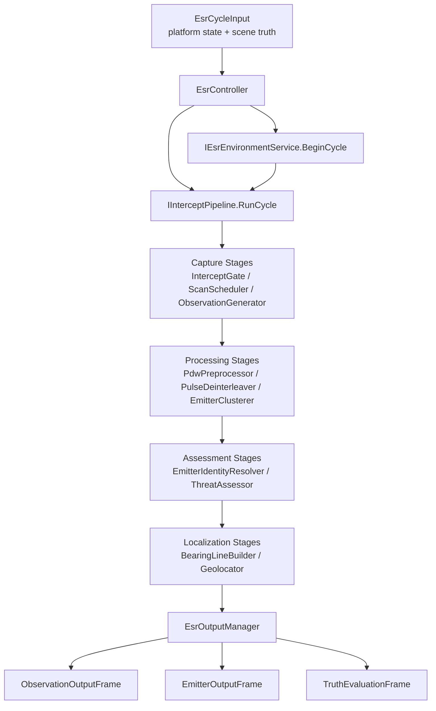
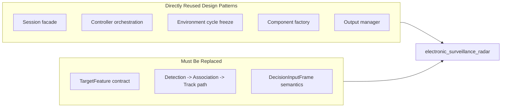

# Electronic Surveillance Radar Architecture

## 1. Overview

`electronic_surveillance_radar` 模块的目标不是复制 `airborne_radar` 的主动探测与跟踪链，而是在保留其优秀工程骨架的前提下，建立一条符合电子侦察机理的主处理链：

- 输入：
  - 平台状态与任务模式
  - 场景辐射源真值
  - 环境与复杂电磁快照
- 输出：
  - 传感器观测输出
  - 辐射源假设输出
  - 威胁与态势输出
  - 可选定位输出
  - 独立的真值评估输出

设计原则：

- 复用工程骨架，不复用主动雷达语义。
- 观测优先，不允许从真值直接生成侦察结果。
- 公共接口最小化，内部复杂算法与装配细节留在 `src/`。

## 2. Reuse Mapping from `airborne_radar`

### 2.1 可以直接借鉴的设计

| `airborne_radar` 设计 | 复用方式 | ESR 中的角色 |
|-----------------------|----------|--------------|
| `RadarSession` 门面 | 直接借鉴模式 | 提供 `一步一周期` 的外部接入门面 |
| `RadarController` 调度器 | 直接借鉴模式 | 负责周期编排、环境冻结、管线调用、输出缓存 |
| `IEnvironmentService::BeginCycle / SampleEnvironment` | 直接借鉴接口风格 | 冻结当前周期传播、遮蔽、干扰和频谱占用事实 |
| `SignalPipeline` 显式步骤编排 | 直接借鉴分层思想 | ESR 主管线不走责任链，而走显式 stage orchestration |
| `SignalComponentFactory` | 直接借鉴装配思想 | 将公共配置映射到内部组件、校验装配约束 |
| `IDataOutputManager` | 直接借鉴多视图输出设计 | 分离观测输出、侦察输出、评估输出 |
| 纯 resolver / model 拆分 | 直接借鉴 | 几何、扫描、频段覆盖、误差模型都拆成无状态组件 |
| PIMPL + 最小公共头 | 直接借鉴 | 控制 ABI 与依赖扩散，避免把复杂内部状态暴露到公共 API |

### 2.2 只能局部复用的模块

| `airborne_radar` 模块 | 复用结论 | 原因 |
|----------------------|----------|------|
| `SignalDetector` / `RadarEquations` | 只能借鉴模式，不能直接搬 | ESR 是被动接收，不是单站主动雷达回波探测 |
| `MeasurementErrorModel` | 可借鉴 | 误差建模拆分方式正确，但公式需改成 ESR 体制 |
| `BeamControlResolver` / `TargetGeometryResolver` | 可借鉴 | 方向、视场、天线与几何解析仍然需要 |
| `EnvironmentService` | 可借鉴聚合与冻结思路 | 但输出从“雷达环境摘要”改为“侦察接收条件摘要” |

### 2.3 明确不复用的主路径

| `airborne_radar` 模块 | 不复用原因 |
|----------------------|------------|
| `TargetFeature -> DataAssociationEngine -> TrackLifecycleManager` | 这是主动雷达量测到目标轨迹的链路，不适合 ESR 的发射源侦察语义 |
| `DecisionInputFrame` / 战术评估器链 | ESR 首版先聚焦侦察与态势输出，不继承主动雷达的 LPI/ECCM 决策链 |
| `TrackOutputFrame` 语义 | ESR 输出不是航迹快照，而是观测记录、辐射源假设和方位线/定位结果 |

## 3. Proposed Directory Layout

```text
include/1q/electronic_surveillance_radar/
├── common/
│   ├── EsrOrientationConfig.h
│   ├── EsrControlProfile.h
│   ├── EmitterObservation.h
│   ├── EmitterTrackSnapshot.h
│   └── EsrOutputFrame.h
├── core/
│   ├── context/EsrCycleInput.h
│   ├── controller/EsrController.h
│   └── session/EsrSession.h
├── environment/
│   ├── IEsrEnvironmentService.h
│   └── EsrEnvironmentTypes.h
└── pipeline/
    ├── IInterceptPipeline.h
    └── InterceptPipelineTypes.h

src/electronic_surveillance_radar/
├── core/
│   ├── controller/EsrController.cpp
│   └── output/EsrOutputManager.h/.cpp
├── environment/
│   └── EsrEnvironmentService.h/.cpp
├── pipeline/
│   ├── InterceptPipeline.h/.cpp
│   └── InterceptComponentFactory.h
├── intercept/
│   ├── InterceptGate.h
│   ├── SpectrumCoverageResolver.h
│   ├── ScanScheduler.h
│   ├── ReceiverEffectModel.h
│   ├── ObservationGenerator.h
│   └── ObservationErrorModel.h
├── processing/
│   ├── PdwPreprocessor.h
│   ├── PulseDeinterleaver.h
│   ├── EmitterClusterer.h
│   └── EmitterIdentityResolver.h
└── localization/
    ├── BearingLineBuilder.h
    ├── SinglePlatformGeolocator.h
    └── MultiPlatformGeolocator.h
```

说明：

- 这里是设计阶段的目标布局，不代表本轮已存在。
- 顶层命名延续 `airborne_radar` 的风格，但把 `signal` 改为更符合语义的 `pipeline / intercept / processing / localization`。

## 4. Main Processing Flow

ESR 首版的正式主链应定义为：

1. `EsrSession` 接收周期输入和可选场景更新。
2. `EsrController` 调用 `IEsrEnvironmentService::BeginCycle()` 冻结环境事实。
3. `IInterceptPipeline` 执行接收与侦察主链。
4. `EsrOutputManager` 将内部结果装配为观测输出、侦察输出和评估输出。
5. `EsrController` 缓存最新输出，供外部查询。

## 5. Diagram Index

| Diagram ID | Purpose | Anchor | Output File |
|------------|---------|--------|-------------|
| M1 | ESR 主处理链 | `#diagram-m1-main-flow` | `./electronic-surveillance-radar-m1.png` |
| M2 | 复用映射与模块边界 | `#diagram-m2-boundary` | `./electronic-surveillance-radar-m2.png` |

### Main Processing Flow
<a id="diagram-m1-main-flow"></a>
Diagram ID: M1 -> Output file: `./electronic-surveillance-radar-m1.png`



### Boundary Mapping
<a id="diagram-m2-boundary"></a>
Diagram ID: M2 -> Output file: `./electronic-surveillance-radar-m2.png`



## 5. Key Mechanisms

### 5.1 `EsrSession` 复用 `RadarSession` 门面思路

建议保留 `Step()` / `StepWithResult()` 风格：

- 外部调用方只需要准备周期输入和可选环境场景更新。
- 内部默认装配 controller、environment service 和 intercept pipeline。
- 对外暴露最近一次观测输出和侦察输出，而不暴露内部组件对象。

这部分可直接对齐 [RadarSession.h](/Users/aurora/Code/1q/include/1q/airborne_radar/core/session/RadarSession.h) 的门面模式。

### 5.2 `EsrController` 复用 `RadarController` 的调度骨架

`airborne_radar` 的控制器设计是好的，因为它把“周期上下文管理”和“算法细节”分开了。ESR 中建议保留同样的分工：

- controller 只负责顺序编排和上下游桥接。
- 侦察算法全部放进 pipeline 和专用组件。
- controller 缓存最新输出，但不拥有长期可变的算法状态机细节。

这部分可直接对齐 [RadarController.h](/Users/aurora/Code/1q/include/1q/airborne_radar/core/controller/RadarController.h)。

### 5.3 `IEsrEnvironmentService` 复用环境冻结接口

这块是 `airborne_radar` 最值得直接迁移的设计之一。ESR 环境服务也应该提供：

- `BeginCycle(cycle_context)`：冻结本周期环境
- `SampleEnvironment()`：返回只读快照

但 ESR 的 `EnvironmentSnapshot` 字段应改成更贴合侦察接收：

- 传播损耗、遮蔽状态、多径系数
- 频谱占用度
- 宽带阻塞和压制噪声摘要
- 欺骗/转发干扰导致的假观测风险度
- 环境级截获退化因子

接口风格参考 [IEnvironmentService.h](/Users/aurora/Code/1q/include/1q/airborne_radar/environment/IEnvironmentService.h)。

### 5.4 `IInterceptPipeline` 复用 `ISignalPipeline` 的单周期接口风格

ESR 也应该保留单周期 `RunCycle()` 抽象，但输入输出契约要换成电子侦察语义：

- 输入不再是 `TargetFeatureList`
- 输入应为平台状态、场景真值视图和环境服务
- 输出不再是 track measurements / decision frame
- 输出应为 observation batch、emitter hypothesis batch、bearing batch 和评估摘要

接口风格可参考 [ISignalPipeline.h](/Users/aurora/Code/1q/include/1q/airborne_radar/signal/pipeline/ISignalPipeline.h)，但不能沿用其数据类型。

### 5.5 `InterceptComponentFactory` 复用装配工厂模式

`SignalComponentFactory` 最大的价值不是具体组件，而是下面三点：

- 公共配置到内部配置的统一映射
- 自动装配的约束校验
- 对复杂默认依赖的集中管理

ESR 也应采用同样的工厂模式，在一个地方统一创建：

- `InterceptGate`
- `ScanScheduler`
- `ReceiverEffectModel`
- `ObservationGenerator`
- `PulseDeinterleaver`
- `EmitterIdentityResolver`
- `BearingLineBuilder`
- `Geolocator`

参考 [SignalComponentFactory.h](/Users/aurora/Code/1q/src/airborne_radar/signal/pipeline/SignalComponentFactory.h)。

### 5.6 `EsrOutputManager` 复用输出分层设计

`airborne_radar` 的 `IDataOutputManager` 给了一个非常好的经验：不要把内部处理对象直接暴露给外部，而是构造多个外部视图。

ESR 中建议至少拆成三类输出：

- `ObservationOutputFrame`
  - 面向接收机视角
  - 包含 PDW/观测摘要/量测误差/观测质量
- `EmitterOutputFrame`
  - 面向侦察结论视角
  - 包含辐射源假设、工作模式、威胁等级、方位线或定位结果
- `TruthEvaluationFrame`
  - 面向仿真统计视角
  - 仅在评估路径使用，不作为战术接口默认输出

设计模式参考 [IDataOutputManager.h](/Users/aurora/Code/1q/src/airborne_radar/core/output/IDataOutputManager.h)。

## 6. ESR-Specific Processing Design

### 6.1 接收与观测阶段

该阶段承接 `ElecReconProcess` 中仍有价值的局部算法，但全部改造成无状态组件：

- `InterceptGate`
  - 负责通视、波束/视场、频段覆盖和动态范围判定
- `ScanScheduler`
  - 负责扫描扇区和驻留调度
- `ObservationGenerator`
  - 把场景辐射源真值转换为观测记录
- `ObservationErrorModel`
  - 负责频率、脉宽、方位和时间戳误差

旧代码中的可借鉴算法来源：

- `BeamArrange`：波束扫描排布
- `JudgeWaveType`：频段分类
- `PreJamPowerCal`：干扰预聚合思路
- `AngleDiff`：角误差随 SNR/波束宽度变化的近似模型

### 6.2 观测处理阶段

这是 `airborne_radar` 没有现成模块、但 ESR 必须新增的核心层：

- `PdwPreprocessor`
  - 观测去噪、时间排序、异常剔除
- `PulseDeinterleaver`
  - 把混合脉冲拆成候选发射源序列
- `EmitterClusterer`
  - 把同一发射源的观测聚类成 emitter hypothesis

这一层是 ESR 与主动雷达最本质的差异，不能拿 `DataAssociationEngine` 替代。

### 6.3 识别与态势阶段

首版不做复杂战术决策引擎，但要做侦察语义上的识别与评估：

- `EmitterIdentityResolver`
  - 依据频率、脉宽、PRI、扫描规律、测向历史输出候选型号集合
- `EmitterModeResolver`
  - 识别搜索、跟踪、制导、频捷等工作模式
- `ThreatAssessor`
  - 根据工作模式、稳定度、相对几何关系输出威胁等级

这里可以借鉴 `airborne_radar` 的 evaluator 粒度设计，但不直接复用现有 `ThreatAssessmentEvaluator` 的语义。

### 6.4 定位阶段

首版定位层只做被动侦察合理的最小闭环：

- `BearingLineBuilder`
  - 根据方位/俯仰和误差生成 bearing line
- `SinglePlatformGeolocator`
  - 基于多时刻机动观测做单平台交汇定位
- `MultiPlatformGeolocator`
  - 预留多平台方位交汇定位

不建议首版纳入 TDOA/FDOA 的默认实现。

## 7. Contracts and Boundaries

### 7.1 必须保留的公共边界习惯

- 公共头只暴露接口和轻量类型。
- 默认实现和复杂状态机全部收口到 `src/`。
- 外部项目优先通过 `Session` 使用，而不是直接依赖 controller 和内部组件。

### 7.2 ESR 新模块的关键契约

- `EsrCycleInput`
  - 平台状态、时间步长、任务模式
- `EmitterTruthState`
  - 场景发射源真值，仅供内部生成观测
- `EmitterObservation`
  - 接收机观测记录，是 ESR 主处理中间契约
- `EmitterHypothesis`
  - 辐射源假设，是识别和定位的主契约
- `EsrOutputFrame`
  - 对外聚合结果，至少包含 observation / emitter / evaluation 三视图

### 7.3 失败策略

- 输入契约缺失时 fail-fast，例如非法频率、无效姿态、负时间步长。
- 环境信息不足时允许降级，但必须显式打标。
- 识别和定位不收敛时输出不确定状态，不伪造唯一答案。

### 7.4 并发语义

- 首版默认单线程语义。
- 不允许像旧 `ElecReconProcess` 那样在并行区直接写共享容器和共享姿态状态。
- 若后续做并行化，应只并行纯 stage 或只读批处理阶段。

## 8. Collaboration with Other Modules

- 与 `airborne_radar` 的关系
  - 共享工程风格和部分基础设施模式
  - 不共享主动雷达数据契约
- 与未来外部仿真系统的关系
  - 外部系统负责提供场景真值和平台状态
  - ESR 负责生成观测与侦察结果
- 与未来协同定位模块的关系
  - 通过 bearing line 和 emitter hypothesis 作为桥接数据

## 9. First Implementation Plan

建议按以下顺序落地，而不是一次性把整套系统全做完：

1. 公共契约：
   - `EsrCycleInput`
   - `EmitterObservation`
   - `EmitterHypothesis`
   - `EsrOutputFrame`
2. 门面与调度骨架：
   - `EsrSession`
   - `EsrController`
   - `IEsrEnvironmentService`
3. 接收与观测阶段：
   - `InterceptGate`
   - `ScanScheduler`
   - `ObservationGenerator`
   - `ObservationErrorModel`
4. 观测处理阶段：
   - `PdwPreprocessor`
   - `PulseDeinterleaver`
   - `EmitterClusterer`
5. 识别与威胁阶段：
   - `EmitterIdentityResolver`
   - `EmitterModeResolver`
   - `ThreatAssessor`
6. 输出阶段：
   - `EsrOutputManager`
7. 首版定位：
   - `BearingLineBuilder`
   - `SinglePlatformGeolocator`

## 10. Status and Next Steps

### Done

- 已完成 ESR 需求基线重写，明确真实电子侦察边界。
- 已从 `ElecReconProcess` 提取出可保留的局部算法方向。
- 已从 `airborne_radar` 梳理出可直接借鉴的骨架设计与不可复用语义。

### Next

- 定义首批公共数据契约。
- 明确 `EsrCycleInput` 与 `EmitterTruthState` 字段。
- 确定 `ObservationOutputFrame` / `EmitterOutputFrame` / `TruthEvaluationFrame` 的最小字段集。
- 决定是否在首版保留轻量任务级简化档与高保真档双配置。
