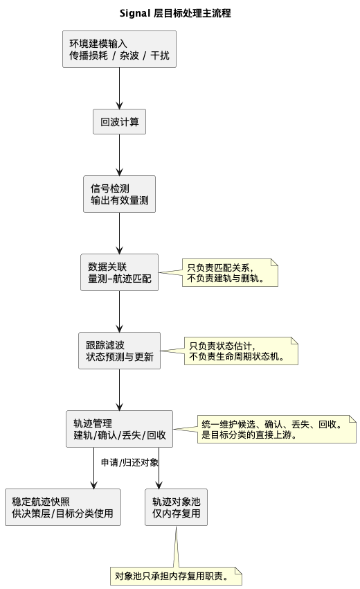

# Signal 层文档目录

- 设计说明：`signal-architecture.md`
- 流程图（PlantUML）：`signal-processing-flow.puml`
- 流程图（PNG）：`signal-processing-flow.png`

说明：本文档聚焦信号处理层的职责边界、模块协同关系，以及目标分类上游所依赖的稳定航迹数据来源。

## 文档说明

- `signal-architecture.md`：解释信号层为什么拆分为数据关联、跟踪滤波、轨迹管理三类职责。
- `signal-processing-flow.puml`：用流程图表达从量测输入到稳定航迹快照输出的主处理链路。

## 流程图预览

