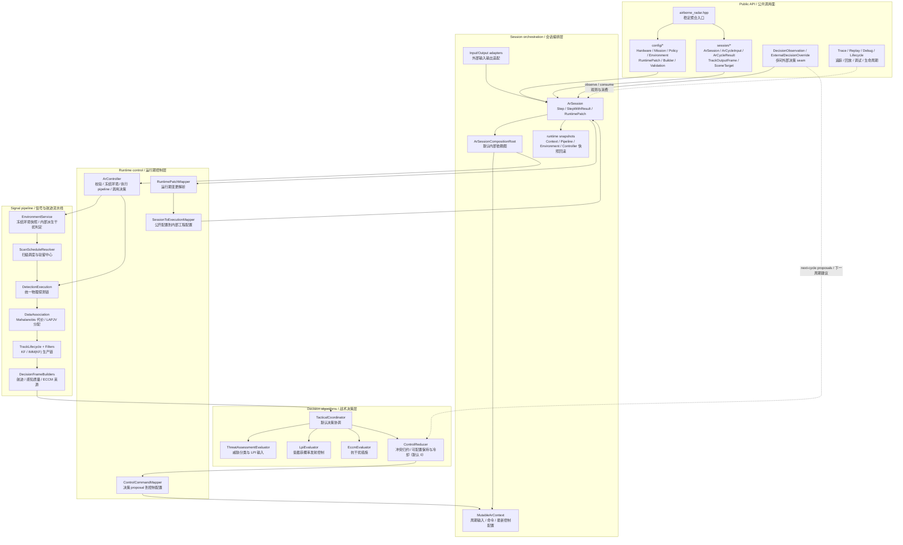
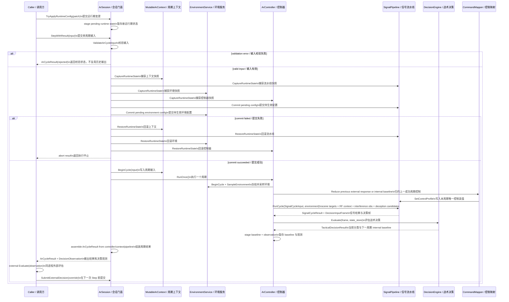
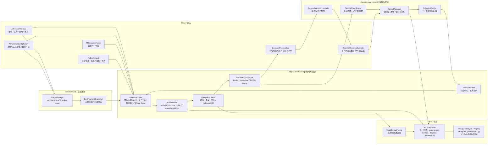
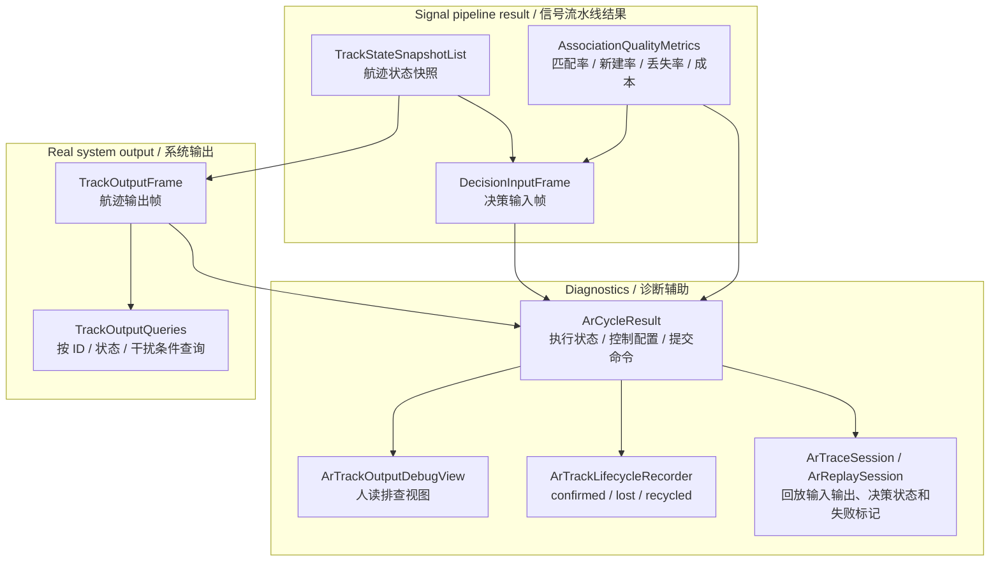
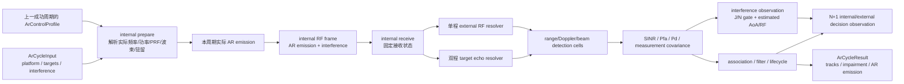

# Airborne Radar 数据流

本文承载 AR 的架构图、Public API 边界、时序、主数据流、输出/调试/归属边界和状态所有权。算法逐步逻辑
读代码；本文只回答"组件如何分层、数据如何流动、状态归谁"。

## Public API 与内部实现边界

公共头位于 `include/1q/airborne_radar/`：

| 区域 | 职责 |
|---|---|
| `airborne_radar.hpp` | 模块聚合入口；聚合稳定 public API，不暴露内部 signal/environment/runtime 类型 |
| `config/` | `ArSessionConfig` 四域配置、runtime patch、语义常量表（`ArProfileConstants.h`）、薄封装 builder、validation |
| `session/` | `ArSession`、cycle input/result、scene target、output types、trace/replay、debug/lifecycle、decision DTO |

Public 决策 DTO 只包含 `DecisionObservation`、`ExternalDecisionOverride`、`ExternalDecisionSubmitStatus` 和
`DecisionControlSource`。默认算法使用的 `TargetCategory`、`TacticalMode`、`TacticalStateStore` 和
`TacticalDecisionResult` 位于 `src/airborne_radar/decision/`，不属于安装边界。

内部实现位于 `src/airborne_radar/`（`config/mapping`、`environment`、`signal/{detection,pipeline,association,tracking}`、
`decision`、`runtime`、`session`、`output`）；逐目录职责读代码，本文只标注边界——`signal/tracking` 生产路径
使用 KF，IMM 按策略配置启用，其它滤波原语位于 `src/common/estimation/`，不构成 AR 可选生产后端。

## 分层组件图



读图要点（边界语义，图本身不传达）：外部只从 observation/response seam 进入；`ArSession` 在运行期配置提交前
捕获 context/pipeline/environment/controller 四类快照，提交或执行失败时回滚避免部分生效；`ArController` 每周期
冻结环境快照让 pipeline 和 decision engine 看同一份事实；决策 proposal 经 `ControlReducer`/
`ControlCommandMapper` 形成下一周期控制配置，不直接改 signal pipeline。

## 执行时序图

`StepWithResult()` 在内部先确定实际 AR 发射，再合并调用方提供的 `RfEmissionFrame` 并完成接收、探测与
跟踪；调用方不管理中间阶段。



## 主数据流

自然环境与外部 RF 干扰分开输入。



### 远程识别链路（kLrr）

识别是纯并行输出：执行点位于 `DecisionInputFrame` 生成之后（controller 内部），结果仅回填
`TrackOutputFrame`，不进入决策帧与威胁评估。

```text
ArSceneTarget 特征真值（aspect / polarization / range_rcs 样本）
  → RecognitionObservationBuilder（SNR / 带宽 / 驻留 / 视角覆盖约束）
  → Rcs / Motion / Polarization / RangeProfile FeatureExtractor
  → RecognitionTrackState 多周期积累（每 association_key 一份）
  → RecognitionMatcher × RecognitionFeatureDatabase（只读内存基线）
  → ArRecognitionResult 回填 TrackOutputFrame
```

状态所有权：`RecognitionFeatureDatabase` 归 `ArController`（构造加载/析构释放，加载期只读
连接，运行期无连接）；每航迹 `RecognitionTrackState` 随航迹创建、随 `kRecycled`/键重分配
清理；识别快照纳入 `ArControllerRuntimeState` 四类回滚矩阵；`database_version` 入
`ArSessionReplayState`。

## 输出、调试与归属边界



归属边界（图传达分层，以下传达归属禁令）：`TrackOutputFrame` 是唯一系统输出，debug/lifecycle/replay 是
仿真辅助视图，output query 不改变输出语义；决策 SPI 不拥有输出结构，不能绕过内部 output adapter 写系统输出。

**反直觉点（emission_frame 是 base 发射身份）**：公开发布的 `emission_frame`（`RfSceneEmission.antenna`）的
发射功率、载波频率捷变、rejitter 等效果直接由控制 profile 作用到发射，但天线方向图字段读取自未经
`ControlProfileEffects` 处理的 base detection 工程配置。旁瓣对消/自适应波束的效果**只**作用于
`receiver_state.antenna`（接收态），不进公开发射方向图。两个消费者（对外 RF 场景 vs 对内 detector 工程配置）
刻意分属两个物理面，常量有意保持差异。

[evidence: tests/unit/airborne_radar/ar_rf_session_test.cpp]
[evidence: tests/unit/airborne_radar/ar_core_controller_test.cpp]
[evidence: tests/unit/airborne_radar/ar_output_boundary_contract_test.cpp]

## 生命周期与状态所有权

AR 内部按"准备实际发射、冻结接收状态、求解外部 RF、探测与跟踪"分层，但这些步骤不形成 public token
或外部状态机。



状态所有权固定如下（谁拥有什么、什么消费什么——代码不传达的边界语义）：

1. **transmitter state** 由 AR session 内部发射准备子状态唯一拥有（waveform、frequency-hop/PRI/rejitter
   phase、emission ID、发射随机流）。输入校验、关机或实际发射发布前的配置拒绝不消费这些状态；实际
   emission 一经发布即提交，后续接收/探测执行拒绝只恢复接收侧候选状态，`ArCycleResult::emission_frame`
   仍返回该不可撤销的发射事实。
2. **receiver operating state** 由 signal pipeline 在本周期冻结（接收波束/自适应零陷、调谐、预选器、检测
   窗口、系统损耗、噪声参数、最大线性输入功率），对本周期所有目标和外部发射相同，禁止逐目标临时重指向。
3. **detection/association/tracking state** 由 pipeline/lifecycle/filter 各自拥有；单周期拒绝时恢复全部本周期
   候选状态，饱和则是成功物理周期并推进 missed-detection。
4. **internal/external LPI/ECCM proposal** 在下一次**成功发布实际 emission**时消费；输入拒绝、发射前配置拒绝
   或关机不消费，发射后的接收拒绝不允许再次消费同一 proposal。
5. 旧 `PrepareCycle` / `CompleteCycle` / `AbandonCycle`、opaque token 和 scene freeze 不进入公共头、示例、
   trace 门面或安装消费者。

trace 因果顺序 `cycle_output(N) → decision_input(override profile) → cycle_input(N+1) → cycle_output(N+1)`。
`cycle_output` 使用内部 `ArReplayCycleRecord`（public result + `ArDecisionReplayState`）；内部决策按 live 路径
重新计算并逐字段比较 pending internal baseline、实际采用 proposal、来源 cycle/batch、reducer 计数、
observation 和最终 profile，不支持旧 `ArCycleResult` replay 输出格式。

[evidence: tests/unit/airborne_radar/ar_rf_session_test.cpp]
[evidence: tests/replay/airborne_radar/ar_replay_codec_roundtrip_test.cpp]
[evidence: tests/replay/airborne_radar/ar_rf_trace_session_test.cpp]
