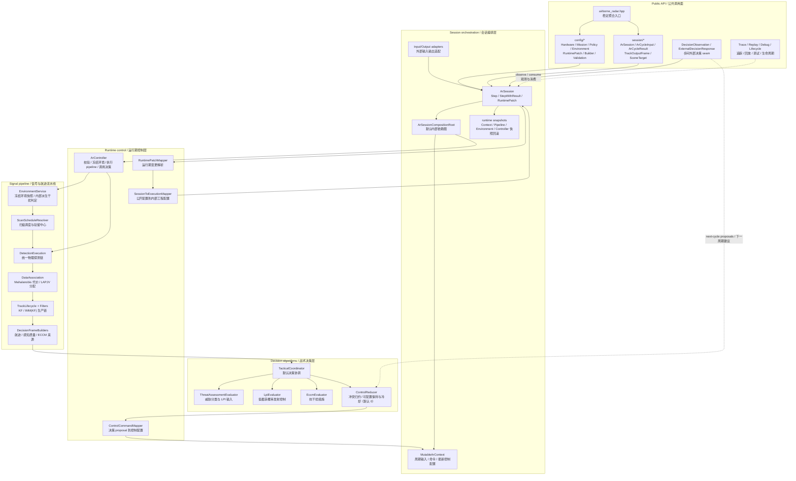
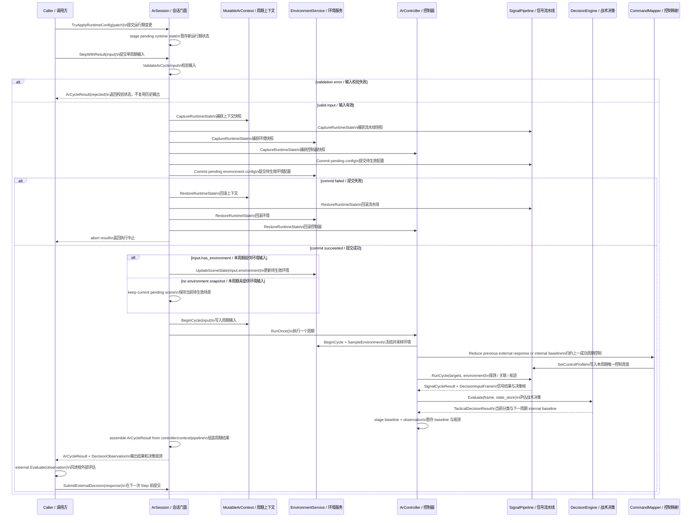
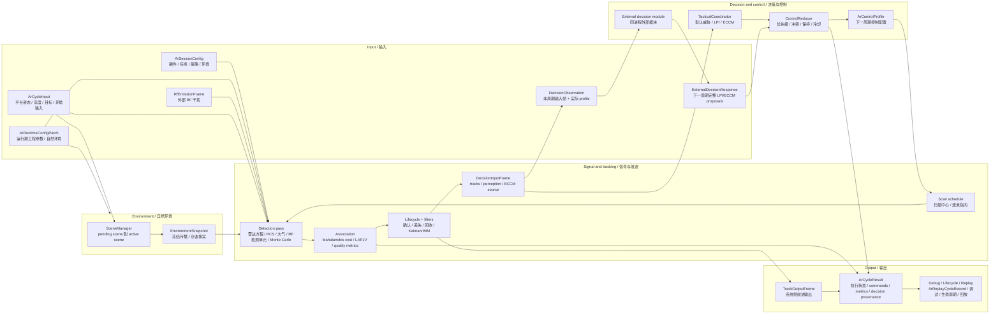
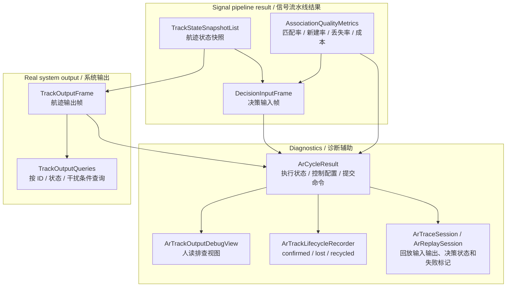
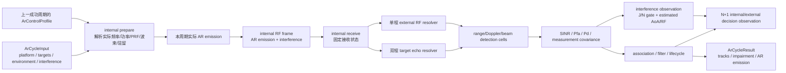

# Airborne Radar 当前设计

Status: active
Last-reviewed: 2026-07-28
Authority: current airborne_radar module design
RF-Interference-Architecture: RF v2 transmitter/receiver current

本文描述 `airborne_radar` 当前架构、数据流和算法边界。跨模块 public API、builder、输出三层模型等共同规则见 `docs/common/contract.md`。

## 1. 架构设计说明

### 1.1 模块定位

`airborne_radar` 提供机载雷达探测、航迹维护、环境/干扰建模、战术决策、控制指令归约、trace/replay、调试视图和生命周期事件。

AR 的决策扩展点是同进程步间 observation/response seam：

- 每个成功周期通过 `DecisionObservation` 输出 `DecisionInputFrame` 与实际控制 profile。
- 调用方在下一次 `Step` 前运行外部模块，并用 `SubmitExternalDecision` 提交完整 LPI/ECCM proposals。
- 外部模块不替换内部对象；威胁分类和内部 baseline 每个成功周期仍持续计算。
- 外部 proposals 仍由内部 `ControlReducer` 和 `ControlCommandMapper` 归约为唯一 `ArControlProfile`。
- trace/replay 在外部响应被接受时立即写入独立 `decision_input` 事件，并在周期输出的内部
  `ArReplayCycleRecord` 中固化 observation、pending/applied internal/external proposals、来源
  cycle/batch、reducer 计数和最终 profile；外部整包替换的 next-successful-cycle 语义可被确定性重放。

当前模块的稳定外部使用方式是：

1. 用 `ArSessionConfig` 或 builder 描述硬件、任务、策略、环境四域配置。
2. 用 `ArCycleInput` 提供绝对周期时间、单一世界坐标平台状态、目标、自然环境和独立 interference frame。
3. 调用 `ArSession::Step()` 获取本周期 track output，或调用 `ArSession::StepWithResult()` 获取结构化执行结果；
   拒绝周期不复用上一帧。
4. 如需自定义 LPI/ECCM，读取结果中的 observation，外部评估后调用 `SubmitExternalDecision()`。
5. 如需调整运行期参数，使用 runtime patch；patch 提交失败时必须保持各子系统状态一致。

`Ar*` 是 AR 模块的 public API 前缀（config/session/cycle/result/adapter/trace/replay/debug/lifecycle 等 DTO 与门面）。`RadarEquations`、`radar_cross_section`、`radar_mount_angles_deg`、`ComposeRadarAttitudeDeg` 等领域术语与领域函数不属于模块前缀范围，保留原名。

历史上的 `Radar*` 模块前缀已一次性迁移到 `Ar*`，不保留 deprecated compat 层：旧 `Radar*.h` public wrapper、`using RadarX = ArX` 别名和 `ar_compat_consumer` 均已删除，`cross_domain_naming_guard` 与 `check_public_api_boundary` 守护目标已切到 `Ar*` 主头。trace/replay schema 与 payload type string 同步迁移到 `Ar*`（namespace 与 file identifier 不变）。新增 public primary 类型不得再使用 `Radar*` 作为模块所有权前缀；`Radar*` 只允许出现在领域术语白名单内。

### 1.2 Public API 与内部实现边界

公共头位于 `include/1q/airborne_radar/`：

| 区域 | 职责 | 设计约束 |
|---|---|---|
| `airborne_radar.hpp` | 模块聚合入口 | 聚合稳定 public API，不暴露内部 signal/environment/runtime 类型 |
| `config/` | `ArSessionConfig`、runtime patch、semantic builder、validation | 表达硬件、任务、策略和自然环境能力 |
| `session/` | `ArSession`、cycle input/result、scene target、output types、trace/replay、debug/lifecycle、decision DTO | observation/response 是唯一 public 决策 seam |

Public 决策 DTO 只包含 `TacticalProposal`、`DecisionObservation`、
`ExternalDecisionResponse`、`ExternalDecisionSubmitStatus` 和 `DecisionControlSource`。
默认算法使用的 `TargetCategory`、`TacticalMode`、`TacticalStateStore` 和
`TacticalDecisionResult` 位于 `src/airborne_radar/decision/`，不属于安装边界。

内部实现位于 `src/airborne_radar/`：

| 目录 | 职责 | 典型类型/函数 |
|---|---|---|
| `config/mapping/` | session config/runtime state 到内部执行配置映射 | `MapSessionToExecution`、runtime patch mapper |
| `environment/` | 自然场景、传播与冻结环境快照 | `EnvironmentService`、`SceneManager`、`PropagationModel` |
| `signal/detection/` | 雷达方程、波束控制、量测误差、目标几何 | `SignalDetector`、`RadarEquations`、`BeamControlResolver` |
| `signal/pipeline/` | 扫描调度、探测执行、数据关联、航迹生命周期、决策帧构建 | `SignalPipeline`、`ExecuteCycle`、`RunPhysicalDetectionPass` |
| `signal/association/` | 数据关联、代价矩阵、LAPJV assignment、关联质量指标 | `DataAssociationEngine`、`LapjvSolver` |
| `signal/tracking/` | track pool、生命周期；生产路径使用 KF，IMM 生命周期按策略配置启用；其他滤波原语位于 `src/common/estimation/`，不构成 AR 可选生产后端 | `TrackFilter`、`TrackLifecycleManager`、`ImmFilter` |
| `decision/` | 默认战术协调、威胁评估、LPI、ECCM、控制归约 | `TacticalCoordinator`、`ThreatAssessmentEvaluator`、`LpiEvaluator`、`EccmEvaluator`、`ControlReducer` |
| `runtime/` | controller 和控制指令映射 | `ArController`、`ControlCommandMapper` |
| `session/` | public session 装配、context、输入输出适配、trace/replay | `ArSession`、`MutableArContext`、`ArSessionCompositionRoot` |
| `output/` | track output 查询 | `TrackOutputQueries` |
| `utils/` | 数学和方位工具 | `MathUtils`、`ArOrientationUtils` |

### 1.3 新开发者视角的分层组件图

读图顺序：

1. 外部只从 Public API 的 observation/response seam 进入，不依赖内部类型。
2. `ArSessionCompositionRoot` 默认装配 context、pipeline、environment service、controller 和默认 `TacticalCoordinator`。
3. `ArSession` 在运行期配置提交前捕获四类快照；提交或执行失败时回滚，避免 pipeline/environment/controller 状态部分生效。设备关机是已接受的非执行配置边界：撤销周期副作用后 finalize 关机配置，并保留外部决策等待下一成功周期。
4. `ArController` 每周期冻结环境快照，再让 signal pipeline 和内部 decision engine 看到同一份环境事实。
5. 决策 proposal 不直接修改 signal pipeline，而是经 `ControlReducer`/`ControlCommandMapper` 形成下一周期控制配置。

### 1.4 执行时序图

下图记录当前单周期执行。`StepWithResult()` 在内部先确定实际 AR 发射，再合并调用方提供的
`RfEmissionFrame` 并完成接收、探测与跟踪；调用方不管理中间阶段。

### 1.5 主数据流

下图记录当前单周期数据流。自然环境与外部 RF 干扰分开输入；工程 RF 输入/输出边界以 §2.5 和
`docs/common/contract.md` 为准。

### 1.6 输出、调试与归属边界

设计要点：

- `TrackOutputFrame` 是系统输出；debug/lifecycle/replay 是仿真和开发辅助视图。
- output query 可以辅助按关联键、状态、干扰条件查询，但不改变输出语义。
- `ArCycleResult` 由 `ArSession` 汇总 controller、context 和 pipeline 状态，承载执行状态、validation
  issues、abort reason、submitted commands、control profile、association quality metrics、decision
  observation 和已采用来源 provenance；完整 proposal、待消费响应与 reducer 计数只属于内部
  `ArReplayCycleRecord`，不进入 public 业务结果。
- 决策 SPI 不拥有输出结构，也不能绕过内部 output adapter 写系统输出。

### 1.7 工程 RF 单周期角色与状态所有权

AR 在工程 RF 世界中同时是主动发射设备和接收设备。面向普通调用方的唯一周期模型是一次输入、
一次结果。AR 内部仍按“准备实际发射、冻结接收状态、求解外部 RF、探测与跟踪”分层，但这些步骤
不形成 public token 或外部状态机。

状态所有权固定如下：

- transmitter state 由 AR session 的内部发射准备子状态唯一拥有，包括实际 waveform、frequency-hop
  phase、PRI/rejitter phase、emission ID 和发射随机流。输入校验、关机或实际发射发布前的配置拒绝
  不消费这些状态；实际 emission 一经发布即提交。后续接收/探测执行拒绝只恢复接收侧候选状态，
  `ArCycleResult::emission_frame` 仍返回该不可撤销的发射事实。
- receiver operating state 由 signal pipeline 在本周期冻结，包括接收波束/自适应零陷、调谐、预选器、
  检测窗口、系统损耗、噪声参数和最大线性输入功率。该状态对本周期所有目标和外部发射
  相同，禁止逐目标临时重指向。
- detection/association/tracking state 继续由 pipeline/lifecycle/filter 各自拥有；单周期拒绝时恢复全部
  本周期候选状态，饱和则是成功物理周期并推进 missed-detection。
- internal/external LPI/ECCM proposal 在下一次**成功发布实际 emission**时消费；输入拒绝、发射前配置
  拒绝或关机不消费，发射后的接收拒绝不允许再次消费同一 proposal。
- 旧 `PrepareCycle` / `CompleteCycle` / `AbandonCycle`、opaque token 和 scene freeze 不进入公共头、示例、
  trace 门面或安装消费者。

## 2. 本模块使用的算法

### 2.1 算法总览

| 算法/部件 | 入口 | 当前角色 | 主要测试锚点 |
|---|---|---|---|
| 配置映射与 runtime patch | `MapSessionToExecution`、runtime patch mapper、`CommitPendingRuntimeConfig` | 将四域配置转为内部工程配置；运行期变更可回滚提交 | `ar_session_config_builder_test`、`ar_runtime_patch_mapper_test`、`ar_environment_config_contract_test` |
| 环境冻结与传播 | `EnvironmentService`、`PropagationModel`、`AtmospherePhysics`（`common/` 共享层） | 管理 pending/active scene，冻结周期环境，计算传播损失/杂波/大气物理 | `ar_environment_service_test`、`ar_propagation_model_test`、`ar_atmosphere_physics_test` |
| 外部 RF 接入 | `RfEmissionFrame`、`ArRfInterferenceResolver`、`ArInterferenceObservationResolver` | 以实际时频发射事实构建前端与 detection-cell 干扰账本，并在 J/N 门控后生成去真值化观测 | `ar_rf_front_end_resolver_test`、`ar_interference_observation_resolver_test` |
| 扫描和波束控制 | `ScanScheduleResolver`、`BeamControlResolver`、orientation utils | 解析扫描中心、安装/机体/平台坐标、波束增益和波束宽度 | `ar_signal_scan_schedule_test`、`ar_orientation_utils_test`、`ar_antenna_pattern_utils_test` |
| 探测执行 | `RunPhysicalDetectionPass`、`SignalDetector`、`ArRfInterferenceResolver` | 统一物理链生成 SNR、检测概率和量测协方差；工程干扰按接收功率进入噪声账本 | `ar_signal_detection_test`、`ar_signal_pipeline_test` |
| RCS 与大气物理 | `ComputeEffectiveTargetRcsM2`、`ComputeTargetSpecificAtmosphericLossDb` | 可选物理 RCS、大气传播损失、目标相关损失修正 | `ar_rcs_physics_test`、`ar_atmosphere_physics_test` |
| 数据关联 | `DataAssociationEngine`、`DenseCostHypothesiser`、`LapjvSolver` | 默认生产路径；基于位置量测、协方差和 track seeds 进行 assignment | `ar_signal_association_test`、`ar_lapjv_solver_test` |
| 航迹过滤与生命周期 | `TrackFilter`、`TrackLifecycleManager`、KF、IMM(KF) | 更新航迹、处理 missed detection、确认/丢失/回收；EKF/UDKF/SRIF 仅见 §2.10 评估/否决表 | `ar_track_filter_test`、`ar_track_lifecycle_test`、`ar_advanced_filter_test` |
| 决策帧构造 | `DecisionFrameBuilders` | 汇总 tracks、感知质量、关联质量、ECCM source info | `ar_core_controller_test`、`ar_signal_pipeline_test` |
| 战术协调 | `TacticalCoordinator` | 威胁评估、LPI、ECCM、关联压力补触发、状态清理 | `ar_decision_layer_test`、`ar_tactical_coordinator_test` |
| 控制归约 | `ControlReducer`、`ControlCommandMapper` | 处理 proposal 冲突、保持窗口、冷却和下一周期控制配置 | `ar_tactical_coordinator_test`、`ar_core_controller_test` |
| 输出/回放 | output adapters、trace/replay codec | 构造 track output、result、debug view 和 replay trace | `ar_cycle_output_builder_test`、`ar_trace_session_adapter_test`、`ar_output_boundary_contract_test` |

### 2.2 配置映射、运行期提交和回滚

环境域以 `EnvironmentScenarioConfig` 作为唯一公开 DTO 权威，环境服务直接消费该类型。当前运行路径
没有执行态专属字段，因此不得维护同型公开 Model 类型或恒等 mapper。只有先证明存在 execution-only
字段时，才可新增内部执行配置并提供显式映射，不应重新复制公开 DTO。
[evidence: tests/unit/airborne_radar/ar_environment_config_contract_test.cpp::ArEnvironmentTypeContractTest.DefaultConfigContainsOnlyScenarioConfig]

AR 的 public config 是语义配置，signal pipeline 使用的是内部工程配置。`ArSession` 构造时通过 `MapSessionToExecution` 初始化 runtime state；runtime patch 到达后先暂存到 `pending_runtime_state`。

真正提交发生在下一次 `RunCycle` 前：

1. 校验输入。
2. 捕获 `MutableArContext`、`ISignalPipeline`、`EnvironmentService`、`ArController` 四类快照。
3. 将 pending runtime state 同步到 signal pipeline。
4. 将环境 scenario 同步到 environment service。
5. 任一提交失败则恢复所有快照，并返回 `kRuntimePreparationFailed`。
6. 提交成功并完成执行后才调用 `FinalizePendingRuntimeConfig`；唯一非执行例外是
   `kSensorPoweredOff`：session 先恢复本周期四类快照以撤销控制/环境消费，再单独重新对齐
   已验证配置并 finalize。真正的执行 abort 仍保留 pending 状态等待重试。

这个机制避免出现“pipeline 已换配置，但 environment/controller 仍旧”的部分生效状态。任何新增运行期可变项，都必须纳入这个提交/回滚语义。
[evidence: tests/contract/airborne_radar/ar_public_api_convenience_test.cpp::RadarSessionPreservesPendingExternalDecisionAcrossPoweredOffBoundary]

运行期 mapper 必须校验合并后的最终候选配置；例如指令波束宽度在同一 patch 中被启用时，
方位/俯仰宽度必须均为有限正数。合法工作模式与非法波束字段混合时整个 patch 原子拒绝，
不得留下工作模式的部分更新。
[evidence: tests/unit/airborne_radar/ar_runtime_patch_mapper_test.cpp::ArRuntimePatchMapperTest.EnabledNonPositiveBeamwidthIsRejectedAtomically]

`MutableArContext` 快照是 session 内部的强所有权边界：opaque envelope 只能由捕获实例构造，
每个 context 生命周期持有唯一 typed identity token，owner token 与 typed snapshot 均为私有且不能
被调用方拆开重组；仅同一生命周期且载荷非空的完整 envelope 可恢复。context 不可复制或移动，
即使析构后在同一地址构造新实例，旧 envelope 也会因 identity 不同被拒绝。foreign owner 和
moved-from 空载荷均在 mutation 前拒绝，不保留 schema compatibility 或明文字段回退路径。
session 仍会对 pipeline、environment 和 controller 执行全部回滚动作；context
或 controller 任一拒绝时统一中止为 `kRuntimePreparationFailed`，不得在 powered-off 边界 finalize
pending 状态。
[evidence: tests/unit/airborne_radar/ar_mutable_context_runtime_state_test.cpp::MutableArContextRuntimeStateTest.ForeignOwnerIsRejectedWithoutMutation]
[evidence: tests/unit/airborne_radar/ar_mutable_context_runtime_state_test.cpp::MutableArContextRuntimeStateTest.WholeForeignEnvelopeAssignmentIsRejectedWithoutMutation]
[evidence: tests/unit/airborne_radar/ar_mutable_context_runtime_state_test.cpp::MutableArContextRuntimeStateTest.MovedFromEnvelopeIsRejectedWithoutMutation]
[evidence: tests/unit/airborne_radar/ar_mutable_context_runtime_state_test.cpp::MutableArContextRuntimeStateTest.ReusedObjectAddressRejectsPreviousLifetimeEnvelope]

### 2.3 自然环境、传播和外部 RF 事实

`EnvironmentService` 维护 pending scene 和 active scene。`UpdateSceneState` 只更新 pending scene，`BeginCycle` 到达时才提交并刷新冻结快照。controller 和 signal pipeline 在同一周期内读取同一份 `EnvironmentSnapshot`。

环境快照包含：

- 大气物理观测（压力、温度、湿度）与自动推导的有效 K 因子；仅在
  `enable_physical_model=true` 时进入逐目标大气损耗计算，影响 SNR/检测概率。
- 地表/植被散射物理，用于影响杂波。
- 基线传播损耗（固定常量之和：基线 + 大气衰减 + 地形反射）。

> 大气物理附加损耗由信号层 `ComputeTargetSpecificAtmosphericLossDb` 用**每个目标的
> 真实几何**（真实斜距、平台/目标高度、波束仰角、发射频率）计算，不在环境层重复
> 计算。环境层早期曾用硬编码几何（10 GHz / 10 km / 1 km / 5°）算一次大气损耗再
> 由信号层减去重加，该重复计算（净贡献为 0 的死计算）已移除，`EnvironmentSnapshot`
> 不再承载 `atmospheric_physics_loss_db` 字段。

> 拒绝暴露 `SpaceWeatherContext`（年积日、太阳流量 F10.7、地磁 Ap、仿真 Unix
> 时间戳等空间天气上下文）：这些字段在当前 GTD7 大气模型退化为 ISA 标准大气
> 的情况下全部未被消费（`src/common/atmosphere/AtmospherePhysics.cpp` 中被
> `(void)` 丢弃），属未接入的死输入，故不对外开放。仿真时间统一以
> `ArCycleInput::cycle_start_time_s` 为唯一来源。未来若恢复完整 GTD7/电离层
> 模型，再作为新能力重新引入。

`ArEnvironmentInput` 与 `EnvironmentSnapshot` 只承载自然环境事实；它们不包含 jammer、J/S、J/N、
干扰检测布尔值或预计算接收功率。AR 的外部 RF 输入是独立的
`oneq::electromagnetics::RfEmissionFrame`，通过 `ArCycleInput::interference` 直接传入。
空 frame 表示无外部 RF；非空 frame 必须与 AR 周期号、绝对窗口起点和时长完全一致，否则整个周期拒绝。

AR 不从环境场景推导干扰。调用方只提供实际发射事实：发射 platform/equipment/emission 身份、ECEF
运动学、天线、极化和参数化波形；接收功率、PSD、J/N、饱和和观测质量全部由 AR 当前接收机链计算。
这使普通调用方的单周期输入保持为“平台、目标、自然环境、可选外部 RF”，而不会要求其选择干扰技术
或预先判断受扰结果。

AR 不保留 legacy jammer DTO、技术类别、J/S 摘要或欺骗/转发适配层；也不直接获取 ECM 的 `EcmDeceptionMode` 真值。外部欺骗发射（ECM 的 RGPO/VGPO/假目标等 kPulseTrain 波形）与压制发射经同一 `RfEmissionFrame` 路径进入接收前端，统一按时频重叠和方向增益计算接收功率。

AR 在接收链的三个层次主动反制欺骗干扰：
- **观测层**：`ArInterferenceObservationResolver` 从过 J/N 门限的 kPulseTrain 观测中，在接收机波束宽度和接收频率分辨单元内建立连通分量，对分量（≥2 同束同频率脉冲列成员）内每个成员 observation 设置 `deception_class=kLikelyFalseTarget`，并逐成员生成一条内部 `ArDeceptionMeasurementCandidate`。候选携带 source observation/emission provenance（`source_observation_id`、`source_emission_identity`）与可观测残差（`estimated_first_pulse_delay_s`、`estimated_carrier_offset_hz`）；候选只在 controller/pipeline 单周期与回滚快照内流转，不进入 public result/replay。候选的关联键不预分配，由正常位置关联产生。resolver 同时填充 `estimated_slant_range_m`、`estimated_range_rate_mps` 和雷达局部系方位（`estimated_bearing_*_local_deg`）。斜距与径向速度在写入前按 `RadarEquations::ComputeRangeErrorStdDev` 派生的标准差叠加**确定性零均值噪声**，种子由 cycle index + receiver equipment id 派生，保证 replay 下可复现；二者不再是精确仿真真值（公共合同 contract.md:348）。候选的 `apparent_slant_range_m`/`apparent_range_rate_mps` 与 `position`/`velocity` 在残差超过可观测门限时由 ECM 编入的额外假距离/假多普勒推导：RGPO 当 `estimated_first_pulse_delay_s ≥ 100 ns` 时叠加 `ΔR = 0.5·c·delay`（双程假时延取单程等效距离），VGPO 当 `|estimated_carrier_offset_hz| ≥ 1 kHz` 时叠加 `Δv = -0.5·λ_ref·Δf`（单基地双程，λ_ref 取接收机本振，>0 否则回退发射中心），使候选量测落在欺骗后的 apparent 位置/速率而非干扰机几何位置；门限内保持几何值，避免无欺骗场景漂移；
- **ECCM 决策层**：`EccmEvaluator` 仅对 kPulseTrain 按**与 ECM 物理匹配**的接收端残差路由 RGPO/VGPO（不读 ECM `EcmDeceptionMode` 真值）。`estimated_center_frequency_hz` 记录发射中心频率加 incident-link Doppler 的实际到达事实；`estimated_carrier_offset_hz` 再扣除接收机本振和同一 link Doppler，只保留额外转发偏移，绝对值 ≥ 1 kHz 时触发 `anti_vgpo_score`。`estimated_first_pulse_delay_s` 以首脉冲到达时刻减“窗口起点 + 同一 link 单程传播”，传播项在两侧相消，只保留 ECM 额外时延，≥ 100 ns 时触发 `anti_rgpo_score`。`kLikelyFalseTarget` 独立触发 `anti_false_target_score`。达阈值后分别生成三个反欺骗提案（§2.7 ECCM）；
- **信号层**：`ArControlProfile` 的三个 bool 字段通过 `ControlReducer`/`ControlCommandMapper` 经现有 ECCM hold/cooldown 管线生效。`DeceptionMeasurementGenerator` **独立于反制开关**，只消费 resolver 生成的候选量测（每成员一条），逐候选合成一条带 `classified_as_false_target` 的假目标量测注入 `track_measurements`；候选数已在 resolver 结构性收敛（每成员一条，不二次扩展），generator 不再按簇大小或固定网格扩展。反制开关只在 `TrackLifecycleManager::PromoteState` 控制 tentative→confirmed 的抑制策略。反 VGPO 加速度限幅在裁剪 `track.velocity` 后回写 `gaussian_state.mean` 速度分量并重算 `acceleration`，保证下一周期 Predict 从一致状态出发。
[evidence: tests/unit/airborne_radar/ar_deception_eccm_test.cpp::SignificantFirstPulseDelayTriggersAntiRgpoProposal]
[evidence: tests/unit/airborne_radar/ar_deception_eccm_test.cpp::SignificantCarrierOffsetTriggersAntiVgpoProposal]
[evidence: tests/unit/airborne_radar/ar_deception_eccm_test.cpp::PlainPulseTrainWithoutFeaturesDoesNotTriggerAntiDeception]
[evidence: tests/unit/airborne_radar/ar_deception_eccm_test.cpp::NonPulseWaveformCannotTriggerRgpoOrVgpoFromResidualFields]
[evidence: tests/unit/airborne_radar/ar_deception_eccm_test.cpp::AntiVgpoClampWritesBackToGaussianState]
[evidence: tests/unit/airborne_radar/ar_deception_eccm_test.cpp::AntiVgpoClampPropagatesToNextPredict]
[evidence: tests/unit/airborne_radar/ar_deception_eccm_test.cpp::AntiVgpoClampRecomputesAcceleration]
[evidence: tests/unit/airborne_radar/ar_deception_measurement_generator_test.cpp::SynthesizesOneMeasurementPerCandidate]
[evidence: tests/unit/airborne_radar/ar_deception_measurement_generator_test.cpp::PositionPreservedFromCandidate]
[evidence: tests/unit/airborne_radar/ar_deception_measurement_generator_test.cpp::AssociationKeyFromEngine]
[evidence: tests/unit/airborne_radar/ar_deception_measurement_generator_test.cpp::GeneratesFalseTargetMeasurementsRegardlessOfSwitch]
[evidence: tests/unit/airborne_radar/ar_deception_measurement_generator_test.cpp::CandidateCountMatchesInputCount]
[evidence: tests/unit/airborne_radar/ar_interference_observation_resolver_test.cpp::LocalFrameBearingDiffersFromEcefWhenAttitudeNonZero]
[evidence: tests/unit/airborne_radar/ar_interference_observation_resolver_test.cpp::RangeAndRangeRateArePerturbedFromTruth]
[evidence: tests/unit/airborne_radar/ar_interference_observation_resolver_test.cpp::PulseTrainPopulatesCarrierOffsetAndFirstPulseDelay]
[evidence: tests/unit/airborne_radar/ar_interference_observation_resolver_test.cpp::ApparentRangeShiftsByHalfLightSpeedDelayForRgpo]
[evidence: tests/unit/airborne_radar/ar_interference_observation_resolver_test.cpp::ApparentRangeRateShiftsByCarrierOffsetForVgpo]
[evidence: tests/unit/airborne_radar/ar_interference_observation_resolver_test.cpp::SubThresholdResidualsKeepGeometricApparent]
[evidence: tests/replay/airborne_radar/ar_replay_codec_roundtrip_test.cpp::AntiDeceptionProfileFlagsRoundtripPreserved]
[evidence: tests/replay/airborne_radar/ar_replay_codec_roundtrip_test.cpp::InterferenceObservationNewFieldsRoundtripPreserved]
[evidence: tests/replay/airborne_radar/ar_replay_codec_roundtrip_test.cpp::InterferenceObservationRejectsOutOfRangeDeceptionClassWithoutMutation]
[evidence: tests/replay/airborne_radar/ar_replay_codec_roundtrip_test.cpp::InterferenceObservationRejectsUnknownWaveformKindWithoutMutation]
[evidence: tests/integration/cross_domain/multi_model_scenario_test.cpp::EcmDeceptionFalseTargetReachesArAndTriggersEccm]

### 2.4 扫描调度、坐标和波束控制

AR 的探测不是只按目标 range 计算。目标必须先被解析到当前雷达参考框架：

- input adapter 和 scene target utils 支持外部坐标、ECEF/LLA、局部坐标和语义轴。
- orientation utils 处理 mount/body/platform frame 的旋转组合。
- `ScanScheduleResolver` 将周期、扫描范围和 dwell center 转成当前扫描指向。
- `BeamControlResolver` 综合天线工程配置、扫描中心、平台姿态、目标 look angle 和波长，给出 one-way antenna gain 与有效波束宽度。

`ArMissionConfig::orientation.scan_center_deg` 是基础扫描中心的 public source of truth；policy 不再
保留默认中心或 replay-only 副本，Builder 档位也只写入 mission orientation。runtime patch 的
`dwell_center_deg` 是当次驻留偏移，最终运行时指向为“基础扫描中心 + 当次 dwell 偏移”。replay 分别保留
基础中心与偏移，不把最终指向误写成只来自一个字段。
[evidence: tests/unit/airborne_radar/ar_signal_scan_schedule_test.cpp]
[evidence: tests/replay/airborne_radar/ar_replay_codec_roundtrip_test.cpp]

实际 emission 与 detection context 在 prepare 阶段冻结同一个挂架坐标波束。机体稳定直接使用扫描中心
和 dwell；惯性稳定、对地稳定先使用本周期平台姿态和实际安装角反解挂架指向，再同时用于 ECEF
发射 boresight 与目标方向增益。平台转动不得使惯性/对地稳定波束随机体漂移。
[evidence: tests/unit/airborne_radar/ar_rf_session_test.cpp::ArRfSessionTest.InertialStabilizationKeepsActualEcefBoresightFixed]

天线波束宽度按轴独立解析，方位轴使用 `nominal_az_beamwidth_deg` / `antenna_length_m`，俯仰轴使用
`nominal_el_beamwidth_deg` / `antenna_width_m`：

- 有生效的 commanded beamwidth 时，以有限正值的 commanded 值为准。
- 未启用 commanded beamwidth 且 nominal beamwidth 大于 0 时，直接使用 nominal 值。
- nominal beamwidth 等于 0 且对应孔径大于 0 时，使用当前发射频率对应的波长和孔径推导。
- nominal 与孔径同时为 0 时没有可用来源，session config validation 拒绝；负数、非有限值，以及推导所需的非法发射频率同样拒绝。

孔径字段属于可回放硬件配置，AR replay 必须保留 `antenna_length_m` 与 `antenna_width_m`；旧 buffer
缺少新增字段时按 FlatBuffer 默认值 0 解码，再由当前 validation 判断该组合是否有效。
[evidence: tests/unit/airborne_radar/ar_beamwidth_resolution_test.cpp]
[evidence: tests/unit/airborne_radar/ar_session_config_builder_test.cpp]
[evidence: tests/replay/airborne_radar/ar_replay_codec_roundtrip_test.cpp]

冻结目标中，控制配置必须反馈到可重放的实际发射或接收硬件状态：

- LPI 可能降低发射功率或改变发射策略。
- ECCM 可能启用频率捷变、rejitter、旁瓣抵消或自适应波束。
- 频率捷变修改实际 carrier/tuning 并重新计算时频重叠；旁瓣对消/自适应波束只修改方向相关接收增益；
  烧穿提高实际发射功率或脉冲能量，重频抖动修改实际参数化脉冲时序。以上措施不直接改写关联、滤波
  或生命周期参数。

测试覆盖坐标变换、扫描窗口、波束宽度、天线方向图、平台姿态，以及实际 emission、PRI/rejitter
schedule、接收零陷和 detection-cell 裕度的跨周期作用。
[evidence: tests/unit/airborne_radar/ar_signal_pipeline_test.cpp::AgilityFrequencyHopPhaseControlsFrequencyDirection]
[evidence: tests/unit/airborne_radar/ar_interference_observation_resolver_test.cpp::GatesByJOverNAndIsOrderIndependent]

### 2.5 统一物理探测与工程 RF 干扰链

AR 的探测门限属于 policy，不属于 hardware。`ArPolicyConfig::detection` 统一承载
`minimum_snr_db`、`pfa`、`pulse_count` 和 `minimum_detection_margin_db`；hardware 只描述发射机、
接收机、天线、波形和量测等物理能力。semantic Builder 的 detection intent 只翻译为这组 policy 参数。
[evidence: tests/unit/airborne_radar/ar_session_config_builder_test.cpp]
[evidence: tests/replay/airborne_radar/ar_replay_codec_roundtrip_test.cpp]

AR 不再提供 heuristic detection toggle 或启发式 pass。冻结目标不是“把所有外部发射功率加到一个周期
总噪声”，而是以下接收机与检测单元链：

1. **实际发射与目标回波。** `StepWithResult()` 内部解析本周期实际频率、发射功率/脉冲能量、带宽、PRF/抖动、
   波束和驻留。每个目标由 AR 自有双程雷达方程计算 echo，包含本周期 transmit/receive gain、双程
   传播、大气、RCS 和处理前损耗；目标不得转换成公共单程 emission。
2. **外部入射 RF。** 冻结 `RfSceneFrame` 中的雷达、ECM 和其他发射经公共单程链路到达 AR 接收设备。
   platform/equipment 路径决定设备级 co-site isolation，不能用零距离自由空间公式或单一实体 ID
   猜测自扰。同平台干扰源 `range_m=0` 时，去真值化扰动钳制到 `kMinObservableRangeM`（1 m）并取
   负扰动绝对值，避免 MeasurementErrorModel 的 20 m 偏置项产生非物理负距触发 fail-closed。
   当前单周期模型不实现 T/R blanking；不得把 co-site 衰减描述为发射脉冲消隐。
3. **前端账本。** 在实际接收方向图和预选器下聚合整个前端带宽的输入功率。超过
   `maximum_linear_input_power_w` 时，本周期仍是物理执行成功，但输出
   `receiver_saturated` impairment，不生成目标量测或虚假 interference observation。
4. **检测单元账本。** 在 range/Doppler/beam 以及实际 time-frequency window 内，为每个候选目标分别记录
   echo、热噪声、杂波和未分辨外部 RF。噪声型 spot/barrage/sweep 以其实际 PSD、接收滤波响应和活动
   占空进入单元；带外、错时或被零陷抑制的贡献为零。首期不把压制噪声解释成虚假目标。
欺骗发射（kPulseTrain）以其参数化脉冲时序、载频和占空比经同一 `TryEvaluateRfArrivalActivity`
时频重叠机制进入检测单元——与连续/噪声型干扰不同，kPulseTrain 在 PRI 间隙内 activity 为零，
因此其有效干扰功率积分低于同峰值功率的连续发射。
当 `enable_anti_rgpo_leading_edge=true` 时，kPulseTrain 外部发射的有效干扰功率乘以 0.5，
模拟前沿跟踪使接收机只取脉冲前沿、减少与欺骗脉冲重叠时段的反制效果。
5. **处理后判决。** 匹配滤波、脉冲压缩、相参/非相参积累和其它 processing gain 只属于 AR。
   统一计算 processed `SINR = echo / (thermal + clutter + interference)`，再由 policy 中的 Pfa、
   Swerling/积累模型和最小 margin 得到 Pd；Monte Carlo 只采样检测事件。检测成功后才由 processed SINR、
   波束宽度、带宽和有效脉冲数生成 range/angle 量测误差及协方差。
6. **航迹影响。** 压制干扰只能通过量测存在性和量测协方差间接影响 association、Kalman、IMM 和
   lifecycle；任何按干扰类别、ECCM profile 或预计算受扰布尔值直接缩放门限、过程噪声、失配容忍
   或生命周期计数的路径都不属于目标架构。

AR 的 interference observation 是与目标 track 分离的接收机观测通道：

- 只在独立能量/J/N 门通过后生成，不能由场景标签或 ECM source ID 直接生成；
- 输出估计 bearing、center frequency、bandwidth、waveform class 和不确定度；误差由 J/N、接收波束和
  有效观测时间驱动；
- raw/decision observation 不包含 truth equipment/emission ID 或“敌方干扰意图”；稳定本地 observation ID
  用于控制闭环，truth attribution 只进入 cycle result debug/replay；
- interference-limited、masked 和 saturated 是接收机事实，不是外部输入字段。

ECCM 只能改变下一次成功发射/接收的实际硬件状态：频率捷变改变 carrier/tuning，重频抖动改变可重放的
脉冲时序，旁瓣对消/自适应波束改变方向增益或零陷，烧穿改变发射功率/脉冲能量。每项措施必须用
检测单元 interference、processed SINR、Pd 或量测协方差的变化证明，不能只断言 control profile 字段。

**噪声基准与饱和降级语义。** 上述链路中存在两个物理上不同的热噪声基准，必须显式区分，不得混用：

- **前端 J/N 门控基准。** `CompleteRfCycle` 计算 J/N 门限使用的热噪声
  `k·T·transmitter.bandwidth_hz·noise_figure`，口径是匹配滤波/预选器带宽下的整前端噪声功率，用于
  判断某条外部 emission 是否达到 `interference_observation_jn_gate_db` 而被记录为可观测干扰。它由
  `ArInterferenceObservationResolver` 消费。
- **检测单元 SINR 基准。** `ArDetectionCellResolver` 计算 processed SINR 时使用的热噪声
  `k·T·matched_filter_bandwidth_hz·noise_figure`，口径是单个 range-Doppler-beam-time-frequency
  detection cell 的噪声功率，进入分母 `thermal + clutter + interference`。

二者带宽口径不同（整前端预选器 vs 单 cell 匹配滤波）是有意的：前者回答“前端能否察觉这个干扰源”，
后者回答“这个 cell 的信干噪比是多少”。它们分别服务两个独立的物理问题，不是同一量的重复实现，
不得合并或互相替换。修改任一带宽口径必须同步本节与对应 resolver 测试。

前端饱和与 ECCM 的关系是降级而非触发：当 `total_incident_power_w > maximum_linear_input_power_w`
时，本周期输出 `receiver_saturated` impairment 并**跳过** `TryResolveArInterferenceObservations`，
因此饱和周期不产生 interference observation，`EccmEvaluator.Evaluate()` 因观测为空而返回未激活。
这是有意语义——前端被烧穿后接收机无法可靠测向，强行生成 J/N 门控观测会输出不可信的 AoA/RF，故
饱和走单独的结构化降级路径（输出 impairment、本周期无目标量测），不经 ECCM 控制闭环。`receiver_saturated`
作为独立 cycle result 字段输出，供上层 orchestrator 做平台级决策；ECCM 的旁瓣对消/自适应波束触发只
依赖未饱和但过 J/N 门的观测，发生在干扰使 SINR 恶化但前端仍线性的区间。
[evidence: tests/unit/airborne_radar/ar_rf_front_end_resolver_test.cpp]
[evidence: tests/unit/airborne_radar/ar_interference_observation_resolver_test.cpp::GatesByJOverNAndIsOrderIndependent]
[evidence: tests/unit/airborne_radar/ar_detection_cell_resolver_test.cpp]
[evidence: tests/unit/airborne_radar/ar_eccm_evaluator_test.cpp]

`ar_rf_session_test`、`ar_detection_cell_resolver_test`、`ar_signal_pipeline_test` 和 AR replay tests 覆盖
RF scene 校验、检测单元时频重叠、接收饱和、干扰观测门控与单周期 replay。跨模块场景和性能测试证明
RF v2 frame 能由 ECM 直接赋给 AR 与 ESR：两者都通过各自的 `interference` 字段消费 ECM 发布的
`RfEmissionFrame`，不经过 v1 迁移适配。

AR 只有一个频率来源：当前有效的 `transmitter.frequency_hz`。探测、传播、天线波长和物理 RCS
全部消费该值；频率捷变更新它后，四条物理路径在同一周期使用同一频率。配置必须有限且大于 0，
`RcsPhysicsConfig` 不再提供独立频率或隐式继承规则。
[evidence: tests/unit/airborne_radar/ar_signal_pipeline_test.cpp::SignalPipelineTest.PhysicalRcsUsesTransmitterFrequency]
[evidence: tests/unit/airborne_radar/ar_signal_pipeline_test.cpp::SignalPipelineTest.AgilityFrequencyHopPhaseControlsFrequencyDirection]
[evidence: tests/unit/airborne_radar/ar_session_config_builder_test.cpp]

### 2.6 数据关联、质量指标和航迹生命周期

探测成功后，`DataAssociationEngine` 负责把量测和已有 track seeds 关联：

1. 过滤未探测目标和缺失位置量测的目标。
2. 基于外部/lifecycle seeds 预测先验 track。
3. 使用 `FullMahalanobisDistanceMetric`、`DenseCostHypothesiser` 和量测协方差生成关联假设。
4. 构造方阵代价矩阵，使用 LAPJV assignment。
5. public `distance_gate_sigma` 以标准差倍数表达；内部 assignment 门限统一派生为
   `distance_gate_sigma²`。小于等于该代价门限的匹配复用原 track key，其余生成新 track key。
6. 计算 association quality metrics：prior、detection、matched、new、missed、match rate、new track rate、missed track rate、mean/p95 match cost。

当前 association 不是 public 算法族扩展点。生产链路只有一条默认路径：`FullMahalanobisDistanceMetric` + `DenseCostHypothesiser` + `LapjvSolver`，没有 factory、runtime config 选择或用户可替换接口。`MahalanobisDistanceMetric` 等保留的具体类用于局部测试和算法对比，不代表已接入第二条生产实现。

association public 配置不再暴露 `unassigned_cost`、启用 hint 或第二套 sigma hint；这些字段会制造多个
互相竞争的门限来源。策略档位如需保持既有内部代价行为，必须在 Builder 中以平方根映射到唯一 sigma。
[evidence: tests/unit/airborne_radar/ar_track_filter_test.cpp]
[evidence: tests/unit/airborne_radar/ar_runtime_patch_mapper_test.cpp]

只有当未来出现至少两个已接入生产路径、具备测试覆盖且语义稳定的 association 实现时，才允许新增用户可见配置来选择算法；在此之前，新增配置项不得只为“可能扩展”而暴露内部类或抽象基类。

航迹层进一步处理 confirmed/lost/recycled 状态：

- `TrackFilter` 在 missed detection 时衰减速度和 RCS。
- 反 VGPO 加速度限幅在 `TrackLifecycleManager` 内实现（而非 `TrackFilter`）：限幅需要跨周期
  上一周期速度，只有持久化 `tracks_by_key_` 持有该状态；`TrackFilter` 无状态且运行在 lifecycle
  之前，无法获得合法基准。当 `enable_anti_vgpo_acceleration_bound=true` 时，对已存在航迹在
  Kalman/IMM 更新之后按 `max_acceleration_mps2 * dt` 裁剪 `track.velocity` 各分量相对上一周期
  速度的变化；新建航迹豁免（其基准是初始零值，限幅无意义）。
  [evidence: tests/unit/airborne_radar/ar_deception_eccm_test.cpp AntiVgpoBoundsVelocityChangePerCycle、
  AntiVgpoDoesNotClampNewlyCreatedTrack]
- 反假目标鉴别在 `TrackLifecycleManager::PromoteState` 内实现：当 `enable_anti_false_target_
  discrimination=true` 且量测被标为疑似假目标（`classified_as_false_target`）时，该量测
  不把 tentative 航迹晋升为 confirmed，抑制欺骗干扰制造的虚假起批。疑似假目标标注来自
  `ArInterferenceObservationResolver` 在连通分量（≥2 同束同频率 kPulseTrain 成员）内对成员
  observation 设置的 `deception_class=kLikelyFalseTarget`；`DeceptionMeasurementGenerator`
  为每条 `ArDeceptionMeasurementCandidate` 合成一条独立量测（`source_index` 取 sentinel，真实
  target 量测不经此路径）并自带 `classified_as_false_target=true`，经 controller 在 `RunCycle`
  前填入 `SignalCycleAnnotations` 后注入 pipeline。
  [evidence: tests/unit/airborne_radar/ar_deception_eccm_test.cpp AntiFalseTargetSuppressesTentativePromotion、
  AntiFalseTargetDisabledPromotesNormally]
- AR 在 ECCM 层主动反制欺骗发射：kPulseTrain 观测经 `EccmEvaluator` 触发前沿跟踪（优先级 89）、
  加速度限幅（优先级 85）和假目标鉴别（优先级 81）三项反欺骗提案；三者经现有 `ControlReducer`
  ECCM hold/cooldown 管线统一归约后写入 `ArControlProfile` 并作用到下一成功周期。
  与压制干扰相同，欺骗发射不得直接改变航迹速度/RCS 衰减或生命周期计数。
  [evidence: tests/unit/airborne_radar/ar_deception_eccm_test.cpp]
- lifecycle manager 管理 tentative/confirmed/lost、track pool 回收、association seeds 导出和 filter writeback；
- 生产预测/更新使用 KF；策略可启用 IMM 生命周期作为多模型 KF 融合层。EKF、UDKF、SRIF 是 common 内部资产，不是 AR 的运行期配置路径；可复现性边界见 §2.10。

这些质量指标继续用于结果输出和一般质量退化诊断，但不得被解释为工程干扰观测，也不得生成 J/N、
jammer attribution 或物理 ECCM 触发。它们最多驱动显式标记的保守 `quality_fallback`，且该 fallback
不能声称已探测到干扰源。

### 2.7 决策帧、威胁评估、LPI 和 ECCM

`ArController` 从 signal pipeline 得到 `DecisionInputFrame` 后调用 decision engine。默认实现是 `TacticalCoordinator`，其流程为：

1. 确定控制触发来源。工程 ECCM 的物理来源只能是 §2.5 定义的接收机 interference observation；
   一般 association quality 异常只能进入不带干扰归属的 `quality_fallback`。
2. 调用 `ThreatAssessmentEvaluator` 评估 tracks，生成威胁分类和 LPI source info。
3. 调用 `LpiEvaluator`，在威胁场景下提出低截获概率发射控制 proposal。
4. 如果存在接收机 interference observation，调用 `EccmEvaluator` 生成抗干扰 proposal；如果只有
   `quality_fallback`，只能选择预先冻结的保守恢复策略，不能构造 interference observation。
5. 工程压制路径不按 truth technique 或 source ID 改写 proposal 优先级。
6. 按 active track keys 清理 `TacticalStateStore`，避免长期运行时状态无限增长。
7. 输出目标分类、proposal、selected mode 和 decision summary。

selected mode 规则：

- ECCM 激活时选择 `kProtectedEmission`。
- 否则如果 LPI 请求降低暴露，选择 `kThreatResponse`。
- 其余为 `kBaseline`。

默认决策结果始终把目标分类回填到 track output frame，并在每个成功周期推进
`TacticalStateStore`、计算下一周期 internal baseline。外部响应只覆盖 LPI/ECCM proposals，
不替换威胁分类路径；因此外部长期生效后，内部 baseline 仍能立即接管。
[evidence: tests/contract/airborne_radar/ar_public_api_convenience_test.cpp::RadarSessionAppliesMatchingExternalDecisionOnNextSuccessfulCycle]

LPI 激活时输出两个参数化 proposal：功率比例沿用威胁/距离分档，范围为 `0.3–0.8`；
驻留比例为 `clamp(0.5 + 0.5 * power_scale, 0.65, 0.90)`。首批不自动启用 LPI
beamforming。[evidence: tests/unit/airborne_radar/ar_tactical_coordinator_test.cpp::LpiEvaluatorTest.EmitsDynamicPowerAndCoupledDwellAcrossRangeBands]
[evidence: tests/unit/airborne_radar/ar_core_controller_test.cpp::CoreControllerTest.ExternalLpiParametersAlterNextPhysicalDetection]

ECCM 只消费接收机 interference observation；烧穿评分达到阈值后输出
`clamp(1.0 + 0.25 * burnthrough_gain_score, 1.0, 2.0)`，且实际 proposal 必须落在
`(1, 2]`。[evidence: tests/unit/airborne_radar/ar_eccm_evaluator_test.cpp::EccmEvaluatorTest.BurnthroughGainIsMonotonicAndClamped]
[evidence: tests/unit/airborne_radar/ar_core_controller_test.cpp::CoreControllerTest.ExternalBurnthroughGainAltersNextPhysicalDetection]
这些测试证明去真值化观测触发的控制会作用到下一成功周期的实际 emission 与探测链。

### 2.8 控制归约和跨周期反馈

内部 baseline 或整包外部响应输出的是 tactical proposal，不是直接生效的硬件控制。
当前实现由 `ControlReducer` 和 `ControlCommandMapper` 在下一成功单阶段周期开始前把二者之一变成唯一
`ArControlProfile`；外部与内部 proposals 不合并：

- 不同域 proposal 会按优先级、策略表和冲突规则归并。
- beam 类冲突默认偏向生存性。
- `ArPolicyConfig::decision_control` 可分别配置 LPI/ECCM 的保持窗口，使 proposal 停止后控制继续维持
  指定数量的成功周期。
- 同一配置可分别设置 LPI/ECCM cooldown，防止控制释放后立即重新激活。
- 四个周期数默认均为 `0`，表示关闭相应窗口并保持“下一成功周期可立即切换”的兼容行为；调用方可通过
  初始 session config 或 whole-policy runtime patch 显式启用，snapshot rollback 和 replay 同步保留配置与计数状态。
- runtime patch 缩短窗口时，当前剩余周期立即收紧为 `min(旧剩余, 新上限)`；改为 `0` 会取消当前窗口。
  增大配置不会延长已经开始的窗口，只影响下一次新建的 hold/cooldown 窗口。
- 频率捷变等行为可以有 hop phase 的跨周期状态。
- LPI 功率要求有限且位于 `(0,1]`，驻留位于 `[0.25,1]`，ECCM 烧穿位于 `(1,2]`；
  其他布尔 directive 禁止携带标量，参数化 directive 禁止缺值。
- 同时出现烧穿和 LPI 降功率时，生存性规则把最终功率比例提升到至少 `0.85`。
- 外部响应必须匹配最新 observation 的 cycle/batch；错源、重复提交、重复 directive type
  或任一非法 proposal 都整包拒绝。合法空集合表示明确关闭 LPI/ECCM。
- 无合法外部响应时自动使用 internal baseline。
[evidence: tests/unit/airborne_radar/ar_tactical_coordinator_test.cpp::ControlReducerTest.RejectsMissingNonFiniteOutOfRangeAndUnexpectedValues]
[evidence: tests/unit/airborne_radar/ar_core_controller_test.cpp::RejectsMismatchedDuplicateAndInvalidExternalResponses]

controller 在单周期开始时把 control profile 传给 signal pipeline，因此决策影响下一次实际发射，
不应假设 proposal 立即改变已经完成的探测。输入拒绝或关机保留 proposal；实际 emission 一经内部发布
即提交 transmitter profile、hop/PRI phase 和相关计数，后续接收侧失败不得让同一 proposal 再次控制下一次
发射。hold/cooldown 的消费边界同样以成功发布实际 emission 为准。

输入验证失败不消费 control profile、reducer 计数器、internal baseline 或待消费外部响应；该响应可供
下一次发射重试。发射已发布后的接收机 impairment 是已完成物理周期；后续内部接收拒绝虽然不产生
接收/跟踪输出，也必须返回实际 emission，并且不回滚已提交发射事实。
[evidence: tests/unit/airborne_radar/ar_rf_session_test.cpp::ArRfSessionTest.ReceiveRejectionCommitsEmissionIdentityChronologyAndAppliedAgility]
[evidence: tests/replay/airborne_radar/ar_rf_trace_session_test.cpp::ArRfTraceSessionTest.PostEmissionReceiveRejectionReplayExactly]
[evidence: tests/unit/airborne_radar/ar_core_controller_test.cpp::CoreControllerTest.RuntimeRestoreRetainsPendingExternalResponseForRetry]
[evidence: tests/unit/airborne_radar/ar_core_controller_test.cpp::CoreControllerTest.PublicDecisionControlConfigEnablesHoldWindow]
[evidence: tests/contract/airborne_radar/ar_public_api_convenience_test.cpp::PublicApiConvenienceTest.RadarRuntimePolicyPatchEnablesDecisionHoldWindow]
[evidence: tests/unit/airborne_radar/ar_tactical_coordinator_test.cpp::ControlReducerTest.RuntimeConfigClampsActiveHoldAndCooldownWithoutExtendingThem]
[evidence: tests/unit/airborne_radar/ar_tactical_coordinator_test.cpp::ControlReducerTest.IncreasedRuntimeConfigAppliesToNextNewWindow]

### 2.9 输出、输入校验和失败行为

`ArSession` 和 `ArController` 都有明确的失败语义：

- cycle input 校验失败时不执行 pipeline，`ArCycleResult` 携带 validation issues，且 controller 设置显式 abort reason `SignalCycleAbortReason::kValidationRejected`（数值 4，追加于既有 `kLifecycleUnavailable=1`/`kInvalidEnvironmentCycle=2`/`kRuntimePreparationFailed=3` 之后，保留 replay/trace 数值语义）。
- 冗余 `has_environment` 标志与数据必须一致：`has_environment=false` 且 `environment` 为默认值视为省略快照；`has_environment=false` 但 `environment` 含非默认数据时校验报 `kEnvironmentSnapshotFlagMismatch` error 并 abort，避免环境事实（杂波/干扰/大气）被静默跳过（见 contract.md §实现安全与失败语义规则 2）。
- 已有有效输出时，校验失败可以复用上一帧输出，并标记 `reused_previous_output`。
- signal pipeline abort 时不会发布合成的最新输出。
- controller 提供执行状态、失败原因、校验问题、决策来源 provenance 和 control profile 等运行期来源；
  `ArSession` 再结合 context/pipeline 状态组装 public `ArCycleResult`。完整 proposal、待消费响应和 reducer
  计数由内部 replay access 捕获，不通过 public getter 暴露。
- trace 的因果顺序是 `cycle_output(N) → decision_input(response) → cycle_input(N+1) → cycle_output(N+1)`。
  `ArTraceSession::SubmitExternalDecision` 只有在底层返回 `kAccepted` 后才立即写事件，因此即使 trace 在提交后
  立刻结束，响应也不会丢失。回放在原事件位置提交响应，禁止从后续输出反推前因。
- `cycle_output` 使用内部 `ArReplayCycleRecord`，由 public result 和 `ArDecisionReplayState` 组成；内部决策按
  live 路径重新计算，并逐字段比较 pending internal baseline、实际采用 proposal、pending external response、
  来源 cycle/batch、reducer 计数、observation 和最终 profile。不支持旧 `ArCycleResult` replay 输出格式。
[evidence: tests/replay/airborne_radar/ar_trace_session_adapter_test.cpp::TraceSessionAdapterTest.RadarReplayRestoresExternalDecisionAcrossRejectedCycleForNextSuccessfulCycle]
[evidence: tests/replay/airborne_radar/ar_trace_session_adapter_test.cpp::TraceSessionAdapterTest.RadarReplayComparesInternalNextCycleDecision]
[evidence: tests/replay/airborne_radar/ar_trace_session_adapter_test.cpp::TraceSessionAdapterTest.RadarReplayDetectsDecisionObservationDivergence]
[evidence: tests/replay/airborne_radar/ar_trace_session_adapter_test.cpp::TraceSessionAdapterTest.RadarReplayRetainsExternalDecisionAcrossPoweredOffAbort]
[evidence: tests/replay/airborne_radar/ar_trace_session_adapter_test.cpp::TraceSessionAdapterTest.RadarReplayPersistsAcceptedDecisionWhenTraceEndsImmediately]

输出边界要求：

- track output 保持系统侧航迹语义。
- 名称、仿真便利信息或调试归因不能替代 stable association key/status。
- query/debug/lifecycle/replay 是诊断辅助，不是用户扩展 signal pipeline 的入口。

### 2.10 滤波后端选型与可复现性

AR 模块当前使用标准 Joseph 形式 Kalman 滤波器（KF）作为生产后端。航迹生命周期可通过策略配置
`enable_imm_lifecycle` 启用 IMM（交互多模型）框架——IMM 不是独立后端，是包裹 KF 的多模型融合层：每个模型分支
使用相同 KF 后端、不同过程噪声系数 q，通过 Markov 转移概率矩阵和权重自适应应对机动目标。

**后端特性**：

| 组件 | 量测线性性 | 数值稳定性 | 计算成本 | 说明 |
|------|:---:|:---:|:---:|------|
| KF (Joseph) | 线性 H | 标准 | 最低 | 默认后端；Joseph 形式显式对称化协方差 |
| IMM(KF×N) | 继承 KF | 取决于内层 | N 倍 | 多模型自适应；是否启用由策略配置决定 |

**评估/否决表**（以下候选不与 live 生产链并列）：

| 候选 | 当前结论 | 否决依据 |
|---|---|---|
| EKF (`kEkf`) | 否决接入 AR | AR 使用笛卡尔位置量测，`H=[I3|03]` 为线性模型；EKF 退化为 KF 并增加 Jacobian 开销。common 原语保留给非线性量测模块评估。 |
| SRIF (`kSrif`) | 暂不接入 AR | 信息形式优势与当前已有先验初始化的 AR 路径不匹配；common 模板仅作候选资产。 |
| UDKF (`kUdKf`) | 否决接入 AR | 500 周期 CV 与病态初始化表征中，未证明相对 Joseph KF 的正定性、对称性或条件数收益；common 模板仅作候选资产。 |

**选型原则：人工配置为主，不做在线自动切换**。理由三点：

1. **可复现性优先于智能性**。在线自动选型会使同一想定因阈值微调走不同后端，结果不可比。
2. **选型决策依赖外部真知**。"目标是否机动"等判据，仿真期真值已知，泄露到选型逻辑等同作弊。
3. **可解释性**。工程评审需能追溯到具体后端与参数，自动切换使因果链复杂化。

**可接受的"智能"形态**（仍保持人工决策）：

- **只读诊断**：用 `KalmanUpdateResult` 现有的 `innovation` / `innovation_covariance` 字段计算 NIS，报告模型失配程度，不触发自动切换。
- **IMM 多模型**：基于任务剖面先验知识启用（如助推段用 IMM、巡航段用单 KF），在策略配置阶段指定，完全可复现。

**明确不做**：在线残差驱动的自动后端切换。唯一可选框架是策略配置中的 `enable_imm_lifecycle`；KF 仍是每个模型分支的生产更新器。

### 2.11 专项序列验证边界

`batch_validation::airborne_radar` 在公开 Session 边界执行六类跨周期序列：同 RCS
双目标交叉、干扰加入/清除、TWS→STT→TWS、关机恢复、无效输入恢复和混合非法 runtime
patch。场景必须显式启用物理探测、物理 RCS 与 `physics_mix_ratio=1`。目标身份连续、patch
原子性、非执行周期 lifecycle 静默、failure marker 后完整 replay 属于硬契约；距离/RCS 等
物理趋势仍只产生 warning。场景 ID 与运行方式由 `examples/batch_validation/README.md` 维护。

## 3. 非目标与边界

- 不恢复宽 public customization surface。
- 不把 `EnvironmentService`、`SignalPipeline`、`ArController`、`MutableArContext`、tracking lifecycle 或 foundation 工程算法暴露为用户可替换 API。
- 不把单一默认 association 路径包装成 public algorithm family；只有存在多个生产实现时，才通过受控配置暴露选择。
- 不做在线残差驱动的自动滤波后端切换；IMM 生命周期仅由 `enable_imm_lifecycle` 策略配置决定，保证 replay 可复现（详见 §2.10）。
- 不把测试 mock 便利接口升级为 public SPI。
- 不让外部 decision engine 绕过内部 control reducer 和 command mapper。
- 不把 debug/lifecycle/replay 字段混入系统输出语义。

## 4. 设计变更规则

1. 新增、删除或改变 public SPI 时，必须同步本文、consumer tests 和 `ar_public_api_convenience_test`。
2. 任何新增 runtime patch 字段，必须明确是否影响 pipeline config、自然环境 scenario 或 RF operating state，并接入提交/回滚流程。
3. 探测路径如改变 RCS、大气、干扰、波束、SNR、检测概率或量测协方差语义，必须同步本文和相关 signal/detection tests。
4. 数据关联和 lifecycle 行为变化，必须同步 association quality metrics、decision frame 说明和对应测试。
5. 战术决策或控制归约策略变化，必须补充 LPI/ECCM/ControlReducer 测试，并在 `[evidence: ...]` 标注中记录决策依据。
6. 输出字段变化必须保持 `TrackOutputFrame`、`ArCycleResult`、debug/lifecycle/replay 三层分离。
