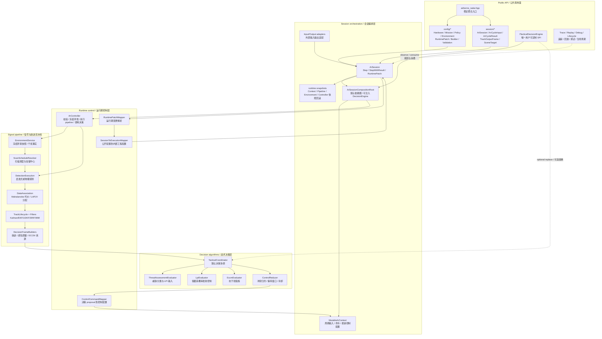
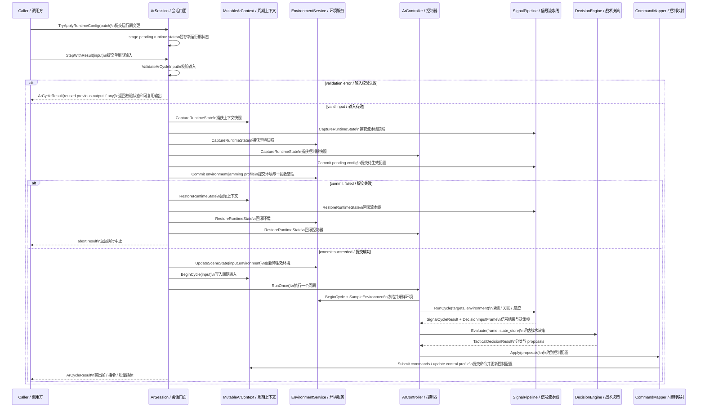
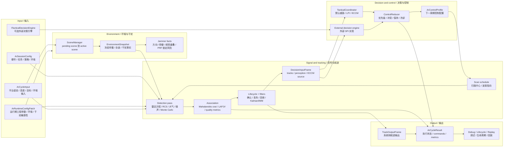
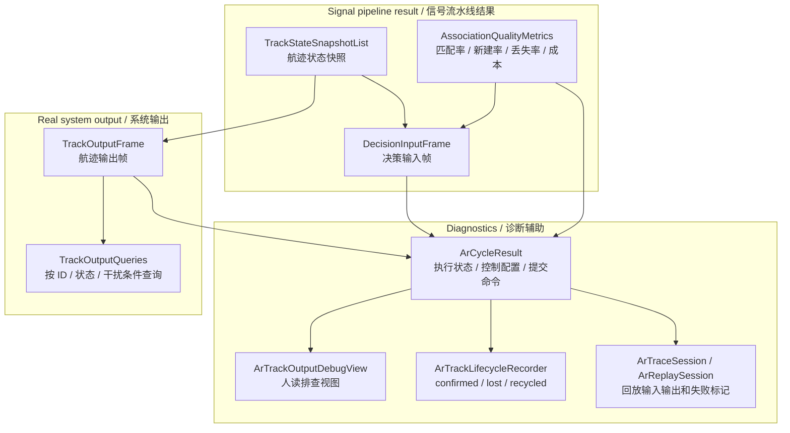

# Airborne Radar 当前设计

Status: active
Last-reviewed: 2026-07-06
Authority: current airborne_radar module design

本文描述 `airborne_radar` 当前架构、数据流和算法边界。跨模块 public API、builder、输出三层模型等共同规则见 `docs/common/contract.md`。

## 1. 架构设计说明

### 1.1 模块定位

`airborne_radar` 提供机载雷达探测、航迹维护、环境/干扰建模、战术决策、控制指令归约、trace/replay、调试视图和生命周期事件。

它是当前五个业务模块中唯一保留用户自定义 SPI 的模块，但自定义点被限定在 `ITacticalDecisionEngine`：

- 可以替换战术决策引擎，改变 LPI/ECCM/威胁响应策略。
- 不可以替换 public 层之外的 signal pipeline、controller、environment service、mutable context 或 tracking lifecycle。
- 自定义决策引擎消费稳定 DTO：`DecisionInputFrame`、`TacticalStateStore`、`TacticalDecisionResult`。
- 决策输出仍由内部 `ControlReducer` 和 `ControlCommandMapper` 归约为下一周期 `ArControlProfile`。

当前模块的稳定外部使用方式是：

1. 用 `ArSessionConfig` 或 builder 描述硬件、任务、策略、环境四域配置。
2. 用 `ArCycleInput` 或 adapter 提供平台姿态、高度、目标、环境和干扰源。
3. 调用 `ArSession::Step()` 获取 track output，或调用 `ArSession::StepWithResult()` 获取结构化执行结果。
4. 如需自定义战术逻辑，使用 `ArSession::CreateWithDecisionEngine()` 注入 `ITacticalDecisionEngine`。
5. 如需调整运行期参数，使用 runtime patch；patch 提交失败时必须保持各子系统状态一致。

`Ar*` 是 AR 模块的 public API 前缀（config/session/cycle/result/adapter/trace/replay/debug/lifecycle 等 DTO 与门面）。`RadarEquations`、`radar_cross_section`、`radar_mount_angles_deg`、`ComposeRadarAttitudeDeg` 等领域术语与领域函数不属于模块前缀范围，保留原名。

历史上的 `Radar*` 模块前缀已一次性迁移到 `Ar*`，不保留 deprecated compat 层：旧 `Radar*.h` public wrapper、`using RadarX = ArX` 别名和 `ar_compat_consumer` 均已删除，`cross_domain_naming_guard` 与 `check_public_api_boundary` 守护目标已切到 `Ar*` 主头。trace/replay schema 与 payload type string 同步迁移到 `Ar*`（namespace 与 file identifier 不变）。新增 public primary 类型不得再使用 `Radar*` 作为模块所有权前缀；`Radar*` 只允许出现在领域术语白名单内。

### 1.2 Public API 与内部实现边界

公共头位于 `include/1q/airborne_radar/`：

| 区域 | 职责 | 设计约束 |
|---|---|---|
| `airborne_radar.hpp` | 模块聚合入口 | 聚合稳定 public API，不暴露内部 signal/environment/runtime 类型 |
| `config/` | `ArSessionConfig`、runtime patch、semantic builder、validation、jamming semantics | 表达硬件、任务、策略、环境和干扰敏感性 |
| `session/` | `ArSession`、cycle input/result、scene target、output types、trace/replay、debug/lifecycle、decision SPI | 是调用方主要使用面；`ITacticalDecisionEngine` 是唯一 public SPI |

内部实现位于 `src/airborne_radar/`：

| 目录 | 职责 | 典型类型/函数 |
|---|---|---|
| `config/mapping/` | session config/runtime state 到内部执行配置映射 | `MapSessionToExecution`、runtime patch mapper |
| `environment/` | 场景、传播、干扰源规范化、冻结环境快照 | `EnvironmentService`、`SceneManager`、`PropagationModel` |
| `signal/detection/` | 雷达方程、波束控制、量测误差、目标几何 | `SignalDetector`、`RadarEquations`、`BeamControlResolver` |
| `signal/pipeline/` | 扫描调度、探测执行、数据关联、航迹生命周期、决策帧构建 | `SignalPipeline`、`ExecuteCycle`、`RunPhysicalDetectionPass` |
| `signal/association/` | 数据关联、代价矩阵、LAPJV assignment、关联质量指标 | `DataAssociationEngine`、`LapjvSolver` |
| `signal/tracking/` | Kalman/EKF/UDKF/SRIF/IMM、track pool、生命周期 | `TrackFilter`、`TrackLifecycleManager`、`ImmFilter` |
| `decision/` | 默认战术协调、威胁评估、LPI、ECCM、控制归约 | `TacticalCoordinator`、`ThreatAssessmentEvaluator`、`LpiEvaluator`、`EccmEvaluator`、`ControlReducer` |
| `runtime/` | controller 和控制指令映射 | `ArController`、`ControlCommandMapper` |
| `session/` | public session 装配、context、输入输出适配、trace/replay | `ArSession`、`MutableArContext`、`ArSessionCompositionRoot` |
| `output/` | track output 查询 | `TrackOutputQueries` |
| `utils/` | 数学和方位工具 | `MathUtils`、`ArOrientationUtils` |

### 1.3 新开发者视角的分层组件图

读图顺序：

1. 外部只从 Public API 进入。除 `ITacticalDecisionEngine` 外，不应依赖内部类型。
2. `ArSessionCompositionRoot` 默认装配 context、pipeline、environment service、controller 和默认 `TacticalCoordinator`。
3. `ArSession` 在运行期配置提交前捕获四类快照；提交或执行失败时回滚，避免 pipeline/environment/controller 状态部分生效。
4. `ArController` 每周期冻结环境快照，再让 signal pipeline 和 decision engine 看到同一份环境事实。
5. 决策 proposal 不直接修改 signal pipeline，而是经 `ControlReducer`/`ControlCommandMapper` 形成下一周期控制配置。

### 1.4 执行时序图

### 1.5 主数据流

### 1.6 输出、调试与归属边界

设计要点：

- `TrackOutputFrame` 是系统输出；debug/lifecycle/replay 是仿真和开发辅助视图。
- output query 可以辅助按关联键、状态、干扰条件查询，但不改变输出语义。
- `ArCycleResult` 承载执行状态、validation issues、abort reason、submitted commands、control profile 和 association quality metrics。
- 决策 SPI 不拥有输出结构，也不能绕过内部 output adapter 写系统输出。

## 2. 本模块使用的算法

### 2.1 算法总览

| 算法/部件 | 入口 | 当前角色 | 主要测试锚点 |
|---|---|---|---|
| 配置映射与 runtime patch | `MapSessionToExecution`、runtime patch mapper、`CommitPendingRuntimeConfig` | 将四域配置转为内部工程配置；运行期变更可回滚提交 | `ar_session_config_builder_test`、`ar_runtime_patch_mapper_test`、`ar_environment_config_contract_test` |
| 环境冻结与传播 | `EnvironmentService`、`PropagationModel`、`AtmospherePhysics`（`common/` 共享层） | 管理 pending/active scene，冻结周期环境，计算传播损失/杂波/大气物理 | `ar_environment_service_test`、`ar_propagation_model_test`、`ar_atmosphere_physics_test` |
| 干扰源语义化 | `NormalizeEmitterState`、jamming threshold utils | 将 jammer emitter 转成方向、旁瓣、频率重叠、PRF 锁定风险等事实 | `ar_environment_service_test`、`ar_tactical_coordinator_test` |
| 扫描和波束控制 | `ScanScheduleResolver`、`BeamControlResolver`、orientation utils | 解析扫描中心、安装/机体/平台坐标、波束增益和波束宽度 | `ar_signal_scan_schedule_test`、`ar_orientation_utils_test`、`ar_antenna_pattern_utils_test` |
| 探测执行 | `RunHeuristicDetectionPass`、`RunPhysicalDetectionPass`、`SignalDetector` | 生成探测成功标志、SNR/margin、量测协方差 | `ar_signal_detection_test`、`ar_signal_pipeline_test` |
| RCS 与大气物理 | `ComputeEffectiveTargetRcsM2`、`ComputeTargetSpecificAtmosphericLossDb` | 可选物理 RCS、大气传播损失、目标相关损失修正 | `ar_rcs_physics_test`、`ar_atmosphere_physics_test` |
| 数据关联 | `DataAssociationEngine`、`DenseCostHypothesiser`、`LapjvSolver` | 默认生产路径；基于位置量测、协方差和 track seeds 进行 assignment | `ar_signal_association_test`、`ar_lapjv_solver_test` |
| 航迹过滤与生命周期 | `TrackFilter`、`TrackLifecycleManager`、Kalman/EKF/UDKF/SRIF/IMM | 更新航迹、处理 missed detection、确认/丢失/回收 | `ar_track_filter_test`、`ar_track_lifecycle_test`、`ar_advanced_filter_test` |
| 决策帧构造 | `DecisionFrameBuilders` | 汇总 tracks、感知质量、关联质量、ECCM source info | `ar_core_controller_test`、`ar_signal_pipeline_test` |
| 战术协调 | `TacticalCoordinator` | 威胁评估、LPI、ECCM、关联压力补触发、状态清理 | `ar_decision_layer_test`、`ar_tactical_coordinator_test` |
| 控制归约 | `ControlReducer`、`ControlCommandMapper` | 处理 proposal 冲突、保持窗口、冷却和下一周期控制配置 | `ar_tactical_coordinator_test`、`ar_core_controller_test` |
| 输出/回放 | output adapters、trace/replay codec | 构造 track output、result、debug view 和 replay trace | `ar_cycle_output_builder_test`、`ar_trace_session_adapter_test`、`ar_output_boundary_contract_test` |

### 2.2 配置映射、运行期提交和回滚

AR 的 public config 是语义配置，signal pipeline 使用的是内部工程配置。`ArSession` 构造时通过 `MapSessionToExecution` 初始化 runtime state；runtime patch 到达后先暂存到 `pending_runtime_state`。

真正提交发生在下一次 `RunCycle` 前：

1. 校验输入。
2. 捕获 `MutableArContext`、`ISignalPipeline`、`EnvironmentService`、`ArController` 四类快照。
3. 将 pending runtime state 同步到 signal pipeline。
4. 将环境 scenario 和 jamming sensitivity 同步到 environment service。
5. 任一提交失败则恢复所有快照，并返回 `kRuntimePreparationFailed`。
6. 提交成功并完成执行后才调用 `FinalizePendingRuntimeConfig`。

这个机制避免出现“pipeline 已换配置，但 environment/controller 仍旧”的部分生效状态。任何新增运行期可变项，都必须纳入这个提交/回滚语义。

### 2.3 环境、传播和干扰事实

`EnvironmentService` 维护 pending scene 和 active scene。`UpdateSceneState` 只更新 pending scene，`BeginCycle` 到达时才提交并刷新冻结快照。controller 和 signal pipeline 在同一周期内读取同一份 `EnvironmentSnapshot`。

环境快照包含：

- 大气物理观测和派生上下文，例如压力、温度、湿度、K 因子、年积日、太阳和地磁参数。
- 地表/植被散射物理，用于影响杂波。
- 传播损失和大气物理损失。
- jammer sources，包含规范化后的干扰事实。
- jamming sensitivity profile 和有效检测阈值。

干扰源规范化规则包括：

- 位置存在时根据 xyz 推导相对方位/俯仰；不存在时保留方向未知。
- `power_db`、`js_db`、`angular_span_deg` 下界裁剪到 0，`confidence` 裁剪到 `[0, 1]`。
- 根据技术类型、角宽、置信度、J/S 比推导旁瓣事实。
- 根据技术类型、J/S、置信度、方向聚焦推导频率重叠。
- 根据技术类型、功率、置信度和前瓣/旁瓣推导 PRF lock risk。

这些干扰事实既影响 physical detection 的 jam noise，也进入 ECCM source info 和 association-pressure 后处理。

### 2.4 扫描调度、坐标和波束控制

AR 的探测不是只按目标 range 计算。目标必须先被解析到当前雷达参考框架：

- input adapter 和 scene target utils 支持外部坐标、ECEF/LLA、局部坐标和语义轴。
- orientation utils 处理 mount/body/platform frame 的旋转组合。
- `ScanScheduleResolver` 将周期、扫描范围和 dwell center 转成当前扫描指向。
- `BeamControlResolver` 综合天线工程配置、扫描中心、平台姿态、目标 look angle 和波长，给出 one-way antenna gain 与有效波束宽度。

控制配置会反馈到扫描和波束：

- LPI 可能降低发射功率或改变发射策略。
- ECCM 可能启用频率捷变、rejitter、旁瓣抵消或自适应波束。
- 控制效果通过 `ControlProfileEffects` 和 `JammingEffects` 进入下一周期探测。

相关测试覆盖坐标变换、扫描窗口、波束宽度、天线方向图、平台姿态耦合和控制配置跨周期生效。

### 2.5 探测执行：启发式路径与物理路径

`DetectionExecution` 提供两类探测路径：

启发式路径：

- 解析目标几何。
- 可选计算物理 RCS，并把 RCS 转成 signal term。
- 根据目标速度形成 speed penalty。
- 根据传播损失、杂波、干扰和控制配置 relief 形成 environment penalty。
- 以 detection margin 是否超过阈值判断探测成功。

物理路径：

- 计算 clutter noise，并在旁瓣抵消等控制配置下调整。
- 汇总多干扰源 jam noise，并根据控制配置计算 residual jammer factor。
- 对每个目标计算目标相关大气损失。
- 可选使用物理 RCS 模型混合输入 RCS。
- 通过 `BeamControlResolver` 得到波束增益。
- 调用 `SignalDetector::Detect`：雷达方程计算 echo power，扣除接收机损耗；热噪声、杂波、干扰合成噪声基底；计算 SNR；用 CFAR Pfa、Swerling 模型和脉冲积累估算检测概率；低于 `min_snr_db` 时硬截断，否则做 Monte Carlo 判决。
- 用 `MeasurementErrorModel` 将 SNR、波束宽度和带宽转为 range/angle error，再构造量测协方差。

物理路径的关键边界是：目标 RCS、环境传播、干扰、波束增益和量测协方差都参与结果。不能只用“目标距离近就探测成功”描述 AR 行为。

### 2.6 数据关联、质量指标和航迹生命周期

探测成功后，`DataAssociationEngine` 负责把量测和已有 track seeds 关联：

1. 过滤未探测目标和缺失位置量测的目标。
2. 基于外部/lifecycle seeds 预测先验 track。
3. 使用 `FullMahalanobisDistanceMetric`、`DenseCostHypothesiser` 和量测协方差生成关联假设。
4. 构造方阵代价矩阵，使用 LAPJV assignment。
5. 小于等于 unassigned cost 的匹配复用原 track key，其余生成新 track key。
6. 计算 association quality metrics：prior、detection、matched、new、missed、match rate、new track rate、missed track rate、mean/p95 match cost。

当前 association 不是 public 算法族扩展点。生产链路只有一条默认路径：`FullMahalanobisDistanceMetric` + `DenseCostHypothesiser` + `LapjvSolver`，没有 factory、runtime config 选择或用户可替换接口。`MahalanobisDistanceMetric` 等保留的具体类用于局部测试和算法对比，不代表已接入第二条生产实现。

只有当未来出现至少两个已接入生产路径、具备测试覆盖且语义稳定的 association 实现时，才允许新增用户可见配置来选择算法；在此之前，新增配置项不得只为“可能扩展”而暴露内部类或抽象基类。

航迹层进一步处理 confirmed/lost/recycled 状态：

- `TrackFilter` 在 missed detection 时衰减速度和 RCS。
- deception/repeater/mixed 等关联脆弱干扰会放缓速度/RCS 衰减，避免把干扰导致的短时丢失误判成目标消失。
- lifecycle manager 管理 tentative/confirmed/lost、track pool 回收、association seeds 导出和 filter writeback。
- Kalman/EKF/UDKF/SRIF/IMM 路径用于不同工程配置下的预测/更新。

这些质量指标不仅用于结果输出，也会被 decision frame 消费，成为关联压力驱动 ECCM 的依据。

### 2.7 决策帧、威胁评估、LPI 和 ECCM

`ArController` 从 signal pipeline 得到 `DecisionInputFrame` 后调用 decision engine。默认实现是 `TacticalCoordinator`，其流程为：

1. 确定 ECCM 触发信号。来源包括环境干扰事实，以及 association quality 异常时的后备触发。
2. 调用 `ThreatAssessmentEvaluator` 评估 tracks，生成威胁分类和 LPI source info。
3. 调用 `LpiEvaluator`，在威胁场景下提出低截获概率发射控制 proposal。
4. 如果存在干扰或关联压力后备触发，调用 `EccmEvaluator` 生成抗干扰 proposal。
5. 根据关联质量对 deception/repeater/mixed 等语义的 proposal 做优先级偏置。
6. 按 active track keys 清理 `TacticalStateStore`，避免长期运行时状态无限增长。
7. 输出目标分类、proposal、selected mode 和 decision summary。

selected mode 规则：

- ECCM 激活时选择 `kProtectedEmission`。
- 否则如果 LPI 请求降低暴露，选择 `kThreatResponse`。
- 其余为 `kBaseline`。

默认决策结果会把目标分类回填到 track output frame。外部 `ITacticalDecisionEngine` 可以替换这套决策逻辑，但仍必须遵守 DTO 输入输出，并接受内部控制归约。

### 2.8 控制归约和跨周期反馈

decision engine 输出的是 tactical proposal，不是直接生效的硬件控制。`ControlReducer` 和 `ControlCommandMapper` 负责把 proposal 变成下一周期 `ArControlProfile`：

- 不同域 proposal 会按优先级、策略表和冲突规则归并。
- beam 类冲突默认偏向生存性。
- 保持窗口使 proposal 停止后控制可继续维持若干周期。
- cooldown 防止同一域反复进出造成控制抖动。
- 频率捷变等行为可以有 hop phase 的跨周期状态。

controller 在一个周期开始时把当前 control profile 传给 signal pipeline，因此决策影响的是后续周期，不应假设同周期内 proposal 立即改变已经完成的探测。

### 2.9 输出、输入校验和失败行为

`ArSession` 和 `ArController` 都有明确的失败语义：

- cycle input 校验失败时不执行 pipeline，`ArCycleResult` 携带 validation issues，且 controller 设置显式 abort reason `SignalCycleAbortReason::kValidationRejected`（数值 4，追加于既有 `kLifecycleUnavailable=1`/`kInvalidEnvironmentCycle=2`/`kRuntimePreparationFailed=3` 之后，保留 replay/trace 数值语义）。
- 冗余 `has_environment` 标志与数据必须一致：`has_environment=false` 且 `environment` 为默认值视为省略快照；`has_environment=false` 但 `environment` 含非默认数据时校验报 `kEnvironmentSnapshotFlagMismatch` error 并 abort，避免环境事实（杂波/干扰/大气）被静默跳过（见 contract.md §实现安全与失败语义规则 2）。
- 已有有效输出时，校验失败可以复用上一帧输出，并标记 `reused_previous_output`。
- signal pipeline abort 时不会发布合成的最新输出。
- controller 暴露 `executed_this_cycle`、`abort_reason`、`has_validation_error`、`submitted_commands`、`control_profile` 和 association quality metrics。
- trace/replay 会记录输入、输出、result 和 failure marker；回放遇到不匹配或错误模块应拒绝。

输出边界要求：

- track output 保持系统侧航迹语义。
- 名称、仿真便利信息或调试归因不能替代 stable association key/status。
- query/debug/lifecycle/replay 是诊断辅助，不是用户扩展 signal pipeline 的入口。

## 3. 非目标与边界

- 不恢复宽 public customization surface。
- 不把 `EnvironmentService`、`SignalPipeline`、`ArController`、`MutableArContext`、tracking lifecycle 或 foundation 工程算法暴露为用户可替换 API。
- 不把单一默认 association 路径包装成 public algorithm family；只有存在多个生产实现时，才通过受控配置暴露选择。
- 不把测试 mock 便利接口升级为 public SPI。
- 不让外部 decision engine 绕过内部 control reducer 和 command mapper。
- 不把 debug/lifecycle/replay 字段混入系统输出语义。

## 4. 设计变更规则

1. 新增、删除或改变 public SPI 时，必须同步本文、consumer tests 和 `ar_public_api_convenience_test`。
2. 任何新增 runtime patch 字段，必须明确是否影响 pipeline config、environment scenario 或 jamming sensitivity，并接入提交/回滚流程。
3. 探测路径如改变 RCS、大气、干扰、波束、SNR、检测概率或量测协方差语义，必须同步本文和相关 signal/detection tests。
4. 数据关联和 lifecycle 行为变化，必须同步 association quality metrics、decision frame 说明和对应测试。
5. 战术决策或控制归约策略变化，必须补充 LPI/ECCM/ControlReducer 测试，并在 `[evidence: ...]` 标注中记录决策依据。
6. 输出字段变化必须保持 `TrackOutputFrame`、`ArCycleResult`、debug/lifecycle/replay 三层分离。
