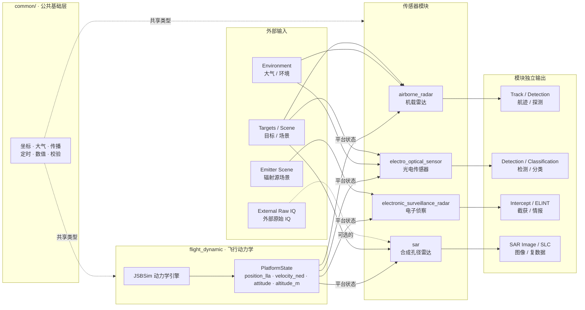

# 跨模块契约

Status: active
Last-reviewed: 2026-07-06
Authority: common contract for all modules

本文合并原顶层 public API customization、session config builder、三层输出可观测性和文档治理契约。模块级文档不得与本文冲突。

## 证据优先开发模式

对算法、架构、模块内部优化、输出语义、配置语义和 public API 相关改动，默认采用
`skills/evidence-first-freeze-contract` 定义的证据优先模式。

强制规则：

1. 先判定，再契约，再实现。
2. Stage A 未得到 `pass` 或 `narrow` 判定时，不进入生产代码实现。
3. Stage B 前必须冻结实现契约，明确允许范围、禁止范围、行为边界、验收条件和非目标。
4. 实现只能覆盖已被证据证明的最小边界；不得借机扩大 public API、跨模块抽象、schema、trace/replay 或兼容层。
5. 验收失败时回到证据矩阵重新拆分原因；不得通过放宽阈值、扩大 skip 或弱化测试制造通过。

具体 evidence matrix、契约模板、输出格式和回写要求由 repo skill 维护；公共契约只规定该流程是高风险开发的默认门禁。

## Public API 边界

默认 public API 只允许稳定门面和稳定 DTO：

- 模块聚合入口头。
- `*Session`，包括 `Create` / `CreateWithValidation` 等静态创建入口。
- `*SessionConfig` 四域配置和运行期 patch。
- `*CycleInput`、scene target/emitter/point target 等单周期输入 DTO。
- `*OutputFrame`、`*CycleResult` 等输出和结构化执行结果 DTO。
- trace/replay、debug view、lifecycle recorder 等已经形成外部消费合同的工具。

业务模块 public 类型使用模块所有权前缀：`Ar*`、`Eos*`、`Esr*`、`Sar*`。领域术语不受该规则机械约束，例如 `radar_cross_section`、`RadarEquations` 这类物理概念可保留领域名；但 session/config/cycle/result/adapter/trace/replay/debug/lifecycle 等 public DTO 和门面不得把通用领域词误用为模块前缀。

默认禁止公开：

- pipeline/controller/context/environment service 等内部装配 seam。
- algorithm executor、focusing selector、calibration/focusing/truth oracle 等内部阶段。
- generated replay headers、内部 execution config、测试专用 mock 接口。
- 仅有单一生产实现且没有外部替换需求的虚接口。

唯一允许的用户自定义 SPI 是 `airborne_radar` 的 decision engine。其它模块默认只提供稳定 session 门面。

## 内部共享命名空间

`src/common/` 是库内部实现层的跨模块共享设施目录，对应命名空间必须使用
`oneq::common::*`。这些类型和函数可被 AR / ESR / EOS / SAR / common
内部代码复用，但不构成 `include/1q/` public API。

规则：

1. `src/common/` 下的共享工具不得放在 `oneq::internal::*` 或
   `oneq::trace::internal` 这类跨模块内部命名空间中。
2. 不得为 `oneq::common::*` 工具新增 `oneq::internal::*` dual-alias 或
   兼容 using 块；迁移期 alias 只能作为同一批次内的临时编译过渡，最终提交前必须删除。
3. `namespace internal` 只可用于测试或翻译单元局部辅助语义；跨文件、跨模块消费的
   `src/common/` 设施必须有明确的 `oneq::common::<domain>` 所属域。
4. 若某工具需要成为外部消费者合同，应通过 `include/1q/` 公开并补充 public API
   边界测试，而不是从 `src/common/` 泄漏。

## 实现安全与失败语义

下列规则源自 `src/` 架构与安全审查，是所有模块共享的规定性约束。

1. **禁止 C++ 异常。** `CLAUDE.md` 已规定 "Never introduce C++ exceptions."。`src/` 与 `include/` 不得引入 `throw`、`std::runtime_error`/`std::invalid_argument` 等异常类型或 `<stdexcept>`。I/O 失败、构造失败、解析失败必须以无异常的错误状态、空 reader 或诊断字段表达（如 `ReplayTrace`/`TraceSink`/`JsbsimAdapter` 的现行做法）。该约束同时保证 `-fno-exceptions` 构建成立，并避免异常穿透构造函数导致仿真流程中途终止。

2. **冗余标志必须与数据一致，且由校验层断言。** 任何 `has_xxx` 布尔标志若用于表达"是否提供某可选数据"，当 `has_xxx=false` 但对应数据非默认值时，输入校验必须报 error 级问题并 abort，不得让数据静默跳过。典型反例是 AR 的 `has_environment`：环境快照已写入但因漏置 flag 不被消费，会让杂波/干扰/大气数据完全不进入信号链且无任何信号。

3. **校验拒绝必须产生结构化 abort reason，不得静默或合成有效输出。** 输入校验失败时，controller 必须设置显式 abort reason（如 `kValidationRejected`），不执行 pipeline，不合成空输出帧，不把非法输入记作新的有效 batch/帧。已有有效输出时可复用上一帧并标记 `reused_previous_output`。新增 abort reason 以显式数值追加，保留已有 replay/trace 中既有数值语义。

4. **外部输入解析与 trace 读取必须有上限与完整性校验。** 自研解析器（如 JSON）必须有最大嵌套深度限制、顶层 value 后的 EOF 校验与转义完整性校验。trace/replay 文件读取必须在读入前检查大小上限（与写入侧守卫对齐）。磁盘写失败必须检查流状态并记录，不得静默丢失。

5. **数值归一化必须是常数时间。** 角度/周期归一化等可能接受无界输入的工具函数必须用 `std::fmod` 等常数时间实现，不得用 `while` 循环减/加周期，避免极大输入近似死循环。

## 数值下限语义

数值下限常量不得只因命名相似而合并。当前允许三类边界：

1. **通用数值防护下限**：防除零、对数域、阈值归一化等纯数值保护使用
   `oneq::common::numerics::kNumericFloor` 或更专门的 common numerics helper。
2. **坐标/姿态退化阈值**：ECEF 原点、方向向量零范数、接近姿态奇异点等几何退化判断保留在
   `common/coordinate` 局部实现内，阈值应按坐标算法精度选择，不与功率/概率数值下限共享。
3. **模块局部几何阈值**：例如 EOS 外部输入适配中目标与平台几乎重合的 range gate，属于模块输入几何退化判断，应保留模块局部阈值和状态码。

新增 floor 常量前必须先归入上述语义桶；不能把物理/几何阈值机械改为 `kNumericFloor`，也不能把通用除零保护散落成模块私有常量。

## SessionConfigBuilder

所有 `*SessionConfigBuilder` 都是 semantic builder：

1. 只表达高层 profile、intent、preset 或语义开关。
2. `Build()` 产生完整 `*SessionConfig`，不写日志、不隐式校验、不产生副作用。
3. 细粒度工程参数由调用方直接编辑 `*SessionConfig` 四域字段。
4. 运行期变更走 `*RuntimeConfigPatch` / `*RuntimeConfigBuilder`。
5. 配置合法性由独立 validator 检查最终 config。

不得重新引入 leaf setter，例如 frame rate、scene center、minimum SNR、atmospheric loss 这类直接字段编辑器。

## Session composition ownership

AR/EOS/ESR/SAR 的 `Session::Impl` 是 session 依赖图的所有权边界。组合根可以在装配过程中使用
raw pointer 回填组件关系，但 `Impl` 长期持有状态不得同时保存 `std::unique_ptr<X>` 与同一对象的
`X&` 成员。`Impl` 应只保存 owning member，并在使用点通过 accessor 或局部引用派生依赖引用。

规则：

1. `Session` public move 语义由外层 `std::unique_ptr<Impl>` 承担；不得让 `Impl` 内部的冗余引用成为移动/所有权重构的隐藏前提。
2. 组合根创建的默认 controller、pipeline、context、environment service 由对应 session 唯一拥有。
3. 外部注入的 public SPI 只能出现在已声明的 seam 上；当前只有 `airborne_radar::session::ITacticalDecisionEngine` 是 public 决策注入 seam。
4. 若未来新增非 owned 依赖，必须先在模块 design 或本契约声明其生命周期边界，不能通过 `Impl` 冗余引用隐式表达。

## 运行期配置提交策略

`*RuntimeConfigPatch` 的提交（commit）与周期内失败回滚（rollback）按 pipeline 的状态空间复杂度分两类。每个 `*Session` 必须显式归属其中一类，且实际行为不得与所属类的承诺冲突。四模块当前归属固定如下——这是对已实现行为的契约化，不是行为变更要求。

| 类别 | 承诺 | 归属模块 |
|---|---|---|
| **事务性提交** | patch 经 resolver 校验；配置延迟到下个周期边界原子落定；commit 或周期执行失败时，对持有跨周期累积状态的子系统做 capture/restore 完整恢复。 | `airborne_radar` |
| **立即提交** | patch 经 resolver 校验；`TryApplyRuntimeConfig` 调用即生效，配置单向落定、不在 session 层回滚。若 pipeline 持有累积状态且执行可能失败，回滚边界由该模块在内部层（如 controller）声明，不上升为 session 层契约。 | `electronic_surveillance_radar`、`electro_optical_sensor`、`sar` |

规则：

1. **归属由状态空间决定，不由风格偏好决定。** 仅当 pipeline 同时满足"有跨周期累积状态"且"commit/执行存在真实失败路径"时，才采用事务性提交。两者缺一即为立即提交。
   - `airborne_radar`：4 个子系统各有独立 runtime state，`UpdateConfig`/`UpdateExecutionConfig` 可返回 false，故需事务对齐（`ArSession.cpp:117` CommitPendingRuntimeConfig、`:185-197` capture/restore、`:167-176` 成功后才 FinalizePendingRuntimeConfig）。
   - `electronic_surveillance_radar`：config 无累积（每 RunCycle 重新派生），`UpdateConfig` 走换 config 留 tracks（`InterceptPipeline.cpp:52-57`）；`InterceptPipelineResult` 是三通道纯数据载体，不含 pipeline 自报执行状态，因此当前无 pipeline 执行失败 abort 路径。
   - `electro_optical_sensor`：执行回滚封装在 `EosController::RunOnce`（`EosController.cpp:68-111`），不上升为 session 层事务。
   - `sar`：每 Step 从 `runtime_config` 全量重建，无累积状态可回滚；以执行前 gate（`ValidateRuntimeConfigForStep`）兜底。
2. **所有四模块的 patch 必须经 resolver 校验**（`is_valid`/`has_requested_update`），不得盲写。`sar` 已通过 `SarRuntimeConfigResolver` 对齐该规则。
3. **立即提交类不得声称 session 层回滚。** 若其内部存在 capture/restore 能力（如 ESR 的累积状态快照），必须在代码 doc 注明该机制的实际边界，避免阅读者误以为 session 层提供配置回滚或已激活的执行失败回滚。
4. **事务性提交类不得在执行成功前落定配置语义状态。** 配置的"逻辑当前值"（如 AR 的 `runtime_state`）与"已推送到子系统的物理状态"必须在对齐点之后才一致。

## 三层输出模型

所有传感器/产品模块遵守三层输出模型：

| 层级 | 入口 | 责任 |
|---|---|---|
| 原始系统输出层 | `Step()` 返回的 `*OutputFrame` | 真实传感器或产品输出 |
| 结构化执行结果层 | `StepWithResult()` 返回的 `*CycleResult` | 输出帧、执行状态、校验、abort reason 和诊断摘要 |
| 开发调试视图层 | `*OutputDebugViewBuilder` / `*LifecycleRecorder` | 人读状态、生命周期事件、输入实体回填 |

规则：

- `Step()` 只返回主系统输出帧。
- `StepWithResult()` 是状态判断入口。
- 日志只用于人读运行信息，状态判断不得依赖解析日志文本。
- 数值 ID 是稳定关联键，名称只用于人读、trace/replay、报告和调试视图。
- `external_target_id` 与模块实体 ID 当前都允许 `0` 作为合法值；`0` 不得触发
  validation error。若未来引入可表达负数的外部输入入口，负数 ID 必须在转换为
  public `std::uint64_t` DTO 前被拒绝。
- 仿真真值不得混入面向外部系统的真实输出通道。

## 文档结构

`docs/` 只允许以下一级目录：

- `common`
- `review`
- `practice`
- `airborne_radar`
- `electro_optical_sensor`
- `electronic_surveillance_radar`
- `flight_dynamic`
- `sar`

`docs/` 顶层不保留散落的 Markdown 文件。所有文档必须落在上述某个一级目录内。

`review/` 是唯一允许的评审和迁移草案目录，只能存放扁平 Markdown 草案文件。每个草案必须在文件头声明 `Status: draft`，不得作为当前权威文档引用；结论落定后，应迁入 `common/contract.md`、`common/open_questions.md` 或对应模块 `design.md`，再删除草案。

`practice/` 存放工程实践与基础设施类设计文档（非业务模块设计）：构建、测试策略、覆盖率、示例程序、批量验证框架等跨模块工程产物。每份文档为扁平 Markdown，文件头声明 `Status: active` 与 `Authority:`（如 `build infrastructure`、`test infrastructure`、`examples`）。`practice/` 不存放业务模块设计——模块设计归各自 `design.md`；也不存放契约规则——规定性规则归 `common/contract.md`。

每个业务模块只保留 `design.md` 作为设计权威文档。历史决策记录（旧版 `decisions.md`、`history.md`、`contract.md`）和模块入口（`README.md`）的内容已内聚到 `design.md` 中。

`common/` 只允许保留两份文档：

- `contract.md` —— 公共契约（规定性：所有模块必须遵守的规则）。
- `open_questions.md` —— 跨模块架构观察与待决项（非规定性：记录调查中发现但尚未定论的议题，不构成契约约束）。条目推进到有结论时，应回写为契约规则（进 contract.md）或模块设计（进对应 design.md），并从 open_questions.md 移除。

模块目录内不保留 `archive/`、`audits/`、`contracts/`、`design/`、`decisions/`、`workflow/`、`migration/` 等展开式历史目录。历史细节需要追溯时从 git 历史读取。

各模块只保留 `design.md` 作为设计权威文档。限制条件与否决方向的证据引用直接嵌入 design.md 中的 `[evidence: ...]` 标注，指向对应测试文件和 git 历史。

## 模块间关系

各业务模块之间的数据流向如下。`flight_dynamic` 是平台状态的生产者；所有传感器模块消费平台状态、外部目标和环境输入后独立输出。

读图规则：
- 箭头表示数据流向，虚线表示可选路径或跨模块共享类型。
- 没有传感器模块之间的直接数据流——各传感器独立处理平台状态和外部输入。
- `common/` 层提供坐标转换、大气物理、数值方法等跨模块共享类型，不作为独立运行时层。
- `flight_dynamic` 是唯一的平台状态生产者；传感器模块不反向影响飞行动力学。
