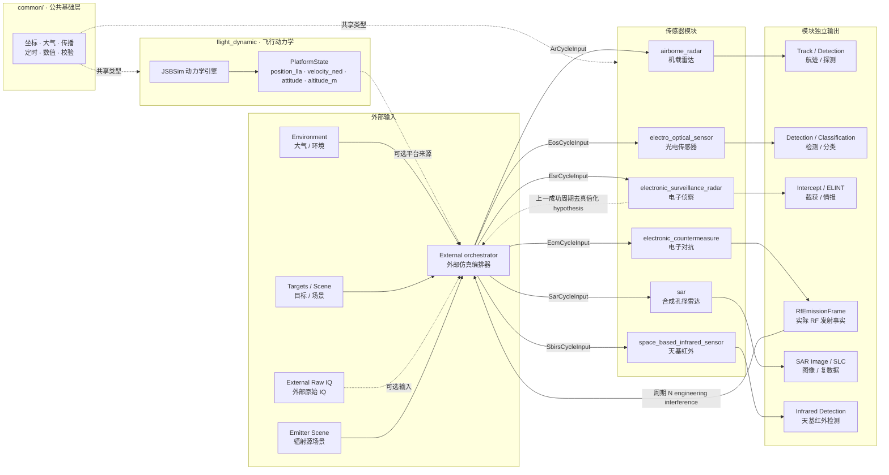

# 跨模块契约

Status: active
Last-reviewed: 2026-07-22
Authority: common contract for all modules

本文合并原顶层 public API customization、session config builder、三层输出可观测性和文档治理契约。模块级文档不得与本文冲突。

## 证据优先开发模式

对算法、架构、模块内部优化、输出语义、配置语义和 public API 相关改动，默认采用
`skills/evidence-first-freeze-contract` 定义的证据优先模式。

强制规则：

1. 先判定，再契约，再实现。
2. Stage A 未得到 `pass` 或 `narrow` 判定时，不进入生产代码实现。
3. Stage B 前必须冻结实现契约，明确允许范围、禁止范围、行为边界、验收条件和非目标。
4. 实现只能覆盖已被证据证明的最小边界；不得借机扩大 public API、跨模块抽象、schema、trace/replay 或兼容层。
5. 验收失败时回到证据矩阵重新拆分原因；不得通过放宽阈值、扩大 skip 或弱化测试制造通过。

具体 evidence matrix、契约模板、输出格式和回写要求由 repo skill 维护；公共契约只规定该流程是高风险开发的默认门禁。

## Public API 边界

默认 public API 只允许稳定门面和稳定 DTO：

- 模块聚合入口头。
- `*Session`，包括 `Create` / `CreateWithValidation` 等静态创建入口。
- `*SessionConfig` 四域配置和运行期 patch。
- `*CycleInput`、scene target/emitter/point target 等单周期输入 DTO。
- `*OutputFrame`、`*CycleResult` 等输出和结构化执行结果 DTO。
- trace/replay、debug view、lifecycle recorder 等已经形成外部消费合同的工具。

业务模块 public 类型使用模块所有权前缀：`Ar*`、`Eos*`、`Esr*`、`Sar*`、`Sbirs*`。领域术语不受该规则机械约束，例如 `radar_cross_section`、`RadarEquations` 这类物理概念可保留领域名；但 session/config/cycle/result/adapter/trace/replay/debug/lifecycle 等 public DTO 和门面不得把通用领域词误用为模块前缀。

默认禁止公开：

- pipeline/controller/context/environment service 等内部装配 seam。
- algorithm executor、focusing selector、calibration/focusing/truth oracle 等内部阶段。
- generated replay headers、内部 execution config、测试专用 mock 接口。
- 仅有单一生产实现且没有外部替换需求的虚接口。

唯一允许的用户自定义 SPI 是 `airborne_radar` 的 decision engine。其它模块默认只提供稳定 session 门面。

### 四域配置所有权

`*SessionConfig` 的 hardware / mission / policy / environment 按“参数表达的用户意图”划分，而不是按
当前内部消费类所在目录划分：

- hardware：发射机、接收机、天线、探测器、光学和波形等物理能力。
- mission：开关机、工作模式、扫描几何、指向和任务目标。
- policy：最低 SNR、虚警概率、脉冲积累数、检测 margin、关联门限等可由任务策略调整的判决规则。
- environment：场景介质、传播、地表和大气观测等外部环境语义。

因此最低 SNR、Pfa 等探测门限不得因内部 signal detector 与 hardware 相邻而放入 hardware。跨模块的
同类判决参数应归 policy；模块可以保留不同物理算法和字段集合，但不能改变所有权含义。
[evidence: tests/unit/airborne_radar/ar_session_config_builder_test.cpp]
[evidence: tests/replay/airborne_radar/ar_replay_codec_roundtrip_test.cpp]

### 物理量单位命名

公开标量字段必须在名称后缀中表达调用方实际提交的单位。跨模块同物理量只有在公式输入量纲和消费语义
一致时才统一单位；不得为了表面一致，在 public 边界隐藏换算或让字段退化为无单位名。

EOS 的 `detector_area_cm2` 与 `detector_detectivity_cm_sqrt_hz_per_w` 共同进入厘米制 D* / NEP 公式，
因此必须保留显式单位后缀，禁止退化成无单位 `detector_area`。SBIRS 当前没有具备焦距、像元几何与
视场立体角映射的成像链，因此不公开未消费的 detector-area 参数。
[evidence: tests/contract/check_cross_domain_naming.cmake]

## 跨模块物理基元复用

跨模块函数不得因名称或量纲相似而合并。只有输入单位、数值精度、有效/非法输入策略、几何归一化、环境/效率因子和输出失败语义完全同义时，才允许复用无状态纯函数；复用前必须有跨模块 characterization 测试。

当前 EOS/SBIRS 的冻结结论：

| 函数族 | 结论 | 原因 |
|---|---|---|
| Planck 光谱辐亮度 | 仅共同 characterization，不抽 common | 有效域数值接近；EOS 为 `float` 且对非法输入回退，SBIRS 为 `double` 且返回零 |
| 接收功率 | 不合并 | EOS 接收孔径面积并除以 `4πr²`；SBIRS 接收孔径直径、使用不同几何因子和量子效率 |
| 噪声/NEP | 不合并 | EOS 是背景抑制与 NEP 链；SBIRS 是 photon/thermal/readout RMS 与兼容 NEP 回退 |

这不是未来共享 foundation 的禁止令：新的候选必须先证明上述语义完全相同，且不得以转换器、默认值或兼容层掩盖差异。

### 工程 RF 发射事实与单程链路

`oneq::electromagnetics` 是 AR、ESR 与 ECM 的公共 RF 事实域，只共享值类型、校验和链路预算纯函数，
不共享传感器检测、受扰判决、ECCM 或资源规划算法。公共坐标统一为 ECEF 米/米每秒，频率为 Hz、
带宽为 Hz、时间为 s、功率在线性域使用 W，损耗和增益使用 dB/dBi。

- `RfEmission`/`RfEmissionSegment` 只描述发射实体、运动学、方向图、极化、波形类别和周期内时频功率分段；
  禁止携带 `received_power`、J/S、J/N、`jamming_detected` 或成功概率。
- `TryEvaluateRfLink` 是无异常、原子写回的单程链路入口。自由空间损耗、附加传播损耗、收发增益、
  极化损耗、时频重叠和接收功率均进入 `RfLinkResult`；大气公共层只提供附加传播损耗。
- 同一 `entity_id` 的收发路径不得代入零距离自由空间公式；接收硬件必须显式提供 co-site isolation，
  缺失时整条链路拒绝。多源功率只允许在 W 域求和。
- 非有限值、非法分段、负功率、重复 emission ID 和缺失 co-site isolation 均 fail closed，且不得部分修改输出。

[evidence: tests/unit/common/common_rf_link_budget_test.cpp::RfLinkBudgetTest.DistanceDoublingLosesSixPointZeroTwoDb]
[evidence: tests/unit/common/common_rf_link_budget_test.cpp::RfLinkBudgetTest.TimeAndFrequencyOverlapScalePowerExactly]
[evidence: tests/unit/common/common_rf_link_budget_test.cpp::RfLinkBudgetTest.AggregationIsOrderIndependentAndRejectsDuplicateIdsAtomically]
[evidence: tests/unit/common/common_rf_link_budget_test.cpp::RfLinkBudgetTest.InvalidInputsAndMissingCoSiteIsolationRejectAtomically]

### 折射率温标输入迁移

公开折射率入口只提供 `RefractivityInputs` + `RefractivityTemperaturePair` +
`TryRefractivityIndex`。摄氏与开氏字段必须满足
`kelvin = celsius + 273.15`（允许 0.05 K 浮点容差）；温标错配、非有限/越界标量或空输出必须
fail closed，且失败不得修改调用方输出。

[evidence: tests/unit/airborne_radar/ar_atmosphere_physics_test.cpp::TypedPublicRefractivityMatchesPhysicalKernel]
[evidence: tests/unit/airborne_radar/ar_atmosphere_physics_test.cpp::TypedPublicRefractivityRejectsMismatchedTemperaturePairAtomically]

### 核心运行面与观测工具面

public API 分为两类，二者都受 public boundary、install manifest 和 consumer 测试保护：

1. **核心运行面**：模块聚合入口、config、input、session、raw output 与 cycle result。它定义调用方驱动模型和消费仿真结果的稳定语义。
2. **观测工具面**：trace/replay、debug view、lifecycle recorder 及其结果 DTO。它用于诊断、复现和人读归属，不能反向改变核心运行面、raw output 或控制行为。

观测工具面的新增字段或事件必须保持三层输出分离，并同步 schema/codec、对应 replay/trace 测试和 consumer 测试；删除或重命名已公开工具仍属于 public API 变更，必须先冻结兼容迁移契约。

## 内部共享命名空间

`src/common/` 同时容纳两类实现，目录位置本身不决定 C++ 命名空间：

- 已由 `include/1q/<domain>/` 公开的领域 API 实现使用对应 public 命名空间，例如
  `oneq::coordinate`、`oneq::replay`、`oneq::trace`。
- 只在库内部跨模块复用的设施使用 `oneq::common::<domain>`，不构成 public API。

规则：

1. `src/common/` 下的类型必须能追溯到 public 领域头或明确的 `oneq::common::<domain>` 所有权；
   不得仅因目录名把 public-domain implementation 改入 `oneq::common`。
2. 跨模块共享工具不得放在 `oneq::internal::*` 或
   `oneq::trace::internal` 这类模糊内部命名空间中。
3. 不得为 `oneq::common::*` 工具新增 `oneq::internal::*` dual-alias 或
   兼容 using 块；迁移期 alias 只能作为同一批次内的临时编译过渡，最终提交前必须删除。
4. `namespace internal` 只可用于测试或翻译单元局部辅助语义；跨文件、跨模块消费的
   `src/common/` 设施必须有明确的 `oneq::common::<domain>` 所属域。
5. 若某工具需要成为外部消费者合同，应通过 `include/1q/` 公开并补充 public API
   边界测试，而不是从 `src/common/` 泄漏。

## 实现安全与失败语义

下列规则源自 `src/` 架构与安全审查，是所有模块共享的规定性约束。

1. **项目失败语义不得依赖 C++ 异常。** `src/` 与 `include/` 不得新增 `throw`，也不得用
   `std::runtime_error`、`std::invalid_argument` 等异常作为项目 API 的失败通道。I/O、构造和解析失败
   必须转换为错误状态、空 reader 或诊断字段。对 HighFive、JSBSim 等可能抛异常的第三方边界，允许在
   最窄调用点使用既有 `try/catch`，但 catch 后必须转换为项目状态且不得让异常穿透 session/adapter
   边界。当前构建没有全局启用 `-fno-exceptions`，因此本文不承诺该编译模式已经成立；若要建立该门禁，
   必须先替换或隔离所有第三方异常边界并增加真实构建验证。

2. **存在性标志必须与数据一致，且由校验层断言。** `has_xxx` 若表达“调用方是否提供本周期可选
   数据”，当 `has_xxx=false` 但对应数据非默认值时，输入校验必须报 error 级问题并 abort，不得让
   数据静默跳过。典型反例是 AR 的 `has_environment`：环境快照已写入但因漏置 flag 不被消费，会让
   杂波/干扰/大气数据完全不进入信号链且无任何信号。若布尔量明确是配置选择器而非数据存在性标志，
   可以定义关闭时整组候选参数不生效且不校验，但必须在 public Doxygen 和模块 design 明确优先级，并以
   启用/关闭对照测试锁定。

3. **非执行周期必须产生准确的结构化 reason，不得静默或伪造故障。** 输入校验失败时，
   controller 必须设置显式 abort reason（如 `kValidationRejected`），不执行 pipeline，不合成
   空输出帧，不把非法输入记作新的有效 batch/帧。设备关机等合法非执行状态必须使用独立
   reason（如 `kSensorPoweredOff`），不得映射成 output contract violation。已有有效输出时可
   复用上一帧并标记 `reused_previous_output`。新增 reason 以显式数值追加，保留已有 replay/trace
   中既有数值语义。Lifecycle recorder 不得把 `executed_this_cycle=false` 解释为目标丢失或未检测；
   非执行周期不产生 lifecycle 事件，也不推进其累积状态。

4. **外部输入解析与 trace 读取必须有上限与完整性校验。** 自研解析器（如 JSON）必须有最大嵌套深度限制、顶层 value 后的 EOF 校验与转义完整性校验。trace/replay 文件读取必须在读入前检查大小上限（与写入侧守卫对齐）。磁盘写失败必须检查流状态并记录，不得静默丢失。

   failure marker 是 trace 中一个可报告的失败边界，不是 replay 的终止符。回放必须记录 marker，
   继续应用并比较其后的有效输入/输出，使“有效 -> 拒绝 -> 恢复”整段都进入确定性比较；只有
   divergence、损坏记录或不兼容模块等真正无法继续解释 trace 的错误才终止回放。
   [evidence: tests/replay/airborne_radar/ar_trace_session_adapter_test.cpp::TraceSessionAdapterTest.RadarReplaySessionContinuesAfterFailureMarker]
   [evidence: tests/replay/electro_optical_sensor/eos_replay_session_test.cpp::EosReplaySessionTest.ReplayEosTraceContinuesAfterFailureMarker]
   [evidence: tests/replay/electronic_surveillance_radar/esr_replay_session_test.cpp::EsrReplaySessionTest.ReplayEsrTraceContinuesAfterFailureMarker]
   [evidence: tests/replay/sar/sar_replay_session_test.cpp::SarReplaySessionTest.ReplayContinuesAfterFailureMarker]
   [evidence: tests/replay/sbirs_sensor/sbirs_replay_session_test.cpp::SbirsReplaySessionTest.ReplayContinuesAfterFailureMarker]

5. **数值归一化必须是常数时间。** 角度/周期归一化等可能接受无界输入的工具函数必须用 `std::fmod` 等常数时间实现，不得用 `while` 循环减/加周期，避免极大输入近似死循环。

## 数值下限语义

数值下限常量不得只因命名相似而合并。当前允许三类边界：

1. **通用数值防护下限**：防除零、对数域、阈值归一化等纯数值保护使用
   `oneq::common::numerics::kNumericFloor` 或更专门的 common numerics helper。
2. **坐标/姿态退化阈值**：ECEF 原点、方向向量零范数、接近姿态奇异点等几何退化判断保留在
   `common/coordinate` 局部实现内，阈值应按坐标算法精度选择，不与功率/概率数值下限共享。
3. **模块局部几何阈值**：例如 EOS 外部输入适配中目标与平台几乎重合的 range gate，属于模块输入几何退化判断，应保留模块局部阈值和状态码。

新增 floor 常量前必须先归入上述语义桶；不能把物理/几何阈值机械改为 `kNumericFloor`，也不能把通用除零保护散落成模块私有常量。

## SessionConfigBuilder

所有 `*SessionConfigBuilder` 都是 semantic builder：

1. 只表达高层 profile、intent、preset 或语义开关。
2. `Build()` 产生完整 `*SessionConfig`，不写日志、不隐式校验、不产生副作用。
3. 细粒度工程参数由调用方直接编辑 `*SessionConfig` 四域字段。
4. 运行期变更走 `*RuntimeConfigPatch` / `*RuntimeConfigBuilder`。
5. 配置合法性由独立 validator 检查最终 config。

不得重新引入 leaf setter，例如 frame rate、scene center、minimum SNR、atmospheric loss 这类直接字段编辑器。

## Session composition ownership

AR/EOS/ESR/SAR/SBIRS 的 `Session::Impl` 是 session 依赖图的所有权边界。组合根可以在装配过程中使用
raw pointer 回填组件关系，但 `Impl` 长期持有状态不得同时保存 `std::unique_ptr<X>` 与同一对象的
`X&` 成员。`Impl` 应只保存 owning member，并在使用点通过 accessor 或局部引用派生依赖引用。

规则：

1. `Session` public move 语义由外层 `std::unique_ptr<Impl>` 承担；不得让 `Impl` 内部的冗余引用成为移动/所有权重构的隐藏前提。
2. 组合根创建的默认 controller、pipeline、context、environment service 由对应 session 唯一拥有。
3. AR 唯一 public 决策 seam 是 `ArCycleResult::decision_observation` 与
   `ArSession::SubmitExternalDecision()` 组成的步间 observation/response seam。外部决策模块
   与 session 同进程运行，但不注入或替换内部对象；内部 baseline 每个成功周期仍持续计算。
   Public seam 只公开 proposal、observation/response、提交状态和控制来源；默认决策器的
   分类结果、模式与状态存储不得进入 `include/1q`。
   [evidence: tests/contract/airborne_radar/ar_public_api_convenience_test.cpp::RadarSessionAppliesMatchingExternalDecisionOnNextSuccessfulCycle]
4. 若未来新增非 owned 依赖，必须先在模块 design 或本契约声明其生命周期边界，不能通过 `Impl` 冗余引用隐式表达。

## 运行期配置提交策略

`*RuntimeConfigPatch` 的提交（commit）与周期内失败回滚（rollback）按 pipeline 的状态空间复杂度分两类。每个 `*Session` 必须显式归属其中一类，且实际行为不得与所属类的承诺冲突。五个传感器模块当前归属固定如下——这是对已实现行为的契约化，不是行为变更要求。

| 类别 | 承诺 | 归属模块 |
|---|---|---|
| **事务性提交** | patch 经 resolver 校验；配置延迟到下个周期边界原子落定；commit 或周期执行失败时，对持有跨周期累积状态的子系统做 capture/restore 完整恢复。 | `airborne_radar` |
| **立即提交** | patch 经 resolver 校验；`TryApplyRuntimeConfig` 调用即生效，配置单向落定、不在 session 层回滚。若 pipeline 持有累积状态且执行可能失败，回滚边界由该模块在内部层（如 controller）声明，不上升为 session 层契约。 | `electronic_surveillance_radar`、`electro_optical_sensor`、`sar`、`sbirs_sensor` |

规则：

1. **归属由状态空间决定，不由风格偏好决定。** 仅当 pipeline 同时满足"有跨周期累积状态"且"commit/执行存在真实失败路径"时，才采用事务性提交。两者缺一即为立即提交。
   - `airborne_radar`：4 个子系统各有独立 runtime state，`UpdateConfig`/`UpdateExecutionConfig` 可返回 false，故需事务对齐（`ArSession.cpp:117` CommitPendingRuntimeConfig、`:185-197` capture/restore、`:167-176` 成功后才 FinalizePendingRuntimeConfig）。
   - `electronic_surveillance_radar`：config 无累积（每 RunCycle 重新派生），`UpdateConfig` 走换 config 留 tracks（`InterceptPipeline.cpp:52-57`）；`InterceptPipelineResult` 包含 observation、emitter、truth-evaluation 三个业务输出及 `sensor_powered_off` execution metadata，当前没有其它 pipeline 执行失败 commit 路径。
   - `electro_optical_sensor`：执行回滚封装在 `EosController::RunOnce`（`EosController.cpp:68-111`），不上升为 session 层事务。
   - `sar`：runtime config 立即提交，但 pipeline 持有 pulse ring、轨迹缓冲、pulse ID 与 PRF
     分数余量。`SarController::RunOnce` 在 pipeline 执行前捕获这些状态，任一执行 abort 后完整
     恢复并按需复用上一有效输出；配置本身不随执行失败回滚，故仍归属立即提交类。
   - `sbirs_sensor`：pipeline 持有跨周期目标状态机，但 `RunCycle` 返回 record/attribution 原子元素，
     controller 输出装配后没有可能失败的 commit 步骤，因此不激活周期回滚。pipeline 的
     capture/restore 是经 mutation 前完整校验的 internal checkpoint，用于确定性 continuation 与
     状态恢复测试，不在 session 层暴露事务语义。归属立即提交类。
2. **所有五个传感器模块的 patch 必须经 resolver 校验**（`is_valid`/`has_requested_update`），不得盲写。
3. **立即提交类不得声称 session 层回滚。** 若其内部存在 capture/restore 能力（如 ESR 的累积状态快照），必须在代码 doc 注明该机制的实际边界，避免阅读者误以为 session 层提供配置回滚或已激活的执行失败回滚。
4. **事务性提交类不得在配置边界被接受前落定配置语义状态。** 配置的"逻辑当前值"
   （如 AR 的 `runtime_state`）与"已推送到子系统的物理状态"必须在对齐点之后才一致。
   AR 设备关机是结构化的非执行边界（`kSensorPoweredOff`），不是 pipeline 故障：session
   必须撤销该周期对控制/环境状态的消费，保留待应用的外部决策，同时完成已验证关机配置的
   物理对齐和 pending finalize；其余执行 abort 仍保持 staged + rollback。

## 三层输出模型

所有传感器/产品模块遵守三层输出模型：

| 层级 | 入口 | 责任 |
|---|---|---|
| 原始系统输出层 | `Step()` 返回的 `*OutputFrame` | 真实传感器或产品输出 |
| 结构化执行结果层 | `StepWithResult()` 返回的 `*CycleResult` | 输出帧、执行状态、校验、abort reason 和诊断摘要 |
| 开发调试视图层 | `*OutputDebugViewBuilder` / `*LifecycleRecorder` | 人读状态、生命周期事件、输入实体回填 |

规则：

- `Step()` 只返回主系统输出帧。
- `StepWithResult()` 是状态判断入口。
- 日志只用于人读运行信息，状态判断不得依赖解析日志文本。
- 调用方主动注入且被结构化结果正确拒绝的无效输入属于可预期边界，不记 error；批量验证中只有
  “未按预期拒绝”或拒绝后状态发生污染才记 error 并使验证失败。
- 数值 ID 是稳定关联键，名称只用于人读、trace/replay、报告和调试视图。
- `external_target_id` 与模块实体 ID 当前都允许 `0` 作为合法值；`0` 不得触发
  validation error。若未来引入可表达负数的外部输入入口，负数 ID 必须在转换为
  public `std::uint64_t` DTO 前被拒绝。
- 仿真真值不得混入面向外部系统的真实输出通道。
- `*CycleResult` 的输出帧、指标和诊断产品仅在 `executed_this_cycle=true` 时代表
  本周期的有效计算结果；abort/失败周期中的默认值或复用值不得按真实零值参与统计。

## Replay 与 trace 语义

1. 模块级 cycle-output 回调必须用 `ReplayTraceOutputStatus` 结构化表达比较结果。
   `kDivergence` 是输出分叉；`kOtherFailure` 是解码、类型或执行失败，不能被标记为
   分叉；不得通过解析人读 error 文本推断状态。
2. `ReplayTracePlaybackResult.divergence_found` 是分叉的权威结构化信号。
   `kHandledByModule` 和 `kDivergence` 均计入 `compared_output_count`，
   `kOtherFailure` 不计入且不改变分叉状态；两条路径必须遵守同一
   `stop_on_first_divergence` 语义。
3. `TraceSink` 是调试/观测记录格式，不能作为 `ReplayXxxTrace()` 输入。
   需要可回放目录时必须使用 `ReplayTraceWriter` 并经对应
   `*TraceSessionOptions::replay_writer` 传入；两者可同时配置，但不能相互替代。
4. `ReplayTraceWriter(overwrite=false)` 必须对既有 replay 工件 fail closed：不得重写
   manifest、追加事件或重置 sequence/hash chain。续写已有 trace 需要独立、显式且能恢复
   sequence、hash、chunk 与 index 状态的 resume 契约，不能复用普通创建入口隐式实现。
5. Replay I/O 不得把错误伪装成正常结束。Reader 调用方必须可通过
   `ReplayTraceReadStatus` 区分事件、正常 trace 末尾与读取错误；Writer 调用方必须可通过
   `ReplayTraceWriteStatus` 和 `first_error()` 观察初始化、写入及刷新失败。扫描和回放遇到
   缺失 manifest、缺失首 chunk 或底层读取错误时必须
   fail closed。
6. 模块 FlatBuffers codec 只共享无 schema 知识的机械基元：已完成 builder 的字节复制，以及
   字段布局一致的 `FailureMarker` 空值、空 payload、verifier 和共有字段解码保护。schema、DTO
   映射、payload identifier、模块错误文本、外部数据资格与 divergence 行为继续由模块拥有；
   不得把公共 helper 扩张为万能 codec 或跨模块对象图。

[evidence: tests/replay/sbirs_sensor/sbirs_replay_codec_roundtrip_test.cpp::DecodeFailureMarkerRejectsNullAndCorrupted]
[evidence: tests/replay/sar/sar_replay_codec_roundtrip_test.cpp::RejectsEmptyPayload]
[evidence: tests/replay/airborne_radar/ar_replay_codec_roundtrip_test.cpp::DecodeFailureMarkerRejectsNullAndCorrupted]

## CMake 工程边界

1. 顶层 `CMakeLists.txt` 只编排项目生命周期；`src/CMakeLists.txt` 只装配最终产品；
   每个模块 CMake 文件拥有自身 component target、源文件、直接依赖和 replay schema。
   不得恢复中心式 module link matrix 或 schema 注册表。
2. 编译、链接、Unity、PCH、coverage 等策略必须以 target 为作用域；不得以
   `add_compile_options()` 或 `add_link_options()` 向目录树广播项目私有选项。
3. Unity Build 暴露的匿名命名空间重定义必须在源文件属性上显式声明
   `SKIP_UNITY_BUILD_INCLUSION`，并说明冲突原因；不得为此把模块私有 helper 扩大为
   `src/common` 公共设施。
4. Windows/MSVC 支持不因 preset 或 public-header 编译通过而成立。该平台将使用
   仓库拥有的 shell bootstrap 从 GitHub 获取锁定版本依赖；脚本必须固定版本与提交
   标识、校验下载内容并产出 CMake 可消费的 imported targets。只有真实 Windows
   configure、build、install 和外部 consumer job 均通过后，才可宣称 project build support。
   当前 Windows Conan/no-Conan presets 与 `fetch_third_party.bat` 只属于未验收脚手架，不改变上述
   支持契约，也不能单独作为“已支持 Windows”的证据。

## 测试架构

测试代码按“测试类型 × 业务域”组织。`*_test.cpp` 必须位于
`tests/<type>/<domain>/`，其中 type 为 `unit`、`integration`、`replay`、
`contract` 或 `performance`；`compatibility` 存放脚本式兼容性探针，`consumer`
保留为安装后消费者验证，二者不混入进程内 GoogleTest 分区。

规则：

1. 每个 `*_test.cpp` 只能有一个类型、一个业务域、一个编译分区。`TestRegistry.cmake`
   在 configure 时必须拒绝 orphan 和重复归属；不得用 allowlist 长期保留重复编译。
2. 新增进程内测试必须通过 `oneq_add_test_partition()` 注册；不得重新引入按
   GoogleTest suite/case 的 CMake filter。`1q_unit_tests` 等旧名称只可作为
   aggregate build target，不能再被当作稳定的测试可执行文件路径。
3. 每个 CTest 项必须携带 type 与 domain label；执行策略使用额外 label 表达。
   `ci_required` 是 PR 的阻断关键路径，完整 `unit` 分区同样阻断；`known_limit`
   与 `performance` 不得借重构被静默纳入该门禁。`replay_fast` 仅是 replay 的
   执行策略 label，不是另一种测试类型。
4. `flight_dynamic` 只在目标依赖和执行策略上是特例：稳定源属于
   `unit::flight_dynamic`，边界/性能源属于 `known_limit::flight_dynamic`；不得
   为它恢复独立的 suite filter 体系。
5. 覆盖率 preset 可构建专用 mapping runner，但该 runner 必须在 CTest 中禁用；
   profile 数据仍来自真实 type × domain 分区，避免重复执行同一测试。
6. `test_layout_guard` 负责 type/domain 布局与 CMake filter 禁令；新增 type 或
   domain 前，必须同批更新 guard、分区注册、README 和相关 contract 测试。
7. `examples/batch_validation` 拥有的端到端可执行程序不是 `*_test.cpp`，不新增 `tests/`
   源码 type，也不进入 GoogleTest 分区。其 sequence 子集可在 examples 自身 CMake 中注册为
   `batch_validation::<domain>`，必须同时携带 `batch_validation` 与 domain label；199 个 sweep
   只由显式 `--suite sweep|all` 运行，不得在 CTest 中重复注册。

## 文档结构

`docs/` 只允许以下一级目录：

- `common`
- `review`
- `practice`
- `airborne_radar`
- `electro_optical_sensor`
- `electronic_surveillance_radar`
- `flight_dynamic`
- `sar`
- `space_based_infrared_sensor`

`docs/` 顶层不保留散落的 Markdown 文件。所有文档必须落在上述某个一级目录内。

`review/` 是唯一允许的评审和迁移草案目录，只能存放扁平 Markdown 草案文件。每个草案必须在文件头声明 `Status: draft`，不得作为当前权威文档引用；结论落定后，应迁入 `common/contract.md`、`common/open_questions.md` 或对应模块 `design.md`，再删除草案。

`practice/` 存放工程实践与基础设施类设计文档（非业务模块设计）：构建、测试策略、覆盖率、示例程序、批量验证框架等跨模块工程产物。每份文档为扁平 Markdown，文件头声明 `Status: active` 与 `Authority:`（如 `build infrastructure`、`test infrastructure`、`examples`）。`practice/` 不存放业务模块设计——模块设计归各自 `design.md`；也不存放契约规则——规定性规则归 `common/contract.md`。

每个业务模块只保留 `design.md` 作为设计权威文档。历史决策记录（旧版 `decisions.md`、`history.md`、`contract.md`）和模块入口（`README.md`）的内容已内聚到 `design.md` 中。

`common/` 只允许保留三份文档：

- `contract.md` —— 公共契约（规定性：所有模块必须遵守的规则）。
- `open_questions.md` —— 跨模块架构观察与待决项（非规定性：记录调查中发现但尚未定论的议题，不构成契约约束）。条目推进到有结论时，应回写为契约规则（进 contract.md）或模块设计（进对应 design.md），并从 open_questions.md 移除。
- `usage.md` —— 当前已验证的构建、安装与外部消费指南；不得承诺尚未由 consumer 验证的打包方式。

模块目录内不保留 `archive/`、`audits/`、`contracts/`、`design/`、`decisions/`、`workflow/`、`migration/` 等展开式历史目录。历史细节需要追溯时从 git 历史读取。

各模块只保留 `design.md` 作为设计权威文档。限制条件与否决方向的证据引用直接嵌入 design.md 中的 `[evidence: ...]` 标注，指向对应测试文件和 git 历史。

## 模块间关系

下图只表示外部仿真编排概念，不表示仓库内 C++ 调用或链接依赖。调用方负责把平台状态、场景和环境
组装为各模块 public `*CycleInput`；`flight_dynamic` 可以是平台状态来源之一，也可以完全不参与。

读图规则：
- 箭头表示概念数据流向，虚线表示可选来源或跨模块共享类型；它们不是 include/link 关系。
- AR、ESR、EOS、SAR、SBIRS 之间没有库内直接调用。ECM 闭环是唯一已冻结的跨业务域 public DTO
  编排：外部 orchestrator 用上一成功 ESR 周期的去真值化 hypothesis 构造 `EcmCycleInput`，再把周期 N
  的 `EcmEmissionFrame` 作为 engineering interference 写入 AR/ESR；箭头不表示模块内部持有或调用。
- `common/` 层提供坐标转换、大气物理、数值方法等跨模块共享类型，不作为独立运行时层。
- `flight_dynamic` 不被任何传感器模块直接调用；平台状态也可由其它外部仿真源提供。
