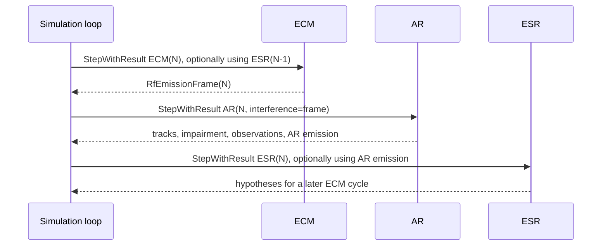

# 工程射频架构

`oneq::electromagnetics` 是 AR、ESR、ECM 与 RIR 的公共 RF 事实域，只共享值类型、校验和链路预算纯函数，
不共享传感器检测、受扰判决、ECCM 或资源规划算法。跨模块的契约规则（函数不得因名称相似而合并、
fail-closed 策略、saturated 语义等）见 `docs/common/contract.md` §跨模块物理基元复用；本文描述这些
规则背后的**设计结构**。

## 公共 RF 事实域

1. 公共坐标统一为 ECEF 米/米每秒，频率为 Hz、带宽为 Hz、时间为 s、功率在线性域使用 W，损耗和增益
   使用 dB/dBi。
2. 工程精度冻结为**检测单元/接收通道级统计模型**：高于"整个周期只有一个总接收功率"的原型，但不
   生成复数 IQ、不模拟未标定的射频器件压缩曲线，也不实现新的欺骗/转发算法。
3. 公共 DTO：`RfEmissionFrame` / `RfSceneFrame`、`RfSceneEmission` 和参数化 `RfWaveformSchedule`；
   旧 `RfEmissionSegment` 仅为尚未迁移模块保留的 v1 兼容类型，AR 不得使用。

## 发射事实四级 provenance

发射事实必须区分 world cycle、platform、equipment 和 emission 四级 provenance：

1. **world cycle**：绑定世界周期号。
2. **platform**：用于同平台判断。
3. **equipment**：标识具体发射/接收设备。
4. **emission**：标识一次实际发射。

co-site isolation 是"发射 equipment → 接收 equipment"的有向硬件路径。连续、参数化脉冲列和扫频必须能在
不逐 IQ 采样、不逐脉冲无界展开的前提下确定性计算时间/频率占用。

## 单程链路边界

公共单程链路只到达**接收设备输入端**：

1. 自由空间损耗、附加传播损耗、收发方向增益、极化损耗和入射功率/功率谱密度属于公共纯函数结果。
2. 大气公共层只提供路径附加损耗。
3. 匹配滤波、脉冲压缩、通道化、处理增益、热噪声账本、Pd/Pfa、receiver impairment、观测误差和 ECCM
   均由具体传感器拥有。

AR/RIR 目标回波使用模块自有的双程雷达方程与 RCS，外部雷达、ECM 和其他 RF 源才走公共单程链路。ESR 接收面
不预先区分"目标发射"和"干扰发射"，所有实际发射先进入同一个冻结 RF scene，意图/阵营只允许进入仿真
truth-evaluation 或 attribution。RIR 同形态接入：外部 RF 经 `RirCycleInput.rf_scene` 注入（仅非本机
emission，空表示无外部干扰），库内构建自发射并合并本帧求解 incident links；成功识别周期经
`RirCycleResult::emission_frame` 发布实际发射（与 AR `ArCycleResult::emission_frame` 同契约）。

## 单周期 RF 数据交换

普通调用方以各模块既有的 `Step()` / `StepWithResult()` 形状推进一个世界周期。ECM 发布的
`RfEmissionFrame(N)` 可以直接写入 AR 周期输入的独立 `interference` 字段；调用方不需要创建 RF scene、
回填 AR 自身发射、管理 token，或调用 prepare/complete 状态机：

时序设计要点：

1. ESR 的成功观测最早驱动下一成功 ECM 周期；ECM 当周期发布的干扰帧可以由同周期 AR 直接消费。AR 的
   内部/外部 LPI/ECCM proposal 最早驱动下一成功 AR 周期。
2. 同周期接收波束、调谐/预选器、通道/检测窗口、噪声参数和最大线性输入功率构成不可变 receiver
   operating state，但由传感器会话内部冻结。
3. `PrepareCycle` / `CompleteCycle` / `AbandonCycle` 和 opaque token 不属于公共传感器合同；需要的发射
   准备与接收分层只作为模块内部事务步骤存在。
4. 多装备发射汇集（AR/RIR/ECM 等共同在场的编排）由调用方在编排层完成：汇集各模块
   `emission_frame` 构建世界 RF scene，再按消费方派生外部 rf_scene/interference（排除本机发射）。
   库内不提供全局 RfScene 总线或跨模块总线组件（参考实现：`examples/component_attachment` 的
   rf-world 编排，`rf_world_broker.h`）。

## 接收机影响分层

AR/ESR/RIR 必须遵守同一物理分层，但各自拥有不同算法：

1. **incident link**：公共单程链路得到每个 emission 到接收设备输入端的方向、功率/PSD 和重叠事实。
2. **front-end ledger**：传感器按实际预选器/接收方向图聚合宽带输入并判断最大线性输入边界。
3. **resolution-cell/channel ledger**：AR 按 range/Doppler/beam/time-frequency detection cell，ESR 按
   tuner/channelizer/time-frequency-angle resolution cell，RIR 按 range/Doppler/beam/time-frequency
   detection cell（副本自 AR，无 ECCM 前沿跟踪分支）计算可分辨信号和未分辨干扰。
4. **sensor decision**：AR 使用处理后 SINR/Pfa/Pd 生成量测，ESR 使用截获概率、SINR 和碰撞/掩蔽结果
   生成脉冲或能量观测，RIR 使用处理后 SINR/Pd 驱动自持检测链。只有这一层可以产生 receiver impairment
   和测量不确定度。

公共 RF v2 characterization 已覆盖自由空间、参数化 pulse/sweep 占用、传播时延、Doppler、设备级 co-site
和 W/PSD 域聚合。它仍不替代各传感器的前端/通道账本、检测统计或资源调度验收；AR↔RIR RF 链路（基线/
干扰/杂波/饱和）有跨模块 parity 测试锚定。

## 证据

[evidence: tests/unit/common/common_rf_link_budget_test]
[evidence: tests/unit/common/common_rf_scene_test]
[evidence: tests/unit/electronic_surveillance_radar/esr_rf_v2_front_end_test]
[evidence: tests/unit/electronic_surveillance_radar/esr_resolution_cell_ledger_test]
[evidence: tests/unit/remote_identification_radar/rir_rf_physical_parity_test]
