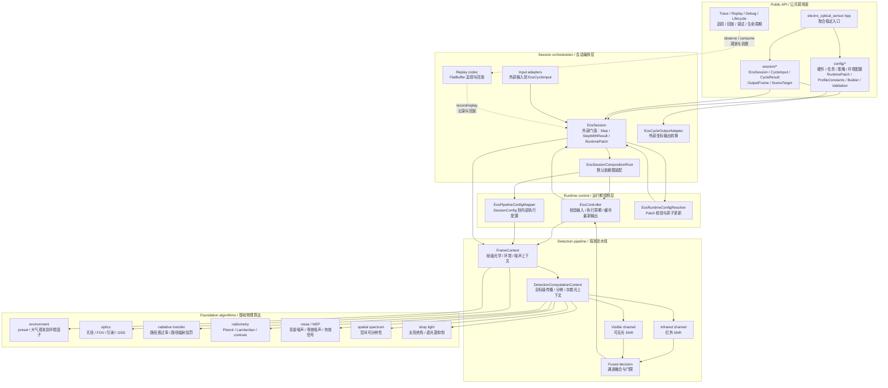
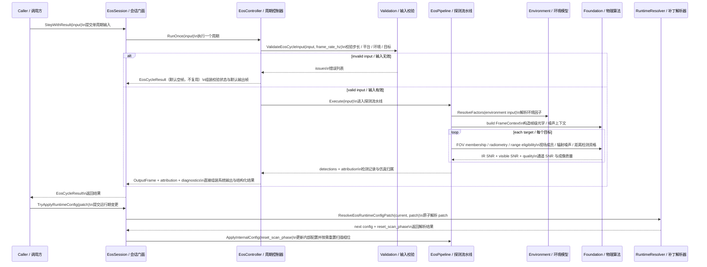
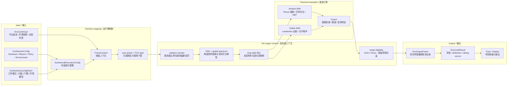
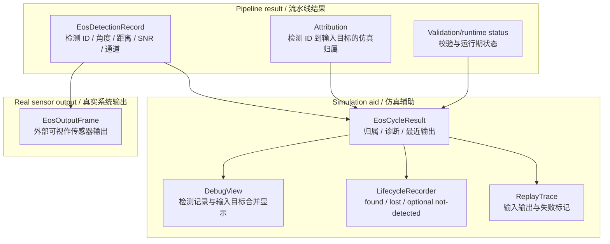

# EOS 数据流

本文承载 EOS 的架构图、Public API 边界、时序、主数据流和状态所有权。算法逐步逻辑读代码；
本文只回答"组件如何分层、数据如何流动、状态归谁"。

## Public API 与内部实现边界

公共头位于 `include/1q/electro_optical_sensor/`：

| 区域 | 职责 |
|---|---|
| `electro_optical_sensor.hpp` | 模块聚合入口；只聚合稳定 public API，不暴露 foundation/pipeline/runtime 内部类型 |
| `config/` | `EosSessionConfig` 四域配置、runtime patch、语义常量表（`EosProfileConstants.h`）、薄封装 builder、config validation |
| `session/` | `EosSession`、cycle input/result、scene target、output types、adapter、trace/replay、debug/lifecycle |

`electro_optical_sensor.hpp` 不是 EOS 全量 public header 汇总。trace/replay、debug view、lifecycle
recorder 等工具头按需单独包含；foundation 算法、pipeline、controller 不通过聚合入口暴露。内部实现位于 `src/electro_optical_sensor/`。新增生产源必须通过 EOS C++11/冻结源/contract guard：

| 目录 | 职责 |
|---|---|
| `config/` | `EosInternalExecutionConfig`、`EosPipelineConfigMapper`（SessionConfig 到内部执行配置） |
| `foundation/` | 光学、传播、辐射、噪声、空间频谱、杂散光基础算法 |
| `environment/` | `ResolveEnvironmentFactors`（preset + 大气观测到环境因子） |
| `pipeline/` | `EosPipeline`、`FrameContext`、`DetectionComputationContext` |
| `runtime/` | `EosController`（单周期调度、输入校验 gate、runtime state capture/restore）、`EosRuntimeConfigResolver` |
| `session/` | `EosSession`（对外门面）、`EosSessionCompositionRoot`（统一装配）、输入输出适配、trace/replay、debug/lifecycle |

## 分层组件图

读图顺序：

1. 外部只从 Public API 进入，不直接构造 `EosPipeline` 或 foundation 类型。
2. `EosSessionCompositionRoot` 负责默认依赖图；没有用户替换 controller、pipeline 或环境模型的 public API。
3. `EosPipeline` 把一个周期拆成帧级上下文和目标级上下文，再运行红外、可见光和融合逻辑；foundation
   算法是内部可测试实现，不是模块间契约。

## 执行时序

## 主探测数据流

## 输出与仿真归属数据流

设计要点：

- `EosOutputFrame` 是系统输出，不携带仿真目标 ID/name；raw detection 只保留真实传感器侧字段
  （detection id、方位/俯仰、距离、SNR、通道）。
- 仿真归属由 `EosCycleResult` 和 debug view 承接；lifecycle 是跨周期辅助视图，不替代 raw output；
  replay 用于复现输入输出和失败标记，不作为 public 算法扩展点。
- **replay double-precision 契约（反直觉）**：replay cycle-input 中的平台位置、速度与欧拉角必须保持
  public `PoseState` 的 double 精度；不允许 schema/codec 静默降为 float。即使当前检测 pipeline 不消费
  平台位姿，trace 仍必须能精确重组调用方输入。

[evidence: tests/replay/electro_optical_sensor/eos_replay_codec_roundtrip_test]

## 生命周期与状态所有权

`EosSession` 的内部状态包括：

1. 当前 runtime config（经 `EosRuntimeConfigResolver` 原子更新）。
2. `previous_output`：输入或运行期配置失败时复用上一有效输出（首个周期无效时不合成虚假输出）。
3. 扫描相位：runtime patch 改变扫描速率/工作模式时由 resolver 显式决定是否重置。
4. lifecycle 视图：found/lost/optional not-detected 跨周期事件，是辅助视图不是 raw output 状态。

`Step()` 只返回 `EosOutputFrame`；`StepWithResult()` 返回结构化执行状态、abort reason、attribution、
diagnostics 和 debug source。日志不作为状态判断依据。controller runtime state 支持 capture/restore，
但必须拒绝不兼容的 pipeline snapshot 或其他 controller 实例的 snapshot。

### 会话创建入口

`EosSession::Create()` 是信任构造路径，不隐式调用初始化校验。`CreateWithDiagnostics(config, issues)`
会报告 config 校验问题但仍构造会话（非阻断，见 contract.md §会话创建入口的非阻断语义）；真正阻断
执行的是每周期输入 gate 和 runtime patch 的原子校验。

[evidence: tests/unit/electro_optical_sensor/eos_session_create_test]
[evidence: tests/unit/electro_optical_sensor/eos_controller_runtime_state_test]
