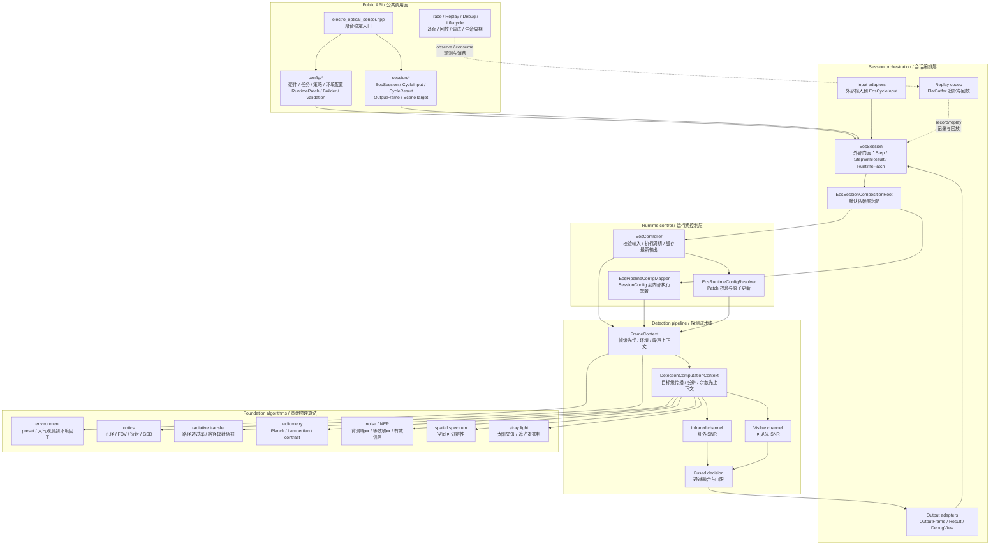
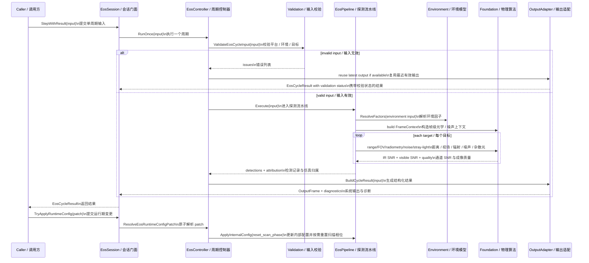
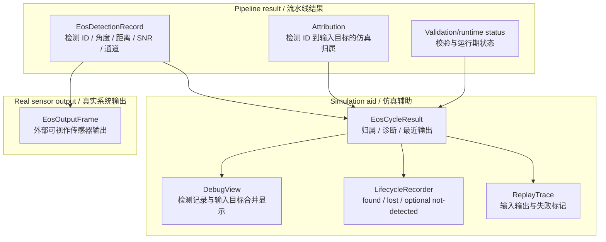

# Electro Optical Sensor 当前设计

Status: active
Last-reviewed: 2026-06-27
Authority: current electro_optical_sensor module design

本文描述 `electro_optical_sensor` 当前架构、数据流和算法边界。跨模块 public API、builder、输出三层模型等共同规则见 `docs/common/contract.md`。

## 1. 架构设计说明

### 1.1 模块定位

`electro_optical_sensor` 提供光电传感器的配置、单周期输入、环境/大气建模、红外与可见光探测、融合输出、trace/replay、调试视图和生命周期事件。

它不是一个通用图像处理框架。当前模块的稳定外部使用方式是：

1. 使用 `EosSessionConfig` 或 semantic builder 描述硬件、任务、策略、环境四域配置。
2. 使用 `EosCycleInput` 或 input adapter 提供平台、环境和目标场景。
3. 调用 `EosSession::Step()` 获取真实系统输出，或调用 `EosSession::StepWithResult()` 获取结构化执行结果。
4. 通过 runtime patch 调整工作模式、扫描、检测阈值、杂散光过滤和环境模型等有限运行期参数。

当前模块不提供 public pipeline/controller/environment-service 自定义点。外部如果需要改变物理行为，应通过配置和输入表达；如果需要排查仿真归属，应消费 `EosCycleResult`、debug view、lifecycle 或 replay，而不是把仿真真值塞进 raw output。

### 1.2 Public API 与内部实现边界

公共头位于 `include/1q/electro_optical_sensor/`：

| 区域 | 职责 | 设计约束 |
|---|---|---|
| `electro_optical_sensor.hpp` | 模块聚合入口 | 只聚合稳定 public API，不暴露 foundation/pipeline/runtime 内部类型 |
| `config/` | `EosSessionConfig`、runtime patch、semantic builder、config validation | 表达硬件、任务、策略、环境四域语义 |
| `session/` | `EosSession`、cycle input/result、scene target、output types、adapter、trace/replay、debug/lifecycle | 是外部调用方的主要使用面 |

内部实现位于 `src/electro_optical_sensor/`：

| 目录 | 职责 | 典型类型/函数 |
|---|---|---|
| `config/` | 内部执行配置 | `EosInternalExecutionConfig` |
| `foundation/` | 光学、传播、辐射、噪声、空间频谱、杂散光基础算法 | `ComputePlanckRadiance`、`EvaluateRadiativeTransfer`、`ComputeBackgroundNoiseStatistics`、`EvaluateSpatialResolvability` |
| `environment/` | 环境模型 | `ResolveEnvironmentFactors` |
| `pipeline/` | 红外/可见光/fused 探测流水线 | `EosPipeline`、`FrameContext`、`DetectionComputationContext` |
| `runtime/` | controller、config mapper、runtime config resolver | `EosController`、`MapSessionToInternal`、`ResolveEosRuntimeConfigPatch` |
| `session/` | public session 装配、输入输出适配、trace/replay、debug/lifecycle | `EosSessionCompositionRoot`、`EosCycleOutputAdapter`、`EosReplayFlatbufferCodec` |

### 1.3 新开发者视角的分层组件图

读图顺序：

1. 外部只从 Public API 进入，不直接构造 `EosPipeline` 或 foundation 类型。
2. `EosSessionCompositionRoot` 负责默认依赖图；当前没有用户替换 controller、pipeline 或环境模型的 public API。
3. `EosController` 处理输入校验、运行期状态、失败输出复用和周期执行。
4. `EosPipeline` 把一个周期拆成帧级上下文和目标级上下文，再运行红外、可见光和融合逻辑。
5. foundation 算法是内部可测试实现，不是模块间契约。

### 1.4 执行时序图

### 1.5 主探测数据流

```mermaid
flowchart LR
  subgraph Input["Input / 输入"]
    Config["EosSessionConfig\nHardware / Mission / Policy / Environment"]
    Cycle["EosCycleInput\n平台姿态 / 环境快照 / 目标列表"]
    Patch["EosRuntimeConfigPatch\n工作模式 / 扫描 / 门限 / 环境模型"]
  end

  subgraph Runtime["Runtime mapping / 运行期映射"]
    Internal["EosInternalExecutionConfig\n内部执行配置"]
    Frame["FrameContext\n帧级上下文"]
    Scan["scan phase + FOV gate\n扫描相位与视场门控"]
  end

  subgraph Target["Per-target context / 目标级上下文"]
    Range["range gate\nDmin / Dmax"]
    Transfer["radiative transfer\n路径透过率与路径辐射惩罚"]
    Quality["GSD + spatial spectrum\n地面采样距离与空间可分辨性"]
    Stray["stray-light filter\n太阳夹角与遮光罩抑制"]
  end

  subgraph Channels["Channel evaluation / 通道计算"]
    IR["Infrared SNR\nPlanck 辐射 / 红外对比 / NEP"]
    VIS["Visible SNR\nLambertian 反射 / 光子噪声"]
    Fuse["Fusion\n昼夜权重 / 阈值 / 检测判定"]
  end

  subgraph Output["Output / 输出"]
    Raw["EosOutputFrame\n真实传感器侧检测记录"]
    Result["EosCycleResult\n状态 / attribution / debug source"]
    Trace["Trace / Replay\n可回放输入输出"]
  end

  Config --> Internal
  Patch --> Internal
  Cycle --> Frame
  Internal --> Frame
  Frame --> Scan
  Scan --> Range
  Range --> Transfer
  Transfer --> Quality
  Quality --> Stray
  Stray --> IR
  Stray --> VIS
  IR --> Fuse
  VIS --> Fuse
  Fuse --> Raw
  Raw --> Result
  Result --> Trace
```

### 1.6 输出与仿真归属数据流

设计要点：

- `EosOutputFrame` 是系统输出，不携带仿真目标 ID/name。
- 归属关系由 `EosCycleResult` 和 debug view 承接。
- 生命周期事件是跨周期辅助视图，不替代 raw output。
- replay 用于复现输入输出和失败标记，不作为 public 算法扩展点。

## 2. 本模块使用的算法

### 2.1 算法总览

| 算法/部件 | 入口 | 当前角色 | 主要测试锚点 |
|---|---|---|---|
| 配置到内部执行映射 | `MapSessionToInternal`、`BuildModelConfigFromScenario` | 将四域配置变成 pipeline 可执行参数 | `eos_input_validation_test` |
| runtime patch 原子解析 | `ResolveEosRuntimeConfigPatch`、`EosSession::TryApplyRuntimeConfig` | 校验运行期变更，拒绝无效 patch，按需重置扫描相位 | `eos_runtime_config_resolver_test`、`eos_session_test` |
| 环境因子解析 | `ResolveEnvironmentFactors` | 将场景/大气观测映射为 aerosol、turbulence、radiance bias 等环境因子 | `eos_environment_model_test` |
| 辐射传输 | `EvaluateRadiativeTransfer`、`ComputePathRadiativeTransfer` | 根据路径长度、云量、气溶胶、湍流和模型类型计算透过率 | `eos_radiative_transfer_test`、`eos_pipeline_test` |
| 光学几何 | `ComputeApertureAreaM2`、`ComputeFovSolidAngleSr`、`ComputeGroundSampleDistanceM` | 计算孔径面积、视场立体角、衍射/GSD 相关量 | `eos_foundation_test` |
| 红外辐射 | `ComputePlanckRadiance`、`IntegrateSpectralRadianceOverBand`、`ComputeInfraredSnrLinear` | 基于目标温度、发射率、背景辐射和路径透过率估计 IR SNR | `eos_foundation_test`、`eos_pipeline_test` |
| 可见光辐射 | `ComputeVisibleLambertianRadiance`、`ComputeVisibleChannelResult` | 基于太阳辐照、反射率、投影面积和路径影响估计 visible SNR | `eos_foundation_test`、`eos_pipeline_test` |
| 背景噪声与 NEP | `ComputeBackgroundNoiseStatistics`、`ComputeEffectiveSignalPowerW`、NEP 相关函数 | 计算背景噪声、抑制权重、等效噪声和有效信号功率 | `eos_noise_model_test`、`eos_foundation_test` |
| 空间可分辨性 | `EvaluateSpatialResolvability` | 将目标尺度、GSD、MTF、采样效率映射为成像质量增益 | `eos_spatial_spectrum_test` |
| 杂散光过滤 | `EvaluateStrayLightFilter` | 根据太阳-目标夹角、云量和遮光罩参数抑制近太阳干扰 | `eos_straylight_test`、`eos_session_test` |
| 扫描/FOV/范围门控 | `EosPipeline` | 推进扫描相位，过滤视场外和探测距离外目标 | `eos_pipeline_test`、`eos_session_test` |
| 通道融合与输出构造 | `EosPipeline`、`EosCycleOutputAdapter` | 合成 IR/visible/fused SNR，生成 raw output、result、debug/lifecycle | `eos_cycle_output_builder_test`、`eos_output_observability_consumer` |

### 2.2 配置、环境 preset 与运行期映射

`EosSessionConfig` 按硬件、任务、策略、环境四域组织。进入 pipeline 前，`MapSessionToInternal` 会形成 `EosInternalExecutionConfig`：

- `hardware` 映射为 optics 和 detector 参数。
- `mission` 映射为 power、工作模式、扫描速率、帧率和探测范围。
- `policy` 映射为检测阈值、融合策略、杂散光过滤策略。
- `environment.scenario_config` 经 `BuildModelConfigFromScenario` 映射为辐射传输模型、气溶胶系数、湍流系数和可选大气观测。

EOS replay 的 session-config payload 以 `scenario_config` 为 decode 后的环境 source of truth。
FlatBuffer 中的 `radiative_transfer_model_derived`、`aerosol_density_factor_derived` 和
`turbulence_factor_derived` 是编码时 `BuildModelConfigFromScenario` 的派生快照，用于
characterization/漂移检查；`DecodeEosSessionConfig` 不从这些派生字段反写配置。
`EosReplayCodecRoundtripTest.SessionConfigPreservesAllDomains` 直接检查快照字段与当前 mapper 输出一致。

当前 preset 语义：

| Preset | 辐射传输模型 | 气溶胶因子 | 湍流因子 | 设计含义 |
|---|---:|---:|---:|---|
| default | `kDerivedBeerLambert` | 1.0 | 1.0 | 基线大气 |
| humid | `kHumidityWeighted` | 1.1 | 1.1 | 湿度加权路径损失 |
| dusty | `kAdaptivePathRadiance` | 2.0 | 1.2 | 气溶胶显著增强 |
| turbulent | `kAdaptivePathRadiance` | 1.3 | 1.8 | 湍流主导退化 |
| maritime | `kHumidityWeighted` | 1.5 | 1.4 | 海洋湿度和气溶胶混合退化 |

如果 `has_custom_overrides` 为真，custom model、aerosol、turbulence 会覆盖 preset 默认值。这个规则是设计契约的一部分，改变时必须同步本文、`docs/common/contract.md` 中的配置语义和相关测试。

### 2.3 帧级上下文：工作模式、扫描和探测范围

`EosPipeline` 每周期先构造 `FrameContext`。该上下文是目标无关的帧级物理状态，主要包括：

- 红外/可见光是否启用：由 `EosPipelineWorkMode` 决定，`kFused` 同时启用两路。
- 孔径面积：由光学口径直径转换得到。
- FOV 立体角：由水平/垂直视场角近似计算。
- 波段中心、带宽、光学透过率、衍射分辨角。
- 探测距离上下界 `dmin_m` / `dmax_m`。
- 背景辐射、可见光光子噪声增强因子、NEP 输入和基础噪声输入。
- 环境模型结果。

扫描逻辑负责更新当前视场中心。目标只有同时通过范围门控和 FOV 门控后，才会进入通道 SNR 判定。相关行为由 `ScanAngleAdvancesAndWrapsInsideRange`、`InFovTargetIsDetectedAndOutOfFovTargetIsFiltered`、`OutOfRangeTargetIsMarkedUndetected`、`MultiCycleScanAdvancesAzimuth` 覆盖。

运行期 patch 中的扫描速率或工作模式变化会通过 resolver 校验并更新内部配置。扫描相位是否重置由 resolver 显式给出，不能由调用方隐式假设。

### 2.4 目标级上下文：路径、大气、空间分辨和杂散光

每个目标会构造 `DetectionComputationContext`。该上下文在帧级上下文基础上补充目标相关量：

- `ComputePathRadiativeTransfer` 根据目标距离、云量、气溶胶、湍流、平台高度和辐射传输模型，得到路径透过率和路径辐射惩罚。
- 范围门控检查目标距离是否位于 `dmin_m` 和 `dmax_m` 之间。
- `ComputeGroundSampleDistanceM` 和目标投影面积估算几何质量。
- `EvaluateSpatialResolvability` 结合目标尺度、GSD、MTF 参考值、采样效率和场景对比度，得到空间频谱质量。
- `EvaluateStrayLightFilter` 根据目标方位/俯仰、太阳方位/高度、云量和遮光罩参数得到杂散光抑制结果。

`imaging_quality_gain` 是几何质量和空间频谱质量的组合结果，并继续影响背景噪声场景复杂度。也就是说，空间分辨不是输出装饰项，而会反馈到 SNR 判定。

### 2.5 红外通道算法

红外通道的核心是温差辐射与探测器噪声之间的关系：

1. 使用 `ComputePlanckRadiance` 根据波长中心和目标表观温度计算目标谱辐射。
2. 使用目标发射率和背景谱辐射得到红外谱辐射差。
3. 使用 `IntegrateSpectralRadianceOverBand` 将谱辐射差按带宽积分。
4. 使用 `ComputeRelativeContrast` 形成目标相对背景的红外对比。
5. 使用 `ComputeReceivedPowerW` 将源辐射、目标投影面积、距离、孔径面积、路径透过率和光学透过率转化为接收功率。
6. 结合 NEP、积分时间、背景噪声和成像质量得到红外 SNR。

该路径解释了几个重要现象：

- 目标温度升高会提高 Planck 辐射，从而提高 IR SNR。
- 带宽增大在固定中心波长下会提高积分辐射，但也必须和噪声模型一起看。
- 距离增加会通过传播和反平方关系降低接收功率。
- 高云量、强气溶胶、强湍流会通过路径透过率和路径辐射惩罚降低 SNR。

相关测试包括 `PlanckRadianceIncreasesWithTemperature`、`InfraredRadianceDeltaReflectsTemperatureContrast`、`ReceivedPowerAndSnrDecreaseWithRange`、`InfraredBandwidthIncreaseRaisesSnrAtFixedCenterWavelength` 和 `WorseAtmosphereObservationReducesInfraredSnr`。

### 2.6 可见光通道算法

可见光通道使用照明、反射率、目标投影面积、路径透过率和光子噪声估计 visible SNR：

1. `DayNightType` 映射为 day/twilight/night illumination condition。
2. 太阳辐照和目标反射率进入 Lambertian 可见光辐射估计。
3. 目标投影面积只应在通道链路中应用一次，避免重复放大目标。
4. 云量和参考辐照差异会提高 visible photon noise enhancement。
5. 杂散光过滤结果会影响近太阳方向的有效信号质量。
6. 输出 visible SNR 进入单通道判定或 fused 判定。

该通道不把红外温差当作主要信号源。白天可见光权重更高，夜间 fused 权重应向红外倾斜。相关测试包括 `VisibleRadianceDayIsHigherThanNight`、`VisibleChainAppliesProjectedAreaOnce`、`VisibleReferenceIrradianceAffectsVisibleSnrThroughNoiseModel`、`HigherCloudCoverageReducesVisibleSnr` 和 `FusedWeightShiftsTowardVisibleInDayAndInfraredAtNight`。

### 2.7 噪声、NEP、空间频谱与杂散光

EOS 的检测判定不是简单的“信号大于阈值”。噪声和成像质量由多项内部模型共同形成：

- 背景噪声：`ComputeBackgroundNoiseStatistics` 计算背景均值、sigma、等效噪声，云量、场景复杂度和光子噪声都会参与。
- 背景抑制：`ComputeEffectiveSignalPowerW` 会扣除可抑制的背景预算，抑制权重被限制在配置范围内。
- NEP：探测器面积、detectivity、带宽/积分时间等参数形成等效噪声功率，用于 SNR 评价。
- 空间频谱：目标尺度相对 GSD 越大，空间可分辨性越好；GSD 变粗会降低质量增益。
- 杂散光：太阳-目标夹角越小，污染越强；遮光罩和云量会调节抑制结果。

这些算法位于 foundation 层，测试可以直接覆盖，但它们不是 public customization surface。外部用户只能通过硬件、任务、策略、环境和输入影响这些模型。

### 2.8 融合、检测记录和仿真归属

pipeline 先得到红外 SNR 和可见光 SNR，再依据工作模式生成最终检测判定：

- `kInfraredOnly`：只使用红外通道。
- `kVisibleOnly`：只使用可见光通道。
- `kFused`：按昼夜和策略权重融合两路通道。

检测记录进入 `EosOutputFrame`。raw detection 只保留真实传感器侧应有的字段，例如 detection id、方位/俯仰、距离、SNR、通道信息等；输入目标 ID/name 等仿真便利字段不得进入 raw output。

仿真归属路径由 `EosCycleResult` 和 debug view 表达：

- attribution 把 detection id 与输入目标关联。
- debug view 可以把 raw output 和输入目标合并展示，服务开发排查。
- lifecycle recorder 跟踪 found/lost/optional not-detected 等跨周期事件。
- replay 保存 cycle input/output/result 和 failure marker，用于回放一致性。

该边界由 `ExternalOutputPreservesDetectionIdOnly`、`DebugViewMergesRawOutputWithInputTargets`、`LifecycleRecorderTracksFoundLostAndOptionalNotDetected`、`ReplayEosTraceRoundtrip` 和 `eos_cycle_output_builder_test` 覆盖。

### 2.9 输入校验、失败输出和运行期状态

`EosController` 在执行 pipeline 前会校验 `EosCycleInput`。无效输入不会直接污染 pipeline 状态：

- 首个周期输入无效时，不合成虚假的最新输出。
- 已有成功周期后再遇到无效输入，可以复用最近有效输出，同时在 result 中记录校验失败状态。
- runtime patch 必须原子校验；任一字段无效时整个 patch 被拒绝。
- controller runtime state 支持 capture/restore，但必须拒绝不兼容的 pipeline snapshot 或其他 controller 实例的 snapshot。

这些规则让 EOS 能在 replay、回归测试和集成场景中保持可解释行为。相关测试包括 `ValidationFailureReturnsEmptyFrameAndStillAdvancesCycleIndex`、`StepReusesPreviousOutputWhenValidationFailsAfterSuccessfulCycle`、`RuntimePatchIsAtomicWhenAnyFieldIsInvalid` 和 `CaptureAndRestoreRoundTripState`。

## 3. 非目标与边界

- 不暴露用户自定义 pipeline、controller、环境模型或 foundation algorithm 类型。
- 不把仿真目标 ID/name 混入 `EosOutputFrame` 的 raw detection。
- 不把 debug view、lifecycle 或 replay 当作真实传感器输出。
- 不把环境 preset 简化为无语义 flat 参数；preset 到物理参数的映射是设计内容。
- 不为测试 mock 便利新增 public 扩展点。

## 4. 设计变更规则

1. `EosOutputFrame`、`EosDetectionRecord`、`EosCycleResult` 或 attribution/debug/lifecycle 语义变化，必须同步本文和输出边界测试。
2. 环境 preset、radiative transfer model、aerosol/turbulence 默认值变化，必须同步本文和 `eos_environment_model_test`、`eos_pipeline_test`。
3. runtime patch 的可变字段、原子性或 scan reset 规则变化，必须同步本文和 runtime resolver 测试。
4. foundation 算法如果从 internal 变成 public API，必须在本文 `[evidence: ...]` 标注中记录扩展理由和兼容策略。
5. 新增 debug/replay 字段时，必须保持真实输出、结构化结果和仿真辅助视图三层分离。
