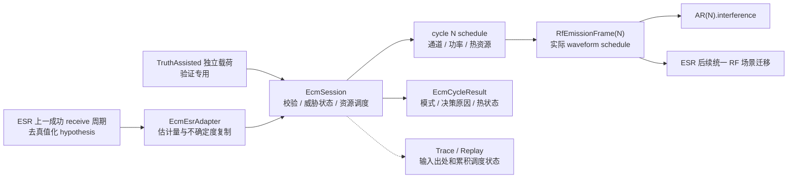

# Electronic Countermeasure 当前设计

Status: active
Last-reviewed: 2026-07-22
Authority: current electronic_countermeasure module design
RF-Interference-Architecture: frozen target; implementation pending

本文是 `electronic_countermeasure` 的唯一设计权威。公共 RF 单位、链路、co-site 与输出分层规则见
`docs/common/contract.md`。首期精度为参数化 RF 活动/发射调度级，不生成复数 IQ，仅实现点频、阻塞和
扫频压制干扰；接收机链路预算、受扰状态和探测结果不属于 ECM。
首期不实现欺骗/转发；AR 已无 legacy adapter，尚未迁移的 ESR v1 兼容路径必须与 ECM 的 RF v2
压制发射严格隔离。SAR/EOS/SBIRS 不在当前联动范围。

## 1. 架构与边界

公共面只提供 `EcmSessionConfig`、runtime patch、`EcmCycleInput`、`EcmCycleResult`、ESR adapter 和
trace/replay 门面，不公开 planner SPI。raw output 是公共 RF v2 `RfEmissionFrame`，可直接赋给
`ArCycleInput::interference`；资源选择原因、truth-assisted 归属和预期调度语义只进入 result/debug。

`EcmSession::StepWithResult()` 把校验、调度和发布合在一次原子调用中。ECM 不等待 AR/ESR 回调，
也不拥有接收机求解；调用方只转交值类型，不能形成隐式反向依赖。

## 2. 输入模式与周期合同

- `kSensorDriven` 只接受 `EcmSensorObservationFrame`，其内容来自 ESR 去真值化 hypothesis。
- `kTruthAssisted` 只接受独立 `EcmTruthThreat`；结果与 replay 显式标记 `truth_assisted`。
- 两种载荷不得混合；模式与载荷不一致时原子拒绝，拒绝周期不推进成功周期、滑行年龄、热状态或随机流。
- 世界周期 N 的 ECM 发射只消费 N 之前最近一个成功 ESR 周期的观测；fresh
  frame 必须带可验证的 source world cycle、source ESR success sequence 和 source batch provenance，不能
  仅满足“小于 N”就重置为新鲜。没有新观测时最多滑行两个成功 ECM 发射准备周期，第三个安全停发。
- 关机和输入拒绝不产生发射，也不推进滑行年龄、热状态、随机流或 emission ID。成功发布的
  emission 是已发生的世界事实；后续 AR/ESR receive 失败不得回滚 ECM 功率、热能、调度相位或 ID。
- SensorDriven 与 TruthAssisted 的所有来源字段、缓存和 replay attribution 必须完全互斥。切换模式时
  旧 sensor cache 立即失效；TruthAssisted 成功周期不得让旧 sensor frame 在切回后重新获得新鲜年龄。

原型证据（不构成 fresh provenance、模式切换失效或两阶段提交的目标验收）：
`ecm_session_test.cpp::SensorFrameGlidesTwoSuccessfulCyclesThenSafelyStops`、
`RejectedMixedModeDoesNotAdvanceSuccessfulState`、`TruthAssistedOwnershipIsExplicitAndSeparate`。

## 3. 调度、资源与确定性

调度器按威胁分数和稳定 hypothesis ID 排序，在 `channel_count`、单通道功率、总功率、硬件频率范围和
热容量内分配资源。点频覆盖估计中心频率，阻塞使用可行带宽，扫频使用公共 RF 合同的参数化实际
waveform schedule；不生成逐采样 IQ，也不为性能方便把扫频伪装成一个全周期中心频率。所有功率守恒
在 W 域检查，完整占用带宽必须落在硬件范围内；发射 frame 的 platform/equipment/emission provenance
唯一，活动不得越出周期，生成后必须原子通过公共 emission-frame validation 才能发布。

首期 ECM 不拥有定向天线控制算法。平台/硬件层在 prepare 输入中提供已经解析的固定 transmit antenna
pattern、polarization 和 pointing，scheduler 只能选择 waveform、channel、power 和 timing；ESR bearing
可参与威胁排序或 attribution，但不得在没有天线执行机构、转动/相控时延和 snapshot 状态的情况下
声称已经驱动波束指向。若未来引入定向 ECM，必须先冻结 actuator/beam state、slew/settle、资源冲突和
replay，再把 pointing 写入实际 emission fact。

随机性按 waveform scheduling、tie-break 和其它实际消费者分离；每条流定义无发射/拒绝周期是否采样，
不得由 threat 输入顺序隐式改变。实现上 session 维护两条独立 `std::mt19937` 流：scheduling 流
专责 sweep 方向采样，tie-break 流专责等分排序；两者均从会话 `random_seed` 经 splitmix32 终结符
按各自 domain tag 派生（与 SBIRS `DeriveMeasurementSeed` 同约定），互相不相关。无发射/拒绝/
关机周期两条流都不采样。tie-break 流的消耗量只等于“参与排队的可行威胁唯一 ID 数”，scheduling
流的消耗量只等于“实际生成的 sweep emission 数”，二者都与 threat 输入顺序无关；具体地，tie-break
键在排序前按威胁稳定 ID 的规范序（而非输入序）逐 ID 派生并回填到威胁，使排序比较器保持纯函数，
相同威胁集合在任意输入顺序下产出相同的 {ID → 键} 映射与相同的最终排序。scheduling state、next
emission ID、最近 ESR 帧、逐威胁年龄、滑行年龄、成功 prepare sequence、热能、两条随机流和活动
配置均由 session 快照唯一拥有。快照只可恢复到捕获它的同一 session 实例，恢复前完整校验所有嵌套
observation、重复 ID、provenance、模式组合和随机状态（含两条流的反序列化），失败不得部分修改。

原型证据（不构成参数化 waveform、设备 provenance 目标验收；多随机流分离与快照嵌套校验已实现）：
`ecm_session_test.cpp::ChannelAndPowerBudgetsAreConservedForAllTechniques`、
`SweepSnapshotContinuationIsDeterministic`、
`ecm_scheduler_order_invariance_test.cpp::DistinctScoresKeepSweepSequenceAcrossPermutations`、
`ecm_scheduler_order_invariance_test.cpp::TiedScoresTieBreakIsOrderIndependent`、
`ecm_scheduler_order_invariance_test.cpp::DifferentSeedsProduceDifferentSweepSequence`、
`ecm_session_test.cpp::SnapshotFollowsImplAcrossFacadeMoveAndRejectsForeignSession`、
`ecm_session_test.cpp::RestoreRejectsDirtySnapshotAndLeavesSessionUntouched`、
`ecm_session_test.cpp::RestoreRejectsShallowInconsistencyRegression`。
恢复校验现在逐项复用输入侧的 `IsValidSensorObservation` 与 hypothesis ID 唯一性,并断言
`has_successful_cycle↔last_successful_cycle_index` 一致;脏快照(无效观测、重复 ID、标志/索引不一致、
`has_last_sensor_frame=false` 但仍有观测)在 fail-closed 下被拒绝且不部分修改 session。

## 4. Trace、replay 与联动

ECM schema 必须记录输入模式、完整 ESR provenance、actual waveform schedule、platform/equipment/emission
身份、固定发射天线状态、实际输出、资源决策、逐威胁/滑行/热状态、所有随机流和 runtime patch apply
result。回放按 prepare/emit 事件重建 session 并严格比较发布事实，不能忽略出处、无发射周期或
truth-assisted 标记；空补丁和被拒 patch 也必须复现原 apply result。

AR 直接消费 ECM 发布的 `RfEmissionFrame`，不消费 ECM 自己计算的 J/S、J/N 或预期效果。ESR 的
统一 RF v2 接收链仍待迁移；它的 v1 兼容输入不得转换回 AR。启用 `flight_dynamic` 时，跨域验收从连续
飞行动力学状态导出 ECEF 运动学，并验证 ESR(N-1) → ECM(N) → AR(N) 的值类型闭环；传感器和 ECM
仍不直接依赖飞行动力学模块。

现有 replay、cross-domain 和 performance tests 只证明单阶段原型接线、基本 provenance 字段与 P95；尚不能
证明 fresh-frame 严格来源、模式切换失效、参数化 waveform、两阶段提交、完整 snapshot/replay 往返或统一
RF scene 已实现。注:快照恢复侧的嵌套 observation / 重复 ID / 标志一致性校验已实现(见 §3 证据);
此处 "完整 snapshot/replay 往返" 仍指 replay schema 端到端往返(EcmRuntimeState 当前不进 replay schema),
而非恢复侧校验深度。

## 5. 非目标与变更规则

- 不实现新的欺骗、转发、DRFM 或成功概率模型。
- 不把 truth ID 引入 sensor-driven 输入或 raw emission。
- 不让 ECM 计算接收功率、J/S、J/N 或传感器受扰判决。
- 增加技术、修改滑行/资源/热语义或 snapshot 所有权时，必须同步 unit、trace/replay、跨模块集成和本文证据。
