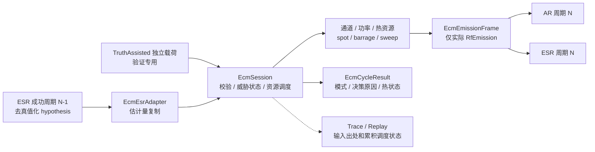

# Electronic Countermeasure 当前设计

Status: active
Last-reviewed: 2026-07-22
Authority: current electronic_countermeasure module design

本文是 `electronic_countermeasure` 的唯一设计权威。公共 RF 单位、链路、co-site 与输出分层规则见
`docs/common/contract.md`。首期精度为链路预算级，不生成复数 IQ，仅实现点频、阻塞和扫频压制干扰；
欺骗/转发仍由 AR/ESR 的隔离 legacy adapter 承担，SAR/EOS/SBIRS 不在当前联动范围。

## 1. 架构与边界

公共面只提供 `EcmSessionConfig`、runtime patch、`EcmCycleInput`、`EcmCycleResult`、
`EcmEmissionFrame`、ESR adapter 和 trace/replay 门面，不公开 planner SPI。raw output 只包含实际发射事实；
资源选择原因、truth-assisted 归属和预期调度语义只进入 result/debug。

## 2. 输入模式与周期合同

- `kSensorDriven` 只接受 `EcmSensorObservationFrame`，其内容来自 ESR 去真值化 hypothesis。
- `kTruthAssisted` 只接受独立 `EcmTruthThreat`；结果与 replay 显式标记 `truth_assisted`。
- 两种载荷不得混合；模式与载荷不一致时原子拒绝，拒绝周期不推进成功周期、滑行年龄、热状态或随机流。
- 世界周期 N 的 ECM 只消费上一成功 ESR 周期观测并生成周期 N 发射。没有新观测时最多滑行两个成功
  ECM 周期，第三个成功周期安全停发；关机和拒绝周期既不产生新发射，也不推进滑行年龄。

[evidence: tests/unit/electronic_countermeasure/ecm_session_test.cpp::EcmSessionTest.SensorFrameGlidesTwoSuccessfulCyclesThenSafelyStops]
[evidence: tests/unit/electronic_countermeasure/ecm_session_test.cpp::EcmSessionTest.RejectedMixedModeDoesNotAdvanceSuccessfulState]
[evidence: tests/unit/electronic_countermeasure/ecm_session_test.cpp::EcmSessionTest.TruthAssistedOwnershipIsExplicitAndSeparate]

## 3. 调度、资源与确定性

调度器按威胁分数和稳定 ID 排序，在 `channel_count`、单通道功率、总功率和热容量内分配资源。
点频覆盖估计中心频率，阻塞使用配置带宽，扫频以多个周期内分段表达，不生成逐采样 IQ。所有功率守恒
在 W 域检查；发射 frame 的 emission ID 唯一，分段不得越出周期。

随机性按语义消费者分离；当前 scheduling RNG、next emission ID、最近 ESR 帧、滑行年龄、成功周期、
热能和活动配置均由 session 快照拥有。快照只可恢复到捕获它的同一 session 实例，恢复失败不得部分修改状态。

[evidence: tests/unit/electronic_countermeasure/ecm_session_test.cpp::EcmSessionTest.ChannelAndPowerBudgetsAreConservedForAllTechniques]
[evidence: tests/unit/electronic_countermeasure/ecm_session_test.cpp::EcmSessionTest.SweepSnapshotContinuationIsDeterministic]

## 4. Trace、replay 与联动

ECM schema 记录输入模式、来源 ESR 成功周期、RF 分段、实际输出、决策、热状态和 runtime patch。
回放逐事件重建 session 并严格比较输出，不能忽略出处或 truth-assisted 标记。AR/ESR 以
`none / legacy / engineering` tagged mode 消费 ECM 发射；新旧字段混合 fail closed。启用
`flight_dynamic` 时，跨域验收从连续飞行动力学状态导出 ECEF 位置和速度，再验证
`flight_dynamic → ESR(N-1) → ECM(N) → AR/ESR(N)` 闭环；传感器仍不直接依赖飞行动力学模块。

[evidence: tests/replay/electronic_countermeasure/ecm_replay_test.cpp::EcmReplayCodecTest.InputAndResultPreserveProvenanceAndRfSegments]
[evidence: tests/replay/electronic_countermeasure/ecm_replay_test.cpp::EcmReplaySessionTest.MultiCycleTraceReplaysDeterministically]
[evidence: tests/integration/cross_domain/multi_model_scenario_test.cpp::MultiModelScenarioTest.SensorDrivenEcmUsesPreviousSuccessfulEsrFrame]
[evidence: tests/integration/cross_domain/multi_model_scenario_test.cpp::MultiModelScenarioTest.FlightDynamicDrivesSensorEcmClosedLoop]
[evidence: tests/performance/cross_domain/rf_interference_performance_test.cpp::RfInterferencePerformanceTest.FullScaleCyclesMeetReleaseP95Budget]

## 5. 非目标与变更规则

- 不实现新的欺骗、转发、DRFM 或成功概率模型。
- 不把 truth ID 引入 sensor-driven 输入或 raw emission。
- 不让 ECM 计算接收功率、J/S、J/N 或传感器受扰判决。
- 增加技术、修改滑行/资源/热语义或 snapshot 所有权时，必须同步 unit、trace/replay、跨模块集成和本文证据。
