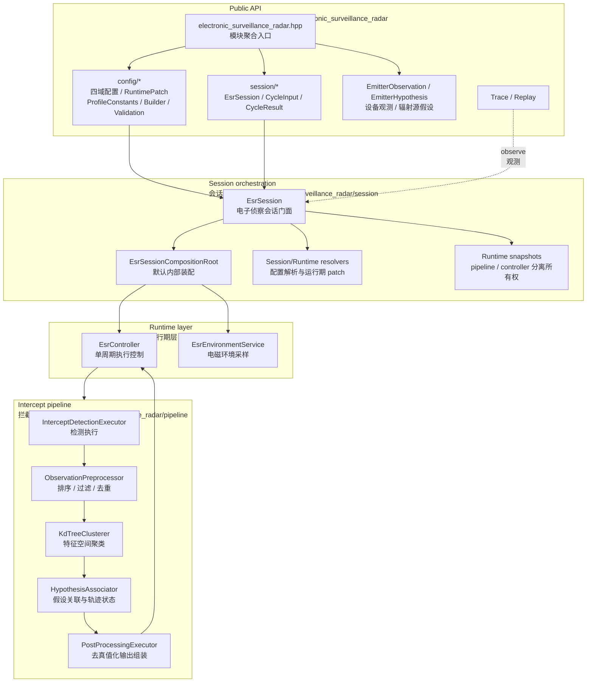
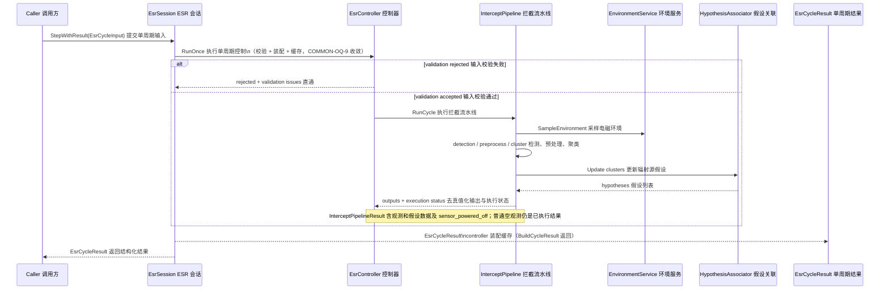
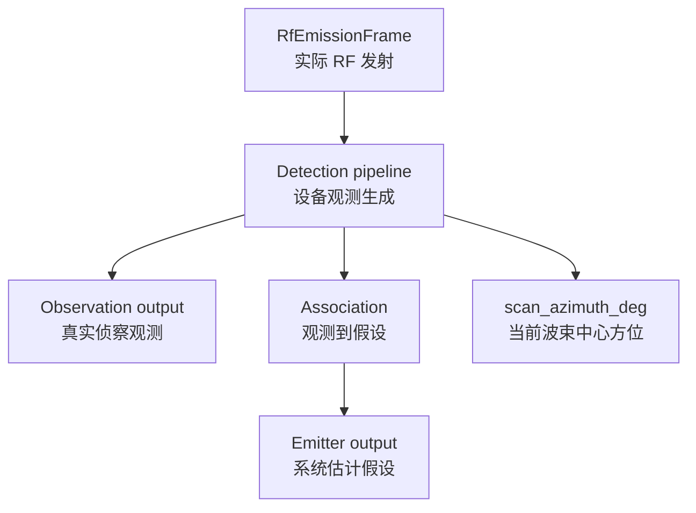
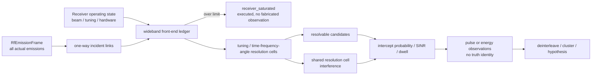

# ESR 数据流

本文承载 ESR 的架构图、Public API 边界、时序、主数据流和状态所有权。算法逐步逻辑读代码。

## Public API 与内部实现边界

公共头位于 `include/1q/electronic_surveillance_radar/`：`electronic_surveillance_radar.hpp`（模块聚合入口）、
`config/`（`EsrSessionConfig` 四域配置、runtime patch、`EsrProfileConstants.h`、薄封装 builder、config validation）、
`session/`（`EsrSession`、cycle input/result、observation/hypothesis、trace/replay）。聚合入口不是全量 public
header 汇总：trace/replay、debug view 等工具头按需单独包含；pipeline/controller/environment service、runtime
snapshot 不通过聚合入口暴露。内部实现位于 `src/electronic_surveillance_radar/`：`config/`（内部执行配置
`EsrInternalExecutionConfig`）、`environment/`（`EsrEnvironmentService` 和单程传播附加损耗采样）、`pipeline/`
（拦截 gate、检测执行、预处理、特征编码、Kd-tree 聚类、假设关联、后处理）、`runtime/`（`EsrController` 和
执行状态、输出缓存管理）、`session/`（组合根、配置解析、runtime patch、输入校验、trace/replay）。

## 分层组件图

读图方式：新调用方从 `electronic_surveillance_radar.hpp`、`EsrSessionConfig`、`EsrCycleInput` 和 `EsrSession`
开始。`EsrSessionCompositionRoot` 只在创建阶段装配并转移 pipeline/controller 所有权；周期执行由
`EsrSession` 委托 `EsrController`，再由 Controller 调度 pipeline。

## 执行时序

ESR 保持单阶段 `StepWithResult` 门面：调用方在周期输入中提供一个公共 `RfEmissionFrame`，ESR 在内部冻结
接收工作状态、求解入射链路并生成本周期输出，不暴露 orchestrator、token 或 receive/complete 协议。

## 主数据流

自然环境与 RF 发射事实分开输入；RF 发射帧是意图中立的统一入口，不再将"目标辐射源"和"干扰源"分流。

```mermaid
flowchart LR
  subgraph Input["输入层 Input"]
    Config["EsrSessionConfig\n硬件 / 任务 / 策略 / 环境"]
    Cycle["EsrCycleInput\n周期 / 平台 / 自然环境 / RfEmissionFrame"]
    Patch["EsrRuntimeConfigPatch\n运行期变更"]
  end

  subgraph Detect["检测层 Detection"]
    Env["EnvironmentSnapshot\natmospheric / clutter"]
    Front["EsrRfV2FrontEnd\n宽带预选器 / 调谐通道双状态"]
    Cells["EsrResolutionCellLedger\n到达时间 / 瞬时频率 / 角度单元"]
    Gate["InterceptGate\n范围 / 频段 / 扫描窗口 / SNR 门"]
    Angle["AngleErrorModel\nAOA 误差采样"]
    Raw["RawObservationRecord\n原始观测记录"]
  end

  subgraph Feature["特征层 Feature"]
    Pre["ObservationPreprocessor\n有限值过滤 / SNR 质量归一 / 去重"]
    Encode["ObservationFeatureEncoder\nRF/PW/AOA/SNR 特征缩放"]
    Cluster["KdTreeClusterer\n半径聚类 / 噪声标记"]
  end

  subgraph Track["关联层 Association"]
    Assoc["HypothesisAssociator\n门限距离匹配 / ID 稳定 / miss 回收"]
    Hyp["EmitterHypothesis\n模式 / 威胁 / 置信度 / candidate classes"]
  end

  subgraph Output["输出层 Output"]
    Obs["observation_output\n设备观测"]
    Emit["emitter_output\n系统估计"]
    Scan["scan_azimuth_deg\n波束中心方位"]
    Result["EsrCycleResult\n执行状态 / 诊断 / replay"]
  end

  Config --> Gate
  Patch --> Gate
  Cycle --> Front
  Env --> Gate
  Front --> Cells
  Cells --> Gate
  Gate --> Angle
  Angle --> Raw
  Raw --> Pre
  Pre --> Encode
  Encode --> Cluster
  Cluster --> Assoc
  Assoc --> Hyp
  Raw --> Obs
  Raw --> Scan
  Scan --> Result
  Hyp --> Emit
  Obs --> Result
  Emit --> Result
```

输出包含两个去真值化通道与一个设备状态标量：

## 工程 RF 接收角色与意图中立输入

ESR 是纯接收设备，不拥有其它模块，也不要求调用方运行额外的 RF 状态机。调用方把当前周期的实际发射填入
`RfEmissionFrame`，ESR 用一个不可变 receiver operating state 处理帧内全部发射。一个 frame 可以包含 AR、
ECM 或其他 RF 发射；它们在接收链中没有"目标/干扰"角色差异。旧 `scene_emitters`、tagged interference、
legacy jammer 和欺骗注入已经删除，不属于公共合同。

所有 RF 发射在接收入口都是意图中立的实际发射；接收 pipeline 只依据波形、时频占用、方向和功率决定其
是否可观测、可分辨或形成干扰，"敌方""jammer""普通 emitter"等角色只允许存在于调用方外部业务语义或
debug attribution 中，不得提前改变 raw detection gate。同周期 active receive beam、安装姿态、tuning
window、极化、噪声参数、最大线性输入功率和 equipment-level co-site isolation 构成唯一 receiver operating
state；pipeline 唯一拥有扫描/调谐累积相位并写入自身 snapshot，trace/replay 由输入与事件重建该状态，
处理不同候选 emission 时不得逐候选重指向天线、改调谐或改前端带宽。

## 生命周期与状态所有权

pipeline/controller 的 `CaptureRuntimeState()` / `RestoreRuntimeState()` 描述分离的累积运行态所有权：

- **pipeline** 是接收流水线累积状态的唯一 owner；其快照含 observation/hypothesis id、hypothesis associator
  tracks、归一化扫描相位和 `completed_receive_cycles` 调谐相位。随机流由 immutable seed/cycle/identity/
  domain 参数派生，不存在跨周期可变 RNG 状态。pipeline 快照不含 config、feature scales 或环境配置。
  归一化扫描相位在本周期检测阶段映射为输出帧 `scan_azimuth_deg`：选中波束的方位 + 天线安装偏置
  （平台参考系实际指向，与 RF 前端接收求解同算式），并折叠到 [-180, 180)；该映射随相位推进而逐周期变化。
- **controller** 快照只含其拥有的 latest output、batch id 和最近一次执行状态，不嵌套或恢复
  pipeline 快照。周期内无 session 层快照回滚事务（controller 各 abort 路径均不推进 pipeline
  累积状态，原 session 回滚分支不可达，COMMON-OQ-9 收敛时移除）；`CaptureRuntimeState()` /
  `RestoreRuntimeState()` 仅用于快照往返与跨实例恢复防护。

`InterceptPipeline::RunCycle()` 返回 `InterceptPipelineResult`，显式区分设备关机导致的未执行状态
（controller 传播为 `kPoweredOff`，不复用最近有效输出且不推进 batch；普通空观测仍是合法数据结果）。
validation rejection 在进入 pipeline 前发生（`EsrCycleResult.status=kRejected` 且不返回历史输出）。设备关机
不是 output-contract failure，也不触发运行态回滚；新增其他 pipeline failure 必须使用显式内部结果状态并
定义回滚边界（非法 scene/link 仍属未执行的结构化失败，饱和仍属已执行 impairment，二者不得混用）。

调谐位置只在成功完成的 `Step()` / `StepWithResult()` 周期推进，validation/RF rejection 和设备关机均冻结；
累积调谐相位 `completed_receive_cycles` 只由 pipeline snapshot 持有，trace/replay 通过 config、patch 和 cycle
事件重建，**不**另存第二份调谐相位，**禁止**按 world cycle index 隐式轮转。

[evidence: tests/unit/electronic_surveillance_radar/esr_controller_runtime_state_test]
