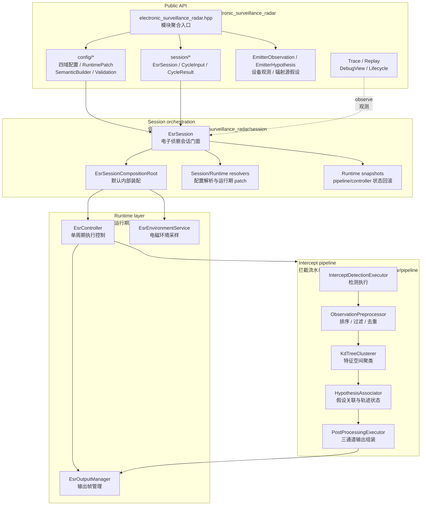
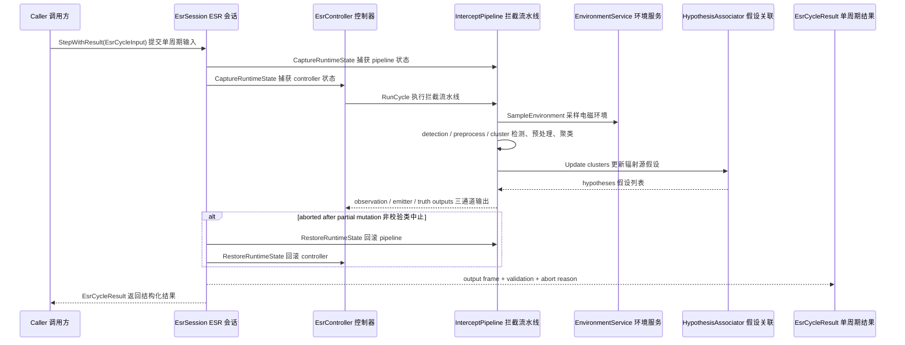
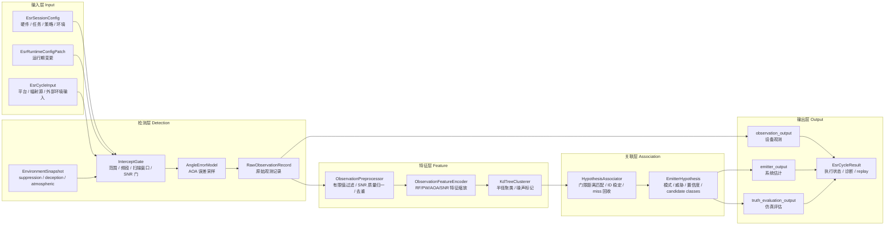
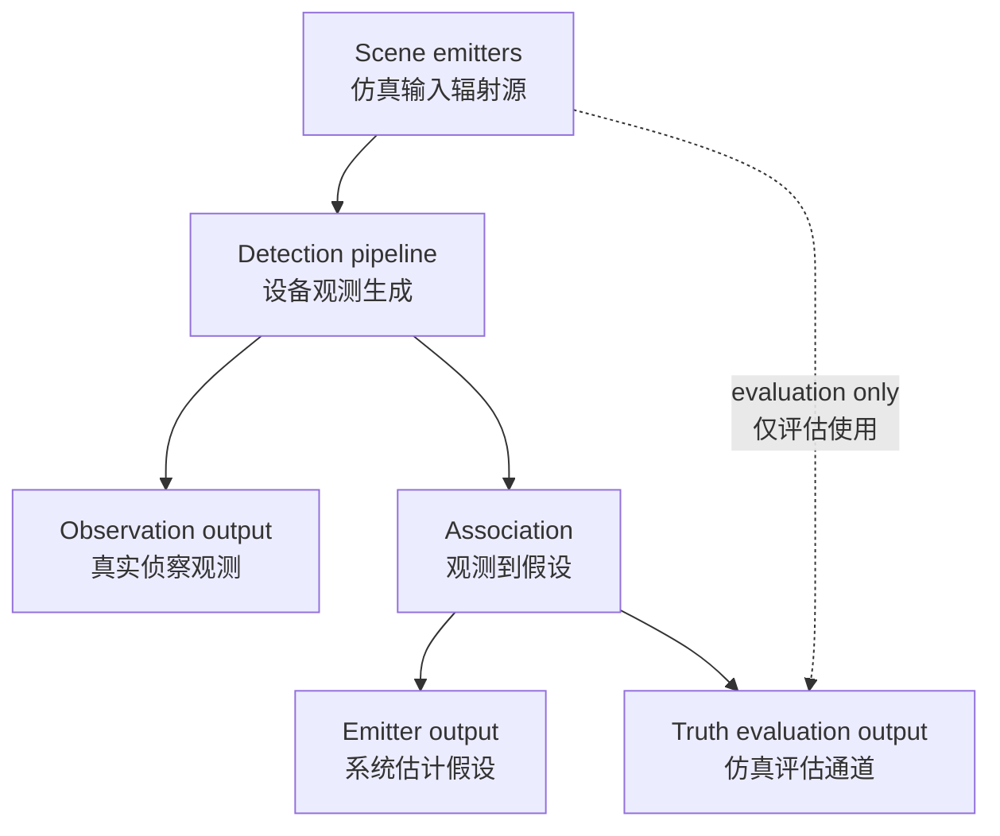

# Electronic Surveillance Radar 当前设计

Status: active
Last-reviewed: 2026-06-27
Authority: current electronic_surveillance_radar module design

本文是 `electronic_surveillance_radar` 当前设计权威。它描述 ESR 的会话门面、拦截 pipeline、观测预处理、聚类、辐射源假设关联、输出三通道和运行期回滚边界。

## 1. 架构设计说明

### 1.1 模块定位

ESR 模块模拟电子侦察接收机对辐射源的观测和估计。它的核心不是“直接输出 truth emitter”，而是把输入辐射源场景、平台姿态、接收机配置和电磁环境转化为：

- observation output：设备观测记录。
- emitter output：系统估计的辐射源假设。
- truth evaluation output：仿真评估辅助。

当前设计目标：

- 对外提供稳定 `EsrSession` 门面和四域配置。
- 内部保持可回滚 pipeline，运行期 patch 失败时不污染状态。
- 保持真实侦察输出与仿真 truth evaluation 分离。
- 不暴露用户自定义 pipeline/controller/environment service。

### 1.2 Public API 与内部实现边界

公共头位于 `include/1q/electronic_surveillance_radar/`：

| 区域 | 职责 |
|---|---|
| `electronic_surveillance_radar.hpp` | 模块聚合入口 |
| `config/` | `EsrSessionConfig`、runtime patch、semantic builder、config validation |
| `session/` | `EsrSession`、cycle input/result、scene emitter、observation/hypothesis、adapter、trace/replay、debug/lifecycle |

内部实现位于 `src/electronic_surveillance_radar/`：

| 目录 | 职责 |
|---|---|
| `config/` | 内部执行配置 | `EsrInternalExecutionConfig` |
| `environment/` | `EsrEnvironmentService` 和 suppression/deception/atmospheric 环境采样 |
| `pipeline/` | 拦截 gate、检测执行、预处理、特征编码、Kd-tree 聚类、假设关联、后处理 |
| `runtime/` | `EsrController`、`EsrOutputManager` 和执行状态管理 |
| `session/` | session 组合根、配置解析、runtime patch、输入/输出适配、trace/replay |

### 1.3 新开发者视角的分层图

### 1.4 执行时序图

### 1.5 数据流

主链路展示输入如何变成三通道输出：

输出三通道必须保持语义分离：

## 2. 本模块使用的算法

### 2.1 算法总览

| 算法/部件 | 入口 | 当前角色 | Public 默认 |
|---|---|---|---|
| 环境采样 | `EsrEnvironmentService::SampleEnvironment` | suppression/deception/atmospheric 环境快照 | session 内部 |
| 扫描窗口 | `ScanPatternGenerator` | 根据扫描模式和运行期配置生成接收窗口 | pipeline 内部 |
| 拦截门控 | `InterceptGate` | range、receiver window、dynamic range、SNR 等 joint constraints | pipeline 内部 |
| 边界搜索 | `BoundarySearchSolver` | 单调谓词边界查找 | pipeline 内部 |
| 角误差 | `AngleErrorModel` | 基于 SNR/系数/随机种子的 AOA 扰动 | pipeline 内部 |
| 干扰聚合 | `JammingAggregator` | suppression/deception 通道分离和混合技术 fallback | pipeline 内部 |
| 观测预处理 | `ObservationPreprocessor` | 排序、有限值过滤、质量归一、窗口去重 | pipeline 内部 |
| 特征编码 | `ObservationFeatureEncoder` | RF/PW/AOA/SNR 按尺度编码到特征空间 | pipeline 内部 |
| 聚类 | `KdTreeClusterer` | 半径聚类、min-points、noise/border point 处理 | pipeline 内部 |
| 假设关联 | `HypothesisAssociator` | cluster 到 track 的 gated matching、ID 稳定、miss 回收 | pipeline 内部 |
| 输出管理 | `EsrOutputManager` | 输出帧 stamp、空帧和上一帧复用 | runtime 内部 |

### 2.2 拦截检测

`InterceptDetectionExecutor` 将场景 emitter 转成 raw observation。关键步骤包括：

1. 计算平台到 emitter 的距离和接收机参考系方位/俯仰。
2. 应用天线安装偏置。
3. 计算 emitter beam overlap；历史默认 beam state 退化为全覆盖。
4. 使用自由空间路径损耗和综合接收损耗估计接收功率。
5. 结合统计检测参数、pulse count、integration mode、PFA 和 threshold scale 判断是否可检测。
6. 将 suppression/deception 影响写入观测质量或 false/confused observation 可能性。

限制：

- detection 输出是设备观测，不直接等同于 truth emitter。
- 随机量必须受 config seed 和 runtime snapshot 管理，支持回滚。

验证入口：

- `tests/unit/esr_algorithms_test.cpp`
- `tests/integration/esr_session_test.cpp`

### 2.3 观测预处理

`ObservationPreprocessor` 对 raw observation 做三件事：

- 按 timestamp 和 observation id 排序。
- 丢弃非有限值、非法 RF、非法 pulse width。
- 在时间、RF、pulse width、azimuth、elevation 窗口内去重，保留 SNR 更高或 observation id 更小的记录。

质量归一规则：

- `snr_db >= 18` → high。
- `snr_db >= 10` → medium。
- 否则 low。

验证入口：

- `tests/unit/esr_kdtree_clusterer_test.cpp`

### 2.4 特征编码与聚类

聚类前会把 observation 转为特征向量，尺度来自 `InterceptClusterConfig`：

- RF scale。
- pulse width scale。
- azimuth/elevation scale。
- SNR scale。

`KdTreeClusterer` 使用半径和 min-points 判断 cluster/noise，并处理 border point。该层目标是把同一 emitter 的多条观测归为候选簇，不直接生成最终 emitter hypothesis。

验证入口：

- `tests/unit/esr_kdtree_clusterer_test.cpp`

### 2.5 假设关联

`HypothesisAssociator` 维护内部 track state。每周期：

1. 计算 cluster centroid feature 到现有 track feature 的距离。
2. 距离小于 `gate_distance` 的 cluster-track pair 进入候选集。
3. 候选按距离、cluster index、track index 排序，固定并列距离顺序，避免边界抖动。
4. 匹配 track 使用 `confidence_alpha` blending 更新 feature、bearing、mode、threat、confidence。
5. 未匹配 cluster 创建新 hypothesis id。
6. 未命中 track 累计 missed cycles，超过阈值后回收。

模式和威胁推断：

- pulse width、PRI 和 SNR 推断 search/tracking/guidance。
- guidance 或高 SNR 提升 threat level。
- deception support 会降低 confidence，并添加 ambiguous/deception candidate class。

验证入口：

- `tests/unit/esr_hypothesis_associator_test.cpp`

### 2.6 运行期配置与回滚

`EsrSession::RunCycle()` 在执行前捕获 pipeline 和 controller runtime state。若周期未执行且 abort reason 不是 validation rejection，则恢复两者状态。

设计含义：

- validation rejection 可以保留“输入被拒绝”的状态记录。
- 中途失败不能消耗 RNG、observation id、hypothesis id 或 track state。
- runtime patch 必须原子应用；非法 patch 不应部分修改 pipeline/environment/controller。

验证入口：

- `tests/unit/esr_controller_runtime_state_test.cpp`
- `tests/unit/esr_runtime_config_resolver_test.cpp`
- `tests/integration/esr_session_test.cpp`

### 2.7 输出三通道与可观测性

ESR 输出保持三通道：

- `observation_output`：设备观测。
- `emitter_output`：系统估计 hypothesis。
- `truth_evaluation_output`：仿真评估。

名称字段和 truth identity 不进入真实输出通道。需要人读映射时通过 debug view 或 truth evaluation 关联回填。

验证入口：

- `tests/unit/esr_output_boundary_contract_test.cpp`
- `tests/unit/esr_cycle_output_builder_test.cpp`
- `tests/consumer/esr_output_observability_consumer.cpp`
- `tests/unit/esr_replay_codec_roundtrip_test.cpp`

## 3. 非目标与边界

- 不暴露用户自定义 pipeline/controller/environment service。
- 不把 truth evaluation 合并进真实 observation/hypothesis 输出。
- 不把 pipeline internal context、runtime snapshot 或 generated replay header 当成 public API。
- 不通过日志文本判断状态；调用方应使用 `EsrCycleResult`。

## 4. 设计变更规则

1. Observation/hypothesis 字段变化必须同步 replay roundtrip 测试。
2. Gate、preprocess、cluster、association 语义变化必须同步本文和对应 focused tests。
3. Runtime patch、snapshot 或 rollback 变化必须同步控制器状态测试。
4. 输出通道边界变化必须同步 output boundary contract 测试。

