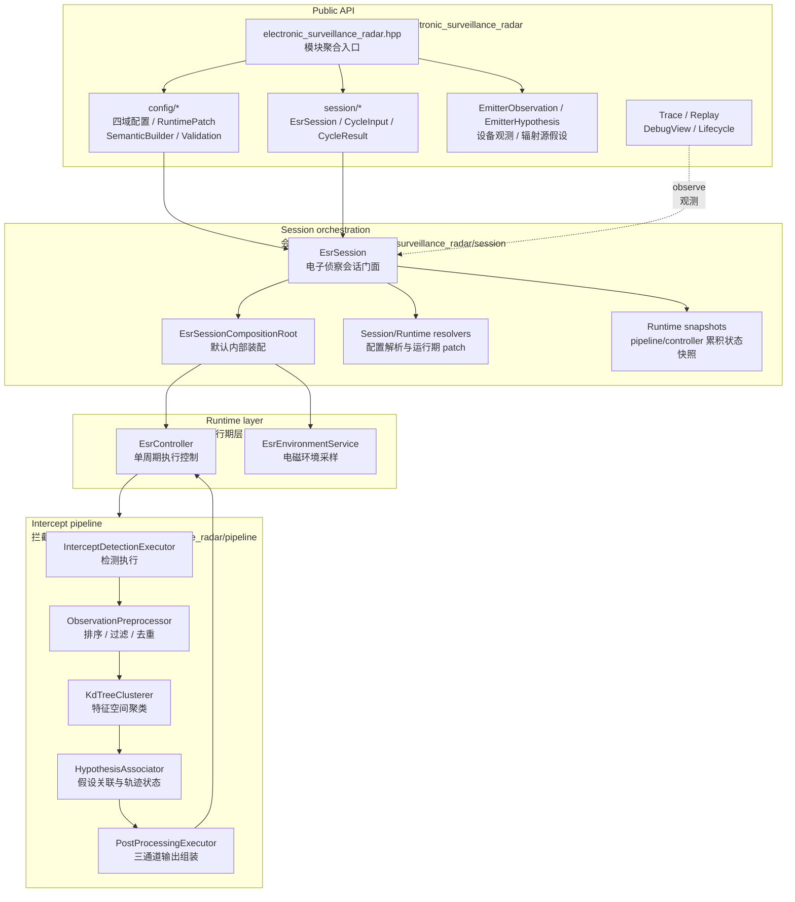
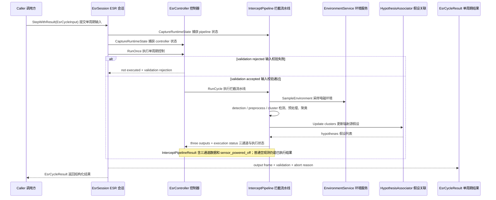
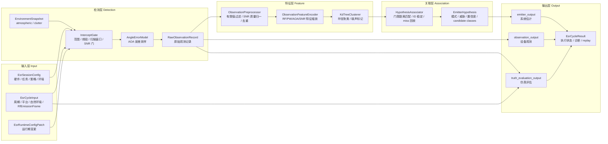
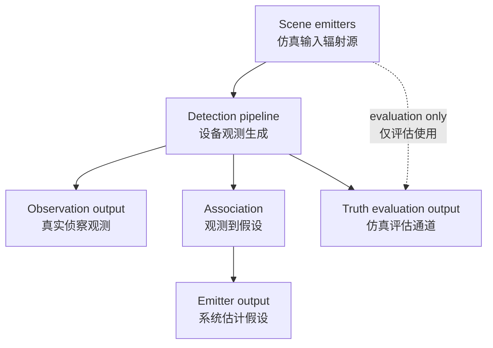
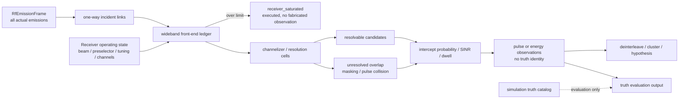

# Electronic Surveillance Radar 当前设计

Status: active
Last-reviewed: 2026-07-22
Authority: current electronic_surveillance_radar module design
RF-Interference-Architecture: frozen migration; RF v2 receiver implementation in progress

本文是 `electronic_surveillance_radar` 当前设计权威。它描述 ESR 的会话门面、拦截 pipeline、观测预处理、聚类、辐射源假设关联、输出三通道和运行期状态边界。

## 1. 架构设计说明

### 1.1 模块定位

ESR 模块模拟电子侦察接收机对辐射源的观测和估计。它的核心不是“直接输出 truth emitter”，而是把输入辐射源场景、平台姿态、接收机配置和电磁环境转化为：

- observation output：设备观测记录。
- emitter output：系统估计的辐射源假设。
- truth evaluation output：仿真评估辅助。

当前设计目标：

- 对外提供稳定 `EsrSession` 门面和四域配置。
- runtime patch 经 resolver 校验后立即提交；配置不提供 session 层回滚。
- 保持真实侦察输出与仿真 truth evaluation 分离。
- 不暴露用户自定义 pipeline/controller/environment service。

### 1.2 Public API 与内部实现边界

公共头位于 `include/1q/electronic_surveillance_radar/`：

| 区域 | 职责 |
|---|---|
| `electronic_surveillance_radar.hpp` | 模块聚合入口 |
| `config/` | `EsrSessionConfig`、runtime patch、semantic builder、config validation |
| `session/` | `EsrSession`、cycle input/result、scene emitter、observation/hypothesis、adapter、trace/replay、debug/lifecycle |

内部实现位于 `src/electronic_surveillance_radar/`：

| 目录 | 职责 |
|---|---|
| `config/` | 内部执行配置 | `EsrInternalExecutionConfig` |
| `environment/` | `EsrEnvironmentService` 和传播附加损耗/legacy 兼容环境采样 |
| `pipeline/` | 拦截 gate、检测执行、预处理、特征编码、Kd-tree 聚类、假设关联、后处理 |
| `runtime/` | `EsrController` 和执行状态、输出缓存管理 |
| `session/` | session 组合根、配置解析、runtime patch、输入/输出适配、trace/replay |

### 1.3 新开发者视角的分层图

### 1.4 执行时序图

ESR 保持单阶段 `StepWithResult` 门面。调用方在周期输入中提供一个公共 `RfEmissionFrame`；ESR 在内部
冻结接收工作状态、求解入射链路并生成本周期输出，不暴露 orchestrator、token 或 receive/complete 协议。

### 1.5 数据流

主链路展示输入如何变成三通道输出：

自然环境与 RF 发射事实分开输入。RF 发射帧是意图中立的统一入口，不再将“目标辐射源”和“干扰源”分流。

输出三通道必须保持语义分离：

### 1.6 工程 RF 接收角色与统一场景

ESR 是纯接收设备，不拥有其它模块，也不要求调用方运行额外的 RF 状态机。调用方把当前周期的实际发射
填入 `RfEmissionFrame`，ESR 用一个不可变 receiver operating state 处理帧内全部发射。一个 frame 可以
包含 AR、ECM 或其他 RF 发射；它们在接收链中没有“目标/干扰”角色差异。旧 `scene_emitters`、tagged
interference、legacy jammer 和欺骗注入仅是待删除原型，不属于最终公共合同。

所有雷达、ECM、通信式或其它 RF 发射在接收入口都是意图中立的实际发射。接收 pipeline 只依据波形、
时频占用、方向和功率决定其是否可观测、可分辨或形成干扰；“敌方”“jammer”“普通 emitter”等角色只允许
存在于独立 truth catalog、威胁数据库匹配结果或 attribution/debug，不得提前改变 raw detection gate。

同周期 active receive beam、安装姿态、预选器、tuning window、channel plan、极化、噪声参数、最大线性
输入功率和 equipment-level co-site isolation 构成唯一 receiver operating state。它由 pipeline/scheduler
拥有并进入 snapshot/replay；处理不同候选 emission 时不得逐候选重指向天线、改调谐或改前端带宽。

## 2. 本模块使用的算法

### 2.1 算法总览

| 算法/部件 | 入口 | 当前角色 | Public 默认 |
|---|---|---|---|
| 环境采样 | `EsrEnvironmentService::SampleEnvironment` | 传播附加损耗与 legacy 兼容环境快照 | session 内部 |
| 扫描窗口 | `ScanPatternGenerator` | 根据扫描模式和运行期配置生成接收窗口 | pipeline 内部 |
| 拦截门控 | `InterceptGate` | range、receiver window、dynamic range、SNR 等 joint constraints | pipeline 内部 |
| 边界搜索 | `BoundarySearchSolver` | 单调谓词边界查找 | pipeline 内部 |
| 角误差 | `AngleErrorModel` | 基于 SNR/系数/随机种子的 AOA 扰动 | pipeline 内部 |
| RF 接收与干扰影响 | 当前 `InterceptDetectionExecutor` + `TryEvaluateRfLink`；目标为 front-end/channel ledger | 当前逐 emitter 单程链路是原型；目标在固定 receiver state 下区分可分辨候选与未分辨干扰 | pipeline 内部 |
| 观测预处理 | `ObservationPreprocessor` | 排序、有限值过滤、质量归一、窗口去重 | pipeline 内部 |
| 特征编码 | `ObservationFeatureEncoder` | RF/PW/AOA/SNR 按尺度编码到特征空间 | pipeline 内部 |
| 聚类 | `KdTreeClusterer` | 半径聚类、min-points、noise/border point 处理 | pipeline 内部 |
| 假设关联 | `HypothesisAssociator` | cluster 到 track 的 gated matching、ID 稳定、miss 回收 | pipeline 内部 |
| 输出装配与缓存 | `EsrController` | stamp/move 三通道输出，维护最近有效帧、batch 和执行状态 | runtime 内部 |

### 2.2 拦截检测

冻结的 ESR 拦截链是“宽带前端 → 通道/分辨单元 → 观测提取 → 分选/假设”，而不是逐个 truth emitter
把其它全部发射当成噪声：

1. **单程入射事实。** 对冻结 scene 中每个实际 emission 计算到 ESR equipment 的单程 incident link。
   exact emission ID 只用于避免同一候选重复计入，platform/equipment ID 用于 co-site 路径；不得因同平台
   有多个发射设备而排除整个平台，也不得把 truth role 带入 detection。
2. **宽带前端账本。** 用固定 receive beam、预选器和设备损耗聚合所有进入前端的功率。该账本独立于
   当前调谐通道，用于最大线性输入、同平台泄漏和强带外 blocking 边界。超过标定上限时输出结构化
   `receiver_saturated` impairment，本周期仍是 executed，但 observation/hypothesis 不生成新记录；不使用
   未标定压缩曲线。
3. **通道化与可分辨性。** 在 tuning/channel plan 内按 time-frequency-angle resolution cell 建立候选。
   两个 emission 若能被通道、到达时间、脉冲参数或角度分辨，应分别进入 detection；只有落入同一不可分辨
   单元的部分才作为彼此 interference，或按波形产生 pulse collision/masking。有效带外发射产生零通道
   贡献，但仍可能通过已冻结的前端 blocking mask 影响饱和账本。
4. **波形化观测。** 参数化脉冲列产生 pulse/PDW 类 observation，连续/宽带噪声和扫频产生 energy-band
   observation。不能强迫所有 waveform 都伪造 PRI/pulse width；observation/hypothesis 必须携带稳定
   waveform class 和仅对该类别有效的估计量/不确定度。
5. **截获判决。** 每个候选使用通道输出 signal power、热噪声、未分辨 interference、有效驻留和脉冲
   截获机会计算 post-channel SINR/intercept probability，再按固定随机子流采样 detection。测量噪声只能在
   detection 成功后施加，不能反向改变接收波束、gate 或候选归并。
6. **接收机影响。** `interference_limited`、`masked`、`pulse_collision`、`receiver_saturated` 是设备事实，
   不表达发射方意图。原始 `is_jammed` 只能作为迁移字段；工程输出迁移后由结构化 impairment 取代。
   observation confidence 只消费一次 detection/SINR 质量，不得因 impairment 布尔量重复惩罚。
7. **分选与 hypothesis。** preprocess、cluster、deinterleave 和 associator 只能消费实际生成的 observation。
   center frequency、bandwidth、PRI、pulse width、bearing 及不确定度来自观测统计；不得从 scene emitter
   原样复制真值。truth equipment/emission ID 只进入 truth-evaluation comparator。

`spectrum_occupancy_ratio` 只能表示尚未显式建模的环境噪声/占用背景，并在 noise PSD 账本中有一次明确
换算；一旦相同 RF 源已经作为 emission 输入，不得再通过 occupancy 标量重复计入。大气物理继续只提供
单程附加传播损耗。

随机流至少按 pulse/intercept decision、measurement error、collision resolution 和 false-alarm consumer
分离；定义未采样周期和稳定 emission/observation 排序，并由 pipeline snapshot 唯一拥有。相同输入、
snapshot 和配置必须 continuation/replay 一致。

现有 altitude/occupancy、矩形 overlap、saturation 和 replay tests 只证明原型链路及字段保存；尚不能证明
固定 receiver state、宽带/通道双账本、可分辨性、波形化 observation 或无真值分选已经实现。

Replay 的 cycle-input 位姿与 public `PoseState` 同为 double 精度；schema/codec 不允许把位置、
速度或欧拉角降为 float。输出比较继续使用严格判等，输入必须先做到可精确重组，不能用比较容差
掩盖几何量化引起的观测角漂移。

### 2.3 观测预处理

`ObservationPreprocessor` 对 raw observation 做三件事：

- 按 timestamp 和 observation id 排序。
- 丢弃非有限值、非法 RF、非法 pulse width。
- 在时间、RF、pulse width、azimuth、elevation 窗口内去重，保留 SNR 更高或 observation id 更小的记录。

质量归一规则：

- `snr_db >= 18` → high。
- `snr_db >= 10` → medium。
- 否则 low。

验证入口：

- `tests/unit/electronic_surveillance_radar/esr_kdtree_clusterer_test.cpp`

### 2.4 特征编码与聚类

聚类前会把 observation 转为特征向量，尺度来自 `InterceptClusterConfig`：

- RF scale。
- pulse width scale。
- azimuth/elevation scale。
- SNR scale。

`KdTreeClusterer` 使用半径和 min-points 判断 cluster/noise，并处理 border point。该层目标是把同一 emitter 的多条观测归为候选簇，不直接生成最终 emitter hypothesis。

验证入口：

- `tests/unit/electronic_surveillance_radar/esr_kdtree_clusterer_test.cpp`

### 2.5 假设关联

`HypothesisAssociator` 维护内部 track state。每周期：

1. 计算 cluster centroid feature 到现有 track feature 的距离。
2. 有限且距离不大于 `gate_distance` 的 cluster-track pair 进入候选集。
3. 对候选图执行一对一全局分配：先最大化匹配数量，再在最大匹配中最小化总距离；总代价相同时按 cluster input index、track hypothesis id 确定性裁决。
4. 匹配 track 使用 `confidence_alpha` blending 更新 feature、bearing、mode、threat、confidence。
5. 未匹配 cluster 创建新 hypothesis id。
6. 未命中 track 累计 missed cycles，达到 `max_missed_cycles` 阈值的当周期回收。

[evidence: tests/unit/electronic_surveillance_radar/esr_hypothesis_associator_test.cpp::EsrHypothesisAssociatorTest.RecyclesTrackAfterConfiguredMissedCycles]

模式和威胁推断：

- pulse width、PRI 和 SNR 推断 search/tracking/guidance。
- guidance 或高 SNR 提升 threat level。
- deception support 会降低 confidence，并添加 ambiguous/deception candidate class。

验证入口：

- `tests/unit/electronic_surveillance_radar/esr_hypothesis_associator_test.cpp::EsrHypothesisAssociatorTest.UsesMaximumCardinalityAssignmentBeforeMinimumDistance`
- `tests/unit/electronic_surveillance_radar/esr_hypothesis_associator_test.cpp::EsrHypothesisAssociatorTest.TieDistanceAssociationUsesStableClusterOrder`
- `tests/unit/electronic_surveillance_radar/esr_hypothesis_associator_test.cpp::EsrHypothesisAssociatorTest.EqualCostPerfectMatchingUsesClusterThenHypothesisIdOrder`

### 2.6 运行期配置与状态边界

环境域以 `EsrEnvironmentScenarioConfig` 作为唯一公开 DTO 权威，环境服务直接消费该类型。当前运行路径
没有 execution-only 字段，因此不得维护同型公开 Model 类型或恒等 mapper；只有先证明存在执行态专属
字段时，才可新增内部执行配置和显式映射。
[evidence: tests/contract/electronic_surveillance_radar/esr_environment_config_contract_test.cpp::EsrEnvironmentConfigContractTest.DefaultConfigOwnsScenarioConfig]

`scan_rate_hz` 的单位不是波束更新率或角速度，而是**每秒完成的完整二维 scan pattern 循环数**。
pipeline 持有归一化扫描相位 `[0, 1)`：本周期先用 `floor(phase × pattern_size)` 选择波束，再累加
`scan_rate_hz × dt` 并回绕。因此变步长不会改变物理扫描速度；运行期只改速率会保留当前相位，改变
窗口边界、顺序或起始位置则重置到起始波束。设备关闭时扫描相位冻结。静态配置和 runtime patch 均拒绝
非有限或非正速率。
[evidence: tests/unit/electronic_surveillance_radar/esr_controller_runtime_state_test.cpp]
[evidence: tests/unit/electronic_surveillance_radar/esr_session_config_builder_test.cpp]

该标量 pipeline 每个 `Step` 只判定当前相位对应的一个波束，不在单周期内积分连续扫过的全部驻留。
因此 `scan_rate_hz × dt` 为整数时，相位会按物理周期回到同一点；需要观察完整扫描覆盖的场景必须选择
能够解析扫描相位的步长/速率组合，不能依赖 cycle index 隐式轮转波束。
[evidence: tests/integration/cross_domain/multi_model_scenario_test.cpp::MultiModelScenarioTest.AirToAirHeadOn]

RF 调谐由接收任务的 tuning/channel plan 显式描述中心频率、带宽和成功 receive/complete 周期驻留数；
空计划表示全硬件频段驻留。调谐位置只在成功接收周期推进；validation rejection、receive 输入缺少
冻结 RF scene、设备关机均冻结。当前 receiver operating state 必须随 observation output、snapshot 和 replay 记录，禁止按
world cycle index 隐式轮转。接收硬件同时拥有方向图、极化、噪声、预选器/blocking mask、设备级
co-site isolation 和最大线性输入功率。

最终工程输入是统一冻结 RF scene，不再以 `legacy / engineering` 标签改变接收物理链。迁移期 tagged
mode 只负责把 legacy adapter 与新 scene 严格隔离；混合载荷原子拒绝，适配完成后删除旧 public jammer
摘要，不把兼容标签保留为长期接收机概念。

`EmitterHypothesis` 只发布由 observation 统计得到的 waveform class、中心频率、带宽、适用的 PRI/脉宽、
bearing 及不确定度；truth platform/equipment/emission ID 只允许出现在 truth-evaluation 通道。ECM
sensor-driven adapter 只能复制这些估计字段和稳定 hypothesis ID，不能访问 scene truth catalog。
现有 adapter 测试只证明未复制 truth ID，不能证明数值估计已经去真值化。

扫描窗口有两种互斥解释方式：

- `use_explicit_scan_bounds=true` 时，四个显式起止角必须全部有限，并分别满足
  `scan_start_az_deg < scan_end_az_deg`、`scan_start_el_deg < scan_end_el_deg`；显式边界生效，中心角字段被忽略。
- `use_explicit_scan_bounds=false` 时，中心角结合硬件扫描范围推导窗口；即使显式字段为 NaN/Inf，也因未被选择而忽略。

静态 session validation 按所选模式验证，不能把非法的显式模式静默退化成中心模式。运行期 resolver
先合并 full-domain mission，再应用 leaf override，最后只对合并后的 scan policy 做一次统一校验和解析；
因此 full-domain 中的非法中间值可被合法 leaf 覆盖，但任何留在最终策略中的非法值都会原子拒绝整份 patch。
提交中心角时关闭显式模式，提交显式起止角时开启显式模式；显式提交 `enabled=false` 时忽略该 inactive
payload 中的四个边界字段，并按中心角、硬件扫描范围和天线安装角重建窗口；将被启用的中心角若非有限
则原子拒绝，不能保留旧显式执行态窗口。runtime 开启显式模式与静态 validation 一致，严格要求两轴
`start < end`，不接受 equal/swapped 输入。因此最近一次被明确选择的合法表达拥有窗口语义。
[evidence: tests/unit/electronic_surveillance_radar/esr_session_config_builder_test.cpp]
[evidence: tests/unit/electronic_surveillance_radar/esr_runtime_config_resolver_test.cpp::EsrRuntimeConfigResolverTest.EqualOrSwappedExplicitBoundsRejectWholePatch]
[evidence: tests/unit/electronic_surveillance_radar/esr_runtime_config_resolver_test.cpp::EsrRuntimeConfigResolverTest.DisableExplicitBoundsRebuildsCenterDrivenWindow]
[evidence: tests/unit/electronic_surveillance_radar/esr_runtime_config_resolver_test.cpp::EsrRuntimeConfigResolverTest.DisableExplicitBoundsIgnoresInactiveNonFinitePayload]
[evidence: tests/unit/electronic_surveillance_radar/esr_runtime_config_resolver_test.cpp::EsrRuntimeConfigResolverTest.DisableExplicitBoundsRejectsNonFiniteCenterAtomically]
[evidence: tests/unit/electronic_surveillance_radar/esr_runtime_config_resolver_test.cpp::EsrRuntimeConfigResolverTest.MissionDomainRejectsInvalidExplicitBoundsAtomically]
[evidence: tests/unit/electronic_surveillance_radar/esr_runtime_config_resolver_test.cpp::EsrRuntimeConfigResolverTest.MissionDomainRejectsInvalidCenterAtomically]
[evidence: tests/unit/electronic_surveillance_radar/esr_runtime_config_resolver_test.cpp::EsrRuntimeConfigResolverTest.LeafOverridesAreValidatedAfterInvalidMissionScanValues]

`ApplyRuntimeConfigWithResult()` 通过 `ResolveEsrRuntimeConfigPatch()` 合并 patch，并对最终被选择的 scan
policy 做原子校验。这里的“有效/无效”当前只覆盖 scan rate、显式边界或中心角；resolver 尚未承诺对
整块 mission/policy/environment 的所有领域值做统一语义校验。通过当前校验的 patch 立即写入
`resolved_config`，并同步到 pipeline/environment；被拒绝的扫描 patch 不污染现有配置。是否建立全域
runtime validation 继续登记在 `docs/common/open_questions.md`。ESR 属于 `docs/common/contract.md`
定义的立即提交类，配置单向落定，不提供 session 层回滚。

`InterceptPipeline::RunCycle()` 返回 `InterceptPipelineResult`。除 observation、emitter、truth
evaluation 三通道外，它显式区分设备关机导致的未执行状态；controller 将其传播为
`kSensorPoweredOff`，复用最近有效输出且不推进 batch。普通空观测仍是合法数据结果。

pipeline/controller 的 `CaptureRuntimeState()` / `RestoreRuntimeState()` 只描述累积运行态能力：

- pipeline 快照含 RNG、observation/hypothesis id、hypothesis associator tracks 和归一化扫描相位。
- pipeline 快照不含 config、feature scales 或环境配置。
- controller 快照含 latest output、validation issues、batch id 和最近一次执行状态。

设计含义：

- validation rejection 在进入 pipeline 前发生，`EsrCycleResult` 记录 `executed_this_cycle=false` 和 `kValidationRejected`。
- 当前唯一的 pipeline 自报非执行状态是设备关机；它不是 output-contract failure，也不触发
  运行态回滚。新增其他 pipeline failure 必须使用显式内部结果状态并定义回滚边界。
- 统一 RF scene 迁移必须先扩展 `InterceptPipelineResult` 或等价内部结果结构：非法 scene/link 是未执行的
  结构化失败并遵守接收侧回滚；`receiver_saturated` 是已执行的物理 impairment，不得复用失败状态或
  伪造 observation。两者必须进入 snapshot/replay 和 public cycle result 的明确映射。

验证入口：

- `tests/unit/electronic_surveillance_radar/esr_controller_runtime_state_test.cpp`
- `tests/unit/electronic_surveillance_radar/esr_runtime_config_resolver_test.cpp`
- `tests/integration/electronic_surveillance_radar/esr_session_test.cpp`
[evidence: tests/integration/electronic_surveillance_radar/esr_session_test.cpp::EsrSessionIntegrationTest.RuntimePatchCanDisableSensorWithoutReconstruction]

### 2.7 输出三通道与可观测性

`EsrOutputFrame` 保持三通道；`EsrCycleResult` 在输出帧之外承载 validation、executed/reused 和 abort reason，pipeline 内部结果另含 powered-off 状态：

- `observation_output`：设备观测。
- `emitter_output`：系统估计 hypothesis。
- `truth_evaluation_output`：仿真评估。

`EsrController` 是输出帧装配和最近有效帧缓存的唯一 runtime owner；它直接写入 cycle/batch header，
移动 pipeline 的三通道结果，并只在成功执行后推进 batch。模块不维护第二个 output-manager 状态或装配路径。
[evidence: tests/unit/electronic_surveillance_radar/esr_controller_runtime_state_test.cpp::EsrControllerRuntimeStateTest.SuccessfulCyclesAdvanceBatchAndRejectedCycleDoesNot]

`batch_id` 在 public `EsrOutputFrame`、controller 累积状态、FlatBuffers replay schema、codec 和 comparator
中统一为 64 位无符号值。codec 不得把它缩窄到 32 位；大于 `UINT32_MAX` 的值必须无损 roundtrip。
[evidence: tests/replay/electronic_surveillance_radar/esr_replay_codec_roundtrip_test.cpp::EsrReplayCodecRoundtripTest.CycleResultPreservesBatchIdAboveUint32Max]

名称字段和 truth identity 不进入真实输出通道。需要人读映射时通过 debug view 或 truth evaluation 关联回填。

验证入口：

- `tests/unit/electronic_surveillance_radar/esr_output_boundary_contract_test.cpp`
- `tests/unit/electronic_surveillance_radar/esr_cycle_output_builder_test.cpp`
- `tests/consumer/esr_output_observability_consumer.cpp`
- `tests/replay/electronic_surveillance_radar/esr_replay_codec_roundtrip_test.cpp`

### 2.8 专项序列验证边界

`batch_validation::electronic_surveillance_radar` 覆盖近同频辐射源角度交叉、密集辐射源静默、
ESM/RWR/HGESM 切换、显式扫描边界重定向、关机恢复和无效输入恢复。所有场景的 trace replay
失败、输出分叉或比较数量不一致都会使批量验证失败；sequence 场景另以 error 级结构化 check 验证：

- 各场景预期的非执行周期数；
- 无效输入场景的 failure marker 数；
- 无效显式边界 patch 的原子拒绝；
- 角度交叉、关机恢复和无效输入恢复三个场景的建立/恢复 hypothesis id 集合连续性。

当前 batch 不实例化 `EsrEmitterLifecycleRecorder`，也不直接断言静默源独占 `Lost` 或关闭显式边界后
无残留；这些语义不能作为 batch 已证明的硬契约。强信号下距离趋势不敏感仍只作为物理 warning。
场景 ID、结构化 check 和运行方式由 `examples/batch_validation/README.md` 维护。

## 3. 非目标与边界

- 不暴露用户自定义 pipeline/controller/environment service。
- 不把 truth evaluation 合并进真实 observation/hypothesis 输出。
- 不把 pipeline internal context、runtime snapshot 或 generated replay header 当成 public API。
- 不通过日志文本判断状态；调用方应使用 `EsrCycleResult`。

## 4. 设计变更规则

1. Observation/hypothesis 或 cycle-input 位姿字段变化必须同步精确 replay roundtrip 测试。
2. Gate、preprocess、cluster、association 语义变化必须同步本文和对应 focused tests。
3. Runtime patch、snapshot 或状态边界变化必须同步控制器状态测试。
4. 输出通道边界变化必须同步 output boundary contract 测试。
