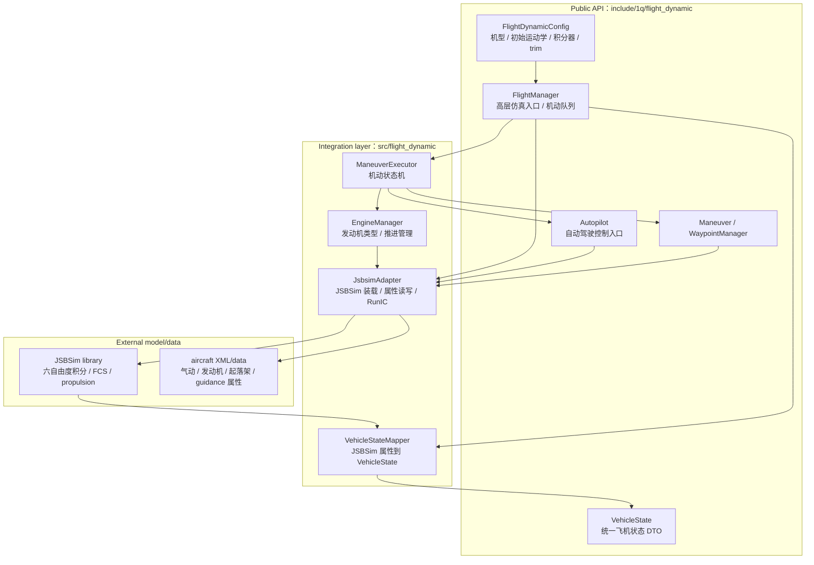

# Flight Dynamic 设计

`flight_dynamic` 不是自研飞行动力学求解器，也**不是传感器模块**——它没有 `Session`/`CycleInput`/
`CycleResult` 三层会话模型。底层六自由度积分、气动、发动机、起落架、FCS 和 aircraft XML 行为由
JSBSim 提供；本模块负责装载 JSBSim aircraft 模型、把 1Q 的初始运动学/机动指令/自动驾驶意图映射到
JSBSim 属性、步进仿真并把 JSBSim 状态映射为稳定 `VehicleState`。

模块由 `ONEQ_ENABLE_FLIGHT_DYNAMIC` 控制，默认不编译；启用后才提供其目标、测试和示例。

flight_dynamic 的心智模型是**JSBSim 适配层**：1Q 高层意图 → JSBSim 属性 → JSBSim 积分 → VehicleState。
核心使用方式是 `FlightManager` 构造、`PushManeuver` 下发机动、`Step` 步进、`GetVehicleState` 读取状态。

## 文档导航

- 模块边界、非目标、FlightManager public seam 边界、设计变更规则 → [boundaries.md](boundaries.md)
- 算法清单（JSBSim 适配/状态映射/自动驾驶 profile/航路点语义/机动执行/起飞降落/推进）、每算法的
  实现边界与反直觉点 → [algorithms.md](algorithms.md)

注：flight_dynamic 不含 data-flow.md——它的数据流就是 FlightManager 构造→Step→VehicleState，
架构图和时序图已内聚在下方。

## 架构分层

读图方式：
1. 新调用方优先看 `FlightManager` 和 `FlightDynamicConfig`。
2. `Autopilot`/`WaypointManager` 可直接取用，但仍通过 `JsbsimAdapter` 写 JSBSim 属性。
3. `JsbsimAdapter` 是 JSBSim binary 和 aircraft XML/data 的边界，不应把 JSBSim 内部行为误写成 1Q 自研算法承诺。

跨模块公共规则见 `docs/common/contract.md`（注：flight_dynamic 不参与三层输出模型与传感器周期语义）。
