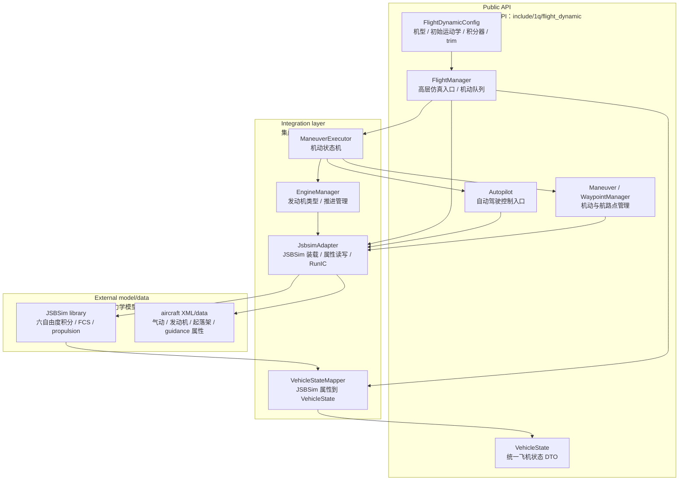
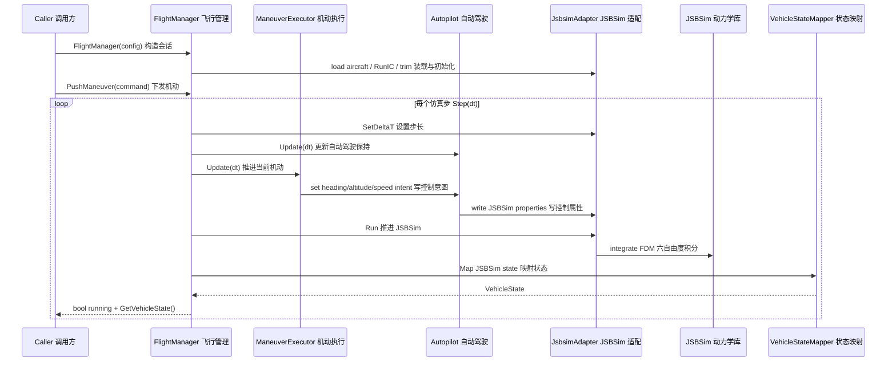
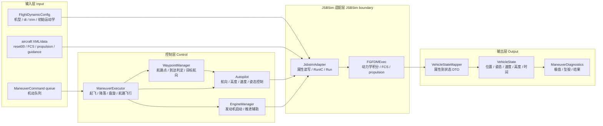
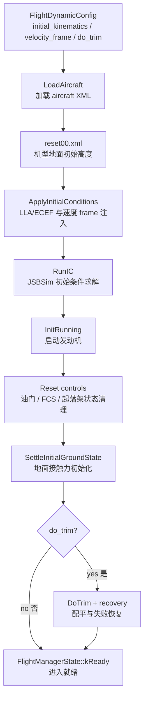
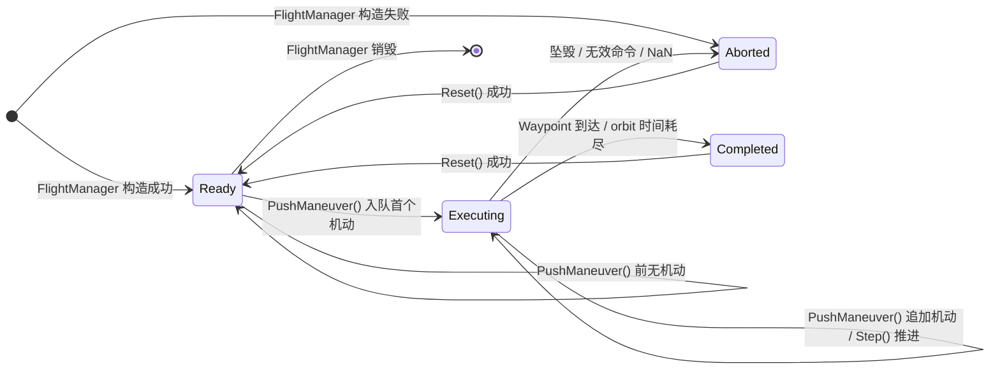

# Flight Dynamic 当前设计

Status: active
Last-reviewed: 2026-07-11
Authority: current flight_dynamic module design

本文是 `flight_dynamic` 当前设计权威。它描述 1Q 对 JSBSim 的适配、飞行状态映射、自动驾驶、航路点和机动执行边界。该模块不同于传感器模块，没有 `Session` / `CycleInput` / `CycleResult` 三层会话模型；核心使用方式是 `FlightManager` 构造、下发机动、步进仿真并读取 `VehicleState`。模块由 `ONEQ_ENABLE_FLIGHT_DYNAMIC` 控制，默认不编译；启用后才提供其目标、测试和示例。

## 1. 架构设计说明

### 1.1 模块定位

`flight_dynamic` 不是自研飞行动力学求解器。底层六自由度积分、气动、发动机、起落架、FCS 和 aircraft XML 行为由 JSBSim 提供；本模块负责：

- 装载 JSBSim aircraft 模型和 vendor XML/data。
- 把 1Q 的初始运动学、速度参考系、机动指令和自动驾驶意图映射到 JSBSim 属性。
- 在每个仿真步后把 JSBSim 属性映射为稳定 `VehicleState`。
- 提供高层机动队列、航路点管理、自动驾驶和诊断。

设计判断：

- 代码调试必须区分 JSBSim 库行为、aircraft XML/data contract、1Q 集成层、控制算法和测试阈值。
- aircraft-specific tuning 优先进入 XML `guidance/*` 属性或配置，而不是散落到通用机动逻辑。
- 已知限制应隔离为 known-limit，而不是用阈值放宽伪装为稳定能力。

### 1.2 Public API 与内部实现边界

公共头位于 `include/1q/flight_dynamic/`：

| 区域 | 职责 |
|---|---|
| `FlightManager.h` | 高层入口：构造、`PushManeuver`、`Step`、`GetVehicleState`、诊断 |
| `config/FlightDynamicConfig.h` | aircraft model、root dir、dt、trim、integrator、gravity、初始运动学 |
| `model/VehicleState.h` | 统一输出状态 DTO |
| `autopilot/Autopilot.h` | 自动驾驶低层控制入口 |
| `guidance/` | `Maneuver`、`Waypoint`、`WaypointManager` |

内部实现位于 `src/flight_dynamic/`：

| 目录 | 职责 |
|---|---|
| `adapter/` | `JsbsimAdapter`、JSBSim 属性名、RunIC/trim/engine/gear 初始化 |
| `model/` | `VehicleStateMapper`，JSBSim 属性到 1Q 状态映射 |
| `autopilot/` | `Autopilot`，速度/高度/航向/姿态控制属性写入 |
| `guidance/` | `ManeuverExecutor`、航路点、起飞、降落、盘旋、S-turn 等机动逻辑 |
| `propulsion/` | `EngineManager`，发动机类型、启动、油门/推进辅助 |

### 1.2.1 `FlightManager` 低层控制 seam

`FlightManager` 的 `GetAdapter()`、`GetAutopilot()`、`GetEngineManager()` 和 `GetWaypointManager()` 是既有 public 兼容面，不是可随意删除的内部便利函数。当前消费者证明它们承担不同职责：

- `GetAdapter()`：FD adapter 测试和已安装的起降示例直接访问 JSBSim property tree、传播状态与地面反力。
- `GetAutopilot()`：多个飞行示例和行为测试读取 aircraft control profile，并设置速度/高度保持目标。
- `GetEngineManager()` 与 `GetWaypointManager()`：分别被发动机/航路点行为测试和示例消费。

因此本版本保留四个 getter，不新增包装它们的通用控制端口，也不以传感器 `Session/Cycle` 形状重构 Flight Dynamic。若未来收窄任一 getter，必须先逐个迁移已安装示例和 consumer test，并以独立 Stage A 冻结替代 API、JSBSim 属性边界和兼容期限。\
[evidence: `FlightManager.h:GetAdapter/GetAutopilot/GetEngineManager/GetWaypointManager` — 当前 public seam;\
 `fd_adapter_test.cpp` — adapter、engine、waypoint 和 autopilot consumer;\
 `examples/flight_dynamic/takeoff_land_csv.cpp` — direct JSBSim property/ground-reaction consumer;\
 `examples/flight_dynamic/racetrack_quality_csv.cpp` — autopilot target-setting consumer]

### 1.3 新开发者视角的分层图

阅读方式：

- 新调用方优先看 `FlightManager` 和 `FlightDynamicConfig`。
- `Autopilot` / `WaypointManager` 可直接取用，但仍通过 `JsbsimAdapter` 写 JSBSim 属性。
- `JsbsimAdapter` 是 JSBSim binary 和 aircraft XML/data 的边界，不应把 JSBSim 内部行为误写成 1Q 自研算法承诺。

### 1.4 执行时序图

### 1.5 数据流

主链路展示高层机动如何变成 JSBSim 属性，再回到 1Q 状态：

初始化数据流单独列出，因为多数历史问题发生在 RunIC、trim、gear、engine 和初始速度 frame：

## 2. 本模块使用的算法

### 2.1 算法总览

| 算法/部件 | 入口 | 当前角色 | Public 默认 |
|---|---|---|---|
| JSBSim 适配 | `JsbsimAdapter` | 加载 aircraft、设置属性、RunIC、trim、Run | `FlightManager` 内部 |
| 初始条件映射 | `VehicleStateMapper::ApplyInitialConditions` | 注入 LLA/ECEF 位置和 body/ECEF 速度 | 初始化路径 |
| 状态映射 | `VehicleStateMapper::Map` | JSBSim propagate/accelerations/FDM 到 `VehicleState` | 输出状态 |
| 自动驾驶 profile | `AircraftControlProfile` / XML `guidance/*` | 根据机型物理量推导速度/俯仰/滚转/油门边界，并允许 XML 覆盖 | autopilot 内部 |
| 自动驾驶控制 | `Autopilot` | 航向、高度、速度、姿态保持和属性写入 | public 低层入口 |
| 航路点管理 | `WaypointManager` | active waypoint、距离、航向、到达/越过判定 | public guidance |
| 机动执行 | `ManeuverExecutor` | 起飞、降落、盘旋、航路、S-turn、racetrack、figure-8 等机动状态机 | public guidance |
| 推进管理 | `EngineManager` | 发动机类型、启动、油门/推进辅助 | 内部 |
| 诊断 | `ManeuverDiagnostics` | 最低高度/速度、最大姿态、坠毁和结果分类 | public 查询 |

### 2.2 JSBSim 初始化与适配

`JsbsimAdapter` 是最关键边界。它负责：

1. 创建 `FGFDMExec`。
2. 设置仿真步长和输出路径。
3. 加载 aircraft model。
4. 如果存在 `reset00.xml`，读取 aircraft 自带地面初始高度，避免机体参考点与起落架接地点不匹配。
5. 配置积分器和 gravity model。
6. 按 `FlightDynamicConfig::initial_kinematics` 和 `InitialVelocityFrame` 注入初始条件。
7. 执行 `RunIC()`。
8. 启动发动机、重置油门/FCS 状态、处理起落架。
9. 地面起始时执行 `SettleInitialGroundState()`，让接触力先收敛。
10. 可选执行 `DoTrim()`；失败时重置 FCS 内部状态并重新 RunIC。

设计限制：

- `InitialVelocityFrame::kBody` 与 `kEcef` 是不同契约，不得在测试中混用。
- 机型地面高度优先尊重 reset XML；当配置 altitude 为 0 时，状态映射不应覆盖该 aircraft-specific 地面值。
- JSBSim FCS 内部状态可能不完全体现在 property tree，trim 失败恢复必须处理 FCS component 内部状态。

验证入口：

- `tests/unit/flight_dynamic/fd_adapter_test.cpp`
- `tests/unit/flight_dynamic/fd_bare_aircraft_baseline_test.cpp`
- `tests/unit/flight_dynamic/fd_aircraft_probe_test.cpp`
- `tests/unit/flight_dynamic/fd_robustness_test.cpp`

### 2.3 状态映射

`VehicleStateMapper` 把 JSBSim propagate、accelerations 和 FDMExec 状态映射为 `VehicleState`。这是 public 输出状态的唯一稳定入口。

状态映射要保持两个边界：

- 不把 JSBSim 属性名直接泄露给调用方。
- 不在状态映射层修正控制问题；控制应回到 autopilot、maneuver 或 XML/profile。

### 2.4 自动驾驶 profile 与控制律

`Autopilot` 的核心是把高层目标转成 JSBSim 控制属性。控制 profile 由 aircraft 物理量和 XML override 共同决定：

- 速度 envelope 从 clean stall speed、wing loading、发动机数量、FBW/roll-rate 能力等推导。
- cruise speed 使用 wing loading 连续函数，避免旧式粗分类。
- safety-critical 参数仍按机型类别离散设置，例如 stall margin、roll limit、pitch command、minimum throttle。
- XML `guidance/*` 属性可覆盖 ref/cruise/min/max speed、pitch/roll limit、landing/takeoff tuning 等。

设计边界：

- profile 推导是 fallback；aircraft-specific tuning 应进入 XML `guidance/*`。
- 自动驾驶写 JSBSim 属性，不直接修改 `VehicleState`。
- 速度/高度/姿态控制失败必须区分 profile 不合适、aircraft XML 模型限制、JSBSim 行为和测试目标不合理。

验证入口：

- `tests/unit/flight_dynamic/fd_aircraft_maneuver_test.cpp`
- `tests/unit/flight_dynamic/fd_orbit_quality_test.cpp`
- `tests/unit/flight_dynamic/fd_robustness_test.cpp`

### 2.5 航路点到达语义

`WaypointManager` 维护 active waypoint 和 leg start。到达判定分两层：

- `IsAtTarget()`：距离小于 threshold 或 waypoint radius。
- `IsAtOrPastTarget()`：已经进入 capture radius，或越过目标法平面且横向偏差在 corridor 内。

`HasPassedActiveWaypoint()` 使用 leg start 到 target 的局部平面投影：

- 沿航段方向超过目标点表示已经越过。
- 横向偏差超过 `max(3000m, radius * 3)` 时，不允许仅凭法平面穿越判定到达，避免大转弯中提前切航点。

设计边界：

- waypoint “到达”不是单一距离阈值。
- 大转弯、过冲、横向偏差和 capture radius 必须分开讨论。

验证入口：

- `tests/unit/flight_dynamic/fd_aircraft_maneuver_test.cpp`
- `tests/unit/flight_dynamic/fd_orbit_quality_test.cpp`

### 2.6 机动执行

`FlightManager::PushManeuver()` 将 `ManeuverCommand` 入队。`ExecuteNextManeuver()` 根据 `ManeuverType` 分发到 `ManeuverExecutor`：

| 机动 | 核心输入 | 当前处理 |
|---|---|---|
| FlyToWaypoint | target waypoint、heading/altitude tolerance | 航路点管理 + 自动驾驶目标 |
| Orbit | center、radius、duration | 切向 carrot/intercept heading |
| SetHeading / SetAltitude | target heading/altitude | 自动驾驶保持 |
| SetPitch / SetRoll | pitch/roll command | 姿态控制 |
| Takeoff | target altitude、heading、speed | 发动机启动、油门 ramp、rotation、爬升 |
| Land | runway waypoint、approach speed | pattern、进近、flare、接地/滑跑 |
| Racetrack / Figure8 / STurn | 重载字段参数 | 复合路径生成与持续时间/圈数控制 |

`ManeuverCommand` 字段语义按 `type` 重载，这是现状设计。维护时必须以 `FlightManager.h` 注释和 `ExecuteNextManeuver()` dispatch 为准。

状态含义：`kIdle` 仅是成员默认值，构造成功或 `Reset()` 成功后进入 `kReady`；`kExecuting` 每帧推进当前机动；`kCompleted` 表示队列已耗尽；`kAborted` 表示构造、执行或外部 `Abort()` 中止。`PushManeuver()` 总会追加命令，只有在 `kReady` 时立即启动执行；执行中追加的命令在当前机动完成后继续执行。`kCompleted` 和 `kAborted` 的 `Step()` 都返回 `false`，必须通过 `Reset()` 重建组件并回到 `kReady`。

### 2.7 起飞与降落

起飞逻辑按发动机类型设置 idle、static runup、throttle ramp 和 rotation。turboprop/turbine/piston 的启动和油门响应不同，不能用一个常数覆盖。

降落逻辑包括：

- 高空/高速阶段的 orbit 或减速策略。
- pattern capture 和 final approach。
- flaps、throttle cap、sink rate、flight path angle。
- flare、bounce recovery、float recovery。
- touchdown 和 rollout 完成条件。

大量阈值可以被 XML `guidance/*` 覆盖。通用逻辑只表达阶段机理，aircraft-specific 数值应进入 XML。

### 2.8 推进管理

`EngineManager` 和 adapter 的 propulsion helpers 管理发动机启动、油门、prop advance、刹车和起落架状态。JSBSim 不同发动机模型对 throttle/prop advance/InitRunning 的响应差异较大，因此推进问题不能简单归为 autopilot 控制问题。

## 3. 非目标与边界

- 不把 JSBSim 库和 aircraft XML 的行为包装成 1Q 自己的物理模型承诺。
- 不通过放宽阈值、扩大 skip 或改弱测试条件来掩盖模型/集成问题。
- 不在通用 autopilot/maneuver 代码中硬编码 aircraft-specific 特例。
- 不把 RunIC/trim/gear/engine 初始化问题归入 waypoint 或 maneuver 算法问题。

## 4. 设计变更规则

1. JSBSim 属性、RunIC、trim、initial velocity frame 或状态映射变化必须同步本文。
2. Autopilot profile、XML `guidance/*` override 或机动控制律变化必须同步本文。
3. Waypoint 到达语义变化必须明确说明 capture radius、法平面穿越和 cross-track corridor 的影响。
4. 已知限制应进入 dedicated test label 或 history 摘要，不得改变稳定测试含义。
5. 验证应区分标签为 `unit;flight_dynamic` 的稳定测试与 `known_limit;flight_dynamic`；known-limit 不得替代稳定能力承诺。
