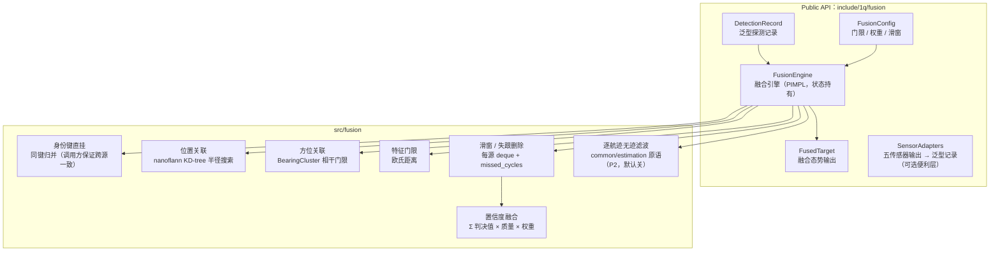

# Fusion 设计

`fusion` 是**目标域估计层算法面**（contract.md §目标处理分层契约）：多源关联 + 置信度
融合 + 逐航迹无迹滤波（2026-08-17 P2 起，`enable_track_filtering` 默认关闭）。它把异构
探测记录（泛型：位置/方位/特征向量/判决值/质量/库内身份键/可选量测原点与噪声）聚合为
融合目标态势（各源探测状态、融合置信度、航迹生命周期、可选运动学估计含协方差）。

心智模型：**探测 → 航迹 → 估计**。每周期把一批探测记录交给 `FusionEngine::Update`，
取回当前全部航迹的融合态势；引擎保持增量航迹状态、滑窗与逐航迹滤波器，算法不感知
具体传感器类型。库提供官方适配器 `fusion/SensorAdapters.h`（五传感器输出——AR 轨迹帧 /
ESR 假设 / EOS 探测 / SBIRS 探测 / RIR 特征量测帧 → 泛型探测记录，可选便利层），
业务层也可自行适配。

## 关键定位

- **关联键策略冻结**（`docs/review/Behavior.md` §4.1）：无外部身份通道，纯库内身份键
  + 特征相似度门限 + 空间门限，守去真值化纪律。
- 空间门限分层：带位置记录 → nanoflann KD-tree 半径搜索（先例：ESR
  `KdTreeClusterer` 内部 nanoflann 用法）；仅方位记录 → `src/common/geometry/
  BearingCluster.h` 方位相干门限。
- 置信度 = Σ 判决值(0/1) × 质量归一化 × 权重（滑窗内**精确求和、不归一化**，随证据
  单调累积——冻结公式，见 [algorithms.md](algorithms.md) 反直觉点）。
- **估计层定位**（P2 起）：逐航迹 6 维 ECEF CV 无迹滤波，滤波原语单源
  `src/common/estimation`（契约规则 4）；产品必须携带协方差（契约规则 6）——角度-only
  弱可观测如实体现在距离方差中。
- 纯算法、无 Session 三元组、无构建门、不引入新依赖（仅 nanoflann，已在依赖清单）。

## 文档导航

- 模块边界、非目标、关联键与 SAR 输入约束、设计变更规则 → [boundaries.md](boundaries.md)
- 算法清单（关联分层、置信度融合、滑窗与失跟）、实现边界与反直觉点 → [algorithms.md](algorithms.md)

注：fusion 不含 data-flow.md——它是状态机式算法面（每周期 `Update(detections, cycle) →
targets`），没有数据流管线，架构图内聚在下方。

## 架构分层

读图方式：
1. 新调用方只依赖 `FusionEngine` 与三个公共值类型（聚合入口 `fusion.hpp`）；
   `SensorAdapters` 不入聚合头，需要适配时按需 include。
2. 关联是**分层**的：身份键优先，其次空间（位置/方位），特征门限作为最终约束。
3. 航迹状态、滑窗与合成键管理在 `src/` 内部，PIMPL 隔离，公共头不暴露 nanoflann。

跨模块公共规则见 `docs/common/contract.md`（fusion 不参与三层输出模型与传感器周期语义）。
