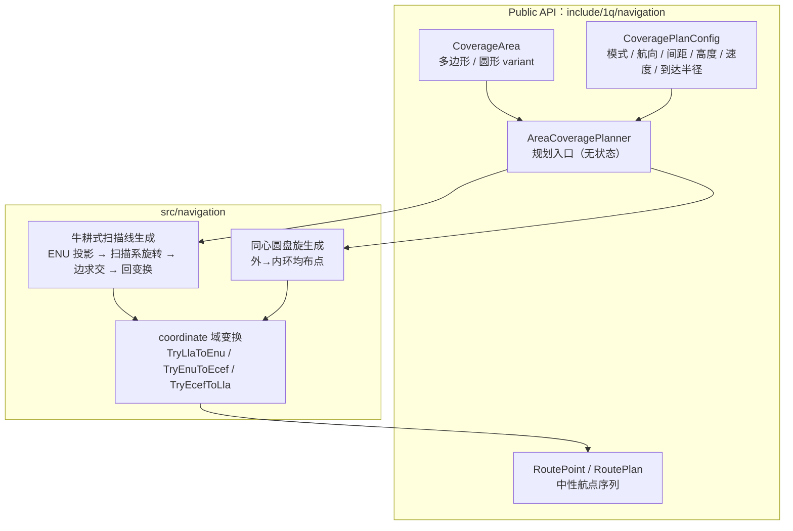

# Navigation 设计

`navigation` 是**区域覆盖路径规划算法面**（行为组件层的两个跨业务可复用算法面之一，
决策记录见 `docs/review/Bahavior.md` §3）。它把覆盖区域（多边形/圆形 LLA）与覆盖参数
（扫描航向/间距/高度/速度/模式）转换为**中性航点序列**，不绑定任何执行模块。

心智模型：**区域 → 航路**。调用方传入已解析的区域数据，取回按访问顺序排列的
`RoutePoint` 序列；相邻航点间以直线航段连接，由业务层适配到
`flight_dynamic::Waypoint`（弧度制）或消费方自有航迹实现。

## 关键定位

- **不绑定 flight_dynamic**（冻结决策，证据：`cmake/project/ProjectOptions.cmake:76`
  `ONEQ_ENABLE_FLIGHT_DYNAMIC` 默认 OFF；消费方可能使用自有机动实现）。
- 输出为自有中性类型 `RoutePoint`（度制 LLA + 速度 + 到达半径），单位语义对齐
  `oneq::coordinate` 域惯例。
- 纯算法、无 Session 三元组、无构建门、不引入新依赖（仅 Eigen，已在依赖清单）。

## 文档导航

- 模块边界、非目标、单位契约与设计变更规则 → [boundaries.md](boundaries.md)
- 算法清单（多边形牛耕式扫描、圆形单环/同心圆盘旋）、实现边界与反直觉点 → [algorithms.md](algorithms.md)

注：navigation 不含 data-flow.md——它是无状态纯函数算法面（`Plan(area, config) → plan`），
没有数据流管线，架构图内聚在下方。

## 架构分层

读图方式：
1. 新调用方只依赖 `AreaCoveragePlanner` 与三个公共值类型（聚合入口 `navigation.hpp`）。
2. 平面几何（ENU 投影、扫描系旋转、边求交）在 `src/` 内部完成，不对外暴露。
3. 大地坐标变换全部走 `1q/coordinate/` 公共变换，不引入新的测地实现。

跨模块公共规则见 `docs/common/contract.md`（navigation 不参与三层输出模型与传感器周期语义）。
