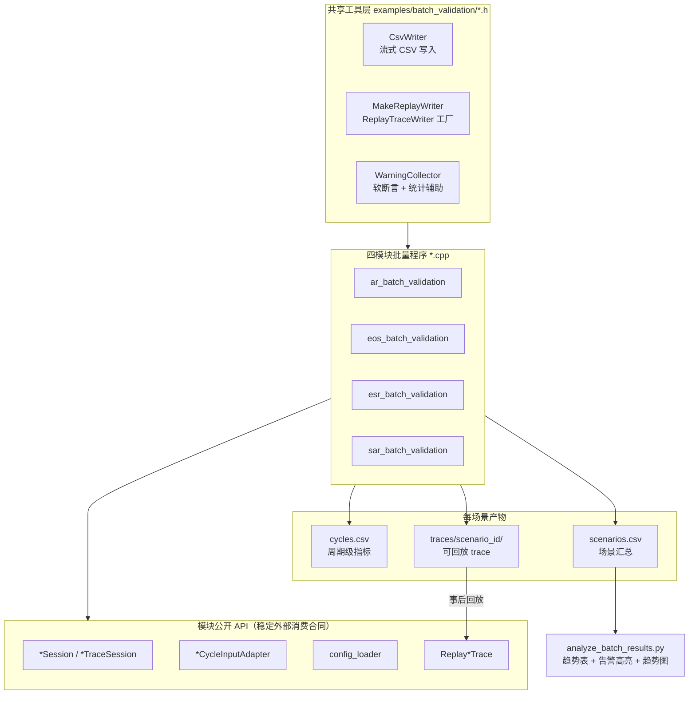
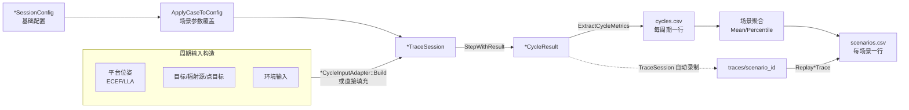

# 批量场景验证框架 当前设计

Status: active
Last-reviewed: 2026-07-02
Authority: examples/batch_validation engineering practice

本框架是 `examples/` 层的工程实践产物，不属于任何业务模块的设计权威。跨模块契约与文档治理规则见 `docs/common/contract.md`；各模块内部行为以其 `design.md` 为准。本框架只通过公开 Session / Adapter / Replay 接口消费模块能力，不定义新的模块行为。

## 1. 架构设计说明

### 1.1 定位

批量场景验证框架（`examples/batch_validation/`）通过**多场景参数扫描**证明 AR / EOS / ESR / SAR 四个传感器模块在不同物理条件下的泛用性与正确性。每个模块一个独立可执行程序，对一组场景参数表逐场景运行仿真，产出：

- **周期级 + 场景汇总级 CSV 指标**，供离线趋势分析。
- **可回放 trace**，每个场景一个目录，事后可由 `ReplayXxxTrace` 做确定性回归（分叉检测）。
- **物理合理性软断言**：对关键趋势（距离↑→检出↓、带宽↑→分辨率↑等）做检查，违反记 `kWarning` 不中断。

框架是纯 examples 层：只使用对外公开接口与各模块 `config_loader`，不修改任何 `include/` 或 `src/`。

### 1.2 Public API 与内部实现边界

框架消费的公开能力（均已在 `docs/common/contract.md` 的 Public API 边界中确认为稳定外部消费合同）：

| 能力 | 入口 | 用途 |
| --- | --- | --- |
| 会话门面 | `*Session::Create` / `StepWithResult` | 驱动单周期执行 |
| 坐标适配（AR/EOS/ESR） | `*CycleInputAdapter::Build` | 外部 ECEF/LLA → 模块内部坐标 |
| 配置加载 | `examples/<module>/config_loader.h` | JSON → `*SessionConfig` |
| trace 录制 | `*TraceSession(config, options)` | 包装 Session，自动录制可回放事件 |
| 回放回归 | `Replay*Trace(trace_dir)` | 重放并逐字段比对输出（分叉检测） |
| 运行期配置 | `*RuntimeConfigPatch` | （预留，当前未在批量程序中注入） |

框架**不消费**任何内部 seam：pipeline/controller/context/algorithm executor/trace codec 等均不触及。SAR 因内部存 LLA、外部也给 LLA，直接构造 `SarCycleInput`，不经 `SarCycleInputAdapter`（该 Adapter 仅在外部脉冲输入时转换脉冲坐标，平台/目标无需转换——见 `examples/sar/integration_demo.cpp` 头部注释）。

### 1.3 分层组件图



读图规则：实线为编译期/运行期依赖；虚线表示事后回放。框架与模块之间唯一的接触面是 Public API 层——任何模块内部实现变更只要保持公开 API 与输出语义稳定，框架就无需改动。

### 1.4 单场景执行时序

```mermaid
sequenceDiagram
  participant Main as 批量程序 main
  participant Loop as 场景循环
  participant TS as *TraceSession
  participant W as ReplayTraceWriter
  participant R as Replay*Trace

  Main->>Loop: 遍历场景参数表
  loop 每个场景
    Loop->>W: MakeReplayWriter(trace_dir, module, trace_id, scenario_id)
    Loop->>TS: TraceSession(config, options{replay_writer})
    Note over TS: 构造时自动写 session_config
    loop N 周期（SAR 为 1 周期）
      Loop->>TS: StepWithResult(input)
      Note over TS: 自动写 cycle_input + cycle_output
      TS-->>Loop: *CycleResult
      Loop->>Loop: 提取指标 → 写 cycles.csv
    end
    Loop->>W: Flush()
    Note over W: trace 落盘完整
    Loop->>R: Replay*Trace(trace_dir)
    Note over R: 重建 Session, 重放, 逐字段比对
    R-->>Loop: *ReplaySessionResult{ok, divergence_found}
    Loop->>Loop: 聚合 + 软断言 → 写 scenarios.csv
  end
```

### 1.5 数据流（CSV 双层 + trace）



周期级 CSV 按 `executed_this_cycle` 门控统计（未执行周期的默认零值不计入稳态窗口）；场景汇总级 CSV 每行含场景参数、聚合指标、`replay_ok`、软断言告警计数与文本。

## 2. 实现说明

### 2.1 录制可回放 trace 的正确姿势

回放要求传入 `ReplayTraceWriter`（不是 `TraceSink`）。这是两套并行的记录机制：

- `TraceSink`（`FlatbufferFileTraceSink`）产出 `uint32_le length + FlexBuffers map` 帧的单个二进制文件，是调试用流，**不能**被 `ReplayXxxTrace` 回放。
- `ReplayTraceWriter` 产出 `manifest.json + events/*.events.jsonl + indexes/ + crash/` 的结构化目录，才是可回放格式。

`*TraceSession` 内部同时往两者写：传了 `sink` 写 sink，传了 `replay_writer` 写可回放事件。批量程序只传 `replay_writer`（无需 `sink`）。

`*TraceSession` 全自动录制，无需手动 `WriteEvent`：

- 构造时（`trace_config_on_construct=true`）写 `session_config`。
- 每次 `StepWithResult` 写 `cycle_input` + `cycle_output`。
- `ApplyRuntimeConfig` 时写 `runtime_config_patch`。
- 校验失败时写 `failure_marker`。

关键约束：

- `manifest.module` 必须精确等于模块字符串常量（`batch_replay.h::ModuleName`：`airborne_radar` / `electro_optical_sensor` / `electronic_surveillance_radar` / `sar`），否则回放兼容性检查失败。
- 回放前必须 `replay_writer->Flush()`，且建议 writer 先析构（文件句柄释放）。
- 回放由各模块 `ReplayXxxTrace(trace_dir)` 完成：重建 Session、重放每个 cycle_input、重新执行 `StepWithResult`，并与 trace 中记录的 cycle_output 逐字段比较（`divergence_found`）。

录制 scope 模式参照 `tests/unit/eos_replay_session_test.cpp::ReplayEosTraceRoundtrip`：把 TraceSession + 所有 Step 包在 `{}` 内，结尾 `Flush()`，writer 析构后再回放。

### 2.2 软断言策略与退出码

批量验证采用"数据采集 + 物理合理性软断言"：对关键物理趋势做检查，违反时记录 `kWarning`（不中断），既证明泛用性又能自动捕捉异常。三类诊断级别（与 SAR 诊断层语义对齐）：

| 级别 | 触发 | 退出码影响 |
| --- | --- | --- |
| `kInfo` | 信息性记录 | 无 |
| `kWarning` | 物理趋势违反；**回放分叉** | 不影响（程序继续） |
| `kError` | 配置加载失败、`Adapter::Build` 失败、无周期执行 | 程序返回 2 |

**回放分叉记为 warning（非 error）**：这是模块在边界场景下的确定性属性（如 ESR 近距离高功率时观测时间戳字段在逐字段严格比较下漂移），应被记录与高亮，但不阻塞批量运行。只有 `kError` 才使程序返回非零。

各模块软断言：

| 模块 | 软断言（违反记 kWarning） |
| --- | --- |
| AR | 近距离 + 高 RCS 应有确认轨迹；`match_rate` ∈ [0,1]；距离↑ 时确认数单调↓ |
| EOS | 高对比度检出率 ≥ 低对比度；夜间可见光 SNR 显著低于红外；融合 SNR 有限 |
| ESR | 假设置信度 / 真值匹配率 ∈ [0,1]；占用率↑ 时受扰观测↑ |
| SAR | 聚焦阶段达 `kL1RdaImage`；图像质量指标有效；带宽↑ → 距离分辨率↓ |

### 2.3 物理链路启用与场景参数

为使距离 / RCS / 带宽等参数真正驱动输出（而非被简化路径掩盖），批量程序按模块调整 config：

- **AR**：示例配置默认启用 `hardware.enable_physics_detection` + `rcs_physics.enable_physical_rcs`，批量程序启动时仍显式确认这两个物理开关处于开启状态，确保距离/RCS 趋势不会被简化检出路径掩盖。
- **EOS**：物理链路本身基于辐射度学，无需开关；距离通过几何影响 SNR，目标用 LLA 经度偏移（相对传感器足印中心）落在探测俯仰角范围内。平台 LLA→ECEF 用项目精确转换 `oneq::coordinate::TryLlaToEcef`（手写近似会导致几何失真、目标落出视场）。
- **ESR**：辐射源功率取与 `examples/electronic_warfare/integration_demo.cpp` 一致的 50 MW 量级，确保 10–100km 可被截获（1 kW 在远距离无法达到接收机灵敏度）。
- **SAR**：以 `examples/configs/sar.json` 与 `examples/sar/integration_demo.cpp` 共享的验证参数集为基准（sample_rate=1MHz、pulse_width=20us、PRF=100Hz、slant=100km），仅在保持采样窗口与孔径时间自洽的前提下扫描带宽 / 斜距 / 方位脉冲数。采样窗口约束为 `ceil(pulse_width × sample_rate) ≤ range_sample_count`。

### 2.4 验证基线（已观测的量化结果）

以下为 `llvm-ninja-release-local` 构建下、92 个场景（AR 52 + EOS 14 + ESR 16 + SAR 10）的实际运行结果，作为框架正确性的证据基线：

- **SAR 带宽 → 距离分辨率**（slant=100km, pulses=33，`sar_bwsweep` 组）：带宽 0.2 / 0.5 / 1.0 / 2.0 MHz 对应 `range_resolution_3db_m` = 749.5 / 299.8 / 149.9 / 149.9 m。带宽↑ → 分辨率数值↓，并在 sample_rate=1MHz 奈奎斯特上限处饱和（1.0 与 2.0 MHz 同为 149.9m）。物理趋势正确。
- **EOS 对比度 → 检出**（offset=0.010, day）：low / med / high 对应 `fused_snr_db` = -11.8 / -2.8 / +21.8 dB，`detection_rate` = 0 / 0 / 1.0。对比度↑ → SNR↑ → 检出率↑。
- **EOS 光照**（offset=0.010, high）：day / twilight / night 的 `visible_snr` 递减，夜间 `visible_snr ≈ 0` 远低于 `infrared_snr`。可见光依赖太阳辐照的物理成立。
- **AR 极限**（rcs=0.01 m², n=3）：8 / 25 / 60 / 120 km 中，仅 120km 出现 `confirmed=0`（漏检），近距离全检出。距离衰减在物理极限处可见。
- **ESR 距离稳定性**（fc=8GHz, occ=0.1）：10–100km 的 `truth_match_rate` 一致（50MW 辐射源在全程远超截获门限）——反映强信号下的稳定行为。

回放确定性：92 个场景中 89 个 `replay_ok=true`、无分叉；ESR 10km 近距离 3 个场景出现回放分叉（已记 warning，见 §3）。

## 3. 非目标与边界

1. **不修改任何 `include/` 或 `src/`**。框架是纯 examples 层；若需新公开能力，走模块自身的 evidence-first 流程，不在本框架内扩大 public API。
2. **不取代 GTest 矩阵测试**。`tests/unit/*_matrix_test.cpp` 是 CI 硬性回归门控（`EXPECT_*` 失败即红）；本框架是软断言的数据采集与趋势分析工具，两者互补，不互替。
3. **不为 SAR 增加 ECEF 外部输出**。SAR 产品是聚焦图像（复数矩阵），模块本就不提供 ECEF 坐标转换；示例包装层不再暴露恒 false 的占位输出接口，框架也不试图弥补。
4. **不把 SAR 复数像素写入 CSV**。`focused_image.real_values/imaginary_values` 不入 CSV（单图像可达百万像素）；只记录图像质量摘要（SNR / 主瓣宽 / 分辨率 / 熵 / 对比度）。需原始像素时手动回放对应 trace。
5. **回放分叉不阻塞批量运行**。模块在边界场景（如 ESR 近距离高功率）的确定性漂移属模块属性，记为 warning 高亮，不视为框架失败，也不修改模块输出语义以求"通过"。
6. **不引入新依赖**。CSV 写入仿 `examples/flight_dynamic/orbit_quality_csv.cpp` 的 `fprintf` 风格；Python 分析脚本仅用标准库 + 可选 matplotlib（无则跳过绘图），不引入 pandas/numpy。

### 3.1 已知发现（模块属性，非框架缺陷）

- **ESR 近距离（10km）回放分叉**：高功率辐射源在近距离时，重放逐字段严格比较会因观测时间戳等字段产生确定性漂移。这是模块确定性属性，已记为 warning。要在 replay 层消除需模块侧改进（如时间戳确定化），超出本框架范围。
- **ESR 距离/占用率不敏感**：50MW 辐射源在 10–100km 内均远超 ESR 截获门限，`truth_match_rate` 在所有距离下一致。要观察距离衰减需进一步降低辐射功率，超出本框架"配置面"的合理范围。
- **SAR 高带宽饱和**：带宽超过 sample_rate/2（奈奎斯特）后距离分辨率不再提升，属采样定理约束，非缺陷。

## 4. 设计变更规则

框架自身演进遵循 examples 层约束（不引入 C++ 异常、遵循 Google 风格、中文 Doxygen）。当出现以下情况时更新本文档：

- 新增 / 移除场景扫描维度或场景参数表。
- 软断言规则变更（新增趋势检查、调整阈值）。
- CSV schema 变更（增删列）。
- 录制 / 回放姿势变更（如改用手动 `WriteEvent` 构造异常场景）。

各模块自身行为变更（输出字段、abort reason 语义、config 字段）由模块 `design.md` 记录；本框架只在消费侧适配。模块公开 API 的破坏性变更会同时影响本框架与 `tests/`，应在模块 evidence-first 流程中统一评估。
