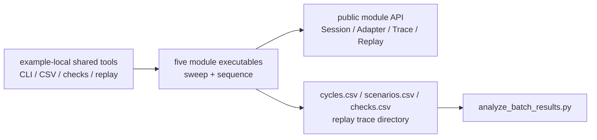

# 批量场景验证框架

Status: active
Last-reviewed: 2026-07-21
Authority: examples/batch_validation engineering practice

本框架位于 `examples/batch_validation/`，只通过 public Session、Adapter、Trace/Replay 接口验证多个
周期和参数组合，不定义业务模块行为。模块设计以各自 `design.md` 为准，跨模块硬规则以
`docs/common/contract.md` 为准。

## 当前范围

五个模块各有一个独立可执行程序，支持 `sweep` 参数扫描和 `sequence` 跨周期专项场景：

| 模块 | 可执行程序 | Sweep | Sequence | 合计 |
|---|---|---:|---:|---:|
| AR | `ar_batch_validation` | 52 | 6 | 58 |
| EOS | `eos_batch_validation` | 36 | 6 | 42 |
| ESR | `esr_batch_validation` | 48 | 6 | 54 |
| SAR | `sar_batch_validation` | 36 | 6 | 42 |
| SBIRS | `sbirs_batch_validation` | 27 | 7 | 34 |
| **总计** |  | **199** | **31** | **230** |

数量和场景 ID 的运行时 source of truth 是各可执行程序的 `--list-scenarios`；可读目录维护在
`examples/batch_validation/README.md`。文档不得从旧 CSV 或历史运行报告反推当前清单。

## 构建与运行

```bash
cmake --preset llvm-ninja-release-local -D ENABLE_EXAMPLES=ON
cmake --build --preset llvm-ninja-release-local --target \
  ar_batch_validation eos_batch_validation esr_batch_validation \
  sar_batch_validation sbirs_batch_validation -j 4

# 列出精确场景 ID
./build/llvm-ninja-release-local/bin/eos_batch_validation --list-scenarios

# 运行一个 suite 或一个精确场景
./build/llvm-ninja-release-local/bin/eos_batch_validation --suite sequence
./build/llvm-ninja-release-local/bin/eos_batch_validation \
  --scenario eos_seq_scan_rate_retask --output-dir /tmp/1q/eos-sequence
```

统一 CLI：

- `--suite sweep|sequence|all`：默认 `all`；
- `--scenario <exact-id>`：只运行一个精确场景；
- `--output-dir <path>`：覆盖输出目录；
- `--list-scenarios`：输出当前可执行程序接受的全部 ID。

CTest 只注册五个 sequence 子集，名称为 `batch_validation::<domain>`。199 个 sweep 不重复注册为
CTest；需要全量表征时显式运行 `--suite sweep|all`。

## 架构与所有权



框架不得 include pipeline/controller/generated codec 等内部头，也不得为了批量场景新增 public seam。
配置加载器属于 example-local 工具，不是稳定的库消费合同。

## Trace 与 replay

每个场景使用独立 `ReplayTraceWriter` 目录和唯一 manifest：

1. `*TraceSession` 构造时记录 session config；
2. 每周期记录 input、output，runtime patch 和 failure marker 按真实事件进入 trace；
3. writer `Flush()` 并释放句柄后调用模块 `ReplayXxxTrace()`；
4. replay 重建 Session、重放输入并逐周期比较输出。

`TraceSink` 是调试流，不是 `ReplayXxxTrace()` 的输入。failure marker 是可报告边界，不终止回放；
marker 后恢复周期仍必须比较。EOS 对应的模块级回放证据位于
`tests/replay/electro_optical_sensor/eos_replay_session_test.cpp`，其它模块位于各自
`tests/replay/<domain>/` 分区。

## 阻断检查与物理 warning

以下情况必须使可执行程序返回非零：

- 配置加载、输入适配或必要输出文件创建失败；
- replay 失败、输出 divergence 或比较数量不完整；
- `checks.csv` 中 `Severity::kError` 的结构化检查失败；
- 预期 validation/abort、failure marker、身份/通道/产品连续性或原子 patch 检查不符合场景定义。

具体硬检查以各模块调用 `ContractCheckCollector::Add()` 产生的 check ID 为准，不得用场景名称推断
不存在的门禁，也不得笼统宣称五模块都具有同一个 lifecycle/FOV/matrix 检查。

物理趋势检查可以是 `kWarning`，例如距离增大后性能未按预期下降或温度/SNR 趋势异常。Warning 写入
CSV 和日志但不单独改变退出码；它不能用于降级 replay、contract 或结构化行为失败。

## 输出

每个模块输出：

- `cycles.csv`：逐周期状态和模块特有指标；
- `scenarios.csv`：场景参数、聚合指标、replay 状态、warning/error 与检查计数；
- `checks.csv`：`scenario_id,phase,cycle_index,check_id,expected,actual,passed,severity`；
- `traces/<scenario_id>/`：manifest、事件、索引和 crash/failure 信息。

周期指标必须按 `executed_this_cycle` 门控；非执行周期的默认值或复用输出不得作为真实零值进入稳态
统计。当前量化结果以本次生成的 CSV 为准，不在权威文档冻结易漂移的历史数值。

## 与 GTest 的关系

Batch validation 是 examples 层端到端消费者，不是新的 `tests/` 类型，也不替代 unit、integration、
contract 或 replay 分区。项目没有“五模块统一 `tests/unit/*_matrix_test.cpp`”契约；每个模块的硬证明
来自其实际注册的测试文件和结构化 batch checks。

## 变更规则

以下变化必须同步本文件、`examples/batch_validation/README.md` 和对应可执行程序测试：

- 新增/删除模块、suite、场景 ID 或 CTest sequence 注册；
- replay、退出码、warning/error 或 check ID 语义变化；
- `cycles.csv`、`scenarios.csv`、`checks.csv` schema 变化；
- CLI 或默认输出布局变化。

不得通过放宽 replay 比较、跳过结构化检查、降低阈值或标记 unstable 来制造绿色结果。
