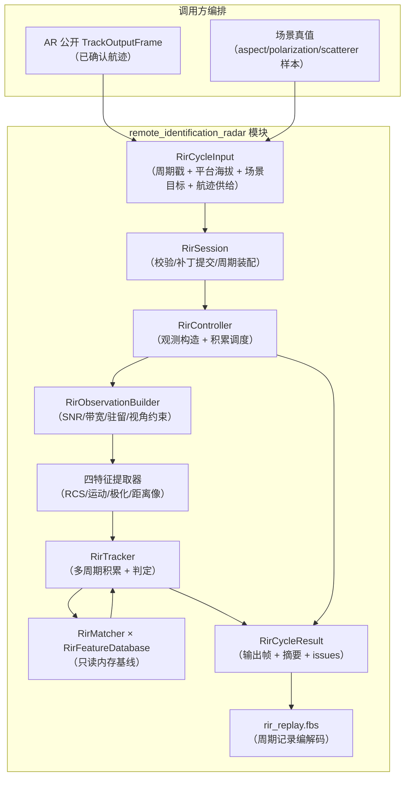

# Remote Identification Radar 数据流

## 数据流图

## 单周期时序（StepWithResult）

1. **入口校验**：`ValidateRirCycleInput`（dt 有限为正、周期号非零、平台海拔有限、
   场景目标/航迹供给字段有限、外部目标 ID 唯一）；失败 → `kRejectedInvalidInput` +
   明细 issues，不执行链路。
2. **关机检查**：`sensor_enabled == false` → `kPoweredOff`，不触碰识别状态。
3. **补丁提交**（staged）：`RirRuntimeConfigPatch` 在下一个成功周期边界应用
   （电源/工作模式/识别策略整域）→ `RirController::UpdateRuntime`（选项映射 +
   数据库按需加载）。
4. **识别执行**：`kIdentify` 且库已加载 →
   - 场景目标（`external_target_id` → 观测上下文：SNR/带宽/驻留/视线角）与航迹
     （`association_key`）按 external_target_id 关联；
   - `UpdateCycle`：滑动窗口积累 + 模板匹配 + 判定 + 结论时间戳；
   - 非 `kIdentify` → `HoldCycle`（结论按 `result_hold_sec` 过期）；
   - 退出 `kIdentify` → `ExitRecognitionMode`（清空积累，结论保持）。
5. **输出装配**：逐航迹结论回填 `RirOutputFrame::recognition_outputs`（按供给顺序，
   `association_key` 对齐）；`RirRecognitionCycleSummary` 计数/可用率/正确率
   （真值经供给 `target_name` 命中数据库 `model_id` 判定，仅统计不参与识别）。
6. **replay**：`RirSessionReplayAccess::CaptureSessionState` 采集
   `active_database_version`；周期记录经 `RirReplayFlatbufferCodec` 编解码。

## 状态所有权

| 状态 | 持有者 | 生命周期 |
|---|---|---|
| `RirFeatureDatabase` | `RirController`（构造加载/析构释放） | 路径变更时按需重载；加载期只读连接，运行期无连接 |
| 每航迹 `RirTrackState`（窗口/计数/结论） | `RirTracker` | 随 `association_key` 出现创建；键重分配（`hit_count` 回落）/`ExitRecognitionMode` 清理 |
| 工作模式/识别策略 | `RirSession::Impl`（config）+ `RirController`（runtime） | 补丁在成功周期边界提交 |
| `latest_summary` | `RirController` | 每成功周期刷新 |
| `active_database_version` | `RirTracker` | 随库加载设置，入 `RirSessionReplayState` |

## 与 AR 的模块间供给关系（非代码依赖）

RIR **不 include 任何 AR 头**。调用方把 AR 公开 `TrackOutputFrame` 的航迹字段
投影到 `RirTrackFeedEntry`（等价性测试 `ar_rir_recognition_equivalence_test.cpp`
即该投影的参考实现）：`association_key`/`external_target_id`/`target_name`/`status`/
`hit_count`/位置/速度/加速度/`estimation_uncertainty_trace`/`target_type`。

帧契约要点（详见 boundaries.md）：`position_z` 为雷达局部 ENU 上向分量；
高度观测 = 平台海拔 + `position_z`；`hit_count` 回落视为新目标。
