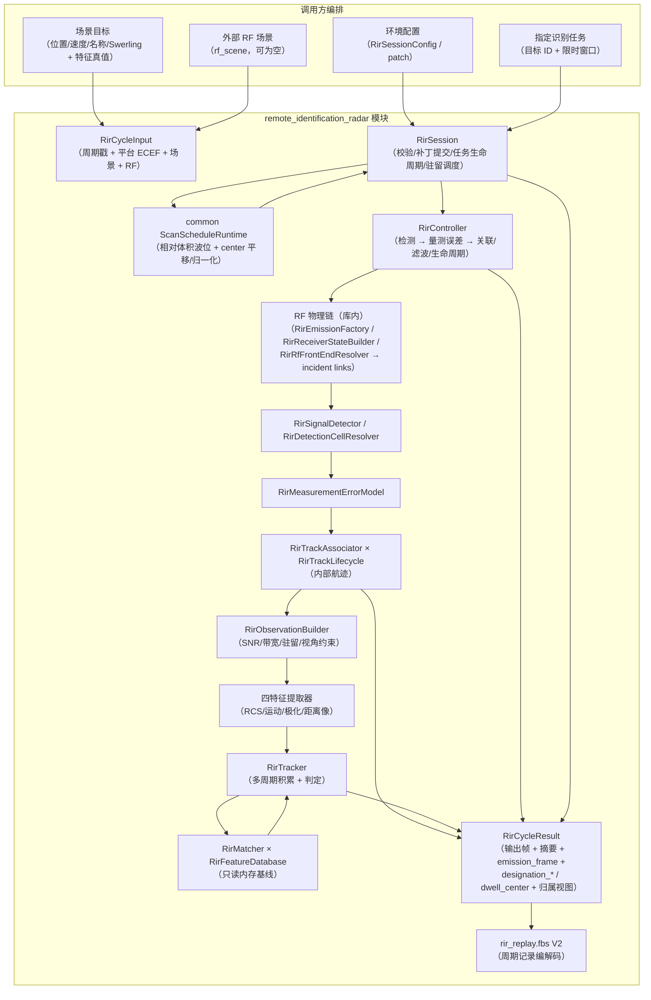

# Remote Identification Radar 数据流

## 数据流图

## 单周期时序（StepWithResult）

1. **入口校验**：`ValidateRirCycleInput`（dt 有限为正、周期号非零、仿真时间
   有限、平台 ECEF 必填 fail-closed——分量有限且模长>0、须可转 LLA、场景目标
   位置/速度/RCS/斜距/特征样本有限、Swerling 取值合法、外部 `rf_scene`
   帧合法且窗口与 `sim_time_sec`/驻留对齐）；失败 → `kRejectedInvalidInput`。
2. **关机检查**：`sensor_enabled == false` → `kPoweredOff`，不触碰检测/跟踪/识别状态。
3. **补丁提交**（staged）：`RirRuntimeConfigPatch` 在下一个成功周期边界应用
   （电源/工作模式/转台朝向 `has_scan_center`/完整 policy/environment 域/
   指定识别任务字段）→ `RirController::UpdateRuntime` / `UpdateEnvironment`。
4. **指定识别任务推进 + 驻留调度**（`RirSession`）：任务生命周期逐周期推进
   （kNone → kPending → kAcquired | kExpired，镜像 AR 骨架）；驻留中心 =
   任务窗口内指定目标视线角（在体积内），否则相对体积 + scan_center 扫描波位。
5. **自持链路执行**：`kIdentify` 门控整链：
   - **RF 物理链**（库内）：`ResolveRfCycle` 构建自发射（`RirEmissionFactory`）+
     接收机状态（`RirReceiverStateBuilder`）→ 合并 `rf_scene` 外部 emission →
     `TryResolveRirRfFrontEnd` 求解 incident links；有效 RCS 经
     `ComputeEffectiveTargetRcsM2`（AR 同口径）写入 detection cell 目标；
   - 驻留候选排序：未识别优先 + 斜距次近（消费上一周期内部航迹结论；
     只决定候选顺序，不生成波束指向）；
   - 波束状态：消费驻留调度显式给定的波束中心（雷达局部 ENU 系，
     `az ∈ [-180, 180]`、`el ∈ [-90, 90]`），与同帧目标视线角相减求离轴增益；
     方向图关闭或无有效视线角时回退主瓣峰值（契约见 boundaries.md）；
   - 检测：RF 链解析成功时走 `TryResolveRirDetectionCell` 分项 SINR 账本
     （含传播损耗/杂波/外部干扰）；解析失败或环境未启用时退化为阶段 1 旧 SNR
     口径；6 dB 回退模式以 SNR ≥ 6 dB 替代 CFAR 判决（旧识别门控口径）；
   - 量测误差：距离/角度标准差 → 笛卡尔协方差；检测器门控模式采样量测位置，
     回退模式量测位置取真值；
   - 关联/滤波/生命周期：LAPJV 全局最优关联（方阵代价矩阵 + 未分配代价）
     → CV KF 或 IMM（confirmed 命中激活，`enable_imm_lifecycle`）预测/更新
     → confirm/lost/回收（池化槽位 + `generation` 复用代次）；
   - 识别积累：内部航迹按 `external_target_id` 回联场景目标，逐航迹
     `UpdateCycle` 积累/匹配/判定（可选出参采集本周期实际构建的有效特征观测，
     供出口①透出）；非 `kIdentify` → `HoldCycle`；
     退出 `kIdentify` → `ExitRecognitionMode`。
5. **输出装配（双产品）**：逐内部航迹结论回填 `RirOutputFrame::recognition_outputs`
   （按关联键升序，出口②）；特征量测记录回填 `feature_measurements`（出口①：
   采集观测 × 观测上下文 + 平台位置，透出原则——识别链未构建观测的周期为空）；
   `RirCycleResult::emission_frame` 在 `kIdentify` 且 RF 链成功时携带本周期实际
   发射（供编排层汇集 RF scene，与 AR 同契约）；同循环构建归属视图缓存（`RirController::LatestTrackAttributions`），会话在
   kCompleted 后回填 `RirCycleResult::track_attributions`；非执行周期产品层与
   归属层均为空（五模块统一规则）。`RirRecognitionCycleSummary` 含识别统计、
   真值准确率与驻留预算摘要。
6. **replay**：`RirSessionReplayAccess::CaptureSessionState` 采集
   `active_database_version` + 检测随机种子；周期记录经 `RirReplayFlatbufferCodec`
   V2 编解码，旧 V1 显式拒绝；输出帧特征量测向量、结果表归属向量与
   `emission_frame` 为加性扩展（`RIR2` 标识不变，旧记录缺字段解码为空）。
   指定任务生命周期阶段
   （designation_phase/deadline）为派生跨周期状态，不进 replay session state：
   全量重放由 patch 流 + cycle_index 驱动可复现；若未来引入"从第 N 周期恢复"，
   需同步纳入会话状态。

## 状态所有权

| 状态 | 持有者 | 生命周期 |
|---|---|---|
| `RirFeatureDatabase` | `RirController` | 路径变更时按需重载；加载期只读连接，运行期无连接 |
| 内部航迹 `RirTrackState` | `RirTrackLifecycle` | 关联命中建轨；lost 超时回收；键单调不回收复用 |
| KF 高斯状态 | `RirTrackFilter`（经 lifecycle 持有） | 命中更新/失配外推；lost 重捕获重置 |
| 关联键分配器 `next_key` | `RirTrackAssociator` | 单调递增；运行态可捕获恢复 |
| 每航迹识别积累窗口/结论 | `RirTracker` | 随内部航迹键创建；回收/退出识别模式清理 |
| 检测 RNG 与量测误差 RNG | `RirController` | 随 `policy.detection.random_seed` 重置，种子入 replay |
| `latest_summary` | `RirController` | 每成功周期刷新 |
| `last_track_attributions`（归属视图缓存） | `RirController` | 每执行周期随快照刷新；非执行周期不触碰（会话早退保持空列表） |
| 指定任务状态（ID/时长/阶段/截止） | `RirSession` | 随 patch 原子提交；识别达成/作废后窗口停止（终态），结果级指定清零，清除需新 patch |
| `active_database_version` / `detection_random_seed` | `RirController` → `RirSessionReplayState` | 随运行期更新，入 replay |

## 与 AR 的关系

RIR **不 include 任何 AR 头**，不消费任何 AR 输出，也不向 AR 提供航迹、识别
结论或波束控制。AR 与 RIR 仅为同库共存的两部独立装备，由调用方分别编排；
RIR 波束中心由库内驻留调度器（`RirSession`：相对体积 + scan_center 平移归一化，
或指定识别任务限位执行）派生，经 `RirCycleResult::dwell_center_deg` 暴露；RIR 不驱动任何外部雷达波束。
编排层汇集实际发射走 `RirCycleResult::emission_frame`（与 AR 同契约）。
