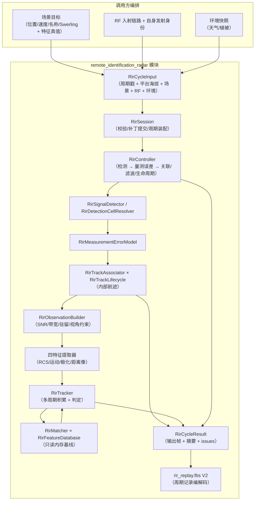

# Remote Identification Radar 数据流

## 数据流图

## 单周期时序（StepWithResult）

1. **入口校验**：`ValidateRirCycleInput`（dt 有限为正、周期号非零、平台海拔/时间
   有限、场景目标位置/速度/RCS/斜距/特征样本有限、Swerling 取值合法、环境快照
   有限非负、RF 入射链路与自身发射身份合法）；失败 → `kRejectedInvalidInput`。
2. **关机检查**：`sensor_enabled == false` → `kPoweredOff`，不触碰检测/跟踪/识别状态。
3. **补丁提交**（staged）：`RirRuntimeConfigPatch` 在下一个成功周期边界应用
   （电源/工作模式/完整 policy 域）→ `RirController::UpdateRuntime`。
4. **自持链路执行**：`kIdentify` 门控整链：
   - 驻留候选排序：未识别优先 + 斜距次近（消费上一周期内部航迹结论）；
   - 检测：无环境/干扰输入时退化为阶段 1 旧 SNR 口径；有环境或 RF 输入时走
     `TryResolveRirDetectionCell` 分项 SINR 账本，再经统计级 CFAR 判决；
     6 dB 回退模式以 SNR ≥ 6 dB 替代 CFAR 判决（旧识别门控口径）；
   - 量测误差：距离/角度标准差 → 笛卡尔协方差；检测器门控模式采样量测位置，
     回退模式量测位置取真值；
   - 关联/滤波/生命周期：LAPJV 全局最优关联（方阵代价矩阵 + 未分配代价）
     → CV KF 或 IMM（confirmed 命中激活，`enable_imm_lifecycle`）预测/更新
     → confirm/lost/回收（池化槽位 + `generation` 复用代次）；
   - 识别积累：内部航迹按 `external_target_id` 回联场景目标，逐航迹
     `UpdateCycle` 积累/匹配/判定；非 `kIdentify` → `HoldCycle`；
     退出 `kIdentify` → `ExitRecognitionMode`。
5. **输出装配**：逐内部航迹结论回填 `RirOutputFrame::recognition_outputs`（按
   关联键升序）；`RirRecognitionCycleSummary` 含识别统计、真值准确率与驻留
   预算摘要。
6. **replay**：`RirSessionReplayAccess::CaptureSessionState` 采集
   `active_database_version` + 检测随机种子；周期记录经 `RirReplayFlatbufferCodec`
   V2 编解码，旧 V1 显式拒绝。

## 状态所有权

| 状态 | 持有者 | 生命周期 |
|---|---|---|
| `RirFeatureDatabase` | `RirController` | 路径变更时按需重载；加载期只读连接，运行期无连接 |
| 内部航迹 `RirTrackState` | `RirTrackLifecycle` | 关联命中建轨；lost 超时回收；键单调不回收复用 |
| KF 高斯状态 | `RirTrackFilter`（经 lifecycle 持有） | 命中更新/失配外推；lost 重捕获重置 |
| 关联键分配器 `next_key` | `RirTrackAssociator` | 单调递增；运行态可捕获恢复 |
| 每航迹识别积累窗口/结论 | `RirTracker` | 随内部航迹键创建；回收/退出识别模式清理 |
| 检测 RNG 与量测误差 RNG | `RirController` | 随 `policy.detection.random_seed` 重置，种子入 replay |
| `latest_summary` | `RirController` | 每成功周期刷新 |
| `active_database_version` / `detection_random_seed` | `RirController` → `RirSessionReplayState` | 随运行期更新，入 replay |

## 与 AR 的关系

RIR **不 include 任何 AR 头**，不消费任何 AR 输出，也不向 AR 提供航迹或识别
结论。AR 与 RIR 仅为同库共存的两部独立装备，由调用方分别编排。
