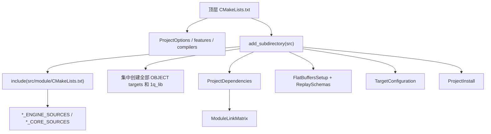
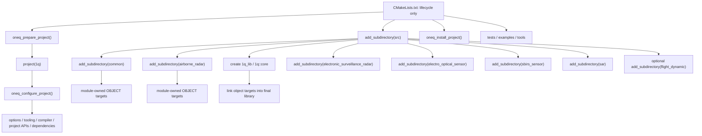

# CMake 工程化分层审视与重规划

Status: draft
Authority: CMake engineering replan proposal
Date: 2026-07-10
Live-Baseline: `7fd6aafb`
Implementation-State: implemented, physically converged and verified

## 结论

当前 CMake 的主要问题不是“文件太多”，而是 ownership 和调用时序断裂：

1. 顶层 `CMakeLists.txt` 同时负责 bootstrap、project policy、工具、输出、测试、安装和目录编排。
2. `src/CMakeLists.txt` 通过 `include(src/<module>/CMakeLists.txt)` 收集变量，集中创建全部 target。
3. `cmake/project` 再从 `src` 尾部补依赖、代码生成、target policy 和安装。
4. 模块的 source、target、dependency、schema、install 分散在不同物理位置，新增模块或依赖需要修改多个中心清单。

推荐目标不是继续拆 `cmake/project` 小文件，而是改成三层 ownership：

- 顶层只按生命周期编排 project。
- `src/CMakeLists.txt` 只装配最终产品 target。
- `src/<module>/CMakeLists.txt` 真正拥有模块 target、sources、direct dependencies、schemas 和模块特例。

最终 public target 保持 `1q::core` 不变，内部 engine/core object target 首批只迁移 ownership，不借机合并或重命名。

## 本次实施结果

- 顶层改为 setup → dependency discovery → `src` → install/tests/examples/tools → summary 的单点生命周期编排；产品身份不再由 CACHE 变量覆盖。
- `src` 改为只装配 `1q_lib`；所有模块改用 `add_subdirectory()`，各模块本地声明 component、直接依赖和 replay schema。
- 已删除中心 `ModuleLinkMatrix.cmake` 与 `ReplaySchemas.cmake`；FlatBuffers 改为模块本地注册、产品 target 统一收尾。
- 安装改为镜像 `include/1q` 公共树并单独安装生成 export header；package config 按最终静态库依赖闭包查找 Eigen、Boost、nanoflann、FlatBuffers、JSBSim、spdlog、ZLIB 和可选 HighFive。
- 物理目录已收敛到下方推荐结构：FlatBuffers 合并为 `project/codegen/FlatBuffers.cmake`，target policy 合入 `ProjectTargets.cmake`，summary 独立为 `ProjectSummary.cmake`，JSBSim provider 命名为 `JsbsimProvider.cmake`；顶层只顺序调用 prepare/configure/src/install/consumer 子目录生命周期入口。
- 已验证 debug/release/coverage fresh configure、FD=ON configure、完整 contract 与 CI 绿色标签套件；独立静态安装后，九个外部 consumer 均完成 `find_package(1q)`、编译、链接和运行。该流程已加入 build CI。

## 改造前调用链（Live-Baseline）



这条链路的关键特征是：模块 CMake 不是子目录入口，而是依赖父 scope 的“变量展开脚本”；project 级配置又依赖 `src` 已经创建好的具体 target。目录看似分层，实际依赖方向是双向的。

## 主要问题与优先级

### P0：当前基线已有确定性缺陷

| 问题 | Live evidence | 影响 |
|---|---|---|
| MSVC helper 无法解析 | `CompilerMSVC.cmake` 第 88、117 行多余 `endforeach()`；`cmake -P` 稳定复现 flow control error | Windows configure 在 include compiler helper 时直接中止 |
| CMake README 已漂移 | README 仍引用已删除的 `TargetBuildOptions.cmake`、`TargetProperties.cmake`、`TargetPrecompiledHeaders.cmake` | 架构说明与 live checkout 不一致，后续修改容易继续走错入口 |
| vendor/offline presets 不可达 | presets 设置 `PACKAGE_MANAGER=none`，`ConanPackages.cmake` 对该值无条件 `FATAL_ERROR` | 六个公开 preset 从定义上不可用 |
| Windows Conan 依赖合同未闭合 | `conanfile.py` Windows 不提供 JSBSim/HighFive，CMake 仍会解析 JSBSim，C++17 时还会 `find_package(HighFive)` | 即使修复 MSVC parser，Windows profile 仍不能视为可用 |
| 两步式 Conan 只校验 toolchain“存在” | `conanfile.py` 新增 HighFive 后，旧 CMakeDeps/toolchain 仍通过顶层存在性检查，随后在 `find_package(HighFive)` 才失败 | 用户漏跑 bootstrap 时错误位置晚、提示不指向依赖刷新 |

这些问题应先于结构迁移修复。否则每个迁移批次都在不可信基线上验证。

### P1：project 生命周期分散

顶层 179 行同时包含：

- toolchain 存在性检查；
- project name/alias/export set；
- C++ standard、policy、build type、platform check；
- options、features、compiler helpers；
- output/test/install setup；
- summary 与子目录编排。

其中 project name、target name、export set 当前还是 CACHE 变量，但它们实际上是产品身份，不应成为普通用户配置项。`DESCRIPTION` 仍是模板占位文本，也表明顶层仍混有模板遗留职责。

### P1：模块没有 target ownership

当前 `src/<module>/CMakeLists.txt` 的共同模式是：

- 设置 `*_ENGINE_SOURCES` / `*_CORE_SOURCES`；
- 设置 `PUBLIC_HEADERS_*`；
- 直接发出部分 install 命令；
- 不创建本模块的主要 target，也不声明 direct dependency。

这导致：

- 文件路径按 `src` 父 scope 解释，不能安全改为 `add_subdirectory()`；
- `flight_dynamic` 使用绝对路径，其他模块使用父目录相对路径，规则不统一；
- common 源直接塞进最终库，未获得与其他 component 一致的 target policy；
- SAR 因 contract 复用另设 `SarSources.cmake`，证明“源清单变量”已经成为外部合同。

### P1：central matrix 取代 direct dependency

`ModuleLinkMatrix.cmake` 同时做：

- object target 的 link matrix；
- SAR HighFive 发现与 feature define；
- JSBSim 注入；
- Conan legacy include variable 兜底；
- spdlog backend 选择；
- ZLIB 和全局 compile definitions 广播。

这使 dependency discovery、feature policy 和 target consumption 再次混在同一文件中。依赖不是由使用源码的 target 声明，而是由中心脚本根据 target 名称猜测和广播。

### P2：模块注册点过多

新增或修改模块时，至少可能触及：

- 模块 source/install `CMakeLists.txt`；
- `src/CMakeLists.txt` 的 target 创建、object target list、最终 source list；
- `ModuleLinkMatrix.cmake`；
- `ReplaySchemas.cmake`；
- `ProjectInstall.cmake`；
- `check_install_manifest.cmake` 对清单物理位置的扫描规则；
- public boundary whitelist。

其中 public boundary whitelist 是有意的独立合同；其他中心注册点多数可以消除。

## 目标职责模型

| 层 | 唯一职责 | 不再承担 |
|---|---|---|
| 顶层 `CMakeLists.txt` | project 生命周期编排、启用 profile、添加产品/测试/示例/工具、最终 install/summary | 具体模块 target 名、schema、模块依赖矩阵 |
| `cmake/project` | project option/setup/dependency provider/install/package 的显式函数 API | include 时消费一批未声明的全局 target 名 |
| `cmake/features` | 可参数化的 tooling 或 target-scoped feature helper | 1q 模块清单与业务 schema |
| `cmake/compilers` | compiler family 的 target-scoped policy helper | 目录级 compile/link side effect |
| `src/CMakeLists.txt` | 创建/装配 `1q_lib`，添加业务模块子目录 | 模块 sources、direct dependency、install header 清单 |
| `src/<module>` | 模块 component targets、sources、direct dependencies、schemas、模块特例 | 修改其他模块 target 或维护全项目 target matrix |

## 最终目标调用链



依赖方向保持单向：root 知道生命周期，`src` 知道产品组成，模块只知道自身 target 和 imported dependencies。

## 最终目录

```text
cmake/
├── README.md
├── compilers/
│   ├── CompilerClangGCC.cmake
│   └── CompilerMSVC.cmake
├── features/
│   ├── CCache.cmake
│   ├── ClangFormat.cmake
│   ├── ClangTidy.cmake
│   ├── Coverage.cmake
│   ├── PrecompiledHeaders.cmake
│   └── UnityBuild.cmake
└── project/
    ├── ProjectOptions.cmake            stable option entry point（组合内部 option 文件）
    ├── ProjectSetup.cmake
    ├── ProjectDependencies.cmake
    ├── ProjectTargets.cmake            component + target policy/public library helpers
    ├── ProjectInstall.cmake
    ├── ProjectSummary.cmake
    ├── codegen/
    │   └── FlatBuffers.cmake           flatc discovery + module-owned schema API
    ├── dependencies/
    │   ├── ConanPackages.cmake
    │   └── JsbsimProvider.cmake
    └── legacy/
        └── Vs2015SourceNormalization.cmake
```

边界说明：

- 不要求每个文件都很小；`ProjectOptions.cmake` 是唯一的 build/module option 定义边界，避免形成仅转发的 wrapper 链。
- `ProjectDependencies.cmake` 只负责产生 imported targets/availability，不链接业务 target。
- `ProjectTargets.cmake` 只定义小型 helper，例如 `oneq_add_component()`、`oneq_apply_target_defaults()` 和 `oneq_configure_public_library()`。
- FlatBuffers helper 位于 project/codegen，但 schema 在业务模块本地声明；删除 central `ReplaySchemas.cmake`。
- `ProjectInstall.cmake` 只处理最终库、export、package config 和 public include tree。

## 模块声明模型

模块 CMake 应保持显式，helper 只压缩稳定样板。例如：

```cmake
oneq_add_component(eos_engine
    SOURCES
        foundation/EosNoiseModel.cpp
        foundation/EosRadiometry.cpp
        pipeline/EosPipeline.cpp
)
target_link_libraries(eos_engine PRIVATE oneq::build_options)

oneq_add_component(eos_core
    SOURCES
        session/EosSession.cpp
        session/EosReplayFlatbufferCodec.cpp
)
target_link_libraries(eos_core PRIVATE flatbuffers::flatbuffers)

oneq_add_flatbuffer_schemas(
    TARGET eos_core
    MODULE electro_optical_sensor
    SCHEMAS eos_replay.fbs eos_session_replay.fbs
)
```

这里不把依赖、schema、安装和 feature 全塞进一个 `oneq_add_module()` 万能宏。代码审查时仍能直接看到模块真实依赖。

## 安装与 public boundary

当前 install guard 通过正则扫描 CMake 源文件中的显式头路径；它把清单必须位于 `src/*/CMakeLists.txt` 写成了测试前提。结构迁移后建议改为：

1. `include/1q` 继续是唯一 public header 物理边界。
2. `check_public_api_boundary.cmake` 继续证明 whitelist 与磁盘一致。
3. `ProjectInstall.cmake` 镜像安装 `include/1q` 的 `.h/.hpp` 和允许的说明文件，并单独安装生成 export header。
4. install consumer smoke 证明安装产物可被 `find_package(1q)` 使用。

这样 public whitelist 仍是独立的架构合同，但不再手工复制一份 159+ header install list。若团队坚持显式 install manifest，也应改为可被 production CMake 和 guard 同时 include 的纯数据文件，而不是正则解析任意 CMake 源码。

## Preset 与支持矩阵

先冻结两种不同合同：

- public header consumer compatibility：`include/1q` 保持 C++11/VS2015 可编译子集。
- project build support：某 host/compiler/dependency provider 能完整 configure/build/test/install。

当前只有 macOS Conan 路径在 CI 文档中被列为健康基线。Windows presets 在恢复为公开入口前，至少要闭合：

- MSVC helper parser；
- JSBSim provider；
- HighFive/HDF5 在 Windows 的 availability/disable policy；
- Conan toolchain 路径和 bootstrap 参数；
- 一个真实 Windows configure/build/install consumer job。

`PACKAGE_MANAGER=none` 若没有完整 vendored dependency provider，应删除该 option 值及对应 presets；“名称叫 offline”不能代替可执行实现。

## 分批迁移计划

### Phase 0：基线止血

改动范围：compiler helper、presets、README、contract guards。

- 修复 MSVC 多余 flow-control。
- 删除/隐藏不可用的 vendor/offline presets，或先实现 provider 再保留。
- 把 README 更新到 live paths。
- 新增 CMake module parse guard，至少在非 Windows CI 也解析两套 compiler helper。
- 新增 preset consistency guard，禁止 preset 声明已被 dependency entry 明确拒绝的 provider。
- 为两步式 Conan 增加 freshness 合同：wrapper 总是先 bootstrap，或生成输入 fingerprint 并在 configure 时给出明确的“依赖元数据已过期”错误。

验收：macOS debug configure + contract；compiler helper parse；preset list/contract；若声称 Windows 支持则必须有 Windows configure。

### Phase 1：冻结工程合同

- 固定产品身份：project name、`1q_lib`、`1q::core`、export set 不再作为普通 CACHE option。
- 明确 `ONEQ_ENABLE_FLIGHT_DYNAMIC` 只控制机动模块，JSBSim common adapter 是否常驻另立合同。
- 明确 HDF5 是必选能力、平台可选能力还是 SAR option。
- 写出 supported preset matrix；未验证 profile 不进入主 presets。

验收：配置 summary 与文档对同一组 profile/option 给出一致结论。

### Phase 2：project 生命周期单点编排

- 将 target policy 从 include-time 脚本收敛到 `ProjectTargets.cmake` 的显式 helper。
- 将 dependency discovery 与 target linking 分离。
- 将 FlatBuffers function/setup 合并为明确 codegen API。
- 顶层按 setup → dependencies → src → install/tests/tools → summary 调用。
- `src` 不再 include project install/全局 setup。

本批不迁移模块 source ownership，减少同时变量。

验收：fresh debug/release/coverage；PCH；JSBSim source/provider；contract bundle。

### Phase 3：模块 target ownership

按风险从低到高迁移：

1. common（建立统一 component target）；
2. EOS、SBIRS；
3. ESR、airborne radar；
4. SAR；
5. flight_dynamic。

每个模块改为 `add_subdirectory()`，本地创建 component target、使用本地相对 source path、声明 direct dependencies。`src` 只维护最终组成 target 名列表。

验收：每迁一个模块就 fresh configure/build + 对应 focused tests；通过 `compile_commands.json` 核对依赖/flags 没有广播到无关 target。

### Phase 4：删除中心注册点

- schema 下沉到模块，删除 `ReplaySchemas.cmake`。
- direct dependency 下沉到模块，删除 `ModuleLinkMatrix.cmake`。
- spdlog/ZLIB backend policy 通过 project-owned interface target 或显式 helper 提供，不遍历全局 target list。
- package config dependency 列表由最终 link/export 合同生成或显式维护在 install 层。

验收：replay codegen/roundtrip；install/export consumer；无 ghost dependency target。

### Phase 5：install、文档与 guard 收口

- 选择 public tree mirror 或纯数据 manifest，删除 CMake source regex 解析。
- 更新 `cmake/README.md` 为现状说明；旧 phase2 review 保留历史定位但标注 superseded。
- guard 增加：CMake paths、preset/provider、module parse、install consumer、public boundary。
- fresh 运行所有正式支持的 presets；未运行的 profile 不标为 supported。

## 每批验证矩阵

| 维度 | 必须验证 |
|---|---|
| Syntax | 两套 compiler helper 与纯函数 module 可在当前 host 解析 |
| Configure | `cmake --fresh` 对正式 debug/release/coverage presets 通过 |
| Build | `1q_lib`、contract tests、受影响模块 focused targets |
| Boundary | public API、install manifest、public header C++11、docs structure |
| Install | `cmake --install` + 独立 consumer `find_package(1q)` |
| Target policy | `compile_commands.json` 证明 vendor/unrelated targets 未继承 1q-only flags |
| Codegen | 所有 replay schemas 生成、codec 编译、roundtrip/divergence tests |
| Platform | 每个声称 supported 的 OS/compiler 至少有 configure + build；不可用 profile 不公开 |

## 明确不做

- 不在结构迁移中改变 `1q::core` public target 或 public API。
- 不同时合并 engine/core object targets；先让 dependency ownership 可见，再评估是否合并。
- 不引入一个隐藏所有行为的 `oneq_add_module()` 万能宏。
- 不为了目录整齐把 compiler/feature helper 改回全局 `add_compile_options()`。
- 不把“preset 存在”当成平台已支持；支持必须由 live job 证明。
- 不通过降低测试、跳过 install consumer 或弱化 public boundary guard 来让迁移变绿。

## 推荐第一实施批

先只做 Phase 0，不碰模块结构：

1. 修复 `CompilerMSVC.cmake` parser。
2. 清理与当前 dependency provider 矛盾的 presets。
3. 同步 `cmake/README.md` 的 live paths/call chain。
4. 增加 compiler module parse 与 preset consistency guard。

Phase 0 形成可信基线后，再实施 Phase 1/2。不要直接从 `include(module/CMakeLists.txt)` 一步跳到全模块 `add_subdirectory()`，否则 source paths、install guard、schema target、dependency matrix 和 test target 会在同一批同时变化，回归定位成本过高。

## 本轮验证记录

- `cmake -P` 解析 `CompilerClangGCC`、Coverage、Unity、PCH、FlatBuffers helper：通过。
- `cmake -P cmake/compilers/CompilerMSVC.cmake`：稳定失败，已定位两处多余 `endforeach()`。
- `check_docs_structure.cmake`：通过。
- `check_install_manifest.cmake`：159 个磁盘头、install 清单和 public boundary whitelist 三者一致。
- `cmake --preset llvm-ninja-debug` 未作为通过基线：本地已有 Conan 生成目录早于 HighFive 依赖变更，未先执行两步式流程要求的 `scripts/bootstrap_conan.sh llvm-ninja-debug`，因此在 `find_package(HighFive)` 失败。本轮只做规划，没有触发依赖下载；该结果用于记录 bootstrap freshness 缺口，不判定为本次文档变更回归。
