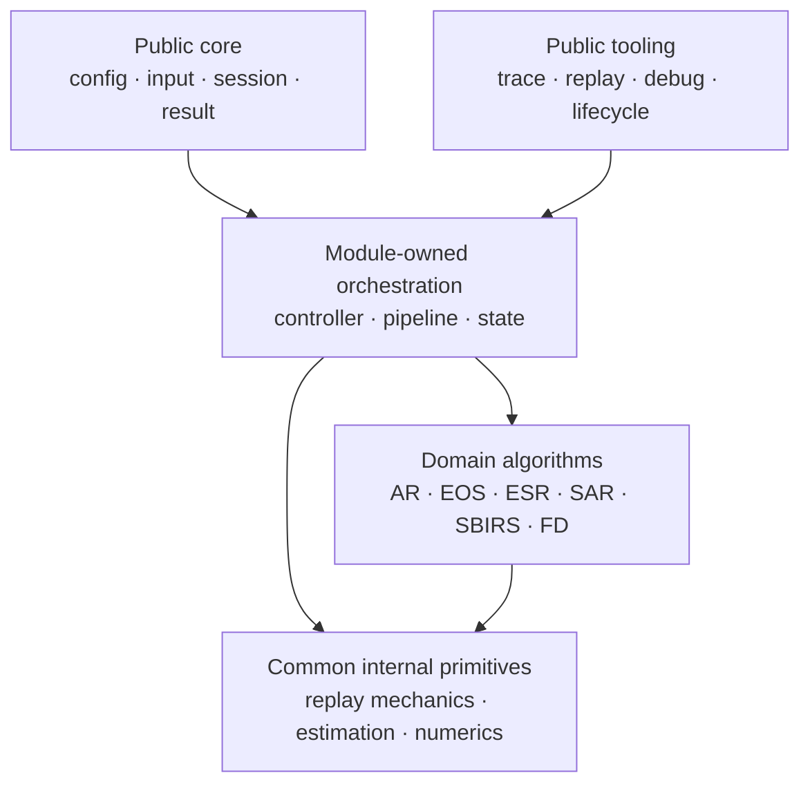

# 1Q 全库架构方向审查

Status: draft
Last-reviewed: 2026-07-11
Authority: non-normative Stage A architecture review

本文基于当前 live code、`docs/common/contract.md` 和各模块 `design.md`，判断架构方向是否偏移，并冻结后续修复的最小边界。本文不是契约；结论落地后必须迁入 `contract.md`、模块 `design.md` 或代码/测试，再删除本草稿。

## 1. 总体结论

当前主方向没有根本偏移。以下原则应继续保持：

- public API 只承载稳定门面、DTO 与已形成外部合同的工具。
- 业务模块拥有自己的 config、session、pipeline、运行期状态和算法语义。
- raw output、结构化 result、debug/lifecycle/replay 保持三层分离。
- 高风险算法、架构、schema 和 public 边界遵循 evidence-first。

当前偏移主要表现为：

1. replay/trace/debug/lifecycle 的复制成本开始接近第二套产品架构。
2. SBIRS pipeline 汇聚过多职责，继续加入 Cueing/ATP 会形成 God object。
3. SAR 的 internal 候选算法数量增长快于 production/session 晋级能力。
4. Flight Dynamic 作为特殊平台模块仍泄漏 concrete 子系统，但不适合机械套用传感器 Session 模型。

## 2. 现场指标

| 指标 | 当前值 | 含义 |
|---|---:|---|
| 五个传感器模块 public headers | 140 | public 面已稳定，但兼容成本不小 |
| 其中 `session/` headers | 82 | 工具、结果和会话能力主要集中于 session 面 |
| trace/replay/debug/lifecycle public headers | 约 25 | 需要区分核心合同与诊断工具合同 |
| 五份手写 Replay FlatBuffer codec | 3397 行 | 存在明显机械重复和字段漂移风险 |
| `SbirsPipeline.cpp` | 约 521 行 | 同时协调物理、调度、跟踪、NIS 与 snapshot |

Replay codec 分布：AR 1224 行、EOS 618 行、ESR 655 行、SAR 391 行、SBIRS 509 行。此数字不直接证明应建立通用 codec；它只证明必须先区分机械重复与模块专属映射。

## 3. Stage A 证据矩阵

| 冻结项 | 假设 | 直接证据 | 允许进入的最小边界 | 决策 |
|---|---|---|---|---|
| Replay/trace 维护税 | 五套 codec 重复了 buffer、verifier 和失败传播机制 | 五份 codec 共 3397 行，均重复 builder→string、Verifier/GetRoot、corruption rejection | `src/common/replay` internal 机械基元；模块 schema/DTO 不变 | pass |
| SBIRS pipeline 职责 | Cueing/ATP 继续内联会扩大状态与 replay 耦合 | `SbirsPipeline` 同时处理 WFOV/NFOV、scheduler、EKF/IMM、NIS、snapshot | 零行为提取首次捕获判定和 tracking coordinator | pass |
| SAR 能力晋级 | internal 算法存在不等于 session 能力 | design 明确 session 主链只装配 RDA/BP，Omega-K 等为 internal/受控 | 建立四级晋级门，暂停新增未接线算法族 | pass |
| Public 核心面/工具面 | 当前“窄 public”未区分运行合同与诊断工具合同 | 140 public headers，约 25 个诊断/回放工具头 | 文档化兼容等级，不删除已有工具 | narrow |
| Flight Dynamic getter | concrete getter 泄漏 vendor/子系统边界 | `FlightManager` 返回 adapter/autopilot/engine/waypoint concrete 引用 | 先审计真实 consumer，再冻结迁移策略 | narrow |
| EOS/SBIRS 物理基元 | Planck/接收功率/噪声重复可能漂移 | 两模块存在同名/同类函数，但 float/double 和策略输入不同 | characterization 后只复用完全同义纯函数 | narrow |
| 通用 Sensor Session/pipeline | 相似外形可统一为公共模板/基类 | 各模块 runtime patch、失败、状态和产品语义不同 | 不实施；只复用横切机械基元 | reject |

## 4. 目标边界

边界规则：

- Public tooling 可稳定存在，但兼容策略与核心运行合同分级。
- Common internal 只承载已证明同义的机械/数学基元，不拥有业务编排。
- 模块算法原语必须经过 characterization 和 production eligibility 后才能接入 session。
- Flight Dynamic 保持平台状态生产者定位，不追求传感器类形状对称。

## 5. 三阶段修复路线

### 5.1 Replay 与 public 工具面

1. 列出五套 codec 的机械重复、schema 专属转换和错误行为矩阵。
2. 先在 EOS/ESR 试点 FlatBuffer 完成复制、输入完整性和 verifier 错误传播 internal helper。
3. 依次迁移 SBIRS、SAR，最后处理 identifier/对象图更复杂的 AR。
4. 保持模块 schema、payload type、file identifier、public DTO 和字节语义不变。
5. 在 `contract.md` 定义核心运行合同与诊断工具合同的兼容等级。

实施记录（2026-07-11）：EOS/ESR 已完成第一批 internal helper 迁移。helper 只统一完成 builder 的字节复制和 FailureMarker 的解码保护；模块 schema、DTO、payload type、identifier、公开头和错误文本均未改变。helper unit、EOS/ESR replay、完整 replay、contract 和 C++11 compatibility 验证均通过。SBIRS、SAR、AR 仍待后续小批迁移。

### 5.2 SBIRS 与 SAR 内部边界

1. 从 `SbirsPipeline` 提取 internal NFOV acquisition evaluator。
2. 提取 tracking coordinator，封装 EKF/IMM、NIS 计数和 capture/restore。
3. 不加入 ATP、CV/CA、新 public SPI 或新 snapshot 字段。
4. 为 SAR 建立 `experimental → characterized → production-eligible → session-wired` 晋级表。
5. 在选定并证明一个候选前，不新增或公开新的 SAR 算法族。

### 5.3 Flight Dynamic 与物理基元

1. 扫描 consumer/examples/tests 对四个 concrete getter 的调用矩阵。
2. 根据外部兼容证据选择保留、兼容迁移或窄控制端口；不直接删除。
3. 建立 EOS/SBIRS Planck、接收功率、噪声的单位、精度、边界和容差矩阵。
4. 只下沉公式、维度和失败语义完全一致的纯函数；环境策略继续由模块持有。

## 6. 明确拒绝项

- 不建立通用 `SensorSession<T>` 或 public pipeline 基类。
- 不合并模块 replay schema 或发明万能跨模块 DTO。
- 不把 Flight Dynamic 包装为传感器式 Session/Cycle。
- 不把所有 foundation/algorithm 类型迁入 `common`。
- 不把“有实现、有单测”直接解释为 production/session 能力。
- 不通过放宽阈值、扩大 skip 或改变 known-limit 使重构通过。

## 7. 验收门槛

- Replay：全部 replay domain partitions、roundtrip/divergence/corruption、contract、public boundary、install manifest、C++11 compatibility。
- SBIRS：unit、integration、replay、capture/restore、cue latency、NIS loss/reacquisition、IMM。
- SAR/FD：SAR session/evidence tests、FD stable/known-limit、consumer tests。
- 文档：docs structure、SAR governance、legacy-term guards；已落定结论必须迁出并删除本 review。
