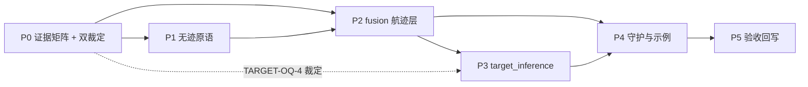

# 目标域能力开发计划（SBIRS + RIR 交付范围，分阶段）

## 0. 结论速览

- **交付范围**：以 SBIRS（角度量测源）与 RIR（识别结论源）为传感器输入，建设估计层（fusion
  演进：关联已有 + 无迹航迹滤波 + 航迹管理）与推演层（新算法面 target_inference：轨迹预测、
  发射点/落点回推、类型概率融合）。AR/ESR/EOS 不在本次交付范围，其适配器与历史债
  （TARGET-OQ-1/2）不动。
- **两个传感器经 2026-08-17 全库审查为干净基线**：SBIRS 内部滤波为合法行为建模（唯一灰区
  TARGET-OQ-3，本次交付内裁定）；RIR 识别为装备使命、内部航迹链严格闭环（灰区 TARGET-OQ-4，
  本次交付内裁定）。本次交付**不偿还** AR/ESR 债务。
- **阶段总览**：

| 阶段 | 名称 | 性质 | 关键前置 |
|---|---|---|---|
| P0 | 需求基线与证据矩阵 | Stage A，零生产代码 | 无 |
| P1 | 无迹滤波原语 | common/estimation 扩展 | P0 指标冻结（可部分并行） |
| P2 | 估计层：fusion 航迹滤波与管理 | fusion 演进 | P0 的 TARGET-OQ-3 裁定 + P1 |
| P3 | 推演层：target_inference 算法面 | 新模块 | P2 + TARGET-OQ-4 裁定 |
| P4 | 守护、示例与跨层集成 | 工程收口 | P2/P3 |
| P5 | 验收与回写 | Stage C | 全部 |

## 1. 交付范围与边界

### 1.1 In scope

| 面 | 内容 |
|---|---|
| 传感器层（只读消费，不进估计逻辑） | `SbirsOutputFrame` 检测记录（ECI 角度 + 线性 SNR）；`RirOutputFrame` 识别结论（按 RIR 内部 `association_key`） |
| 估计层 | fusion 演进：逐航迹无迹滤波、M/N 航迹起始、miss 删除；`FusedTarget` 扩展运动学状态 + 协方差 |
| 推演层 | 新算法面（暂名 `target_inference`）：弹道前向外推、发射点/落点回推、类型概率融合 |
| 公共 | `src/common/estimation` 无迹原语；分层契约的方向纯净度守护 |

### 1.2 Out of scope（本次明确不做）

1. AR/ESR/EOS 的任何改动与其适配器语义变化；TARGET-OQ-1/2 债务处置（AR↔估计层关联单源化
   延后到 AR 债务处置立项）。
2. CSO 密集目标分辨（"分离"已澄清为关联语义，对齐文档 §3.2）。
3. sbirs_sensor / remote_identification_radar 内部进入任何估计/推演逻辑（分层契约规则 2/3）。
4. threat_assessment 改动（其类型概率/融合置信度输入位已预留，只消费不修改）。

### 1.3 交付内必须完成的两个裁定

| 裁定 | 阻塞 | 内容 |
|---|---|---|
| TARGET-OQ-3（SBIRS Estimated 后验外发） | P2 | 估计层量测噪声 R 的语义来源：Estimated 输出按"平滑估计"还是"量测"建模。三选一：维持现状 + 适配层标注来源 / Estimated 改输出带噪量测 / Sensor-like 为估计层默认消费模式 |
| TARGET-OQ-4（RIR 识别与推演层关系） | P3 | RIR 识别结论接入估计/推演链的关联方式（三方案见 §P3）与知识库/原语复用边界 |

## 2. 阶段定义

### P0：需求基线与证据矩阵（Stage A，零生产代码）

**目标**：把"物理可达精度"算清楚、把需求指标口径冻结，后续一切验收以此为准。

工作项：
1. **可达性矩阵**：源数（单 SBIRS / SBIRS+RIR 旁证 / 未来多星预留）× 观测弧长 × 角度量测
   精度 → 距离/发射点/落点 CEP 与误差椭圆。以证据原型（非生产代码）驱动，覆盖对齐文档
   §3.3 的量级直觉并给出正式数字。
2. **TARGET-OQ-3 裁定证据**：盘点 `AdaptSbirsDetectionsToDetectionRecords` 消费路径与
   Estimated/Sensor-like 两种模式在估计层 R 矩阵语义下的差异实测。
3. **需求方指标确认**：对齐文档 §2 映射表终版签认；每项产品落"观测条件 → 可达误差"口径。
4. **回推放大系数表**：弧长 × 回推时域 → 发射点误差放大倍数（可达性矩阵的子表）。

退出门：证据矩阵 pass/narrow 判定 + 指标冻结表 + 两个裁定的 Stage A 结论登记（open_questions
对应条目更新）。

### P1：无迹滤波原语（common/estimation 扩展）

**目标**：补上库内缺失的无迹（Unscented）滤波原语，作为估计层唯一滤波来源（分层契约规则 4）。

工作项：
1. `UnscentedPredictor` / `UnscentedUpdater`（sigma point 采样；对齐 `IKalmanPredictor`/
   `IKalmanUpdater` 模板接口；命名避开 `Udkf*`——UD 分解是稳定化技术，可选组合为
   平方根无迹变体，非互斥）。
2. 单测（`tests/unit/common/`）：线性极限退化为 KF 解；与 EKF 在 `SbirsAngleMeasurementModel`
   同构的非线性量测下对比（NIS 一致性、收敛速度）；协方差下限沿用 `kCovarianceFloor`
   语义桶（contract.md §数值下限语义）。
3. 明确不动项：sbirs_sensor 内部 EKF（传感器行为建模）、既有 `Udkf*`/`Ekf*`。

退出门：单测全绿 + 证据对比记录进 algorithms 级文档（common 无独立 design 集，登记于
P2 fusion algorithms.md 的算法登记表）。

### P2：估计层——fusion 航迹滤波与航迹管理（fusion 演进）

**前置**：fusion boundaries 变更规则 2——先在其 algorithms.md 冻结实现边界；评估
`airborne_radar::signal::association` 复用路径（结论预期：AR out of scope，关联单源化延后，
仅登记评估结论）。

工作项：
1. **量测噪声通道设计**（TARGET-OQ-3 裁定落地）：DetectionRecord 可选噪声字段 vs
   FusionConfig 逐源噪声配置 vs quality 代理——按 P0 裁定实施；SBIRS 适配器同步增强
   （如需来源标注）。
2. **逐航迹无迹滤波**：状态模型（ECI 弹道段 CV/CA 起步，弹道系数估计为 P3 联动候选）；
   角度-only 弱可观测必须体现在协方差（不得用真值辅助字段掩盖，契约规则 6）。
3. **航迹管理**：M/N 起始确认、miss 删除；与既有滑窗关联语义统一冻结；输出确定性按键排序。
4. **`FusedTarget` 扩展**：+ 运动学状态均值/协方差、+ 航迹状态（tentative/confirmed/lost）、
   + 最近更新时延。破坏性变更按 public API 变更流程（追加字段，不重排）。
5. 测试：`tests/unit/fusion/`（滤波一致性、航迹生命周期、确定性/顺序敏感性——注意
   SBIRS-OQ-3 输入顺序边界）；replay 确定性。
6. fusion 四件套文档改写（boundaries 非目标 1 解除 + 新边界冻结）。

退出门：单源 SBIRS 多目标场景（关联→滤波→航迹）端到端测试全绿；文档与实现对齐。

### P3：推演层——target_inference 新算法面

**前置**：TARGET-OQ-4 裁定 + P2 的 TrackState 输出冻结。

工作项：
1. **模块骨架**：照 threat_assessment 先例（泛型输入帧、算法不感知传感器与坐标系、无
   Session 形态）；**工程项**：docs 目录结构守护（check_docs_structure 模块清单）、
   check_test_layout / check_public_api_boundary 白名单同步注册。
2. **弹道运动模型**：中心引力 + 气动阻力 ODE，私有于本模块；不依赖 JSBSim/flight_dynamic。
3. **轨迹/落点/发射点**：前向外推与反向积分，全部携带误差椭圆（契约规则 6）；发射点回推
   附 P0 放大系数表核对；单源弱可观测场景输出可达性说明字段。
4. **类型概率融合**：SBIRS 运动学/IR 特征 + RIR 识别证据 → 目标类型概率，输出对齐
   threat_assessment 的类型概率输入接口。
5. **RIR 接入设计**（三方案，P0/立项时裁定）：
   - 方案 a：业务层提供 RIR `association_key` → 融合航迹键的映射（库不管联，契约允许：
     身份键跨源一致性归调用方）；
   - 方案 b：RIR 识别结论适配为 feature-only `DetectionRecord`（`key=0`，走特征门关联——
     受限于特征相似度语义，需评估）；
   - 方案 c：RIR 扩展公开方位/运动学输出通道（public API 变更，最重，需独立冻结）。
6. 模块四件套（design/boundaries/data-flow/algorithms）+ `tests/unit/target_inference/`。

退出门：端到端"SBIRS 量测 → 融合航迹 → 预测/发射点（带误差）→ 类型概率"链路测试；
P0 指标冻结表逐项核对。

### P4：守护、示例与跨层集成

1. **方向纯净度守护**：`tests/contract/` 新增 include 方向断言（threat 不含 fusion 头、
   fusion 核心不含传感器头、传感器不含估计/决策头、SensorAdapters 白名单豁免）——分层
   契约规则 1 可执行化（对齐文档 §4 已登记的守护空白）。
2. **示例扩展**：component_attachment 增链 SBIRS → fusion → target_inference →
   threat_assessment（本次交付只接 SBIRS 源 + RIR 识别旁证）。
3. integration/batch 验证场景：双目标角度-only 弱可观测、RIR 识别融合、发射点回推误差
   预算复核。

### P5：验收与回写（Stage C）

1. 全量 release 验证（按库验证范围约定，聚焦 `unit::fusion` / `unit::target_inference` /
   新增 contract 守护；全量只在 completeness-review 类节点跑）。
2. P0 指标冻结表 vs 实测复核（误差预算不得事后放宽——证据优先模式规则 5）。
3. 文档回写：TARGET-OQ-3/4 关闭（open_questions 迁出）、对齐文档结论转正进相应模块
   design 集、本计划文档标记完成态。

## 3. 阶段依赖

P0 与 P1 可部分并行（P1 不依赖指标数字，只依赖"UKF=无迹"裁定，已成立）。

## 4. 风险与未决项

| 风险 | 影响 | 缓解 |
|---|---|---|
| 角度-only 弱可观测使部分指标物理不可达 | 需求违约 | P0 先出可达性矩阵再签指标；产品强制携带误差椭圆 |
| SBIRS 量测噪声通道缺失（DetectionRecord 无噪声字段） | P2 R 矩阵无来源 | P0 裁定三选一；quality 代理仅作下策 |
| RIR 识别结论无方位/运动学，关联到融合航迹无库内通道 | P3 类型融合断链 | 三方案 P0/立项裁定；方案 a 零库内改动可先行 |
| 发射点回推误差放大超需求预期 | 验收失败 | P0 放大系数表前置；弧长下限写进指标口径 |
| fusion 演进触碰冻结的关联键边界 | 破坏既有消费方 | 追加字段不重排；关联语义不改，只加不改 |
| 新模块目录触碰 docs/测试布局守护 | 工程验收失败 | P3 工程项显式列出三个守护脚本同步 |

## 5. 进度登记

| 阶段 | 状态 | 说明 |
|---|---|---|
| P0 | 证据已落地（待需求方指标签认） | 决策记录 target_domain_p0_p1_decision_2026-08-17.md §4/§5：OQ-3 语义差实测 + 可达性矩阵实测（地板公里级；σ=5 µrad 触 float 精度边缘）；签认表已填数字。OQ-4 建议方案 a（文档裁定）。残留：需求方签认 + 双裁定正式冻结 |
| P1 | 完成 | 无迹原语三头 + 9 用例（线性极限一致性硬门过）；`e6b0aad1`；`unit::common` 全绿 |
| P2 | 未开始 | — |
| P3 | 未开始 | — |
| P4 | 未开始 | — |
| P5 | 未开始 | — |
