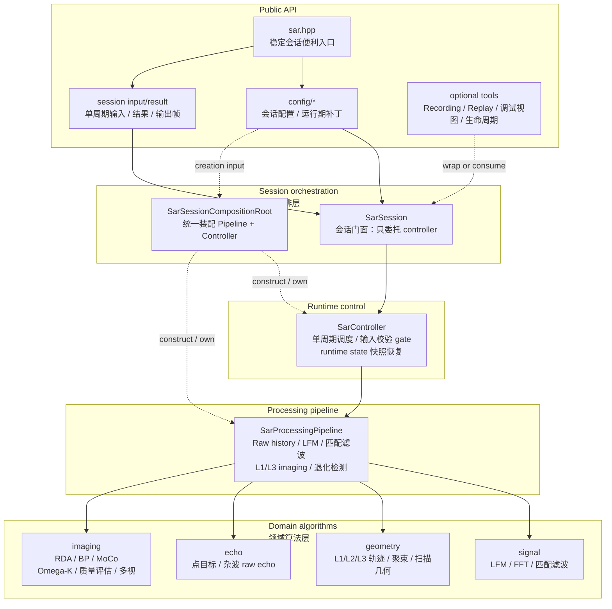
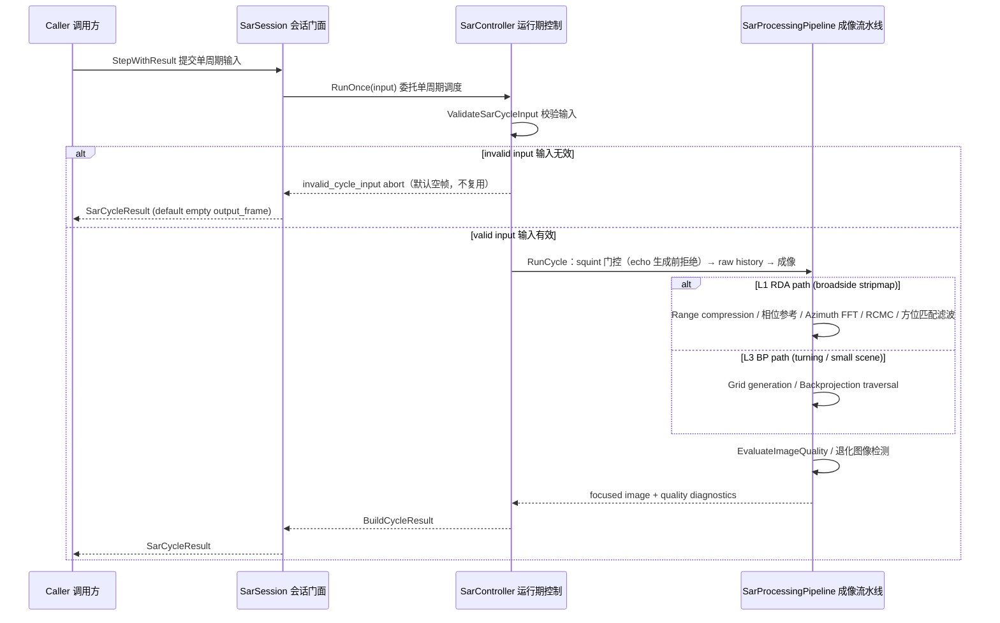
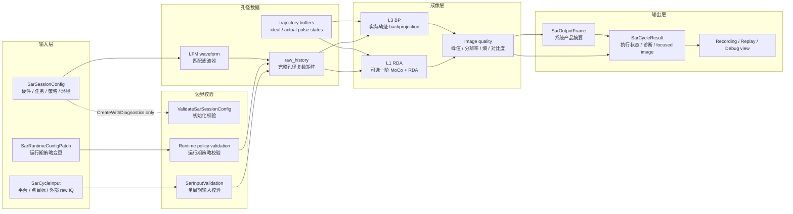
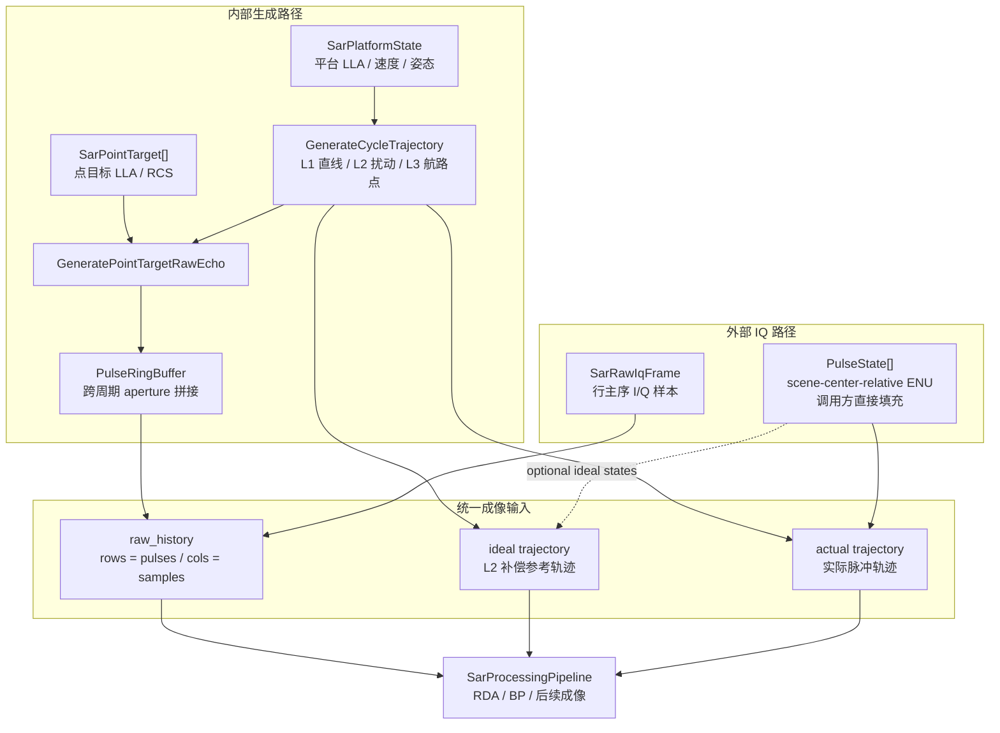

# SAR 数据流

本文承载 SAR 的架构图、Public API 边界、时序、主数据流和状态所有权。算法逐步逻辑读代码；
本文只回答"组件如何分层、数据如何流动、状态归谁"。

## Public API 与内部实现边界

公共头位于 `include/1q/sar/`：

| 区域 | 职责 |
|---|---|
| `sar.hpp` | 收窄后的稳定会话便利入口；只聚合 config、cycle input/result、input adapter、input validation 和 `SarSession` |
| `config/` | `SarSessionConfig` 四域配置、语义常量表（`SarProfileConstants.h`）、薄封装 builder、runtime patch、配置校验 |
| `session/` | `SarSession`、`SarCycleInput`、`SarCycleResult`、输入适配、Recording/Replay、debug/lifecycle |

`sar.hpp` 不是 SAR 全量 public header 汇总。Recording/Replay、debug view、lifecycle recorder 等工具头按需
单独包含；算法部件和聚焦中间态不通过 `sar.hpp` 暴露。

内部实现位于 `src/sar/`：

| 目录 | 职责 |
|---|---|
| `signal/` | FFT、LFM 波形、匹配滤波、距离压缩基础 |
| `geometry/` | L1/L2/L3 平台轨迹、天线、Spotlight beam、ScanSAR burst |
| `echo/` | 点目标 raw echo、分布式 clutter、天线门控回波 |
| `runtime/` | `SarController`（单周期调度、输入校验 gate、runtime state 快照/恢复）、`PulseRingBuffer` 和跨周期 aperture 拼接 |
| `pipeline/` | `SarProcessingPipeline`（raw history 构造、LFM/匹配滤波、L1/L3 imaging、退化图像检测） |
| `imaging/` | RDA、BP/GBP、MoCo、phase reference、quality、Omega-K、Spotlight、ScanSAR、Multilook、PGA/CSA evidence |
| `calibration/` | 辐射定标后处理 |
| `session/` | `SarSession`（对外门面）、`SarSessionCompositionRoot`（统一装配）、输入校验、Recording/Replay |
| `output/` | Binary / sidecar / HDF5 条件输出 |

`src/sar/SarSources.cmake` 是 SAR 源清单的集中入口。新增生产源必须进入该清单，并通过 SAR C++11/
冻结源/contract guard。

## 分层组件图

读图方式：
1. 新调用方从 `sar.hpp`、`SarSessionConfig`、`SarCycleInput` 和 `SarSession` 开始。
2. 需要记录或回放时，再单独包含 Recording/Replay 头。
3. `SarSessionCompositionRoot` 只在创建阶段装配并转移 Pipeline/Controller 所有权；它不参与周期调度。
4. 周期执行由 `SarSession` 委托 `SarController`，再由 Controller 调度 Pipeline。
5. `src/sar/imaging` 等目录可以被内部测试直接覆盖，但不构成 public customization surface。

## 执行时序

## 主数据流

主链路只展示"数据对象如何逐层变成结果"，不展开每个算法内部细节：

`SarSession()` 与 `SarSession::Create(config)` 是信任构造路径，不隐式调用初始化校验。
`CreateWithDiagnostics(config, issues)` 会报告 `ValidateSarSessionConfig` 的问题，但仍构造会话（非阻断，
见 contract.md §会话创建入口的非阻断语义）；真正阻断执行的是每周期输入/运行配置 gate。runtime patch
由 resolver 先生成候选配置并整体校验，失败时不替换当前配置。

### raw history 的两种来源

读图规则：
1. `SarSession` 只让两条 raw history 来源在 `raw_history + trajectory buffers` 处汇合。
2. RDA、BP 和后续成像算法不关心 raw history 是内部 echo 生成还是外部 IQ 输入。
3. 外部 raw IQ 的 pulse state 坐标由调用方以 scene-center-relative ENU 直接提供；库内不做
   ECEF/LLA 到 ENU 适配，也不负责平台/点目标 public 输入的批量转换。

## 生命周期与状态所有权

`SarSession` 的内部状态包括：

1. 当前 runtime config。
2. `PulseRingBuffer`：缓存跨周期 raw pulse，形成完整 aperture。
3. ideal / actual trajectory buffer：支撑 L2 MoCo、L3 BP 和 external raw IQ 轨迹消费。
4. `next_pulse_id` 与 `pulse_fraction_carry`：维持固定 PRF 下跨周期脉冲连续性。

会话不保留"上一有效输出"缓存——非执行周期（校验失败/执行 abort/设备关机）的输出帧严格不复用
（见 boundaries.md 非执行周期契约）。

落地后：`Step()` 返回产品（元数据 + 聚焦图像）；`StepWithResult()` 返回分层周期记录。
IQ 默认不进记录。落地前 `Step()` 仍只返回 `SarOutputFrame` 元数据。日志不作为状态判断依据。

### 内部轨迹分层

1. **L1**：`SarCycleInput.platform` 的本周期 LLA、时间、NED 速度和姿态是匀速直线轨迹的 authority；
   显式推进的输入位置不得再叠加全局 pulse ID 位移，三轴速度全零明确表示静止；输入时间未推进时才从
   上一脉冲连续外推。
2. **L2**：沿用同一 input-owned ideal 轨迹，在其上叠加确定性速度扰动，保留 ideal/actual 轨迹对。
3. **L3**：显式时间航路点拥有位置 authority，BP 使用 waypoint actual 轨迹逐脉冲聚焦。

[evidence: tests/unit/sar/sar_controller_runtime_state_test]

### 坐标边界

1. 平台和点目标 public 输入使用 LLA/NED 语义；内部生成路径按统一环境几何转换到局部 ENU
   （见 boundaries.md Environment 契约）。
2. raw IQ pulse state 使用 scene-center-relative ENU。
3. 外部 raw IQ pulse state 必须由调用方以 scene-center-relative ENU 提供；环境几何只存在于
   raw-history 构造边界，均不得散落进 imaging 算法。
