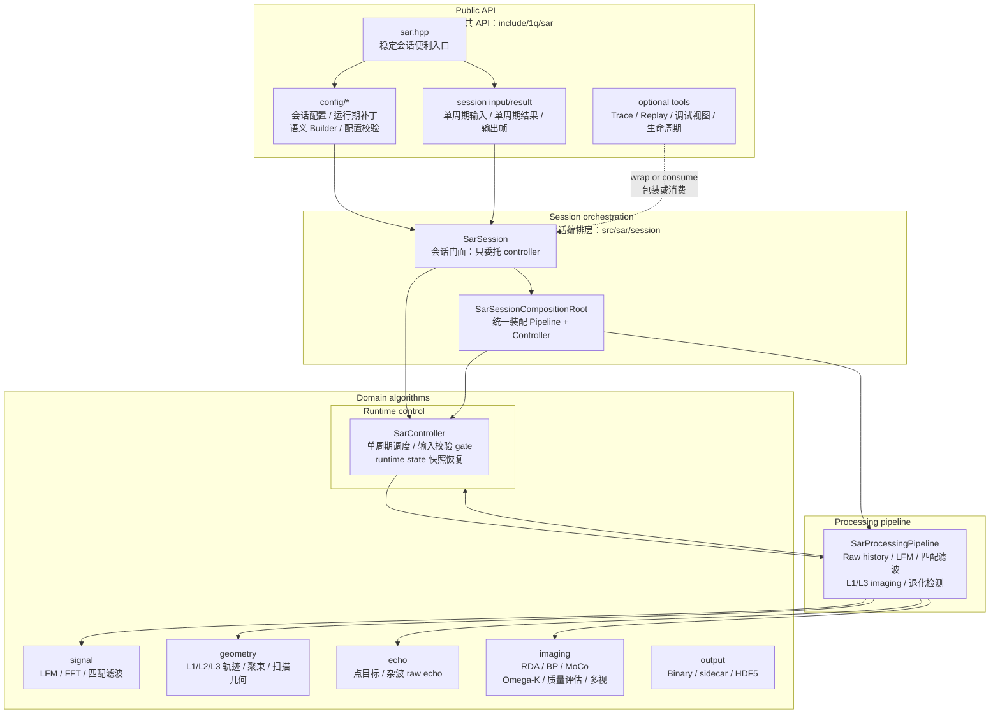
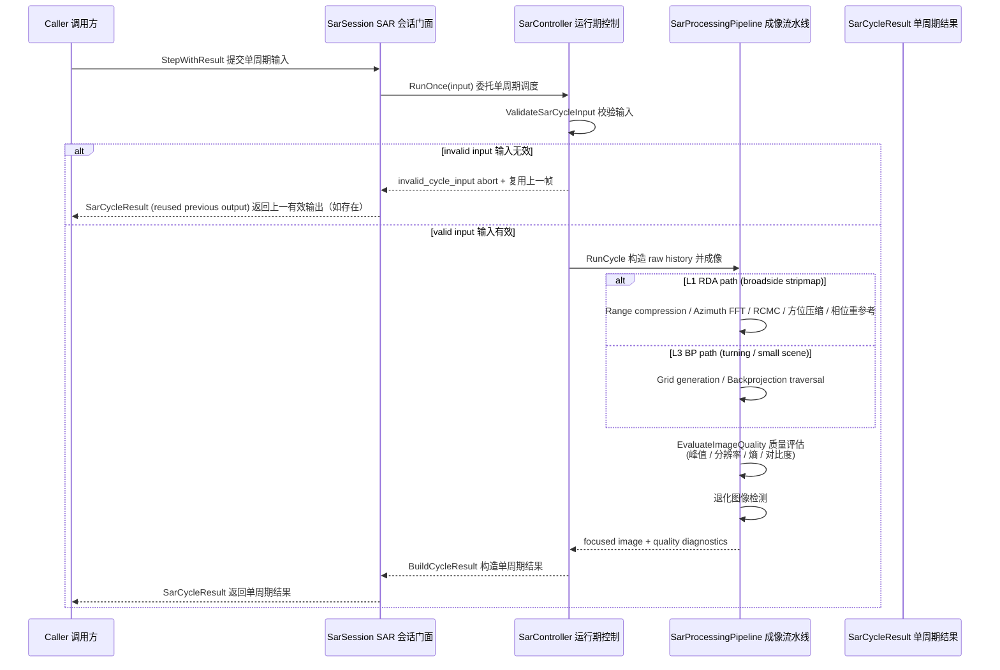
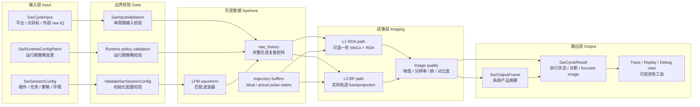
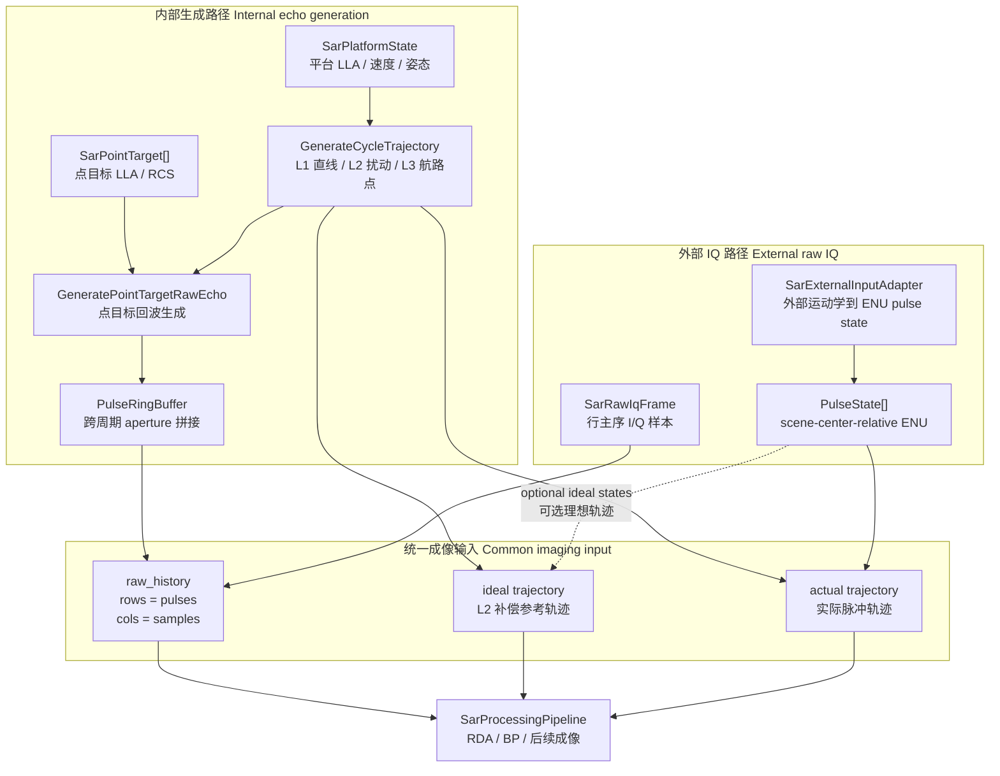

# SAR 当前设计

Status: active
Last-reviewed: 2026-07-06
Authority: current SAR module design

本文是 SAR 模块当前设计权威。它只描述当前 main 中仍成立的架构、数据流和算法边界；历史验收日志、旧合同、旧审计和被删除的 archive 原文不覆盖本文。

## 1. 架构设计说明

### 1.1 模块定位

SAR 模块负责合成孔径雷达的回波仿真、完整孔径 raw IQ 消费、距离压缩、聚焦成像、图像质量摘要、trace/replay 和运行期配置。模块对外提供稳定 `SarSession` 门面；算法部件、truth oracle、聚焦中间态和证据矩阵保持 internal。

当前设计目标：

- 对外保持窄 public API：配置、输入、会话、输出、trace/replay、输入适配和校验。
- 对内允许算法链持续演进：RDA、BP/GBP、Omega-K、Spotlight、ScanSAR、Multilook、MoCo、quality、calibration 等都在 `src/sar/` 内部组织。
- 让 session 数据流可验证：每一步失败必须能落到结构化 abort reason 或 diagnostic，而不是依赖日志文本。

### 1.2 Public API 与内部实现边界

公共头位于 `include/1q/sar/`：

| 区域 | 职责 |
|---|---|
| `sar.hpp` | 收窄后的稳定会话便利入口；只聚合 `sar_config.hpp`、cycle input/result、input adapter、external input adapter、input validation 和 `SarSession` |
| `config/` | `SarSessionConfig` 四域配置、semantic builder、runtime patch、配置校验 |
| `session/` | `SarSession`、`SarCycleInput`、`SarCycleResult`、输入适配、trace/replay、debug/lifecycle |

`sar.hpp` 不是 SAR 全量 public header 汇总。trace/replay、debug view、lifecycle recorder 等工具头按需单独包含；算法部件和聚焦中间态不通过 `sar.hpp` 暴露。

内部实现位于 `src/sar/`：

| 目录 | 职责 |
|---|---|
| `signal/` | FFT、LFM 波形、匹配滤波、距离压缩基础 |
| `geometry/` | L1/L2/L3 平台轨迹、天线、Spotlight beam、ScanSAR burst |
| `echo/` | 点目标 raw echo、分布式 clutter、天线门控回波 |
| `runtime/` | `SarController`（单周期调度、输入校验 gate、runtime state 快照/恢复）、`PulseRingBuffer` 和跨周期 aperture 拼接 |
| `pipeline/` | `SarProcessingPipeline`（raw history 构造、LFM/匹配滤波、L1/L3 imaging、退化图像检测、raw pulse/trajectory 累积状态快照） |
| `imaging/` | RDA、BP/GBP、MoCo、phase reference、quality、Omega-K、Spotlight、ScanSAR、Multilook、PGA/CSA evidence |
| `calibration/` | 辐射定标后处理 |
| `session/` | `SarSession`（对外门面，只委托 controller）、`SarSessionCompositionRoot`（统一装配 pipeline 与 controller）、输入校验、focused image assembler、trace/replay |
| `session/generated/` | FlatBuffers replay/trace 生成头 |
| `output/` | Binary / sidecar / HDF5 条件输出 |
| `smoke/` | 编译/链接烟雾测试 |

`src/sar/SarSources.cmake` 是 SAR 源清单的集中入口。新增生产源必须进入该清单，并通过 SAR C++11/冻结源/contract guard。

### 1.3 新开发者视角的分层图

这张图的阅读方式：

- 新调用方从 `sar.hpp`、`SarSessionConfig`、`SarCycleInput` 和 `SarSession` 开始。
- 需要记录或回放时，再单独包含 trace/replay 头。
- `src/sar/session` 是 public API 和算法部件之间的唯一编排层。
- `src/sar/imaging` 等目录可以被内部测试直接覆盖，但不构成 public customization surface。

### 1.4 执行时序图

### 1.5 数据流

主链路只展示“数据对象如何逐层变成结果”，不展开每个算法内部细节：

`raw_history` 本身有两种来源。下面这张图只解释孔径数据如何进入统一成像入口：

读图规则：

- `SarSession` 只让两条 raw history 来源在 `raw_history + trajectory buffers` 处汇合。
- RDA、BP 和后续成像算法不关心 raw history 是内部 echo 生成还是外部 IQ 输入。
- external adapter 只服务 raw IQ pulse state 坐标适配，不负责平台/点目标 public 输入的批量转换。

### 1.6 生命周期与状态

`SarSession` 的内部状态包括：

- 当前 runtime config。
- `PulseRingBuffer`：缓存跨周期 raw pulse，形成完整 aperture。
- ideal / actual trajectory buffer：支撑 L2 MoCo、L3 BP 和 external raw IQ 轨迹消费。
- `next_pulse_id` 与 `pulse_fraction_carry`：维持固定 PRF 下跨周期脉冲连续性。
- `previous_output`：输入或配置失败时允许复用上一有效输出。

`Step()` 只返回 `SarOutputFrame`；`StepWithResult()` 返回结构化执行状态、abort reason、diagnostics 和 focused image。日志不作为状态判断依据。

### 1.7 与 common 契约的关系

SAR 遵守 `docs/common/contract.md`：

- public API 只暴露稳定 session/config/input/output/trace/replay 门面。`SarSession` 是对外门面，只委托内部 `SarController`；Controller、ProcessingPipeline、CompositionRoot 不通过 public header 暴露。
- `SarSessionConfigBuilder` 是 semantic builder，不承担 leaf setter 或隐式 validation。
- SAR 输出遵守三层模型：系统输出、结构化结果、调试视图分离。
- `SarSession::StepWithResult` 在运行期配置和成像链路前调用 `ValidateSarCycleInput`；存在 error 级问题时记录 `invalid_cycle_input` abort 并按既有语义复用上一帧（符合 contract.md §实现安全与失败语义规则 3）。
- SAR runtime config 属于立即提交；`SarController` 在每次 pipeline 执行前捕获 raw pulse、
  trajectory、pulse ID 和 PRF 分数余量，执行 abort 时恢复这些跨周期状态并按需复用上一有效
  输出。配置不随执行失败回滚，执行状态也不得被失败周期污染。
- historical/raw evidence 不常驻 `docs/sar/`；当前事实只由五文件模型承载。

### 1.8 Environment 配置的保留与后续接入边界

`SarEnvironmentConfig` 是有意保留的 public 四域配置，不下沉、不删除，也不标记 deprecated。
当前生产链尚未消费其中字段，因此本版本中它们只参与 config 透传和 replay roundtrip；调用方不得
把字段变化解释为已改变 raw echo、聚焦图像或质量摘要。

后续接入方向已经确定，但物理公式和分批顺序仍需在实施前单独完成 Stage A：

- `terrain_reference_altitude_m` 应进入场景参考面、平台/目标相对高度和成像几何解析。
- `atmospheric_loss_db_per_km` 与 `enable_atmospheric_attenuation` 应共同控制内部生成 raw echo 的
  双程传播衰减；关闭开关时损耗参数不生效。
- `surface_backscatter_sigma0_db` 应进入分布式地表背景/杂波回波建模，不得机械叠加到点目标 RCS。
- `use_flat_earth_geometry` 应选择局部平面与曲面地球几何路径；两条路径必须共享明确的坐标、距离和
  高程基准，不能只改变字段而继续执行同一计算。
- 外部 raw IQ 已包含外部生成器的环境传播结果，session 不得再次施加上述衰减或背景模型。

任何字段首次接入生产计算时，必须同时补充启用/关闭对照、输出影响、非法值校验、内部 raw echo 与
外部 raw IQ 分流、replay 确定性和对应成像回归；在这些证据完成前保持当前 no-op 行为。

## 2. 本模块使用的算法

### 2.1 算法总览

| 算法/部件 | 入口 | 当前角色 | Public 默认 |
|---|---|---|---|
| LFM waveform / matched filter | `GenerateLfmWaveform` / `BuildMatchedFilter` | 基础发射波形和距离压缩匹配滤波器 | session 内部使用 |
| 点目标 raw echo | `GeneratePointTargetRawEcho*` | 从平台轨迹和点目标生成 raw history | session 内部使用 |
| Pulse ring buffer | `PulseRingBuffer` | 跨周期累计 aperture | session 内部使用 |
| RDA | `FocusStripmapRda` | L1 broadside stripmap 基础聚焦路径 | 受 policy 控制 |
| First-order MoCo | `ApplyFirstOrderMotionCompensation` | L2 扰动轨迹补偿 | 受 policy 控制 |
| BP/GBP | `FocusSmallSceneBp` / `FocusSmallSceneGbp` | L3 转弯/小场景参考成像 | 受 policy 和尺寸门控制 |
| Image quality | `EvaluateImageQuality` | 峰值、3dB 宽度、熵、对比度等摘要 | 输出摘要 |
| Phase reference | `ApplyBroadsideCenterPhaseReference` | RDA 全局相位重参考 | RDA 内部使用 |
| Omega-K | `FocusStripmapOmegaK` 及部件链 | 聚束/宽波束友好聚焦路径和证据链 | internal/受控 |
| Spotlight / ScanSAR | `FocusSpotlightOmegaK` / `FocusScanSarOmegaK` | 模式编排路径 | internal/受控 |
| Multilook | `ApplyMultilook` | 聚焦后图像域非相干多视 | internal/受控 |
| Radiometric calibration | `ExecuteCalibrationRequests` / `CalibrateMultiple` | 后处理标量定标：从已知 RCS 观测求解定标因子 | internal/受控 |

### 2.2 LFM、匹配滤波与距离压缩

SAR session 每周期先由 hardware config 生成 LFM waveform：

- bandwidth：`SarHardwareConfig::bandwidth_hz`
- sample rate：`SarHardwareConfig::sample_rate_hz`
- pulse width：`SarHardwareConfig::pulse_width_s`
- time-bandwidth product：`max(bandwidth * pulse_width, 1.0)`

匹配滤波器由发射波形构造。距离压缩是 RDA/BP 内部的基础处理，不作为 public 算法对象暴露。

适用边界：

- waveform 生成失败会中止周期。
- `enable_range_compression` 是 L1 RDA 与 L3 BP 的显式前置条件；关闭时成像配置在执行前被拒绝。
- 当前没有独立距离压缩载荷。只有 RDA/BP 实际成功执行内部距离压缩后才置位
  `has_range_compressed_echo`；`raw=false, range=true` 与 raw-only 路径均不得发布完成状态，live
  session 也不以 `kRangeCompression` 作为仅开关驱动的终态。该枚举只为既有 replay 保真保留。

[evidence: tests/unit/sar/sar_session_pipeline_test.cpp::RangeCompressionStatusRequiresExecutedImaging]
[evidence: tests/unit/sar/sar_session_pipeline_test.cpp::RdaRequiresRawEchoAndRangeCompression]
[evidence: tests/replay/sar/sar_replay_codec_roundtrip_test.cpp::CycleResultPreservesOutputAndDiagnostics]

验证入口：

- `tests/unit/sar_signal_chain_test.cpp`
- `tests/unit/sar_fft_backend_test.cpp`
- `tests/unit/sar_rda_test.cpp`

### 2.3 Raw history 构造

SAR 支持两条 raw history 来源：

1. 内部生成：由平台状态、点目标、L1/L2/L3 轨迹和 LFM 波形生成 raw echo，并通过 `PulseRingBuffer` 组成 aperture。
2. 外部 raw IQ：调用方提供完整孔径 IQ 样本和 pulse state，session 只校验与转换轨迹，不重新生成 echo。

内部生成路径的接收链按单站雷达方程处理：`peak_power_w`、双程天线增益、波长与
`system_loss_db` 决定回波幅度，随后按 `k * 290 K * bandwidth * noise factor` 叠加确定性复高斯
热噪声。`estimated_snr_db` 是完整孔径内加噪前平均接收信号功率与已知接收机噪声功率之比；功率、
增益、损耗、噪声系数的单变量变化必须分别满足正、正、负、负的方向性。

external raw IQ 已位于接收机之后，session 不得再次施加上述链路预算或噪声。现有 public 输入未携带
信号/噪声分量元数据，因此该路径将 `estimated_snr_db` 标为不可估计（`-inf`），记录
`sar.external_raw_iq_snr_unavailable`，并跳过 `minimum_snr_db` 门控；不得以峰均功率比冒充 SNR。

[evidence: tests/unit/sar/sar_session_pipeline_test.cpp::HardwareLinkBudgetControlsInternalRawEchoSnr]
[evidence: tests/unit/sar/sar_session_pipeline_test.cpp::MinValidSnrRejectsApertureBelowThreshold]
[evidence: tests/unit/sar/sar_session_pipeline_test.cpp::ExternalRawIqDoesNotReapplyHardwareOrSnrGate]

`retain_raw_phase_history` 控制结构化 `SarCycleResult` 是否返回本次**实际用于成像**的完整孔径：

- 关闭时不复制矩阵，`raw_phase_history` 为空且 source 为 `kNone`。
- 开启时必须同时启用 raw echo generation，否则 session 初始化和 runtime patch 均拒绝。
- 内部生成路径标记 `kInternallyGenerated`；external raw IQ 路径标记 `kExternalRawIq`，I/Q 顺序和值保持输入。
- 产品携带 pulse count、samples per pulse 和行主序 I/Q vectors；cycle-result replay 完整记录该产品，
  decode 校验尺寸乘法、精确长度和所有样本有限性。

该产品属于结构化执行结果，不进入 `SarOutputFrame`；失败周期不发布未完成孔径。
[evidence: tests/unit/sar/sar_session_pipeline_test.cpp]
[evidence: tests/unit/sar/sar_controller_runtime_state_test.cpp::PipelineAbortRestoresAllCrossCycleState]
[evidence: tests/replay/sar/sar_replay_codec_roundtrip_test.cpp]

内部轨迹分层：

- L1：`SarCycleInput.platform` 的本周期 LLA、时间、NED 速度和姿态是匀速直线轨迹的
  authority；显式推进的输入位置不得再叠加全局 pulse ID 位移。三轴速度全零时为兼容旧调用方
  才使用 mission 标称东向速度；输入时间未推进时才从上一脉冲连续外推。
- L2：沿用同一 input-owned ideal 轨迹，在其上叠加确定性速度扰动，保留 ideal/actual 轨迹对。
- L3：显式时间航路点拥有位置 authority，BP 使用 waypoint actual 轨迹逐脉冲聚焦；当前周期
  input 姿态仍随 pulse state 保存，不再从另一份内部配置派生。

[evidence: tests/unit/sar/sar_controller_runtime_state_test.cpp::PlatformInputOwnsGeneratedTrajectoryKinematics]

坐标边界：

- 平台和点目标 public 输入使用 LLA/NED 语义。
- raw IQ pulse state 使用 scene-center-relative ENU。
- ECEF/LLA 到 ENU 的适配集中在 `SarExternalInputAdapter`，不能散落进 imaging 算法。

验证入口：

- `tests/unit/sar_cycle_input_adapter_test.cpp`
- `tests/unit/sar_external_input_adapter_test.cpp`
- `tests/unit/sar_input_validation_test.cpp`
- `tests/unit/sar_raw_history_external_iq_predicate_test.cpp`

### 2.4 RDA 聚焦

RDA 是当前 L1 broadside stripmap 的基础聚焦路径。session 中 `ExecuteL1RdaImaging` 将 hardware/mission 字段映射为 `RdaConfig`：

- sample rate
- carrier frequency
- PRF
- platform velocity
- reference slant range
- RCMC interpolation

处理步骤概念上包括：

1. 距离压缩。
2. 方位向频域处理。
3. RCMC。
4. 方位压缩。
5. broadside center phase reference。
6. image quality diagnostics。

设计限制：

- 当前 RDA 是 broadside 基础路径，不把所有 squint/spotlight/turning 场景都硬塞进 RDA。\
  [evidence: `sar_rda_test.cpp` — RDA zero-squint 实现，单脉冲 Fallback 等 11 个用例覆盖率定语义]
- `max_allowed_squint_angle_deg` 是启用成像路径的执行门，必须有限且位于 `[0°, 90°)`。squint 由实际
  速度方向与指向场景中心 LOS 相对零多普勒 broadside 的夹角计算；存在完整实际脉冲轨迹时取孔径内
  最大绝对值，否则使用当前平台状态。超限以 `squint_angle_exceeds_limit` 中止，不自动切换到其它算法；
  raw-echo-only 模式不执行该成像门。
  [evidence: `sar_session_pipeline_test.cpp` — broadside、临界值、超限和 raw-only 对照]
- RDA 误差用相位曲率、Doppler margin、3dB 宽度、entropy、contrast 等诊断解释，不通过放宽阈值掩盖。\
  [evidence: `sar_image_quality_test.cpp` — 9 个用例覆盖 entropy/contrast/PSLR/ISLR/3dB width;\
   `sar_rda_test.cpp:DiagnosticsPreserveEquivalentAzimuthSpacingAndPhaseCurvature` — 相位曲率与 Doppler Nyquist margin 诊断]
- RDA focused image 是否完整保留由 `retain_focused_image` policy 控制；关闭时只输出占位元数据。

验证入口：

- `tests/unit/sar_rda_test.cpp`
- `tests/unit/sar_phase_reference_test.cpp`
- `tests/unit/sar_image_quality_test.cpp`
- `tests/unit/sar_reference_scenario_matrix_test.cpp`

### 2.5 一阶运动补偿

L2 MoCo 在 RDA 前对 raw history 施加一阶运动补偿：

- 输入：ideal trajectory、actual trajectory、raw history、reference point。
- 输出：补偿后的 raw history。
- 诊断：最大/RMS range error、envelope shift bins。

补偿参考点由 nominal slant range 给出。该算法解决直线轨迹扰动下的一部分相位误差，不授权二阶补偿或自动算法选择。\
[evidence: `sar_second_order_motion_compensation_evidence_test.cpp:PhaseAFailureEvidenceMatrix` — NRMS<0.25 且 Coherence>0.97 门限; 6m 偏移通过, 9m 起失效; DO_NOT_TRIGGER_PHASE_B;\
 `sar_l2_l3_fidelity_matrix_test.cpp` — L2/L3 一阶适用性矩阵]

限制：

- ideal/actual 轨迹长度必须等于 raw history 行数。
- 对强转弯场景，失效根因通常是 RDA 轨迹假设，不应简单归因为二阶残余相位。\
  [evidence: `sar_second_order_motion_compensation_evidence_test.cpp:PhaseAFailureEvidenceMatrix` — 参考点(二阶残余恒为零)从 9m 起已失效, 排除了"残余相位是主因"假设;\
   同文件 `SecondOrderPhaseIsZeroWhenTargetEqualsReference` — 不变量验证参考点二阶相位严格为零]

验证入口：

- `tests/unit/sar_motion_compensation_test.cpp`
- `tests/unit/sar_l2_l3_fidelity_matrix_test.cpp`
- `tests/unit/sar_second_order_motion_compensation_evidence_test.cpp`

### 2.6 BP/GBP 小场景聚焦

BP/GBP 共享 backprojection 内核，区别主要是遍历顺序。session 的 L3 路径使用 `FocusSmallSceneBp`：

- 输入 actual trajectory、raw history、matched filter。
- 网格由 mission 的 pulse/sample 数和 hardware sample rate 推导。
- 输出 focused image 与 traversal diagnostics。

BP 的价值是用实际逐脉冲几何承接 L3 航路点/转弯小场景，而不是对 RDA 做越来越多补丁。

限制：

- 受尺寸门约束，不作为无限规模生产聚焦器。\
  [evidence: `sar_gbp_test.cpp:RejectsSceneBeyondApproved128SquareGate` — kMaxApprovedDimension=128, azimuth+range pixel count 超 128 被拒绝;\
   `sar_rda_test.cpp` — RDA size gate: 1024×1024]
- 不默认引入并行、GPU 或快速 BP。
- BP quality summary 只输出当前可稳定承诺的摘要；米制分辨率有效性与 RDA 不完全相同。

验证入口：

- `tests/unit/sar_gbp_test.cpp`
- `tests/unit/sar_l2_l3_fidelity_matrix_test.cpp`
- `tests/unit/sar_session_pipeline_test.cpp`

### 2.7 Omega-K、Spotlight 与 ScanSAR

Omega-K 部件链包括 spectrum front-end、Stolt geometry/interpolation、common support、grid reduction、relative delay、reference mapping、reference phase compensation 和 azimuth inverse transform。这些已编译的内部部件用于受控算法证据与局部验证；当前 session 主链不装配 Omega-K、Spotlight 或 ScanSAR。

设计判断：

- Omega-K 更适合聚束和宽波束类的后续受控路径，优先于重新扩展完整 CSA。\
  [evidence: `sar_csa_complete_focusing_evidence_test.cpp:RdaBroadsideApproximationDegradationMatrix` — 所有孔径 |alpha| max<0.018, RDA worst NRMS=1.38; Omega-K 全覆盖; DO_NOT_TRIGGER_PHASE_B;\
   `tests/unit/sar_omega_k_*_test.cpp` — 12+ 测试覆盖 Omega-K 各部件链]
- Spotlight 与 ScanSAR 的部件、时变 beam 和 burst 逻辑已可独立验证，但尚未接入 session 主链。

能力晋级门（仅适用于内部候选算法，不创建新的 public 类型）：

| 级别 | 进入条件 | 当前算法 |
|---|---|---|
| `experimental` | 可编译，且局部单元测试明确输入、输出与拒绝边界 | Spotlight Omega-K、ScanSAR Omega-K |
| `characterized` | 除局部测试外，已有确定性、质量/失效矩阵或受控证据 | stripmap Omega-K |
| `production-eligible` | 已冻结场景范围、门限、失败语义与集成证据；仍未改变 session 装配 | 当前无候选 |
| `session-wired` | 已接入 `SarProcessingPipeline`，并覆盖 config、输出/abort、replay 与 session 集成 | L1 RDA、L3 BP |

Stripmap Omega-K 的 Stage A 矩阵冻结为 L1、匀速直线、broadside stripmap，且只允许以
`BuildRawPulseHistory` 生成的孔径调用 `FocusStripmapOmegaK`；Spotlight、ScanSAR、squint、L2/L3
轨迹与 session 接线均不在本候选内。参数对照表明，复用 RDA 单元测试的缩小配置（1 GHz、20 Hz PRF、
2 m/s、100 MHz、9×64）时，最大 Stolt 频移超过距离频率支持区，公共有效列为零并稳定在
`grid_reduction/kInvalidCommonSupport` 拒绝；保持其余参数不变、仅把平台速度提高到 5 m/s 后，
同一 `BuildRawPulseHistory → FocusStripmapOmegaK` 路径恢复公共支持并确定性聚焦成功。因此直接原因是
缩小配置破坏了 Omega-K 的几何比例，而不是内部编排器普遍不可用。当前支持判定仍按全部 PRF FFT 行
取交集，不考虑实际能量占用的多普勒带宽；这是保守模型，但尚无证据证明应放宽。参考距离不参与
公共支持区计算，只参与 front-end 参考相位。

仓库仍没有可追溯、独立的物理真值数据，synthetic fixture 也会被 truth eligibility 拒绝为非物理证据，
所以结论保持 `characterized`，不得进入质量门限或 `production-eligible`。下一 probe 是提供带 manifest、
digest、provenance、`physical_evidence=true` 和 `independently_generated=true` 的独立 L1 真值，并将
实际输出送入验收器。

[evidence: `sar_omega_k_l1_raw_history_stage_a_test.cpp:RejectsGeneratedL1ApertureAtGridReductionDeterministically` — 缩小配置公共支持为零并稳定拒绝;
 `sar_omega_k_l1_raw_history_stage_a_test.cpp:CompatibleVelocityRestoresCommonSupportAndFocusing` — 单变量速度对照恢复同一路径完整聚焦;
 `src/sar/imaging/SarOmegaKCommonSupport.cpp:DiagnoseOmegaKCommonStoltSupport` — 全方位 FFT 行共同支持交集;
 `src/sar/imaging/SarOmegaKSpectrumFrontEnd.cpp:ExecuteOmegaKSpectrumFrontEnd` — 参考距离仅用于 bulk 参考相位;
 `sar_omega_k_truth_eligibility_test.cpp:KeepsSyntheticFixtureIneligible` — synthetic fixture 不可作为物理验收真值;
 `sar_omega_k_truth_eligibility_test.cpp:AuthorizesEligibleDatasetForEvaluationOnly` — manifest/digest/provenance 独立真值门]

`session-wired` 只陈述当前会话已装配的能力，不把它泛化为所有场景的性能承诺。候选算法必须逐级提供证据；不得因已有 internal 实现而跳级或新增未接线算法族。\
[evidence: `src/sar/pipeline/SarProcessingPipeline.cpp:RunCycle` — 只调用 `ExecuteL1RdaImaging` 和 `ExecuteL3BpImaging`;\
 `sar_session_pipeline_test.cpp:StepWithResultRunsRawRangeAndRdaPipeline` — session 输出 L1 RDA stage;\
 `sar_omega_k_focusing_test.cpp`、`sar_omega_k_spotlight_test.cpp`、`sar_omega_k_scansar_test.cpp` — internal 算法的独立验证]

限制：

- 这些路径不自动变成 public/session 默认行为。\
  [evidence: `src/sar/imaging/SarOmegaKFocusing.h:FocusStripmapOmegaK` — Omega-K 已有内部单入口编排器;\
   `src/sar/pipeline/SarProcessingPipeline.cpp:RunCycle` — 缺失的是该入口到 pipeline/session 的接线;\
   `sar_session_pipeline_test.cpp` — session 默认只启用 RDA/BP, 不包含 Omega-K/Spotlight/ScanSAR]
- truth ingestion、manifest、payload digest 和 eligibility gate 属于证据链，不是普通 public API。\
  [evidence: `src/sar/` 中无 `public` 路径暴露 truth oracle 或 eligibility 类型;\
   `sar_csa_complete_focusing_evidence_test.cpp` — CSA 否决证据;\
   `sar_pga_autofocus_closure_evidence_test.cpp` — PGA 否决证据]

验证入口：

- `tests/unit/sar_omega_k_*_test.cpp`
- `tests/unit/sar_omega_k_spotlight_test.cpp`
- `tests/unit/sar_omega_k_scansar_test.cpp`
- `tests/unit/sar_scan_burst_test.cpp`
- `tests/unit/sar_spotlight_beam_test.cpp`

### 2.8 Multilook、radiometric calibration 与受限能力

Multilook 是聚焦后图像域非相干多视，消费任意 focused complex image，不侵入聚焦器主链路。

Radiometric calibration 是后处理标量定标能力，当前不扩大为完整生产级雷达方程 public contract。定标入口为 `ExecuteCalibrationRequests`（批量请求执行），底层使用 `CalibrateSingle`/`CalibrateMultiple` 从已知 RCS 观测求解定标因子。\
[evidence: `sar_radiometric_calibration_test.cpp` — 覆盖 CalibrateSingle/Multiple/ExecuteCalibrationRequests;\
 `src/sar/calibration/` — 2 文件约 340 行, 按当前契约不扩展为 public API]

受限或否决方向：

- 完整 CSA：当前无独立增量，Omega-K 覆盖主要需求。\
  [evidence: `sar_csa_complete_focusing_evidence_test.cpp:RdaBroadsideApproximationDegradationMatrix` — 所有孔径 |alpha| max<0.018, RDA worst NRMS=1.38 均显著超阈值; DO_NOT_TRIGGER_PHASE_B;\
   `src/sar/imaging/SarCsaGeometry.h` — CSA 仅 geometry+oracle, main flow 0% implemented]
- PGA closure：当前 MoCo 已覆盖直线扰动场景，PGA 闭环不进入默认生产路径。\
  [evidence: `sar_pga_autofocus_closure_evidence_test.cpp:MotionCompensationResidualDefocusMatrix` — 所有 MoCo 补偿后 NRMS<0.17 (阈值 0.25), Coherence>0.985; DO_NOT_TRIGGER_PHASE_B]
- 二阶 MoCo：强转弯失败主因是 RDA 轨迹假设，不是简单二阶相位补偿。\
  [evidence: `sar_second_order_motion_compensation_evidence_test.cpp:PhaseAFailureEvidenceMatrix` — NRMS 6m=0.177/通过, 9m=0.273/失效, 12m~18m 持续恶化;\
   `grep -r 'SecondOrder\|second_order' src/sar/` 返回零命中]
- 缺失脉冲修复、NUFFT、生产 RDA 自动接入：保留诊断和拒绝矩阵，不默认启用自动修复。\
  [evidence: `sar_missing_pulse_rejection_matrix_test.cpp` — 3 个用例覆盖 baseline/single-missing/separate-missing 路径, gap_ratio≥1.5 硬拒绝]

验证入口：

- `tests/unit/sar_multilook_test.cpp`
- `tests/unit/sar_radiometric_calibration_test.cpp`
- `tests/unit/sar_csa_complete_focusing_evidence_test.cpp`
- `tests/unit/sar_pga_autofocus_closure_evidence_test.cpp`
- `tests/unit/sar_missing_pulse_*_test.cpp`

## 3. 非目标与边界

- 不恢复旧会话工厂或旧文档树。
- 不把 internal algorithm object 变成 public 替代入口。
- 不把历史 evidence 文档重新常驻 `docs/sar/`。
- 不为形式对称把 SAR 输入改造成其它模块的 external adapter 模型。
- 不用测试阈值放宽替代模型、坐标、算法和契约问题的拆分。

上述边界由当前 `docs/sar/` 五文件模型和 public API 契约测试守护。\
[evidence: `tests/contract/check_sar_doc_governance.cmake` — 文档结构守护;\
 `tests/contract/check_public_api_boundary.cmake` — public header 边界守护;\
 `sar.hpp` — PIMPL + private ctor + factory friend 阻止外部构造;\
 `include/1q/sar/` — public headers 不暴露 imaging/calibration/echo 等内部类型]

## 4. 设计变更规则

1. public header、session/config/input/output 变化必须同步本文和 public API contract 测试。
2. pipeline、轨迹、raw history、聚焦路径或算法限制变化必须同步本文。
3. 能力启用、否决或替代关系必须在本文 `[evidence: ...]` 标注中记录依据。
4. 历史原因只保留本文的摘要说明，不恢复被删除的旧审计文档目录。
5. 验证优先使用 `ci_required` 中的 SAR replay/integration/guard、`compatibility::sar` 和 `unit::sar`。
