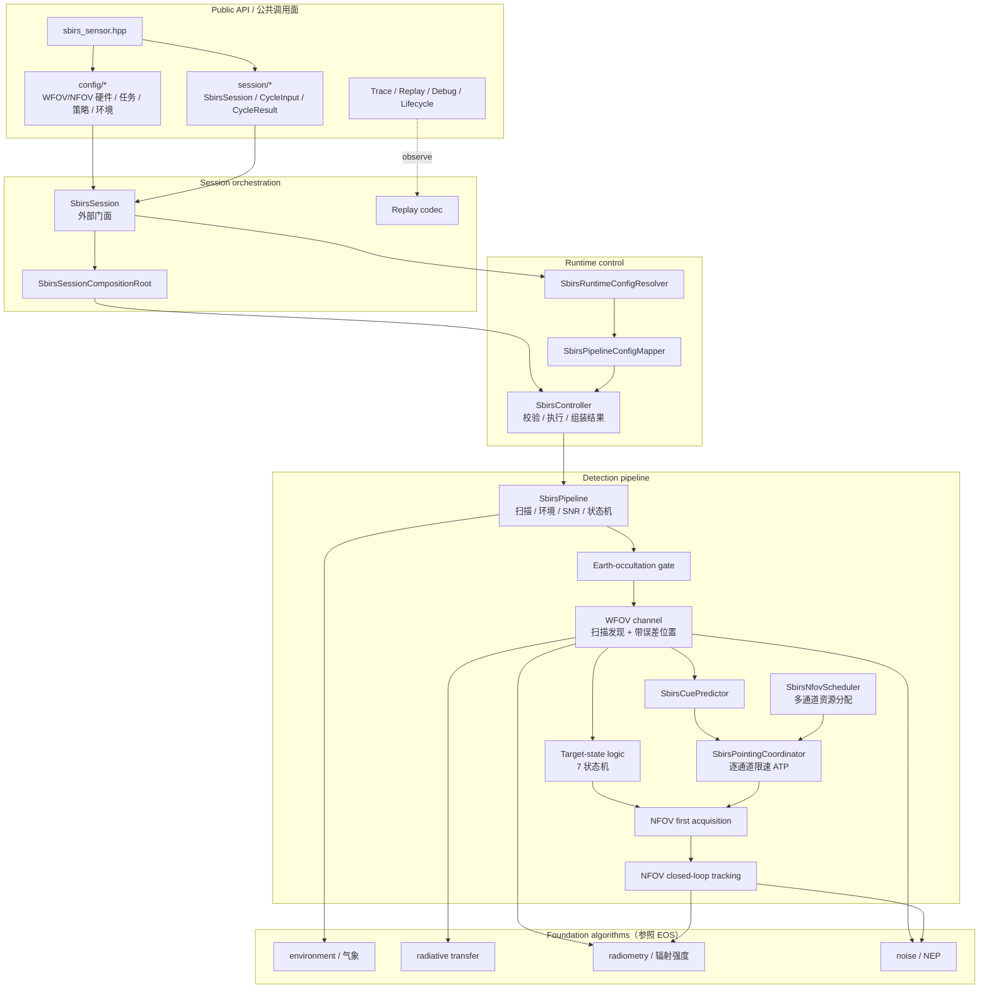
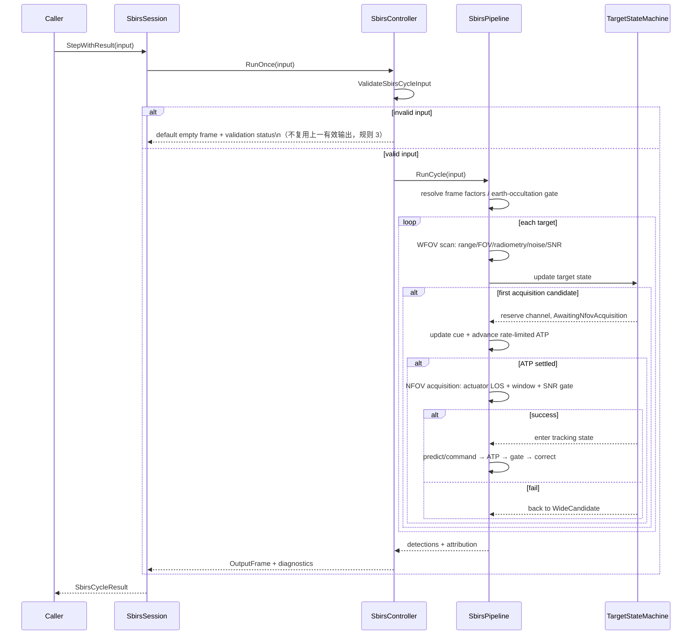

# SBIRS 数据流

本文承载 SBIRS 的架构图、Public API 边界、时序、主数据流和 runtime patch 状态迁移。算法逐步逻辑
读代码；本文只回答"组件如何分层、数据如何流动、状态如何迁移"。

## Public API 与内部实现边界

公共头位于 `include/1q/sbirs_sensor/`，命名空间 `sbirs_sensor`，public 类型前缀 `Sbirs*`：

| 区域 | 职责 |
|---|---|
| `sbirs_sensor.hpp` | 模块聚合入口；只聚合稳定 public API，不暴露 foundation/pipeline/runtime/state-machine 内部类型 |
| `config/` | `SbirsSessionConfig`、runtime patch、semantic builder、config validation；表达硬件（WFOV/NFOV）、任务、策略、环境四域 |
| `session/` | `SbirsSession`、cycle input/result、scene target、output types、adapter、trace/replay、debug/lifecycle |

SBIRS 不在公开头文件中暴露 `electro_optical_sensor`、`Eos*` 或 `1q/electro_optical_sensor/...`。EOS 仅作为
foundation 物理算法的迁移参考，不构成 SBIRS 的对外集成依赖。

内部实现位于 `src/sbirs_sensor/`：

| 目录 | 职责 |
|---|---|
| `config/` | 内部执行配置 `SbirsInternalExecutionConfig` |
| `foundation/` | 光学、传播、辐射、噪声、空间频谱基础算法（参照 EOS foundation 复制改名） |
| `environment/` | 环境模型与气象衰减 |
| `pipeline/` | WFOV/NFOV 编排、首次捕获、调度与估计跟踪运行态 |
| `runtime/` | controller、config mapper、runtime config resolver |
| `session/` | public session 装配、输入输出适配、trace/replay、debug/lifecycle |

## 与 EOS 的关系：派生 + 独立

1. foundation 物理算法（辐射强度接收功率、标量路径透过率、光子/热/读出噪声、SNR 合成）参照 EOS
   foundation 层复制并改为 `sbirs_sensor` 命名空间和 `Sbirs*` 类型；目标签名由调用方以辐射强度
   （W/sr）提供，SBIRS 侧不再包含 Planck 换算。这些算法是内部可测试实现，不是 public 契约。
2. pipeline、controller、session 三层**全部独立实现**，不复用 EOS 代码。EOS 是单视场扫描 + 单次 SNR
   判定；SBIRS 是双视场 + 状态机调度。
3. 复制来的算法允许按天基场景修正常数和几何输入，但必须保持调用面由 `SbirsPipeline` 统一编排。

## 分层组件图

## 执行时序

运行期配置采用**立即提交**策略（与 EOS 同类，见 contract.md 运行期配置提交策略表）。当前 `RunCycle` 后
不存在可能失败的 commit 步骤，因此 controller 不捕获或恢复 pipeline。pipeline snapshot 仅是经完整校验的
internal checkpoint，用于确定性 continuation 与状态恢复测试，不上升为 session 层事务契约。

## runtime patch 状态迁移表

resolver 按旧、新配置的字段差异生成内部 impact；相同值 patch 合法但不迁移状态。pipeline 的迁移表：

| 变化 | 保留 | 定向迁移 |
|------|------|----------|
| environment、WFOV 门限、普通 FOV/range/cue/pointing 数值、scan rate | scan、lock、cue、filter、actuator、全部随机流 | 无 |
| 扫描扇区/俯仰栅格（scan_start/span/direction、el start/span/step） | 行内 scan phase 按旧绝对方位重算 | scan row 索引重锚到新栅格最近行（旧 el 不在新栅格内则归零） |
| R/Q、NIS 周期或误差统计 | filter 均值与协方差 | NIS 连续计数归零 |
| NFOV 门限/FOV、指向扰动参数、NFOV gate-loss 周期 | lock 与 actuator | NFOV 连续门失败计数归零 |
| 初始化协方差 | 所有既有航迹 | 只影响后续新航迹 |
| measurement seed / pointing seed | 另一随机流；pointing seed 还保留绑定和 actuator LOS | 分别只重启所属随机流/扰动 epoch |
| EKF/IMM 结构 | 非估计状态 | 释放不兼容 estimated track，后续允许重捕获 |
| NFOV 通道扩/缩容 | 低编号通道及其绑定/actuator/filter | 扩容新增空闲高编号；缩容确定性释放越界目标 |
| standby / power-off | scan phase；未改 seed 的测量随机流 | 清空 target、cue、NFOV、pointing、tracking |

通道数/pointing 的多组件迁移先构造临时 scheduler 和 coordinator，验证保留映射一致后再整体替换；这属于
pipeline 内部原子状态替换，不虚构 session rollback。

[evidence: tests/unit/sbirs_sensor/sbirs_runtime_config_resolver_test]
[evidence: tests/unit/sbirs_sensor/sbirs_pipeline_test]

## 主数据流

```mermaid
flowchart LR
  subgraph Input["Input"]
    Config["SbirsSessionConfig\nWFOV/NFOV / Mission / Policy / Environment"]
    Cycle["SbirsCycleInput\n卫星姿态 / 环境快照 / 目标列表"]
    Patch["SbirsRuntimeConfigPatch"]
  end

  subgraph Runtime["Runtime mapping"]
    Internal["SbirsInternalExecutionConfig"]
    Frame["FrameContext\n帧级上下文（含卫星轨道几何）"]
  end

  subgraph Geo["Geometric gating"]
    Occult["Earth occultation"]
    WfovGate["WFOV FOV gate"]
    RangeGate["Range gate"]
  end

  subgraph Wfov["WFOV discovery"]
    Wsnr["WFOV IR SNR"]
    Werr["带误差位置"]
    Weather["气象衰减"]
  end

  subgraph State["State machine"]
    SM["7 状态机"]
    Handoff["Handoff\n首次捕获判定"]
    Sched["NFOV scheduler"]
  end

  subgraph Nfov["NFOV channel"]
    Acq["首次捕获"]
    Track["闭环跟踪"]
  end

  subgraph Output["Output"]
    Raw["SbirsOutputFrame"]
    Result["SbirsCycleResult"]
    Trace["Trace / Replay"]
  end

  Config --> Internal
  Patch --> Internal
  Cycle --> Frame
  Internal --> Frame
  Frame --> Occult
  Occult --> WfovGate
  WfovGate --> RangeGate
  RangeGate --> Weather
  Weather --> Wsnr
  Wsnr --> Werr
  Werr --> SM
  SM --> Handoff
  Sched --> Handoff
  Handoff --> Acq
  Handoff --> Track
  Acq --> Raw
  Track --> Raw
  Wsnr --> Raw
  Raw --> Result
  Result --> Trace
```

## 输入校验边界（dt_sec）

单周期输入在任何 pipeline mutation 之前 fail-closed 校验：

1. `dt_sec` 必须正、有限、且不超过 `10 / frame_rate_hz`（默认 10 Hz → 上限 1.0 s；`frame_rate_hz` 来自
   任务域配置，创建后不可变）。
2. 该上界仅适用于 SBIRS 与 EOS（凝视/成像传感器有 frame_rate_hz 概念）；SAR/ESR/AR **故意不含**此上界。
3. 卫星和目标 ECEF 必须有限且非原点；`target_id` 必须非零且周期内唯一；
    UTC 儒略日（`utc_julian_day`）必须正有限（缺失 = 0 即校验拒绝；ECI 输出参考系必需）。
4. 目标速度在 `has_velocity_ecef_m_per_s=true` 时必须有限，为 false 时必须是有限零向量。
5. 卫星速度（`satellite_velocity_ecef_m_per_s`）必填（2026-08-17 起，合同指标 2）：缺失或非有限即
    校验拒绝（code `sbirs.validation.invalid_satellite_velocity`）；ECEF 零向量合法（如 GEO 卫星）。
    速度旋入 ECI 后与目标速度合成相对视线角速度，驱动动态滞后误差、cue 延迟外推与 EKF R 阵。
6. 卫星姿态（`satellite_attitude_eci_body_deg`）必填（2026-08-17 起，阶段 2 指向合成链）：缺失或
    非有限即校验拒绝（code `sbirs.validation.invalid_satellite_attitude`）；零欧拉合法（体轴对齐
    ECI）。姿态与安装角（及阶段 3 安装失准，静态配置）复合为指向合成链，驱动 WFOV/NFOV 内部光轴
    几何；安装失准 bias/sigma 由会话配置校验（code `sbirs.validation.invalid_misalignment`）。
7. 启用 environment override 时，天气/海况枚举、绝对温度下限、湿度、能见度、透过率和交互权重全部校验。

拒绝周期不捕获也不恢复 pipeline（其随机源、扫描、cue、ATP、调度和跟踪状态从未推进），`Step()`
返回默认空帧，**不复用上一有效输出**（规则 8）。

[evidence: tests/unit/sbirs_sensor/sbirs_input_validation_test]
[evidence: tests/integration/sbirs_sensor/sbirs_session_test]
