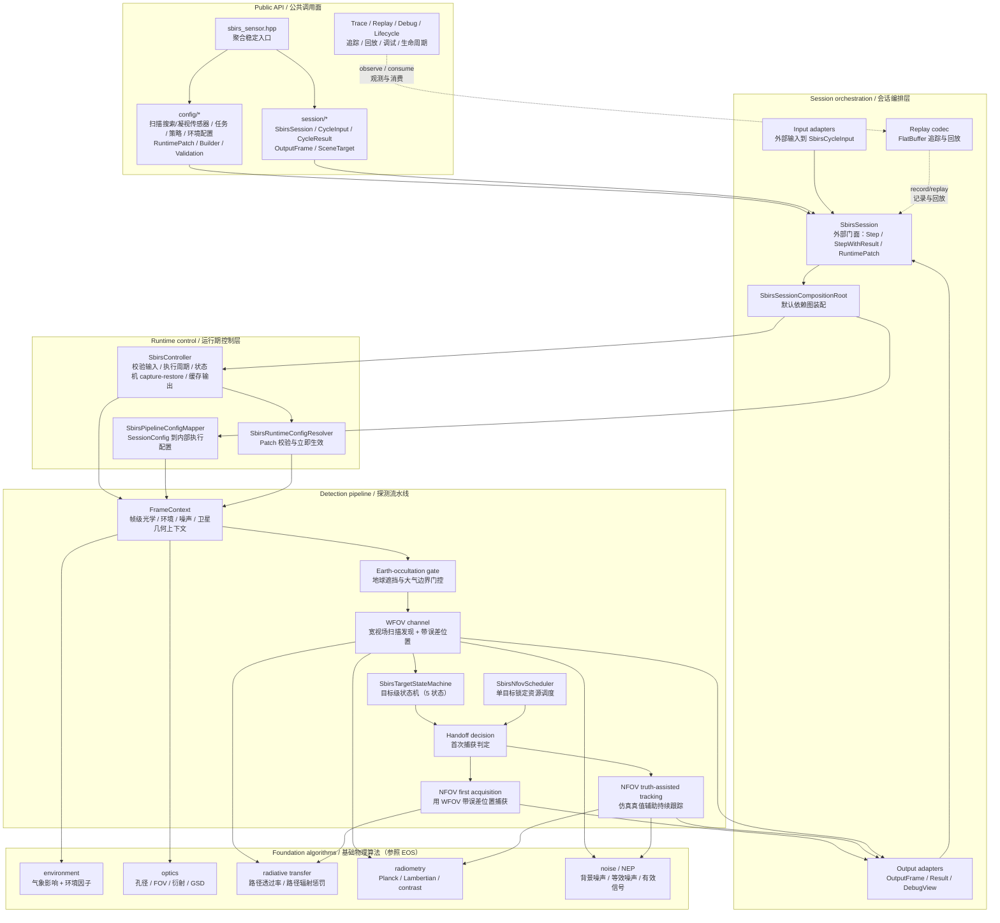
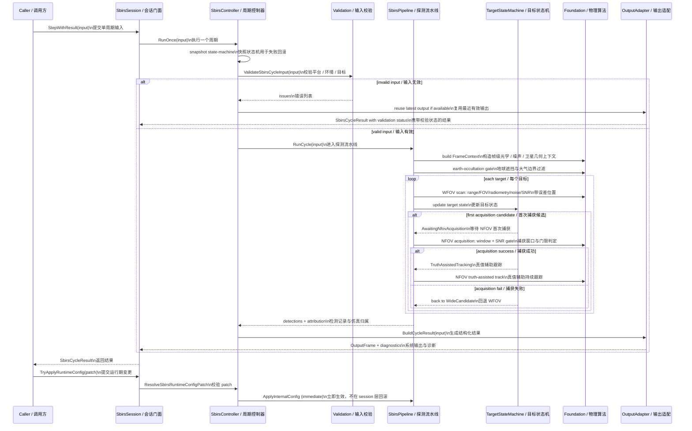
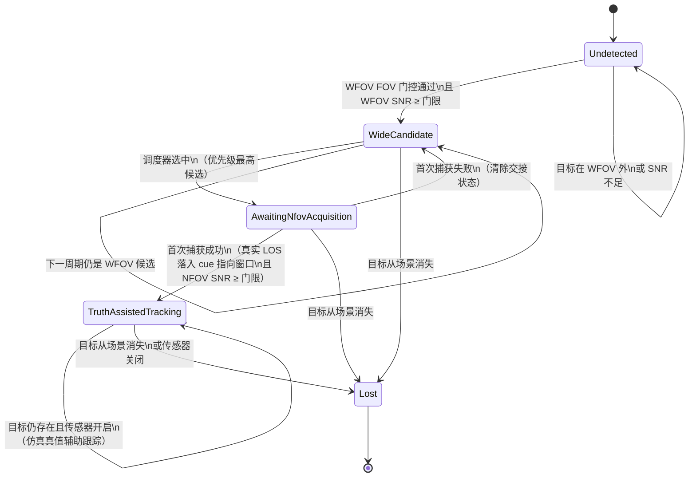

# Space-Based Infrared Sensor (SBIRS-inspired) 目标设计

Status: draft
Last-reviewed: 2026-07-06
Authority: target design for the new `sbirs_sensor` module

本文是 `sbirs_sensor`（天基红外预警仿真传感器）模块的设计权威文档。模块尚未实现，本文描述
目标架构、数据流和算法边界。跨模块 public API、builder、三层输出等共同规则见
`docs/common/contract.md`。

本文以公开 SBIRS / OPIR 资料中的扫描红外传感器与 step-staring/staring 红外传感器为真实系统校准点，
但不声称复刻真实 SBIRS 设备、保密载荷或地面处理链路。本文中的 WFOV / NFOV 是面向仿真实现的
宽域搜索 / 窄域凝视抽象：WFOV 对应扫描搜索能力，NFOV 对应可任务化凝视与高灵敏度区域覆盖能力。

原始需求见同目录 `红外模型1205-V3.0.md`（pandoc 转换自同名 docx，下文引用其行号）。
实现计划草案见 `filter.md`；历史审查结论见第 5 节。

## 1. 架构设计说明

### 1.1 模块定位

`sbirs_sensor` 提供天基红外预警仿真传感器的配置、单周期输入、环境与大气建模、扫描搜索发现、
凝视捕获/跟踪、搜索→凝视交接（cueing & handover）、多目标状态管理、融合输出、trace/replay、
调试视图和生命周期事件。

与 EOS 的核心差异在于**扫描搜索 + 凝视资源调度 + 状态机驱动交接**：EOS 是单视场扫描探测器，对
FOV 内目标做一次性 SNR 判定；SBIRS-inspired 模型用 WFOV 宽域扫描发现目标，首次进入 NFOV 时用
WFOV 带误差 cue 生成凝视指向并做捕获判定，捕获成功后进入仿真简化的持续跟踪，捕获失败回退 WFOV
继续搜索。

它不是一个通用图像处理或航迹滤波框架。当前模块的稳定外部使用方式是：

1. 使用 `SbirsSessionConfig` 或 semantic builder 描述硬件、任务、策略、环境四域配置。
2. 使用 `SbirsCycleInput` 或 input adapter 提供平台（卫星）姿态、环境和目标场景。
3. 调用 `SbirsSession::Step()` 获取 1q 仿真传感器主输出，或调用 `SbirsSession::StepWithResult()`
   获取结构化执行结果。
4. 通过 runtime patch 调整工作模式、扫描速率、检测阈值、NFOV 资源策略和环境模型等有限运行期参数。

当前模块不提供 public pipeline/controller/environment-service/state-machine 自定义点。外部如果
需要改变物理行为，应通过配置和输入表达；如果需要排查仿真归属，应消费 `SbirsCycleResult`、
debug view、lifecycle 或 replay，而不是把仿真真值塞进 raw output。

### 1.2 Public API 与内部实现边界

公共头位于 `include/1q/sbirs_sensor/`，命名空间 `sbirs_sensor`，public 类型前缀 `Sbirs*`：

| 区域 | 职责 | 设计约束 |
|---|---|---|
| `sbirs_sensor.hpp` | 模块聚合入口 | 只聚合稳定 public API，不暴露 foundation/pipeline/runtime/state-machine 内部类型 |
| `config/` | `SbirsSessionConfig`、runtime patch、semantic builder、config validation | 表达硬件（扫描搜索/凝视传感器，仿真参数名保留 WFOV/NFOV）、任务、策略、环境四域语义 |
| `session/` | `SbirsSession`、cycle input/result、scene target、output types、adapter、trace/replay、debug/lifecycle | 是外部调用方的主要使用面 |

内部实现位于 `src/sbirs_sensor/`：

| 目录 | 职责 | 典型类型/函数 |
|---|---|---|
| `config/` | 内部执行配置 | `SbirsInternalExecutionConfig` |
| `foundation/` | 光学、传播、辐射、噪声、空间频谱基础算法（参照 EOS foundation 复制改名） | `ComputePlanckRadiance`、`EvaluateRadiativeTransfer`、`ComputeBackgroundNoiseStatistics` |
| `environment/` | 环境模型与气象衰减 | `ResolveEnvironmentFactors`、`ResolveWeatherAttenuation` |
| `pipeline/` | WFOV 扫描通道、NFOV 跟踪通道、交接与状态机调度 | `SbirsPipeline`、`SbirsTargetStateMachine`、`SbirsNfovScheduler` |
| `runtime/` | controller、config mapper、runtime config resolver | `SbirsController`、`MapSessionToInternal`、`ResolveSbirsRuntimeConfigPatch` |
| `session/` | public session 装配、输入输出适配、trace/replay、debug/lifecycle | `SbirsSessionCompositionRoot`、`SbirsCycleOutputAdapter` |

SBIRS 不在公开头文件中暴露 `electro_optical_sensor`、`Eos*` 或 `1q/electro_optical_sensor/...`。
EOS 仅作为 foundation 物理算法的迁移参考，不构成 SBIRS 的对外集成依赖。

### 1.3 与 EOS 的关系：派生 + 独立

SBIRS 的 foundation 物理算法（Planck 辐射、Beer-Lambert 传播、光子/热/读出噪声、SNR 合成）
参照 EOS foundation 层复制并改为 `sbirs_sensor` 命名空间和 `Sbirs*` 类型。这些算法是内部可测试
实现，不是 public 契约，也不是 public customization surface。

但 pipeline、controller、session 三层**全部独立实现**，不复用 EOS 代码：

- EOS pipeline 是单视场扫描 + 单次 SNR 判定（`EosPipeline::RunCycle`，
  `src/electro_optical_sensor/pipeline/EosPipeline.cpp:387-426`）。
- SBIRS pipeline 是双视场 + 状态机调度：WFOV 通道发现目标、状态机决策交接、NFOV 通道做首次捕获
  或真值辅助跟踪。状态机是跨周期累积状态，由 controller 做 capture/restore（见 1.5、2.2）。

### 1.4 分层组件图



读图顺序：

1. 外部只从 Public API 进入，不直接构造 `SbirsPipeline`、`SbirsTargetStateMachine` 或 foundation 类型。
2. `SbirsSessionCompositionRoot` 负责默认依赖图；当前没有用户替换 controller、pipeline、状态机或环境模型的 public API。
3. `SbirsController` 处理输入校验、运行期状态（含状态机 capture/restore）、失败输出复用和周期执行。
4. `SbirsPipeline` 把一个周期拆成帧级上下文、地球遮挡门控、WFOV 发现、状态机决策、NFOV 首次捕获或真值辅助跟踪。
5. foundation 算法参照 EOS 复制改名，是内部可测试实现，不是模块间契约。

### 1.5 执行时序图



运行期配置采用**立即提交**策略（与 EOS 同类），见 `docs/common/contract.md` 运行期配置提交策略表。
状态机 capture/restore 是 controller 内部失败回滚机制，不上升为 session 层事务契约。

### 1.6 主探测数据流

```mermaid
flowchart LR
  subgraph Input["Input / 输入"]
    Config["SbirsSessionConfig\nSearch/Stare hardware abstraction / Mission / Policy / Environment"]
    Cycle["SbirsCycleInput\n卫星姿态 / 环境快照 / 目标列表"]
    Patch["SbirsRuntimeConfigPatch\n工作模式 / 扫描速率 / 门限 / NFOV 策略"]
  end

  subgraph Runtime["Runtime mapping / 运行期映射"]
    Internal["SbirsInternalExecutionConfig\n内部执行配置"]
    Frame["FrameContext\n帧级上下文（含卫星轨道几何）"]
  end

  subgraph Geo["Geometric gating / 几何门控"]
    Occult["Earth occultation\n地球遮挡角判别"]
    WfovGate["WFOV FOV gate\n宽视场门控"]
    RangeGate["Range gate\nDmin / Dmax"]
  end

  subgraph Wfov["WFOV discovery / 宽视场发现"]
    Wsnr["WFOV IR SNR\nPlanck / 透过率 / 噪声"]
    Werr["Error-bearing position\n带误差方位/俯仰/距离"]
    Weather["Weather attenuation\n气象衰减 A_total"]
  end

  subgraph State["State machine / 状态机决策"]
    SM["Target state\n5 状态机"]
    Handoff["Handoff\n首次捕获判定"]
    Sched["NFOV scheduler\n单目标锁定调度"]
  end

  subgraph Nfov["NFOV channel / 窄视场通道"]
    Acq["First acquisition\nWFOV 带误差位置 + 窗口 + 门限"]
    Track["Truth-assisted tracking\n真值辅助持续跟踪"]
  end

  subgraph Output["Output / 输出"]
    Raw["SbirsOutputFrame\n1q 仿真传感器检测记录"]
    Result["SbirsCycleResult\n状态 / attribution / debug source"]
    Trace["Trace / Replay\n可回放输入输出"]
  end

  Config --> Internal
  Patch --> Internal
  Cycle --> Frame
  Internal --> Frame
  Frame --> Occult
  Occult --> WfovGate
  WfovGate --> RangeGate
  RangeGate --> Weather
  Weather --> Wsnr
  Wsnr --> Werr
  Werr --> SM
  SM --> Handoff
  Sched --> Handoff
  Handoff --> Acq
  Handoff --> Track
  Acq --> Raw
  Track --> Raw
  Wsnr --> Raw
  Raw --> Result
  Result --> Trace
```



## 2. 本模块使用的算法

### 2.1 算法总览

SBIRS 第一版的 public 可调面限定为 config、cycle input、runtime patch 和 debug/replay 消费面。
下表中的算法均为 internal 实现；除 `SbirsSession`、配置、输入输出 DTO、trace/replay/debug/lifecycle
工具外，不形成 public customization surface。

| 算法/部件 | 入口 | 当前角色 | Public 默认 | 主要测试锚点（计划） |
|---|---|---|---|---|
| 配置到内部执行映射 | `MapSessionToInternal` | 将硬件、任务、策略、环境四域配置映射为 WFOV/NFOV 可执行参数 | internal mapper，不暴露 | `sbirs_input_validation_test` |
| runtime patch 立即提交 | `ResolveSbirsRuntimeConfigPatch`、`SbirsSession::TryApplyRuntimeConfig` | 校验工作模式、扫描速率、阈值、NFOV 策略和环境模型变更 | public 只提交 patch，不替换 resolver | `sbirs_runtime_config_resolver_test`、`sbirs_session_test` |
| 环境与气象衰减 | `ResolveEnvironmentFactors`、`ResolveWeatherAttenuation` | 将场景/大气观测映射为透过率衰减因子 | internal 环境模型，不提供环境 service SPI | `sbirs_environment_model_test` |
| 地球遮挡门控 | `EvaluateEarthOccultation` | 用有限 LOS 线段与地球球体相交判别穿地视线 | internal 几何门控，不进入 raw output | `sbirs_earth_occultation_test` |
| WFOV 扫描搜索 | `SbirsPipeline` | 推进扫描相位，执行地球遮挡、FOV、范围和 SNR 门控 | internal pipeline，不可替换 | `sbirs_pipeline_test` |
| WFOV 误差模型 | `ApplyAngularErrorModel` | 对方位/俯仰/距离生成带误差 cue，供首次 NFOV 捕获使用 | internal 随机源可注入，public 不直接采样 | `sbirs_error_model_test` |
| 目标状态机 | `SbirsTargetStateMachine` | 5 状态管理 WFOV 候选、首次捕获和真值辅助跟踪 | internal 状态机，debug view 可观测 | `sbirs_state_machine_test` |
| NFOV 首次捕获 | `EvaluateNfovAcquisition` | 由 WFOV cue 生成凝视指向，真实 LOS 落入窗口且 NFOV SNR 达标时捕获 | internal 判定，不暴露捕获算法 SPI | `sbirs_pipeline_test` |
| NFOV 资源调度 | `SbirsNfovScheduler::Select` | 单目标锁定，按已跟踪、SNR、距离、target id 排序 | internal scheduler，不暴露策略 SPI | `sbirs_scheduler_test` |
| 辐射传输与 SNR | `ComputePlanckRadiance`、`EvaluateRadiativeTransfer`、`ComputeInfraredSnrLinear` | 计算红外辐射、透过率、噪声和可探测性 | internal foundation，可测试但不可定制 | `sbirs_foundation_test`、`sbirs_radiative_transfer_test` |
| 输出构造与仿真归属 | `SbirsCycleOutputAdapter` | 生成 1q 仿真传感器主输出、结构化 result、debug/lifecycle/replay | public 只消费 DTO，不混入 truth | `sbirs_cycle_output_builder_test` |

### 2.2 核心状态机与 WFOV→NFOV 交接

本章是 SBIRS-inspired 模型区别于 EOS 的核心。EOS 对 FOV 内目标做一次性 SNR 判定；本模块用跨周期
状态机管理每个目标的 WFOV 发现、NFOV 首次捕获和真值辅助跟踪全过程。

#### 2.2.1 目标状态机（5 状态统一版）

每个目标独立维护一个状态机实例，以 `target_id` 为键。状态枚举（解决 `filter.md` 两套状态机
不一致问题，见第 5 节修正 #2）：

| 状态 | 含义 | 该状态下本周期输出 |
|---|---|---|
| `Undetected` | 初始或目标未被任何视场发现 | 不输出 |
| `WideCandidate` | WFOV 已发现，等待 NFOV 资源调度 | 输出 WFOV 检测记录 |
| `AwaitingNfovAcquisition` | 已被调度器选为首次捕获目标，本周期执行 NFOV 首次捕获 | 视捕获结果 |
| `TruthAssistedTracking` | 首次 NFOV 捕获成功，进入仿真简化的真值辅助持续跟踪 | 输出 NFOV 检测记录 |
| `Lost` | 目标从输入场景消失或传感器关闭 | 不输出 |

捕获失败不是独立状态；失败转移回 `WideCandidate`，并清除本次交接上下文。

状态转移：



转移条件表（补充状态图中的判定细节）：

| 起点 → 终点 | 触发条件 | 周期内副作用 |
|---|---|---|
| `Undetected` → `WideCandidate` | 目标在本周期 WFOV 视场内，且 WFOV IR SNR ≥ WFOV 检测门限 | 记录 WFOV 带误差位置、SNR |
| `WideCandidate` → `AwaitingNfovAcquisition` | NFOV 资源空闲且该目标在优先级排序中胜出（见 2.6） | 标记本周期为首次捕获目标 |
| `AwaitingNfovAcquisition` → `TruthAssistedTracking` | 由 WFOV 带误差 cue 生成的 NFOV 指向窗口覆盖目标真实 LOS，且 NFOV IR SNR ≥ NFOV 捕获门限 | 记录 NFOV 检测，进入真值辅助跟踪 |
| `AwaitingNfovAcquisition` → `WideCandidate` | 首次捕获条件不满足（窗口外或 SNR 不足） | 清除交接状态，目标回候选池 |
| `TruthAssistedTracking` → `TruthAssistedTracking` | 目标仍存在于输入场景且传感器开启 | 用仿真真值辅助生成 NFOV 指向与检测输出 |
| 任意 → `Lost` | 目标从输入场景消失，或传感器关闭 | 释放 NFOV 资源 |

设计要点：

- 首次 NFOV 捕获**必须**使用 WFOV 输出的带误差位置，不得直接用真值位置（`filter.md:121` 假设）。
- 捕获成功后的真值辅助跟踪**只**受"目标是否存在"和"传感器是否开启"影响，不受后续测量误差影响。
  这是第一版的仿真简化，不是真实 SBIRS 设备行为：真实传感器只能产生测量、事件和辐射数据，不知道
  目标真值。第一版不实现 EKF/CKF 滤波，先用真值辅助指向避免把跟踪估计复杂度引入首批开发。
- 状态机是跨周期累积状态。`SbirsController` 在执行前 snapshot、失败时 restore（见 1.5 时序图），
  与 EOS controller 的 `CaptureRuntimeState`/`RestoreRuntimeState`
  （`src/electro_optical_sensor/runtime/EosController.cpp:64-112`）同构。

适用边界：

- 状态机只管理目标级发现、首次捕获、真值辅助跟踪和消失，不负责图像检测、滤波估计或多假设关联。
- 状态机输入来自 pipeline 判定结果；外部调用方不能直接推进状态，也不能替换状态机策略。
- debug view 可以暴露状态机状态，但 raw output 不携带状态枚举。

验证入口：

- `sbirs_state_machine_test`
- `sbirs_scheduler_test`
- `sbirs_session_test`

### 2.3 WFOV 宽视场多目标搜索

每周期对输入场景中的所有目标执行 WFOV 扫描判断：

1. **几何门控**：目标先过地球遮挡门控（2.7）、WFOV FOV 门控、范围门控。WFOV FOV 门控参照 EOS
   `IsTargetInCurrentFov`（`src/electro_optical_sensor/pipeline/EosPipeline.cpp:443-451`）：
   `|az − scan_az| ≤ 0.5 × wide_field_fov_az` 且 `|el − scan_center_el| ≤ 0.5 × wide_field_fov_el`。
2. **扫描相位推进**：每周期按 `scan_rate_deg_per_sec × dt` 推进 WFOV 扫描方位角，对
   `[start_az, end_az]` 取模回绕，参照 EOS `AdvanceScan`
   （`src/electro_optical_sensor/pipeline/EosPipeline.cpp:428-441`）。角度归一化必须用 `std::fmod`
   常数时间实现（`docs/common/contract.md` 实现安全规则 5）。
3. **SNR 计算**：对门控通过的目标计算 WFOV IR SNR（见 2.8）。气象衰减 `A_total`（2.9）作用于
   路径透过率，进入 SNR。
4. **带误差位置**：满足 WFOV 检测门限的目标，输出带误差的方位角、俯仰角、距离（见 2.10 误差模型）。
   带误差位置是后续 NFOV 首次捕获的输入。
5. **多目标**：内部以 `target_id` 建立候选状态表，每个目标独立维护状态。同一周期允许多个 WFOV
   候选目标同时存在。

适用边界：

- WFOV 搜索只处理输入场景中显式给出的目标列表，不从图像像素中生成新目标。
- WFOV 带误差位置是仿真观测/cue，不是目标真值，也不是外部 target identity。
- 扫描相位、FOV 和范围门控属于 pipeline 内部状态；public 只能通过配置和 runtime patch 影响它们。

验证入口：

- `sbirs_pipeline_test`
- `sbirs_error_model_test`

### 2.4 NFOV 首次捕获

对状态机进入 `AwaitingNfovAcquisition` 的目标，本周期执行首次捕获：

1. **输入**：使用该目标 WFOV 输出的**带误差位置**（方位角、俯仰角、距离），不得使用真值位置。
2. **指向生成**：由 WFOV 带误差位置生成 NFOV 命令指向 `u_cmd`。第一版不模拟 ATP 姿态机动过程，
   但保留 `narrow_pointing_settle_error_deg` / `narrow_cue_latency_s` 等配置位，默认可为 0。
3. **窗口判定**：判断目标真实 LOS `u_true` 是否落入以 `u_cmd` 为中心的 NFOV 搜索窗口。这样捕获判定
   仍受 WFOV 误差、目标运动、cue 延迟和 NFOV 视场大小影响，不会因为窗口中心直接取测量值而恒成立。
4. **SNR 门限**：判断 NFOV IR SNR 是否 ≥ NFOV 捕获门限。NFOV 门限通常高于 WFOV（窄视场虚警率
   要求更低，对应 `k=5~6`，见原始需求 `红外模型1205-V3.0.md:137-142` 的 k 值表）。
5. **成功**：进入 `TruthAssistedTracking`。后续周期不再使用 WFOV 带误差位置重新捕获。
6. **失败**：清除该目标本次交接状态，回退 `WideCandidate`，等待后续周期重新发现和交接。不输出该
   目标本周期 NFOV 成功记录。

适用边界：

- NFOV 首次捕获只做几何窗口 + SNR 门限判定，不做模板匹配、图像相关或目标运动外推。
- `u_cmd` 由 WFOV cue 生成；真实 LOS 只用于仿真判定捕获是否成功，不进入 raw output。
- cue 延迟和指向 settle error 是配置参数，不代表完整 ATP 动力学模型。

验证入口：

- `sbirs_pipeline_test`
- `sbirs_error_model_test`

### 2.5 NFOV 真值辅助持续跟踪

对 `TruthAssistedTracking` 状态的目标，后续周期持续跟踪：

1. **指向来源**：使用目标**真实位置**（输入场景中的真值方位角、俯仰角、距离）辅助计算 NFOV 指向和
   检测输出，不再使用 WFOV 带误差位置。这是仿真层稳定性假设，不代表真实传感器知道目标真值。
2. **持续条件**：只要目标仍存在于输入场景，且传感器开启，就认为 NFOV 能持续捕获/跟踪该目标。
   不因测量误差丢失锁定。
3. **输出**：按现有红外传感器检测记录格式生成（角度、距离、SNR、是否探测成功）。可在输出测量值
   上叠加误差，但误差不影响内部真值辅助状态——即输出层的误差是"显示噪声"，不是"状态转移输入"。
4. **释放**：目标从输入场景消失后，状态转为 `Lost`，NFOV 释放资源，回到 WFOV 中选择下一个候选。

适用边界：

- 真值辅助跟踪是第一版仿真稳定性假设，不是 OPIR/SBIRS 真实跟踪算法。
- 该阶段不实现 EKF/CKF、波门关联、轨迹平滑或丢锁概率模型。
- 后续若引入估计滤波，必须先把本状态重命名或拆分，避免把真值辅助和真实测量跟踪混用。

验证入口：

- `sbirs_state_machine_test`
- `sbirs_pipeline_test`

### 2.6 多目标优先级与 NFOV 资源调度

第一版 NFOV 资源采用**单目标锁定策略**：任一时刻至多一个目标处于 `AwaitingNfovAcquisition` 或
`TruthAssistedTracking`。

优先级默认规则（调度器在多个 WFOV 候选中选目标进入首次捕获）：

1. 已真值辅助跟踪目标优先级最高（持续占用 NFOV 资源，直到目标消失）。
2. 新候选按 WFOV IR SNR 从高到低。
3. SNR 相同按距离从近到远。
4. 仍相同按 `target_id` 从小到大。

已锁定目标消失后，NFOV 释放资源，调度器在剩余 `WideCandidate` 中按上述规则选下一个。

适用边界：

- 第一版调度器只支持单 NFOV 资源；多凝视资源、多区域同时重访和任务化排程不在当前范围。
- 优先级排序必须稳定，避免相同输入在 replay 中产生不同捕获目标。
- 调度器不读取仿真目标名称，只使用状态、SNR、距离和 `target_id`。

验证入口：

- `sbirs_scheduler_test`
- `sbirs_replay_codec_roundtrip_test`

### 2.7 地球遮挡与几何门控

天基传感器视线穿过地球时目标不可观测，这是 `filter.md` 缺失、但原始需求明确要求的天基必备
几何门控（`红外模型1205-V3.0.md:864-880`）。

**遮挡角计算**：

- 卫星到地心距离 `R_sat = ||r_sat(t)||`。
- 地球半径 `R_E = 6371 km`。
- 地球遮挡角 `θ_occ = arcsin(R_E / R_sat)`。

**遮挡判定**：对任意目标视线方向 `u_LOS`，计算卫星-地心-视线夹角

```
φ = arccos( (r_sat · (R_sat · u_LOS)) / R_sat² )
```

上述遮挡角公式适合解释地球圆盘半角。实现时使用有限线段射线-地球球体判定，避免方向符号误用：

```
p = r_sat
u = unit(target_position - satellite_position)
range = ||target_position - satellite_position||
s_closest = -dot(p, u)
d_closest² = dot(p, p) - s_closest²
occulted = (0 < s_closest && s_closest < range && d_closest² <= R_E²)
```

其中 `u` 是从卫星指向目标的单位 LOS。只有最近点位于卫星到目标的有限线段内，且该线段穿过地球球体
时，目标才被地球遮挡。若只做无限射线近似，也必须要求 `dot(p, u) < 0`，即视线朝向地球一侧。

**大气边界过滤**：设定大气顶层高度 `H_atm`（如 100 km）。对目标高度 `h < H_atm` 的区域，考虑
大气红外吸收（通过透过率阈值过滤）。第一版的气象衰减模型（2.9）已覆盖大气透过率，大气边界过滤
主要作为几何前置门控：目标位于大气层以下且距离过远时，直接判为不可观测。

地球遮挡判定在 WFOV FOV 门控和范围门控**之前**执行，避免对穿地视线做无意义的 SNR 计算。该门控
是帧级（目标无关）与目标级（目标相关）的混合：遮挡角 `θ_occ` 只依赖卫星位置（帧级），夹角 `φ`
依赖目标视线方向（目标级）。

适用边界：

- 遮挡门控只回答 LOS 是否穿过地球球体，不负责地形、云图、临边散射或三维大气廓线。
- 大气边界过滤是 SNR 前置 gate；更精细的大气吸收仍由 2.9 的透过率链路承担。
- 实现必须使用一致的 ECEF/ECI 坐标输入，不能混用局部 FOV 坐标做地球相交判定。

验证入口：

- `sbirs_earth_occultation_test`
- `sbirs_pipeline_test`

### 2.8 Foundation 物理链路

以下 foundation 算法参照 EOS foundation 层复制并改为 `sbirs_sensor` 命名空间，原始公式见
`红外模型1205-V3.0.md`：

| 算法 | EOS 参照 | 原始需求公式 | 说明 |
|---|---|---|---|
| Planck 辐射 | `ComputePlanckRadiance`（`src/electro_optical_sensor/foundation/EosRadiometry.cpp`） | `红外模型1205-V3.0.md:208-214`（斯特藩-玻尔兹曼简化） | 目标谱辐射，Stefan-Boltzmann 常数使用 `σ≈5.670374419e-8 W/(m²·K⁴)`；原始需求中的 `5.76e-8` 视为近似/笔误 |
| 大气衰减（Beer-Lambert） | `EvaluateRadiativeTransfer`（`EosRadiativeTransfer.cpp`） | `红外模型1205-V3.0.md:216-222` | `Φ_atm = Φ_tar · τ(λ,d)`，`τ` 依赖波段和距离 |
| 探测器接收功率 | `ComputeReceivedPowerW` | `红外模型1205-V3.0.md:224-230` | `P_sig = Φ_atm · A_det · η_det / d²` |
| 噪声模型 | `ComputeBackgroundNoiseStatistics`（`EosNoiseModel.cpp`） | `红外模型1205-V3.0.md:232-240` | 光子噪声、热噪声、读出噪声均方根合成 |
| SNR 与可探测性 | `ComputeInfraredSnrLinear` | `红外模型1205-V3.0.md:242-246` | `SNR = P_sig · t_int / N_total`，`SNR ≥ SNR_th` 可探测 |
| 方位角/俯仰角计算 | EOS pipeline 内部 | `红外模型1205-V3.0.md:148-186` | `El = RADTODEG(-arcsin(XLOS_z/LOSRange))`，`Az = RADTODEG(arctan2(XLOS_y, XLOS_x))` |
| 探测阈值调整 | EOS policy 映射 | `红外模型1205-V3.0.md:121-142` | `T = μ + k·σ`，k 值按虚警率选取（WFOV k≈4，NFOV k≈5~6） |

这些算法是内部可测试实现，不是 public 契约。复制时改命名空间为 `sbirs_sensor`，类型前缀改
`Sbirs*`，并允许为天基红外场景修正物理常数、波段参数、背景项和几何门控。若与 EOS 逻辑不等价，
必须在测试名和本文变更记录中说明差异来源。

适用边界：

- foundation 算法可被单元测试直接覆盖，但不作为 public header、SPI 或 runtime plugin 暴露。
- 第一版只实现波段、透过率、接收功率、噪声和门限的标量链路，不实现图像帧、像元级背景图或多色分类器。
- 与 EOS 复制来的算法允许按天基场景修正常数和几何输入，但必须保持调用面由 `SbirsPipeline` 统一编排。

验证入口：

- `sbirs_foundation_test`
- `sbirs_noise_model_test`
- `sbirs_radiative_transfer_test`

### 2.9 气象衰减模型

气象影响是 SBIRS SNR 链路的必要组成，原始需求 `红外模型1205-V3.0.md:35-103` 有完整定义。

**气象影响列表**（查表得各参数独立衰减比例 `A_i`）：

| 气象参数 | 独立衰减比例 |
|---|---|
| 海浪等级 | 低 5% / 中 10% / 高 15% |
| 天气类型 | 晴 0% / 多云 5% / 雨 15% / 雾 20% |
| 温度 | 每升高 10℃ 衰减减少 2% |
| 湿度 | 每增加 20% 衰减增加 5% |
| 能见度 | >10km 0% / 5-10km 5% / 1-5km 10% / <1km 20% |

**加权叠加公式**（`红外模型1205-V3.0.md:87-103`）：

```
A_total = Σ(w_i · A_i) + Σ(k_j · A_p · A_q) + C
```

其中 `w_i` 为参数权重（`Σw_i = 1`），`k_j · A_p · A_q` 为参数交互项（如湿度与能见度联合影响），
`C` 为常数修正项。`A_total ∈ [0, 1]`，1 表示完全衰减。

**进入 SNR 链路的方式**：`A_total` 作用于路径透过率，即有效透过率

```
τ_eff(λ,d) = τ(λ,d) · (1 − A_total)
```

`τ_eff` 替换 2.8 中的 `τ(λ,d)` 进入 `Φ_atm = Φ_tar · τ_eff`，进而降低 `P_sig` 和 SNR。这样气象
衰减与 Beer-Lambert 大气衰减统一在透过率维度合成，避免在多个环节重复扣减。

适用边界：

- 气象模型只输出透过率衰减因子，不直接改写 detection threshold、目标温度或输出记录。
- `A_total` 必须夹紧到 `[0, 1]`，并且只能在透过率维度扣减一次。
- 第一版使用查表和加权叠加，不接入 MODTRAN/LOWTRAN 或三维天气场。

验证入口：

- `sbirs_environment_model_test`
- `sbirs_radiative_transfer_test`

### 2.10 误差模型（WFOV 带误差位置）

WFOV 输出的带误差位置是 NFOV 首次捕获的输入，误差模型直接影响首次捕获成功率。原始需求
`红外模型1205-V3.0.md:1052-1115` 定义 5 类误差：

| 误差类型 | 物理成因 | 建模方法 |
|---|---|---|
| 卫星轨道误差 | 轨道预报摄动（太阳辐射压、大气阻力） | 高斯分布 + 协方差传播，`Δr_sat ~ N(0, Σ_orb)` |
| 卫星姿态误差 | 姿态传感器噪声（陀螺漂移、星敏误差） | 高斯分布 + 一阶马尔可夫，`Δα,Δβ ~ N(0, σ_att²)`，典型 `σ_att≈0.01°` |
| 探测器视场误差 | 像元错位、光学畸变 | 随机偏移 + 系统偏差，`Δθ_FOV = Δθ_rand + Δθ_sys` |
| 大气折射误差 | 大气密度梯度导致的光线偏折 | 标准大气模型，红外波段 `Δθ_refr = 1.5e-6 / (d·cosβ)`，β 为目标俯仰角 |
| 动态滞后误差 | 探测器响应延迟（高速目标运动快） | 一阶系统滞后，`Δθ_lag = ω_tar / (2π·f_det)`，`ω_tar` 为目标角速度，`f_det` 为探测器带宽 |

**加法合成**（角度误差）到真值方位角/俯仰角（`红外模型1205-V3.0.md:1111-1113`）：

```
α_meas = α_true + Δα_orb + Δα_att + Δα_refr + Δα_lag
β_meas = β_true + Δβ_orb + Δβ_att + Δβ_refr + Δβ_lag
```

**乘法合成**（距离误差）：`d_meas = d_true · (1 + Δd_rand)`，典型 `Δd_rand ≈ 0.1%`。

误差叠加作用于 WFOV 输出层、NFOV cue 指向生成和 NFOV 首次捕获判定层；真值辅助跟踪阶段（2.5）
不受后续测量误差影响。高斯随机误差的采样应使用可注入的随机数源，保证 replay 可复现。

适用边界：

- 误差模型生成的是观测/cue 误差，不改变输入目标真值。
- 随机源必须可注入、可 snapshot 或可由 replay 固定，避免同一 trace 回放产生不同捕获结果。
- 距离误差字段是仿真兼容输出；不能由此推导真实单星被动红外具备直接测距能力。

验证入口：

- `sbirs_error_model_test`
- `sbirs_replay_codec_roundtrip_test`

### 2.11 输出与仿真归属

SBIRS 遵守三层输出模型（`docs/common/contract.md` 三层输出模型表）：

| 层级 | 入口 | 责任 |
|---|---|---|
| 原始系统输出层 | `Step()` 返回的 `SbirsOutputFrame` | 1q 仿真传感器主输出 |
| 结构化执行结果层 | `StepWithResult()` 返回的 `SbirsCycleResult` | 输出帧、执行状态、校验、abort reason、诊断摘要 |
| 开发调试视图层 | `SbirsOutputDebugViewBuilder` / `SbirsLifecycleRecorder` | 人读状态、生命周期事件、输入实体回填 |

**`SbirsOutputFrame` 字段**（第一版为兼容 1q 现有传感器输出，与 `EosDetectionRecord` 同构，
`include/1q/electro_optical_sensor/session/EosOutputTypes.h:21-31`）：

| 字段 | 类型 | 说明 |
|---|---|---|
| `detection_id` | `std::uint64_t` | 本输出帧内的探测记录标识 |
| `range_m` | `float` | 仿真估计斜距（m）；被动红外单星不天然直接测距，真实系统解释必须走融合/估计层 |
| `azimuth_deg` | `float` | 方位角（deg） |
| `elevation_deg` | `float` | 仰角（deg） |
| `infrared_snr_linear` | `float` | 红外通道线性 SNR |
| `visible_snr_linear` | `float` | 兼容字段；SBIRS 第一版可置 0 或映射为非红外辅助通道，不代表真实 SBIRS 可见光载荷 |
| `fused_snr_linear` | `float` | 兼容字段；第一版可由红外 SNR 派生 |
| `fused_snr_db` | `float` | 兼容字段；第一版可由红外 SNR 派生 |
| `detected` | `bool` | 是否通过探测门限判决 |

输出规则（WFOV/NFOV 状态仅决定当前周期哪些目标输出检测记录，不进 raw output 字段）。这里的 raw
output 指 1q 仿真传感器主输出层，不等同于真实 SBIRS 下传的未处理辐射图像或事件消息：

- WFOV 阶段（`WideCandidate`）：输出 WFOV 检测成功目标的检测记录，位置为带误差值。
- NFOV 首次捕获成功周期（`AwaitingNfovAcquisition → TruthAssistedTracking`）：输出 NFOV 捕获后的检测记录。
- NFOV 真值辅助周期（`TruthAssistedTracking`）：持续输出锁定目标的检测记录，位置由真值辅助生成（可叠加显示误差）。
- NFOV 首次捕获失败周期（`AwaitingNfovAcquisition → WideCandidate`）：不输出该目标 NFOV 成功记录，目标回 WFOV 流程。

仿真归属（detection id → 输入 target id/name）、debug view、lifecycle（found/lost）、replay 仅进
`SbirsCycleResult` 和调试视图层，不得混入 `SbirsOutputFrame`。WFOV/NFOV 状态机内部状态如需调试，
通过 debug view 暴露，不影响正式输出接口。

适用边界：

- `SbirsOutputFrame` 是 1q 仿真传感器主输出层，不是 debug view，也不是真实 SBIRS 下传辐射图像。
- `target_id`、输入目标名称、状态机枚举、capture attribution 和生命周期事件只能进入 result/debug/replay 层。
- 如果后续新增真实 OPIR 风格事件消息或辐射帧，应新增独立 DTO，不得塞入 EOS 兼容字段。

验证入口：

- `sbirs_cycle_output_builder_test`
- `sbirs_output_boundary_contract_test`
- `sbirs_replay_codec_roundtrip_test`

## 3. 非目标与边界

以下算法和能力出现在原始需求 `红外模型1205-V3.0.md` 中，但第一版不实现。每项给出理由。

- **图像级 TBD（Track-Before-Detect）**——管道滤波能量累积（`:268-294`）、动态规划 TBD
  （`:296-310`）。第一版用 WFOV 单帧 SNR 门控判定可探测性，不做帧间能量累积。理由：TBD 需要
  多帧图像缓存和速度空间搜索，是独立的图像处理子系统；第一版聚焦视场协同与状态机交接。

- **模板匹配 NCC 窄视场捕获**——归一化互相关模板匹配（`:442-472`）。第一版用 WFOV cue 生成
  NFOV 命令指向，再用真实 LOS 是否落入搜索窗口 + SNR 门限判捕获。理由：NCC 需要宽视场目标模板和
  窄视场当前帧图像，依赖图像级数据；第一版的几何 + SNR 判定已能覆盖捕获语义。

- **EKF/CKF 状态估计与滤波**——扩展卡尔曼滤波（`:886-994`）、容积卡尔曼滤波（`:1190-1216`）、
  波门关联（`:984-994`）。第一版真值辅助阶段直接用仿真真值生成 NFOV 指向，不做滤波估计。理由：
  真值辅助是第一版开发稳定性假设（捕获成功后用真值辅助），滤波估计属于后续跟踪精化阶段。

- **Otsu/DBSCAN 多目标聚类**——自适应阈值分割（`:1174-1182`）、聚类分析（`:1184-1186`）。
  第一版按 `target_id` 独立维护状态机，不做像素级聚类。理由：聚类针对图像级检测点，第一版的
  目标来自输入场景的显式目标列表。

- **多 NFOV 通道同时锁定**——第一版 NFOV 资源采用单目标锁定策略（2.6）。理由：多通道同时跟踪
  需要独立的 NFOV 资源模型和调度器，第一版先用单目标验证状态机和交接语义。

- **Cueing 运动预测与 ATP 姿态机动建模**——CV/CA 运动模型状态预测（`:370-432`）、ATP 快速姿态
  机动（`:434-440`）。第一版不做目标运动外推和姿态机动过程建模。理由：第一版只保留由 WFOV
  带误差 cue 生成 NFOV 命令指向的判定边界，ATP 机动时间、闭环稳定和速度空间搜索是后续优化项。

- **不暴露用户自定义 pipeline、controller、状态机、环境模型或 foundation algorithm 类型。**

- **不把仿真目标 ID/name 混入 `SbirsOutputFrame` 的 raw detection。**

- **不把 debug view、lifecycle 或 replay 当作 1q 仿真传感器主输出。**

- **不为测试 mock 便利新增 public 扩展点。**

## 4. 设计变更规则

1. `SbirsOutputFrame`、检测记录字段、`SbirsCycleResult` 或 attribution/debug/lifecycle 语义变化，
   必须同步本文和输出边界测试，并检查与 `EosDetectionRecord` 的字段一致性是否仍是有意为之。
2. 状态机状态集合、转移条件、优先级规则变化，必须同步本文 2.2 状态转移图、转移条件表和
   `sbirs_state_machine_test`、`sbirs_scheduler_test`。
3. 气象影响列表、加权叠加公式 `A_total`、衰减进入 SNR 链路的方式变化，必须同步本文 2.9 和
   `sbirs_environment_model_test`、`sbirs_radiative_transfer_test`。
4. 误差模型（5 类误差、加法/乘法合成、折射角与滞后公式）变化，必须同步本文 2.10 和
   `sbirs_error_model_test`；同时检查对 NFOV cue 指向、首次捕获成功率的影响是否需要更新测试期望。
5. runtime patch 的可变字段、立即提交策略或状态机 capture/restore 规则变化，必须同步本文 1.5、
   `docs/common/contract.md` 运行期配置提交策略表和 runtime resolver 测试。
6. foundation 算法如果从 internal 变成 public API，必须在本文 `[evidence: ...]` 标注中记录扩展
   理由和兼容策略，并检查与 EOS 对应算法的偏离是否有意。
7. 新增 debug/replay 字段时，必须保持真实输出、结构化结果和仿真辅助视图三层分离。

## 5. `filter.md` 审查记录

`filter.md` 是历史实现计划草案，不再作为当前设计权威。它经与原始需求、`docs/common/contract.md`
和现有 `electro_optical_sensor`（EOS）代码核对后，保留以下结论：

通过项：

- 输出字段与现有红外传感器一致：`filter.md` 列出的 8 个字段与 `EosDetectionRecord`
  的字段完全吻合（`include/1q/electro_optical_sensor/session/EosOutputTypes.h:21-31`）。
- 三层输出模型：内部 WFOV/NFOV 状态不进 raw output，符合 `docs/common/contract.md`
  三层输出规则。
- public API 边界：不在公开头暴露 `Eos*` / `electro_optical_sensor`。
- 第一版范围裁剪清晰，非目标边界明确。

修正项：

| # | 主题 | filter.md 问题 | 本文结论 | 理由 |
|---|---|---|---|---|
| 1 | 迁移源头 | 草案称从当前 `space_based_infrared_sensor` 迁移，但仓库中不存在该实现模块 | 真实源头是 `electro_optical_sensor`；参照复制 EOS foundation 层算法，pipeline/controller/session 独立实现 | 全仓库搜索 `sbirs`/`space_based_infrared` 仅命中草案和本文 |
| 2 | 内部状态机 | 草案同时给出两套状态，数量和语义不对齐 | 统一为本文 2.2 的 5 状态；捕获失败回退是转移，不是独立状态 | 同一对象不能有两套状态机 |
| 3 | 地球遮挡门控 | 草案未覆盖天基几何遮挡 | 本文 2.7 要求地球遮挡与大气边界过滤，并以有限 LOS 线段与地球球体相交作为实现判定 | 天基传感器视线穿地不可观测 |
| 4 | 契约注册 | 草案提议 `sbirs_sensor` 命名空间和 `Sbirs*` 前缀，但未同步公共契约 | `docs/common/contract.md` 需同步文档目录、模块前缀、运行期提交策略和模块关系图 | 公共契约是模块边界权威 |
| 5 | 气象衰减 | 草案只笼统提环境 | 本文 2.9 明确气象影响列表查表 + 加权叠加公式 `A_total`，作用于路径透过率并进入 SNR 链路 | 原始需求 `红外模型1205-V3.0.md:35-103` 有完整定义 |
