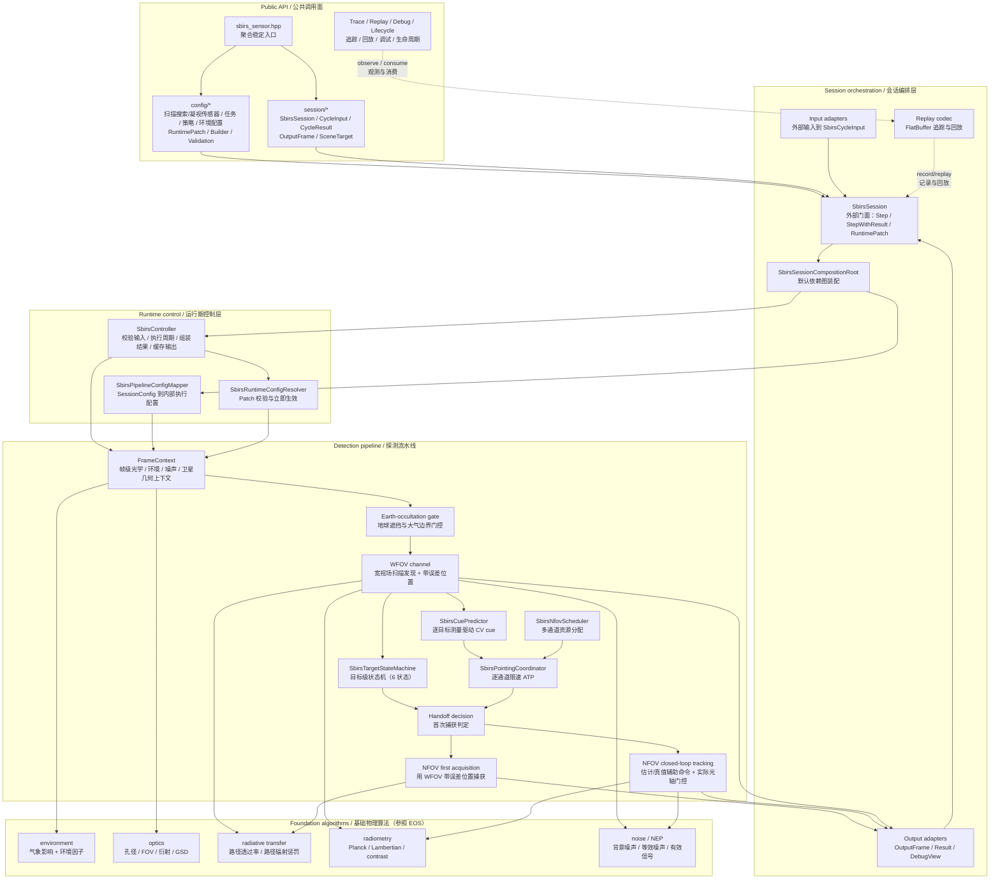
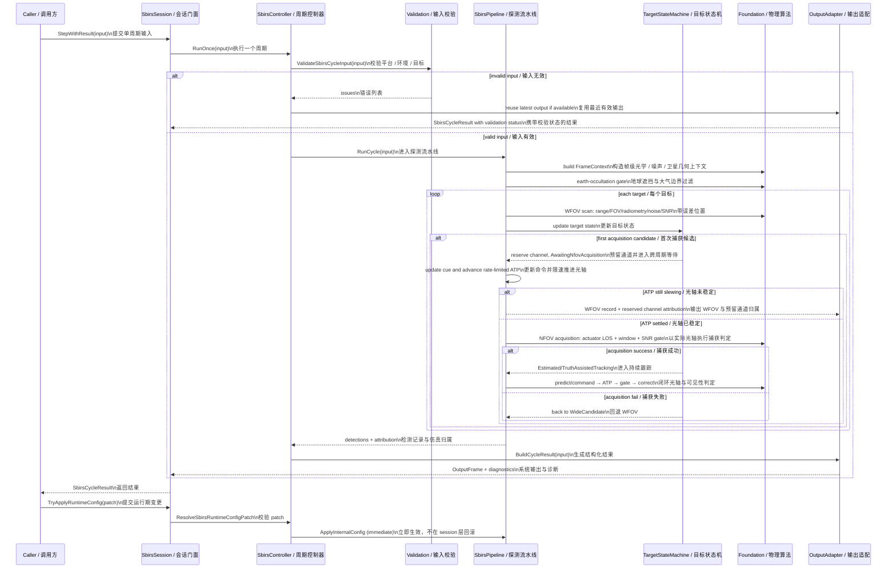
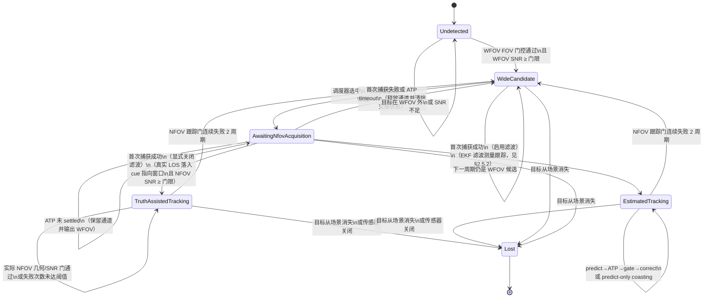

# Space-Based Infrared Sensor (SBIRS-inspired) 设计

Status: active
Last-reviewed: 2026-07-20
Authority: current design authority for the existing `sbirs_sensor` module

本文是 `sbirs_sensor`（天基红外预警仿真传感器）模块的设计权威文档。模块已实现并具备单元、
集成与契约测试分层；本文描述经证据确认的当前实现与已经冻结的设计边界。未经实现验证的候选设计
只能放在能力决策或重新进入门中，不得写成当前运行事实。当前尚未裁决的设计-实现分歧记录在
`docs/review/docs_reliability_audit_2026-07-20.md` 的 SBIRS B 类中；裁决前，对应段落不得作为
live 行为依据。跨模块 public API、builder、三层输出
等共同规则见 `docs/common/contract.md`。

本文以公开 SBIRS / OPIR 资料中的扫描红外传感器与 step-staring/staring 红外传感器为真实系统校准点，
但不声称复刻真实 SBIRS 设备、保密载荷或地面处理链路。本文中的 WFOV / NFOV 是面向仿真实现的
宽域搜索 / 窄域凝视抽象：WFOV 对应扫描搜索能力，NFOV 对应可任务化凝视与高灵敏度区域覆盖能力。


## 1. 架构设计说明

### 1.1 模块定位

`sbirs_sensor` 提供天基红外预警仿真传感器的配置、单周期输入、环境与大气建模、扫描搜索发现、
凝视捕获/跟踪、搜索→凝视交接（cueing & handover）、多目标状态管理、融合输出、trace/replay、
调试视图和生命周期事件。

与 EOS 的核心差异在于**扫描搜索 + 凝视资源调度 + 状态机驱动交接**：EOS 是单视场扫描探测器，对
FOV 内目标做一次性 SNR 判定；SBIRS-inspired 模型用 WFOV 宽域扫描发现目标，首次进入 NFOV 时用
WFOV 带误差 cue 生成凝视指向并做捕获判定，捕获成功后进入仿真简化的持续跟踪，捕获失败回退 WFOV
继续搜索。

它不是一个通用图像处理或航迹滤波框架。当前模块的稳定外部使用方式是：

1. 使用 `SbirsSessionConfig` 或 semantic builder 描述硬件、任务、策略、环境四域配置。
2. 使用 `SbirsCycleInput` 或 input adapter 提供平台（卫星）姿态、环境和目标场景。
3. 调用 `SbirsSession::Step()` 获取 1q 仿真传感器主输出，或调用 `SbirsSession::StepWithResult()`
   获取结构化执行结果。
4. 通过 runtime patch 调整工作模式、扫描速率、检测阈值、NFOV 资源策略和环境模型等有限运行期参数。

当前模块不提供 public pipeline/controller/environment-service/state-machine 自定义点。外部如果
需要改变物理行为，应通过配置和输入表达；如果需要排查仿真归属，应消费 `SbirsCycleResult`、
debug view、lifecycle 或 replay，而不是把仿真真值塞进 raw output。

### 1.2 Public API 与内部实现边界

公共头位于 `include/1q/sbirs_sensor/`，命名空间 `sbirs_sensor`，public 类型前缀 `Sbirs*`：

| 区域 | 职责 | 设计约束 |
|---|---|---|
| `sbirs_sensor.hpp` | 模块聚合入口 | 只聚合稳定 public API，不暴露 foundation/pipeline/runtime/state-machine 内部类型 |
| `config/` | `SbirsSessionConfig`、runtime patch、semantic builder、config validation | 表达硬件（扫描搜索/凝视传感器，仿真参数名保留 WFOV/NFOV）、任务、策略、环境四域语义 |
| `session/` | `SbirsSession`、cycle input/result、scene target、output types、adapter、trace/replay、debug/lifecycle | 是外部调用方的主要使用面 |

内部实现位于 `src/sbirs_sensor/`：

| 目录 | 职责 | 典型类型/函数 |
|---|---|---|
| `config/` | 内部执行配置 | `SbirsInternalExecutionConfig` |
| `foundation/` | 光学、传播、辐射、噪声、空间频谱基础算法（参照 EOS foundation 复制改名） | `ComputePlanckRadiance`、`EvaluateRadiativeTransfer`、`ComputeBackgroundNoiseStatistics` |
| `environment/` | 环境模型与气象衰减 | `ResolveEnvironmentFactors`、`ResolveWeatherAttenuation` |
| `pipeline/` | WFOV/NFOV 编排、首次捕获、调度与估计跟踪运行态 | `SbirsPipeline`、`SbirsNfovAcquisition`、`SbirsNfovScheduler`、`SbirsTrackingCoordinator` |
| `runtime/` | controller、config mapper、runtime config resolver | `SbirsController`、`MapSessionToInternal`、`ResolveSbirsRuntimeConfigPatch` |
| `session/` | public session 装配、输入输出适配、trace/replay、debug/lifecycle | `SbirsSessionCompositionRoot`、`SbirsCycleOutputAdapter` |

SBIRS 不在公开头文件中暴露 `electro_optical_sensor`、`Eos*` 或 `1q/electro_optical_sensor/...`。
EOS 仅作为 foundation 物理算法的迁移参考，不构成 SBIRS 的对外集成依赖。

### 1.3 与 EOS 的关系：派生 + 独立

SBIRS 的 foundation 物理算法（Planck 辐射、Beer-Lambert 传播、光子/热/读出噪声、SNR 合成）
参照 EOS foundation 层复制并改为 `sbirs_sensor` 命名空间和 `Sbirs*` 类型。这些算法是内部可测试
实现，不是 public 契约，也不是 public customization surface。

但 pipeline、controller、session 三层**全部独立实现**，不复用 EOS 代码：

- EOS pipeline 是单视场扫描 + 单次 SNR 判定（`EosPipeline::RunCycle`，
  `src/electro_optical_sensor/pipeline/EosPipeline.cpp:387-426`）。
- SBIRS pipeline 是双视场 + 状态机调度：WFOV 通道发现目标、状态机决策交接、NFOV 通道做首次捕获
  或真值辅助跟踪。状态机是跨周期累积状态；pipeline 提供经完整校验的 internal checkpoint，当前
  controller 周期路径没有执行后失败回滚步骤（见 1.5、2.2）。

### 1.4 分层组件图



读图顺序：

1. 外部只从 Public API 进入，不直接构造 `SbirsPipeline`、`SbirsTargetStateMachine` 或 foundation 类型。
2. `SbirsSessionCompositionRoot` 负责默认依赖图；当前没有用户替换 controller、pipeline、状态机或环境模型的 public API。
3. `SbirsController` 处理输入校验、周期执行、record/attribution 结果组装和失败输出复用。
4. `SbirsPipeline` 把一个周期拆成帧级上下文、地球遮挡门控、WFOV 发现、测量 cue、逐通道 ATP、NFOV 首次捕获或持续跟踪。
5. foundation 算法参照 EOS 复制改名，是内部可测试实现，不是模块间契约。

### 1.5 执行时序图



运行期配置采用**立即提交**策略（与 EOS 同类），见 `docs/common/contract.md` 运行期配置提交策略表。
当前 `RunCycle` 后不存在可能失败的 commit 步骤，因此 controller 不捕获或恢复 pipeline。pipeline
snapshot 仅是经完整校验的 internal checkpoint，用于确定性 continuation 与状态恢复测试，不上升为
session 层事务契约。

单周期输入在任何 pipeline mutation 之前 fail-closed 校验：`dt_sec` 必须正且有限；卫星和目标 ECEF
必须有限且非原点；`target_id` 必须非零且周期内唯一；温度、emissivity、投影面积遵守各自物理域；
目标速度在 `has_velocity_ecef_m_per_s=true` 时必须有限，为 false 时必须是有限零向量；启用
environment override 时，天气/海况枚举、绝对温度下限、湿度、能见度、透过率和交互权重全部校验。
拒绝周期不捕获也不恢复 pipeline，因为其随机源、扫描、cue、ATP、调度和跟踪状态从未推进；若已有
成功输出只复用上一帧，随后合法周期与未经历拒绝的干净会话等价。

[evidence: tests/unit/sbirs_sensor/sbirs_input_validation_test.cpp::RejectsFiniteDomainFlagIdAndEnvironmentMatrix]
[evidence: tests/unit/sbirs_sensor/sbirs_session_test.cpp::ValidationRejectDoesNotAdvancePipelineState]

### 1.6 主探测数据流

```mermaid
flowchart LR
  subgraph Input["Input / 输入"]
    Config["SbirsSessionConfig\nSearch/Stare hardware abstraction / Mission / Policy / Environment"]
    Cycle["SbirsCycleInput\n卫星姿态 / 环境快照 / 目标列表"]
    Patch["SbirsRuntimeConfigPatch\n工作模式 / 扫描速率 / 门限 / NFOV 策略"]
  end

  subgraph Runtime["Runtime mapping / 运行期映射"]
    Internal["SbirsInternalExecutionConfig\n内部执行配置"]
    Frame["FrameContext\n帧级上下文（含卫星轨道几何）"]
  end

  subgraph Geo["Geometric gating / 几何门控"]
    Occult["Earth occultation\n地球遮挡角判别"]
    WfovGate["WFOV FOV gate\n宽视场门控"]
    RangeGate["Range gate\nDmin / Dmax"]
  end

  subgraph Wfov["WFOV discovery / 宽视场发现"]
    Wsnr["WFOV IR SNR\nPlanck / 透过率 / 噪声"]
    Werr["Error-bearing position\n带误差方位/俯仰/距离"]
    Weather["Weather attenuation\n气象衰减 A_total"]
  end

  subgraph State["State machine / 状态机决策"]
    SM["Target state\n6 状态机"]
    Handoff["Handoff\n首次捕获判定"]
    Sched["NFOV scheduler\n多通道锁定调度"]
  end

  subgraph Nfov["NFOV channel / 窄视场通道"]
    Acq["First acquisition\nWFOV 带误差位置 + 窗口 + 门限"]
    Track["Closed-loop tracking\n预测/真值命令 + ATP + NFOV 门"]
  end

  subgraph Output["Output / 输出"]
    Raw["SbirsOutputFrame\n1q 仿真传感器检测记录"]
    Result["SbirsCycleResult\n状态 / attribution / debug source"]
    Trace["Trace / Replay\n可回放输入输出"]
  end

  Config --> Internal
  Patch --> Internal
  Cycle --> Frame
  Internal --> Frame
  Frame --> Occult
  Occult --> WfovGate
  WfovGate --> RangeGate
  RangeGate --> Weather
  Weather --> Wsnr
  Wsnr --> Werr
  Werr --> SM
  SM --> Handoff
  Sched --> Handoff
  Handoff --> Acq
  Handoff --> Track
  Acq --> Raw
  Track --> Raw
  Wsnr --> Raw
  Raw --> Result
  Result --> Trace
```



### 1.7 Mission 电源命名边界

`power_on` 是 SBIRS mission、runtime patch、builder 与 replay schema 的唯一电源名称；不存在第二个
同义字段或 DTO 边界改名。pipeline 和 runtime resolver 也只读取该权威字段。

[evidence: tests/contract/sbirs_sensor/sbirs_public_api_convenience_test.cpp::RuntimeConfigBuilderAllFieldsPopulateFlags]
[evidence: tests/replay/sbirs_sensor/sbirs_replay_codec_roundtrip_test.cpp::SessionConfigPreservesAllDomains]

## 2. 本模块使用的算法

### 2.1 算法总览

SBIRS 第一版的 public 可调面限定为 config、cycle input、runtime patch 和 debug/replay 消费面。
下表中的算法均为 internal 实现；除 `SbirsSession`、配置、输入输出 DTO、trace/replay/debug/lifecycle
工具外，不形成 public customization surface。

| 算法/部件 | 入口 | 当前角色 | Public 默认 | 主要测试锚点 |
|---|---|---|---|---|
| 配置到内部执行映射 | `MapSessionToInternal` | 将硬件、任务、策略、环境四域配置映射为 WFOV/NFOV 可执行参数 | internal mapper，不暴露 | `sbirs_input_validation_test` |
| runtime patch 立即提交 | `ResolveSbirsRuntimeConfigPatch`、`SbirsSession::TryApplyRuntimeConfig` | 校验工作模式、扫描速率、阈值、NFOV 策略和环境模型变更 | public 只提交 patch，不替换 resolver | `sbirs_session_test` |
| 环境与气象衰减 | `ResolveEnvironmentFactors`、`ResolveWeatherAttenuation` | 将场景/大气观测映射为透过率衰减因子 | internal 环境模型，不提供环境 service SPI | `sbirs_environment_model_test` |
| 地球遮挡门控 | `IsEarthOcculted` | 用有限 LOS 线段与地球球体相交判别穿地视线 | internal 几何门控，不进入 raw output | `sbirs_foundation_test`、`sbirs_pipeline_test` |
| WFOV 扫描搜索 | `SbirsPipeline` | 推进扫描相位，执行地球遮挡、FOV、范围和 SNR 门控 | internal pipeline，不可替换 | `sbirs_pipeline_test` |
| WFOV 误差模型 | `ApplyAngularErrorModel` | 对方位/俯仰/距离生成带误差 cue，供首次 NFOV 捕获使用 | internal 随机源可注入，public 不直接采样 | `sbirs_error_model_test` |
| 时间相关指向扰动 | `SbirsPointingDisturbance` | 整星共模 GM 同时移动 WFOV/NFOV，逐通道 GM + 确定性振动只移动对应 NFOV | 零幅默认；不等同量测噪声或完整姿态控制器 | `sbirs_pointing_disturbance_test`、`sbirs_pipeline_test` |
| Cue 预测 | `SbirsCuePredictor` | 按目标保存 WFOV 测量历史并生成角度域 CV 提前量 | internal；命令不消费目标真值速度 | `sbirs_cue_predictor_test`、`sbirs_pipeline_test` |
| NFOV ATP | `SbirsPointingCoordinator`、`SbirsPointingActuator` | 按 NFOV 通道保存光轴；捕获前限速推进并判定 settled/timeout，捕获后闭环跟随并执行几何/SNR 门 | 始终启用；配置公开最大转速、稳定容差与连续跟踪门失败周期数 | `sbirs_pointing_coordinator_test`、`sbirs_pipeline_test` |
| 目标状态机 | `SbirsTargetStateMachine` | 6 状态管理 WFOV 候选、跨周期捕获和持续跟踪 | internal 状态机，debug view 可观测 | `sbirs_state_machine_test` |
| NFOV 首次捕获 | `EvaluateNfovAcquisition` | 由 WFOV cue 生成凝视指向，真实 LOS 落入窗口且 NFOV SNR 达标时捕获 | internal 判定，不暴露捕获算法 SPI | `sbirs_pipeline_test` |
| NFOV 资源调度 | `SbirsNfovScheduler::SelectForAcquisition` | 多通道并发锁定（`max_concurrent_nfov_locks`，默认 1），按已跟踪、SNR、距离、target id 排序并分配通道编号 | internal scheduler，不暴露策略 SPI | `sbirs_scheduler_test` |
| 辐射传输与 SNR | `ComputePlanckRadiance`、`EvaluateRadiativeTransfer`、`ComputeInfraredSnrLinear` | 计算红外辐射、透过率、噪声和可探测性 | internal foundation，可测试但不可定制 | `sbirs_foundation_test`、`sbirs_radiative_transfer_test` |
| 输出构造与仿真归属 | `SbirsCycleOutputAdapter` | 生成 1q 仿真传感器主输出、结构化 result、debug/lifecycle/replay | public 只消费 DTO，不混入 truth | `sbirs_cycle_output_builder_test` |

### 2.2 核心状态机与 WFOV→NFOV 交接

本章是 SBIRS-inspired 模型区别于 EOS 的核心。EOS 对 FOV 内目标做一次性 SNR 判定；本模块用跨周期
状态机管理每个目标的 WFOV 发现、NFOV 首次捕获和真值辅助跟踪全过程。

#### 2.2.1 目标状态机（6 状态版）

每个目标独立维护一个状态机实例，以 `target_id` 为键。状态枚举：

| 状态 | 含义 | 该状态下本周期输出 |
|---|---|---|
| `Undetected` | 初始或目标未被任何视场发现 | 不输出 |
| `WideCandidate` | WFOV 已发现，等待 NFOV 资源调度 | 输出 WFOV 检测记录 |
| `AwaitingNfovAcquisition` | 已预留 NFOV 通道，逐周期更新 cue 并推进 ATP；settled 后才执行首次捕获 | slewing 时输出 WFOV；settled 后视捕获结果 |
| `TruthAssistedTracking` | 首次 NFOV 捕获成功且显式关闭滤波时，真值 LOS 驱动闭环 ATP | 门通过时输出 NFOV 检测；暂时失视时 coasting 且无 raw |
| `EstimatedTracking` | EKF/IMM 预测 LOS 驱动闭环 ATP，门通过后才消费角度量测 | 门通过时输出滤波估计；暂时失视时仅预测 coasting |
| `Lost` | 目标从输入场景消失或传感器关闭 | 不输出 |

捕获失败不是独立状态；失败转移回 `WideCandidate`，并清除本次交接上下文。

`max_concurrent_nfov_locks > 1` 时，多个目标可同时处于 `AwaitingNfovAcquisition`、
`TruthAssistedTracking` 或 `EstimatedTracking`，各占一个独立 NFOV 通道（见 §2.6）。
默认值为 1 时退化为单目标锁定，状态机行为与旧版一致。

状态转移：



转移条件表（补充状态图中的判定细节）：

| 起点 → 终点 | 触发条件 | 周期内副作用 |
|---|---|---|
| `Undetected` → `WideCandidate` | 目标在本周期 WFOV 视场内，且 WFOV IR SNR ≥ WFOV 检测门限 | 记录 WFOV 带误差位置、SNR |
| `WideCandidate` → `AwaitingNfovAcquisition` | 存在空闲 NFOV 通道且该目标在优先级排序中胜出（见 2.6） | 立即分配通道；首次使用从 WFOV 扫描中心初始化光轴，复用通道则从末次 LOS 继续 |
| `AwaitingNfovAcquisition` → `AwaitingNfovAcquisition` | ATP 未 settled 且累计等待小于 `180° / max_slew_rate` | 保留通道，更新 cue，输出 WFOV record 与 `nfov_channel_id` |
| `AwaitingNfovAcquisition` → `TruthAssistedTracking` | ATP settled 后，实际光轴窗口覆盖延迟真值 LOS，NFOV SNR 达标，且关闭滤波 | 记录 NFOV 检测，保留 scheduler 与 ATP 通道绑定 |
| `AwaitingNfovAcquisition` → `EstimatedTracking` | 同上，且启用滤波测量跟踪（见 §2.5.2） | 记录 NFOV 检测并初始化该目标滤波状态 |
| `AwaitingNfovAcquisition` → `WideCandidate` | settled 后窗口/SNR 失败，或未 settled 且达到派生 timeout | 产生一次失败归属并释放通道；同周期不重新调度该目标 |
| `TruthAssistedTracking` → `TruthAssistedTracking` | 真值命令驱动 ATP；实际 NFOV 几何/SNR 门通过或失败次数未达阈值 | 通过时输出真值辅助角度；单周期失败只输出 coasting 诊断 |
| `EstimatedTracking` → `EstimatedTracking` | 先预测 LOS 并推进 ATP；实际 NFOV 门通过后才校正量测 | 通过时输出后验角度；单周期失败只推进预测状态 |
| 两个 tracking 状态 → `WideCandidate` | 几何或 SNR 门连续失败达到 `nfov_tracking_gate_loss_cycles`（默认 2） | 输出一次 `kNfovTrackingGateLost`，释放 scheduler、ATP 与滤波状态 |
| 任意 → `Lost` | 目标从输入场景消失，或传感器关闭 | 释放 NFOV 资源 |

设计要点：

- 首次 NFOV 捕获**必须**使用 WFOV 输出的带误差位置，不得直接用真值位置。
- 捕获成功后进入哪个跟踪态由配置决定：默认启用滤波进入 `EstimatedTracking`，用滤波估计生成指向；
  显式关闭滤波时进入 `TruthAssistedTracking`，用仿真真值辅助生成指向。两个跟踪态**严格分离**，不复用同一
  状态枚举——这满足原先"后续若引入估计滤波必须先把真值辅助状态拆分"的前置约束。
- 真值辅助态的命令来源仍是真值，但实际 actuator LOS、NFOV 窗口与 SNR 门同样决定是否存在有效量测；
  它不是绕过光轴动力学和可见性的理想化输出路径。
- `EstimatedTracking` 的 EKF 滤波已接线（见 §2.5.2）：6 维 CV 状态 / 2 维角度量测，消费
  `common/estimation` 模板化框架，facade 位于 `sbirs_sensor::tracking` 命名空间。`enable_estimated_tracking=true`
  时捕获成功进入此态；关闭时回退 `TruthAssistedTracking`，行为零变化。后端选型见 §2.5.3。
- 状态机是跨周期累积状态。其 snapshot/restore 由 pipeline 自身拥有，并在 mutation 前验证全部
  cross-owned 状态后原子恢复；当前 controller 不把它包装成虚构的执行失败回滚分支。

适用边界：

- 状态机只管理目标级发现、首次捕获、真值辅助跟踪和消失，不负责图像检测、滤波估计或多假设关联。
- 状态机输入来自 pipeline 判定结果；外部调用方不能直接推进状态，也不能替换状态机策略。
- debug view 可以暴露状态机状态，但 raw output 不携带状态枚举。

验证入口：

- `sbirs_state_machine_test`
- `sbirs_scheduler_test`
- `sbirs_session_test`

### 2.3 WFOV 宽视场多目标搜索

每周期对输入场景中的所有目标执行 WFOV 扫描判断：

1. **几何门控**：目标先过地球遮挡门控（2.7）、WFOV FOV 门控、范围门控。WFOV FOV 门控参照 EOS
   `IsTargetInCurrentFov`（`src/electro_optical_sensor/pipeline/EosPipeline.cpp:443-451`）：
   `|az − scan_az| ≤ 0.5 × wide_field_fov_az` 且 `|el − scan_center_el| ≤ 0.5 × wide_field_fov_el`。
2. **扫描相位推进**：每周期按 `scan_rate_deg_per_sec × dt` 推进 WFOV 扫描方位角，对
   `[start_az, end_az]` 取模回绕，参照 EOS `AdvanceScan`
   （`src/electro_optical_sensor/pipeline/EosPipeline.cpp:428-441`）。角度归一化必须用 `std::fmod`
   常数时间实现（`docs/common/contract.md` 实现安全规则 5）。
3. **SNR 计算**：对门控通过的目标计算 WFOV IR SNR（见 2.8）。气象衰减 `A_total`（2.9）作用于
   路径透过率，进入 SNR。
4. **带误差位置**：满足 WFOV 检测门限的目标，输出带误差的方位角、俯仰角、距离（见 2.10 误差模型）。
   带误差位置是后续 NFOV 首次捕获的输入。
5. **多目标**：内部以 `target_id` 建立候选状态表，每个目标独立维护状态。同一周期允许多个 WFOV
   候选目标同时存在。

适用边界：

- WFOV 搜索只处理输入场景中显式给出的目标列表，不从图像像素中生成新目标。
- WFOV 带误差位置是仿真观测/cue，不是目标真值，也不是外部 target identity。
- 扫描相位、FOV 和范围门控属于 pipeline 内部状态；public 只能通过配置和 runtime patch 影响它们。

验证入口：

- `sbirs_pipeline_test`
- `sbirs_error_model_test`

#### 2.4.1 ATP 光轴执行与逐通道状态

`SbirsPointingActuator` 已通过 `SbirsPointingCoordinator` 接入 NFOV 生产链路。执行器把当前/命令光轴
表示为单位 LOS 向量，沿球面最短路径按
`narrow_pointing_max_slew_rate_deg_per_sec × dt` 限速推进，并用
`narrow_pointing_settle_tolerance_deg` 判断 settled；一步可到达命令时直接落到命令向量，禁止过冲。
默认值分别为 30 deg/s 和 0.01 deg，ATP 始终启用。二者与 settled 后施加的静态
`narrow_pointing_settle_error_deg` 是三个独立物理量。

coordinator 以 `channel_id` 持有 actuator、绑定目标、捕获等待时间和跟踪门连续失败计数；scheduler 仍是通道分配的唯一
权威。首次使用的通道从当周期 WFOV 扫描中心初始化；普通释放只解除目标绑定并保留末次 LOS，standby
或整域 mission config 提交才清空。每周期先推进已有 awaiting 目标，再调度新候选，因此释放的容量可在
同周期供其他目标使用。未 settled 且累计等待达到 `180° / max_slew_rate` 时产生一次
`kNfovPointingTimeout`，释放资源并禁止该目标同周期重新调度。

首次捕获成功后 coordinator 不释放绑定，而是清零捕获等待并晋级为 tracking；之后每周期继续限速推进。
pipeline snapshot 同时保存 scheduler 映射、逐通道 actuator 和 tracking gate 计数；restore 验证通道范围、
唯一性，以及绑定目标与 awaiting/tracking 状态的双向一致性后原子提交。replay 不序列化内部 snapshot，
而是由 config、cycle input 和 runtime patch 重新执行；结果比较覆盖全部 tracking gate 诊断。

[evidence: `sbirs_pointing_actuator_test.cpp:ZeroAngleIsImmediatelySettled`、`SlewRateLimitsProgressAndPreventsOvershoot`、`InvalidInputIsRejectedAtomically`、`CaptureRestorePreservesDeterministicContinuation`;
 `sbirs_pointing_coordinator_test.cpp:TrackingAdvanceKeepsBindingWithoutAcquisitionTimeout`、`TrackingGateCountResetsAndRoundtrips`、`InvalidSnapshotIsRejectedAtomically`;
 `sbirs_pipeline_test.cpp:RateLimitedPointingSpansCyclesAndRestores`、`TrackingCoastSnapshotRestoreMatchesUninterrupted`、`ConsecutiveTrackingGateFailuresReleaseLock`]

### 2.4 NFOV 首次捕获

对进入 `AwaitingNfovAcquisition` 的目标跨周期执行指向与首次捕获：

1. **输入**：使用该目标 WFOV 输出的**带误差位置**（方位角、俯仰角、距离），不得使用真值位置。
2. **指向生成**：`SbirsCuePredictor` 按 `target_id` 保存连续 WFOV 带误差角度，用两点有限差分估计
   方位/俯仰角速度，并生成 `u_cmd = u_measured + angular_rate × narrow_cue_latency_s`。第一条测量、
   非正 `dt` 或零延迟退化为当前测量；方位差采用 ±180° 最短路径。命令生成不消费目标真值速度。
3. **ATP 推进**：发令时立即预留 NFOV 通道；每周期用最新 cue 更新命令，并从该通道当前 LOS 沿球面
   最短路径限速推进。未 settled 时只输出正常 WFOV record，attribution 携带已预留的通道编号。
4. **窗口判定**：settled 后，以 actuator 当前 LOS 为窗口中心，再叠加
   `narrow_pointing_settle_error_deg` 静态方位偏差。目标真实 LOS `u_true` 在
   `narrow_cue_latency_s > 0` 且目标提供 `velocity_ecef_m_per_s` 时，按延迟时间对真值位置做线性外推
   后重算。因此 cue 命令和 eligibility truth 都在 latency horizon 上评估；两者的残差来自
   WFOV 测量误差、两点 CV 外推失配、ATP 限速/稳定误差与 NFOV 窗口。无速度时 `u_true`
   即当前帧真值，行为不变。这样捕获判定仍受 WFOV 误差、
   目标运动、cue 延迟和 NFOV 视场大小影响，不会因为窗口中心直接取测量值而恒成立。
5. **SNR 门限**：判断 NFOV IR SNR 是否 ≥ NFOV 捕获门限；具体门限由当前配置决定。
6. **成功**：默认进入 `EstimatedTracking`；显式关闭滤波时进入 `TruthAssistedTracking`。两种状态都保留
   当前通道的 actuator 绑定并进入捕获后闭环推进。捕获 raw 角度沿用本周期 WFOV 带噪测量；实际
   actuator LOS 只参与窗口 eligibility，不把通过门限的目标真值直接写成观测。目标 ID/name 与真实
   LOS 仍只进入 attribution 和仿真判定层。
7. **失败/超时**：窗口或 SNR 失败，或 ATP 达到派生等待上限时，清除交接并回退 `WideCandidate`。不输出该
   目标本周期 NFOV 成功记录；但产出 `capture_failure_reason = kNfovAcquisitionFailed` 的诊断归属，
   仅进入 `SbirsCycleResult.detection_attributions` 与调试/lifecycle 层，不进入 raw output。

适用边界：

- NFOV 首次捕获只做限速光轴 + 几何窗口 + SNR 门限判定；cue predictor 是角度域两点 CV，不做 CA、
  6D ECEF 滤波预测、轨道传播、模板匹配或图像相关。
- 五样本角度二次最小二乘 CA 已完成 characterization：108 个无噪声持续加速
  组合中聚合 RMS 从 CV 的 `0.068965 deg` 降为数值零；但在 `dt=0.1 s`、
  `latency=0.5 s`、量测 `sigma=0.01 deg` 的恒速场景，CA RMS/P95 为
  `0.141490/0.279187 deg`，劣于 CV 的 `0.074132/0.141619 deg`，捕获率也从
  `73.91%` 降至 `41.30%`。因未通过标称噪声零回退门，当前拒绝生产接线，
  不新增 CV/CA 配置、schema 或自动切换。
  [evidence: tests/unit/sbirs_sensor/sbirs_cue_ca_characterization_test.cpp::SbirsCueCaCharacterizationTest.SustainedAccelerationPassesBenefitGateWithoutNoise]
  [evidence: tests/unit/sbirs_sensor/sbirs_cue_ca_characterization_test.cpp::SbirsCueCaCharacterizationTest.FiveSampleCaFailsStrictNominalNoiseZeroRegression]
- `u_cmd` 与捕获 raw 均来自 WFOV 带误差测量链；延迟后的真实 LOS 只用于仿真判定捕获是否成功，
  不进入命令或 raw output。实际 NFOV LOS 的单变量效果由捕获窗口是否存在 raw 记录体现，而非改写
  raw 为窗口中心。
- cue 延迟对真实 LOS 的评估仍用目标速度做线性平移，不做积分轨道传播。
- 当前 ATP 建模捕获前与捕获后的逐通道速率受限光轴；仍不建模整星姿态动力学或通道间机械耦合。

[evidence: `sbirs_cue_predictor_test.cpp:ConstantAngularVelocityPredictsLatencyAhead`、`AzimuthUsesShortestPathAcrossWrap`、`CaptureRestorePreservesPerTargetHistory`;
 `sbirs_cue_ca_characterization_test.cpp:SustainedAccelerationPassesBenefitGateWithoutNoise`、`StaticAndConstantVelocityHaveNoNoiselessRegression`、`FiveSampleCaFailsStrictNominalNoiseZeroRegression`、`NonUniformDtAndAccelerationReversalRemainFinite`;
 `sbirs_pipeline_test.cpp:MeasurementCvCueCapturesOnSecondObservationAndRestores`、`SchedulerSkippedCandidateAccumulatesCueHistoryUntilChannelFrees`、`NfovAcquisitionRawUsesNoisyMeasurementAndIsReproducible`、`CommonAttitudeDisturbanceMovesWfovAndNfovTogether`;
 `sbirs_session_test.cpp:MeasurementCvCueCapturesAfterSecondWfovObservation`;
 `sbirs_session_test.cpp:RateLimitedPointingReservesChannelUntilSettled`、`RuntimeMissionPatchClearsSlewAndUsesNewRate`、`DualChannelAssignmentIsIndependentOfInputOrder`;
 `sbirs_replay_session_test.cpp:ReplaySbirsTraceRoundtrip`、`ReplayPreservesMeasurementDerivedCvCue`、`ReplayPreservesMultiCycleSlewAndRuntimeMissionPatch`、`ReplayPreservesDualChannelPointingTimeout`]

验证入口：

- `sbirs_pipeline_test`
- `sbirs_error_model_test`

### 2.5 NFOV 持续跟踪

首次 NFOV 捕获成功后进入持续跟踪。跟踪态由 `SbirsTrackingConfig.enable_estimated_tracking` 决定：
- **默认（true）**：进入 `EstimatedTracking`，EKF 滤波测量跟踪（§2.5.2）。
- **显式关闭（false）**：进入 `TruthAssistedTracking`，仿真真值辅助跟踪（§2.5.1）。

两个跟踪态**严格分离**（不同枚举值），不复用同一状态——这满足原先"后续若引入估计滤波必须先把
真值辅助状态拆分"的前置约束。状态转移详见 §2.2.1。混用同一状态枚举会带来三个不可接受的后果：某帧检测
记录的指向来源（真值还是滤波估计）无法追溯；capture/restore 无法正确回滚（真值辅助无状态可回滚，滤波器有）；
replay 语义模糊（真值辅助确定性复现，滤波器依赖随机源）。

两个状态共享同一条闭环可见性链：命令 LOS → actuator 按 `dt_sec` 限速推进 → 当前 actuator LOS 叠加
`narrow_pointing_settle_error_deg` 形成有效 NFOV 中心 → 矩形几何门与 `narrow_min_snr_linear` SNR 门。
单周期失败不产生 raw 量测，而是进入 `Coasting` 诊断并保持通道；连续失败达到
`nfov_tracking_gate_loss_cycles`（默认 2，必须 ≥1）才正式丢锁。

EstimatedTracking 严格使用因果顺序：**predict → actuator advance → geometry/SNR gate → correct**。
门失败时滤波器只预测、不采样量测、不产生 NIS，并清零连续 NIS 超限计数；门通过后才施加带误差角度量测。
[evidence: `estimation_kalman_test.cpp:SplitPredictCorrectMatchesProcessWithDynamicR`;
 `sbirs_pipeline_test.cpp:TrackingGateCoastsOnceThenRecoversWithoutRawMeasurement`、`TrackingSnrGateCanCoastWhileGeometryPasses`、`TruthAssistedTrackingStillUsesActualPointingGate`;
 `sbirs_cycle_output_builder_test.cpp:CoastingHasNoRawAndDoesNotEmitPrematureLost`;
 `sbirs_replay_session_test.cpp:ReplayPreservesTrackingCoastAndGateLoss`]

#### 2.5.1 真值辅助跟踪（TruthAssistedTracking）

对 `TruthAssistedTracking` 状态的目标（`enable_estimated_tracking=false`），后续周期持续跟踪：

1. **指向来源**：使用目标**真实位置**（输入场景中的真值方位角、俯仰角、距离）辅助计算 NFOV 指向和
   检测输出，不再使用 WFOV 带误差位置。这是仿真层稳定性假设，不代表真实传感器知道目标真值。
2. **持续条件**：真值驱动命令，但实际 actuator LOS 的 NFOV 几何门和 SNR 门必须通过；短暂失败进入 coasting。
3. **输出**：按 `SbirsOutputFrame` 格式生成检测记录（方位角、俯仰角、SNR、观测阶段、是否探测成功）。可在输出测量值
   上叠加误差，但误差不影响内部真值辅助状态——即输出层的误差是"显示噪声"，不是"状态转移输入"。
4. **释放**：目标从输入场景消失后，状态转为 `Lost`，NFOV 释放资源，回到 WFOV 中选择下一个候选。

适用边界：
- 真值辅助跟踪是第一版仿真稳定性假设，不是 OPIR/SBIRS 真实跟踪算法。
- 该阶段只做真值辅助指向，不实现滤波估计、波门关联、轨迹平滑或丢锁概率模型。
- 此态仅在显式关闭滤波时使用；默认走 `EstimatedTracking`（§2.5.2）。

验证入口：
- `sbirs_state_machine_test`（显式关闭滤波回退 TruthAssistedTracking）
- `sbirs_pipeline_test`

#### 2.5.2 EKF 滤波测量跟踪（EstimatedTracking）

对 `EstimatedTracking` 状态的目标（默认），用扩展卡尔曼滤波（EKF）做测量跟踪。滤波框架消费
`common/estimation`（`oneq::common::estimation`），SBIRS 侧 facade 位于 `sbirs_sensor::tracking`
（`src/sbirs_sensor/tracking/SbirsTrackingTypes.h`）。

**状态空间**：6 维 ECEF 恒速模型 `[x, vx, y, vy, z, vz]`（CV 交错布局），复用 common 的
`KalmanPredictor::BuildTransitionMatrix` / `BuildProcessNoise`。

**量测模型**（非线性，球坐标角度）：2 维 `[az, el]`（弧度），被动红外不测距（design 2.11 不含 range）。
选纯 2 维角度而非 3 维 `[az, el, range]` + 大 R 屏蔽 range 通道：后者把不可观测的 range 塞进量测向量，
需要用极大 R 把它"屏蔽"掉，语义不干净；纯 2 维直接表达"被动红外只测角"的物理事实。
`SbirsAngleMeasurementModel` 实现 `IMeasurementModel<6,2>`：
- `h(x)` = 目标 ECEF 位置（状态偶数索引 0/2/4）相对卫星位置 `satellite_position` 的 LOS →
  `[atan2(dy,dx), asin(dz/r)]`。卫星位置非状态分量，每帧由 pipeline 注入。
- Jacobian `H = ∂[az,el]/∂[x,vx,y,vy,z,vz]` 解析求导，速度列为零。

**初始化**（首次捕获成功时，方案 A）：状态均值用输入场景真值 ECEF 位置 + 速度（无速度时速度置 0），
初始协方差 P0 由 `SbirsTrackingConfig.initial_position_std_m` / `initial_velocity_std_m_per_s` 构造为
对角阵。这是仿真的 track initiation 简化；后续 predict/update 用带误差测量才是滤波器发挥作用的环节。

**每周期因果闭环**：
1. `SetSatellitePosition(input.satellite_position_ecef_m)`
2. EKF/IMM predict（CV 转移模型，过程噪声 `process_noise_diff_coeff`），预测 LOS 作为 ATP 命令
3. actuator 限速推进，以实际 LOS 执行 NFOV 几何/SNR 门；失败时只保留预测状态并 coasting
4. 门通过后才生成本帧带误差角度量测（`ApplyAngularErrorModel` 输出的 az/el，deg→rad）
5. R 矩阵 = `BuildMeasurementCovariance(error_model, range, elevation, angular_rate)`，从 §2.10 的
   5 类误差 RSS 合成，deg²→rad²。R 随距离/俯仰/角速度动态变化
6. EKF/IMM correct（动态 R），并计算 NIS

**输出处理**：
- **SNR / range / 检测门限**：SNR 和 range 仍用真值物理链计算；NFOV 几何中心来自实际 actuator LOS，
  因而滤波预测误差和转速限制会真实影响 coasting/丢锁。
- **输出角度**（`azimuth_deg` / `elevation_deg`）：用滤波估计的 ECEF 位置 → 相对卫星 LOS → az/el。
  `used_truth_assist = false`。
- **状态转移**：除目标存在性和传感器开关外，默认启用的 NFOV 几何/SNR 跟踪门也会影响
  状态转移；连续失败达 `nfov_tracking_gate_loss_cycles`（默认 2）时释放 NFOV 锁定并回到
  `WideCandidate`。NIS 丢锁是另一条可选路径：默认 `nis_gate_loss_cycles = 0` 表示关闭；
  只有配置为正数时，连续 NIS 超 2 维 95% 门限才会释放锁定（详见 §2.5.4）。
  [evidence: tests/unit/sbirs_sensor/sbirs_pipeline_test.cpp::SbirsPipelineTest.ConsecutiveTrackingGateFailuresReleaseLock]
  [evidence: tests/unit/sbirs_sensor/sbirs_pipeline_test.cpp::SbirsPipelineTest.ConsecutiveNisGateExceededReleasesEstimatedTrackLock]

**snapshot / replay**：`SbirsTrackingCoordinator` 内部持有滤波状态（`filter_states_` map：target_id →
`SbirsGaussianState`）、NIS 连续计数和 IMM 运行态；启用 IMM 时，每个 `target_id` 拥有独立 live
`ImmFilter`，其模型状态逐目标映射到既有 `imm_snapshots`。capture/restore 只恢复同一 target 的模型状态，
不会跨目标复用；目标消失、NIS 丢锁或 standby 会释放对应 live filter。它们仍逐字段写入既有
`SbirsPipelineSnapshot`，并由 pipeline checkpoint 统一恢复。EKF 本身确定性（无额外随机源采样），测量噪声采样复用
`SbirsRandomSource`（已在 snapshot 的 `random_state`），故 replay 确定性保持。

配置（`SbirsTrackingConfig`，挂 `SbirsPolicyConfig.tracking`）：
- `enable_estimated_tracking`（默认 true）
- `process_noise_diff_coeff`（默认 1.0）
- `initial_position_std_m`（默认 1000）、`initial_velocity_std_m_per_s`（默认 100）
- `nis_gate_loss_cycles`（默认 0，禁用）
- `nfov_tracking_gate_loss_cycles`（默认 2，必须 ≥1）

适用边界：
- EKF 初始化用真值位置（方案 A），后续 update 用带误差测量；不实现测量初始化（反算 ECEF 需距离假设）。
- SNR / 可探测性用真值链路；滤波器只影响指向与输出角度。
- 过程噪声为 CV 模型白噪声加速度（标量 q），不建模机动目标加速度跳变。
- 量测噪声 R 从 §2.10 误差模型合成，az/el 通道对称（各向同性假设）。
- `nis_gate_loss_cycles` 丢锁是确定性门限，不做概率抽样（详见 §2.5.4）。
- runtime patch（`ApplyConfig`，见 §1.5）对已存在的滤波器只更新 R/Q 等参数（`UpdateConfig`），**不重置**
  协方差矩阵和状态向量——重置会破坏跨周期跟踪连续性。"立即提交"契约（`docs/common/contract.md` 运行期配置
  提交策略表）约束的是 patch 生效时机，不要求丢弃累积状态。

#### 2.5.3 滤波后端选型

当前 SBIRS 接线 EKF 和 IMM(EKF) 两个后端（`enable_imm_tracking` 控制切换）；`enable_estimated_tracking`
是滤波↔真值辅助的总开关，**不是**多后端选择。`common/estimation` 的多后端框架并非全部适用于 SBIRS
非线性角度量测，下表汇总验证结论：

| 后端 | 非线性量测支持 | 当前可用 | 前置条件 |
|------|:---:|:---:|------|
| EKF | ✅（`IMeasurementModel*`，Jacobian 一阶展开） | ✅ | — |
| IMM(EKF) | ✅（内层 EKF） | ✅ 已接线 | 由 `enable_imm_tracking` 控制；`SbirsImmSnapshot` + `imm_snapshots_` 持久化；证据见 `SbirsImmEvaluationTest`（全场景改善 28-55%） |
| SRIF | ❌（`SrifUpdater` 硬编码线性 H） | ❌ | 需扩展 `common/estimation` 让 `SrifUpdater` 接受 `IMeasurementModel*` 并在线性化方程中使用 |
| UDKF | ❌（`UdkfUpdater` 硬编码线性 H） | ❌ | UDKF 是协方差 UD 分解（数值稳定），**不是**无导数滤波，对非线性量测无帮助 |
| KF | ❌（`KalmanUpdater` 硬编码线性 H） | ❌ | 需线性 H，球坐标 az/el 不满足 |

**选型原则：人工配置为主，不做在线自动切换**（与 AR §2.10 一致）。理由：
1. **可复现性优先于智能性**：在线自动选型会使同一想定因阈值微调走不同后端，结果不可比。
2. **选型决策依赖外部真知**："目标是否机动"等判据，仿真期真值已知，泄露到选型逻辑等同作弊。
3. **可解释性**：工程评审需能追溯到具体后端与参数，自动切换使因果链复杂化。

**IMM 已接线**（详见 §2.5.2）：`common/estimation/ImmFilter.h` 已扩展 3 参 `Process(measurement, dt, R)` 支持动态 R。`SbirsTrackingCoordinator` 在 `enable_imm_tracking=true` 时维护按 `target_id` 隔离的运行期 `ImmFilter`，并共享只读模型构件与各子模型的 `SbirsAngleMeasurementModel`；每个 target 的模型状态经既有 `imm_snapshots` 保存/恢复，NIS 取各模型最大值用于丢锁判定。双目标首捕、独立运行/输入顺序、capture/restore 和 trace/replay 均要求保持按 target 归属的一致性。NIS 门限/丢锁/重捕获的确定性语义与单 EKF 路径一致。

[evidence: `sbirs_pipeline_test.cpp:ImmKeepsIndependentStateForEachCapturedTarget`、`ImmMultiTargetUpdatesMatchIndependentRunsAndInputOrder`、`ImmMultiTargetRestorePreservesPerTargetState`;
 `sbirs_replay_session_test.cpp:ReplayPreservesMultiTargetImmTracking`]

**升级触发条件**（当前决策；部分 veto 依据待第二类复核）：

| 方向 | 判定 | 理由 |
|------|:---:|------|
| SRIF 扩展（协方差数值病态→非正定） | ❌ 不适用（依据待复核） | 当前只确认 EKF 使用 Joseph 形式更新后验协方差（`EkfFilter.h:265-268`），以及 SRIF 硬编码线性 H、需先扩展 `common/estimation` 接受 `IMeasurementModel*` 才能用于 SBIRS。当前没有 live 的“AR 500 周期病态测试”可证明 SBIRS 数值稳定性已足够；是否维持该 veto 列入第二类评审 |
| CKF（强非线性几何，Jacobian 一阶展开精度不足） | ❌ 不适用 | SBIRS LEO 卫星（~629km 高度）近天底观测，horiz 始终数百公里量级，atan2/asin 非线性度温和；退化几何（horiz→0）仅在极地飞越时发生且被地球遮挡过滤。仓库无 CKF 实现，需从零编写 `CkfPredictor`/`CkfUpdater` |
| 概率丢锁模型（确定性 NIS 门限→概率抽样） | ✅ 保留 | 当前丢锁是纯确定性连续 NIS 计数（`nis_gate_loss_cycles`），这是跟踪滤波器行业标准做法（AR 模块同理）。概率模型需先完成 NIS/SNR/角速度→重捕获成功率场景矩阵标定，再引入受 seed 控制的可复现概率抽样 |

已否决的两条触发条件不阻塞当前架构——SBIRS 的 EKF/IMM(EKF) + Joseph 形式 + 确定性 NIS 丢锁已覆盖全部已知场景。若未来出现新的 SBIRS 几何配置（如高轨凝视卫星、极地大倾角轨道）或新的量测模型（如多波段联合），可重新评估。

#### 2.5.4 NIS 诊断与丢锁重捕获

**NIS 计算**：归一化新息平方 NIS = `innovationᵀ · innovation_covariance⁻¹ · innovation`，χ² 分布
自由度=量测维数。SBIRS 量测维 2，95% 门限 ≈5.99。NIS 持续偏高→模型失配（过程噪声偏小或目标机动，
CV 模型在助推段会失配）；持续偏低→R 偏大。

**诊断传播**：pipeline 在 EKF update 后计算 NIS，写入 `SbirsDetectionAttributionRecord` /
`SbirsDebugTargetState` / `sbirs_replay.fbs` 的诊断字段（`has_estimation_nis` / `estimation_nis` /
`estimation_nis_gate_exceeded`）。raw `SbirsOutputFrame` 不携带滤波诊断，保持三层输出分离（§2.11）。

**丢锁机制**：默认 NIS 只读不触发动作。当 `nis_gate_loss_cycles > 0` 时，连续 NIS 超门限达到
配置周期数后：
1. 产出 `capture_failure_reason = kEstimationNisGateLost` 的诊断 attribution
2. 释放 NFOV 锁定，目标回退 `WideCandidate`
3. 下一周期调度器可重新选中该目标进入首次捕获
4. 失败诊断进 attribution/debug/lifecycle/replay，不进 raw output

**基线证据**（`SbirsEkfBaselineTest`）：
- CV 适配场景：5 周期 NIS 均低于 95% 门限 → 默认 EKF/CV 对平稳目标足够
- 瞬时横向异常：单周期 NIS 超门限 → 适合触发诊断或确定性丢锁计数
- 持续横向失配：NIS 超门限次数和峰值均高于瞬时异常 → 已驱动 IMM 接线（全场景改善 28–55%）；概率丢锁模型仍为候选方向

**决策记录**：

| 方向 | 当前处理 | 证据 |
|------|------|------|
| 滤波估计 | EKF `EstimatedTracking` 默认启用，输出角度来自滤波估计 | `sbirs_state_machine_test`、`sbirs_pipeline_test`、`sbirs_session_test` |
| 轨迹平滑 | EKF 后验角度作为第一层平滑 | `LockedTargetProducesEstimatedTrack`、NIS 基线矩阵 |
| 丢锁/重捕获 | `nis_gate_loss_cycles` 确定性丢锁；失败诊断进 attribution/debug/lifecycle/replay | `ConsecutiveNisGateExceededReleasesEstimatedTrackLock`、`ReplayPreservesNisLossAndReacquisitionDiagnostics` |
| 概率丢锁模型 | 暂不实现；需先标定 NIS/SNR/角速度到丢锁概率的映射 | NIS 矩阵证明可分离 CV、瞬时异常和持续失配 |
| 波门关联 | 暂不实现；NFOV 已支持多通道并发锁定，但航迹关联仍需独立模型 | `MultipleWfovCandidatesMultiNfovLock` 与 §2.6 |
| IMM | ✅ 已接线；`enable_imm_tracking` 控制，IMM(EKF×N) 全场景 RMSE 改善 28–55% | `SbirsImmEvaluationTest`、`ImmTrackingProducesFiniteState`、`ImmSupportsCaptureRestoreRoundtrip` |

#### 2.5.5 验证入口汇总

- `sbirs_state_machine_test`（默认走 EstimatedTracking；关闭滤波回退 TruthAssistedTracking）
- `sbirs_pipeline_test`（单 EKF + IMM 路径；NIS 连续超限释放锁并重捕获；capture/restore 闭环）
- `sbirs_ekf_baseline_test`（CV / 瞬时异常 / 持续失配 NIS 矩阵基线）
- `sbirs_imm_evaluation_test`（IMM 全场景 RMSE 改善证据：中段 31%、助推 28%、末端机动 55%）
- `sbirs_cycle_output_builder_test`（debug view 与 lifecycle 保留 NIS 丢锁 attribution/reason）
- `sbirs_replay_codec_roundtrip_test`（IMM 配置编解码往返）
- `sbirs_replay_session_test`（trace/replay 保真：捕获 → NIS 丢锁诊断 → 重捕获）

### 2.6 多目标优先级与 NFOV 资源调度

NFOV 资源采用**多通道并发锁定策略**：传感器配置 `max_concurrent_nfov_locks`（`SbirsSchedulerConfig`，
默认 1）个并发 NFOV 通道，每个通道可独立凝视锁定一个目标。默认值 1 退化为单目标锁定。
任一时刻最多 `max_concurrent_nfov_locks` 个目标可同时处于 `AwaitingNfovAcquisition`、
`TruthAssistedTracking` 或 `EstimatedTracking`，各占一个独立通道编号（`nfov_channel_id`）。

通道编号分配与回收：

- 新目标被调度选中时，由 `SbirsNfovScheduler::Acquire` 立即分配**最小可用编号**，在 ATP slewing
  与首次捕获期间保持预留。
- 目标失活/消失、遮挡、越距、离开 WFOV、低于 WFOV SNR、捕获失败、pointing timeout、NIS 丢锁或
  standby 时回收 scheduler 分配。普通释放保留该物理通道末次 LOS；standby/config apply 才清空光轴。
- 编号分配确定性：相同输入在 replay 中产生相同的目标→通道映射。

优先级默认规则（调度器在多个 WFOV 候选中选目标进入首次捕获）：

1. 已锁定（真值辅助/估计跟踪）目标优先级最高（持续占用各自通道，直到释放）。
2. 新候选按 WFOV IR SNR 从高到低。
3. SNR 相同按距离从近到远。
4. 仍相同按 `target_id` 从小到大。

调度器在通道有余量时，按上述规则从 `WideCandidate` 中选取至多
`max_concurrent_nfov_locks - 已占用通道数` 个目标进入首次捕获。已锁定目标的候选不重复入选。
通道满（无余量）时，未被选中的 WFOV 候选标记 `kSchedulerSkipped`。

适用边界：

- 多区域同时重访和任务化排程不在当前范围（仍是单 WFOV 扫描 + 多 NFOV 凝视）。
- 优先级排序必须稳定，避免相同输入在 replay 中产生不同捕获目标与通道分配。
- 调度器不读取仿真目标名称，只使用状态、SNR、距离和 `target_id`。
- `nfov_channel_id` 仅进 attribution 调试层（`SbirsDetectionAttributionRecord`、
  lifecycle 事件、debug view），不进 `SbirsOutputFrame` raw output（见 §3 输出边界）。

验证入口：

- `sbirs_scheduler_test`
- `sbirs_replay_codec_roundtrip_test`

### 2.7 地球遮挡与几何门控

天基传感器视线穿过地球时目标不可观测；这是 WFOV 搜索前的必要几何门控。

**遮挡角计算**：

- 卫星到地心距离 `R_sat = ||r_sat(t)||`。
- 地球半径 `R_E = 6371 km`。
- 地球遮挡角 `θ_occ = arcsin(R_E / R_sat)`。

**遮挡判定**：对任意目标视线方向 `u_LOS`，计算卫星-地心-视线夹角

```
φ = arccos( (r_sat · (R_sat · u_LOS)) / R_sat² )
```

上述遮挡角公式适合解释地球圆盘半角。实现时使用有限线段射线-地球球体判定，避免方向符号误用：

```
p = r_sat
u = unit(target_position - satellite_position)
range = ||target_position - satellite_position||
s_closest = -dot(p, u)
d_closest² = dot(p, p) - s_closest²
occulted = (0 < s_closest && s_closest < range && d_closest² <= R_E²)
```

其中 `u` 是从卫星指向目标的单位 LOS。只有最近点位于卫星到目标的有限线段内，且该线段穿过地球球体
时，目标才被地球遮挡。若只做无限射线近似，也必须要求 `dot(p, u) < 0`，即视线朝向地球一侧。

**大气边界过滤**：设定大气顶层高度 `H_atm`（如 100 km）。对目标高度 `h < H_atm` 的区域，考虑
大气红外吸收（通过透过率阈值过滤）。第一版的气象衰减模型（2.9）已覆盖大气透过率，大气边界过滤
主要作为几何前置门控：目标位于大气层以下且距离过远时，直接判为不可观测。

地球遮挡判定在 WFOV FOV 门控和范围门控**之前**执行，避免对穿地视线做无意义的 SNR 计算。该门控
是帧级（目标无关）与目标级（目标相关）的混合：遮挡角 `θ_occ` 只依赖卫星位置（帧级），夹角 `φ`
依赖目标视线方向（目标级）。

适用边界：

- 遮挡门控只回答 LOS 是否穿过地球球体，不负责地形、云图、临边散射或三维大气廓线。
- 大气边界过滤是 SNR 前置 gate；更精细的大气吸收仍由 2.9 的透过率链路承担。
- 实现必须使用一致的 ECEF/ECI 坐标输入，不能混用局部 FOV 坐标做地球相交判定。

验证入口：

- `sbirs_foundation_test`
- `sbirs_pipeline_test`

### 2.8 Foundation 物理链路

foundation 链路由 `SbirsPipeline` 统一编排：Planck 辐射、路径透过率、接收功率、背景/探测器噪声和 SNR 门限顺序计算。`SbirsNoiseModel` 将背景辐射、探测器温度和读出噪声按 RMS 合成；三项均为零时回退到 `noise_equivalent_power_w`。这些实现以当前 source 和单元测试为证据，不以历史需求中的常数或公式版本作为契约。

当前标量 SNR 链缺少把像元面积映射为视场立体角所需的焦距与成像几何，因此 public hardware 和 replay
schema 都不暴露无消费者的 detector-area 字段。只有独立成像模型同时具备 PSF/MTF、焦距与像元几何时，
才可冻结其物理效应并增加结果测试；不得先加占位字段再用任意归一化系数伪装生效。

这些算法是内部可测试实现，不是 public 契约。复制时改命名空间为 `sbirs_sensor`，类型前缀改
`Sbirs*`，并允许为天基红外场景修正物理常数、波段参数、背景项和几何门控。若与 EOS 逻辑不等价，
必须在测试名和本文变更记录中说明差异来源。

适用边界：

- foundation 算法可被单元测试直接覆盖，但不作为 public header、SPI 或 runtime plugin 暴露。
- 第一版只实现波段、透过率、接收功率、噪声和门限的标量链路，不实现图像帧、像元级背景图或多色分类器。
- 与 EOS 复制来的算法允许按天基场景修正常数和几何输入，但必须保持调用面由 `SbirsPipeline` 统一编排。

验证入口：

- `sbirs_foundation_test`
- `sbirs_noise_model_test`
- `sbirs_radiative_transfer_test`

### 2.9 气象衰减模型

气象影响是 SBIRS SNR 链路的必要组成。

**气象影响列表**（查表得各参数独立衰减比例 `A_i`）：

| 气象参数 | 独立衰减比例 |
|---|---|
| 海浪等级 | 低 5% / 中 10% / 高 15% |
| 天气类型 | 晴 0% / 多云 5% / 雨 15% / 雾 20% |
| 温度 | 每升高 10℃ 衰减减少 2% |
| 湿度 | 每增加 20% 衰减增加 5% |
| 能见度 | >10km 0% / 5-10km 5% / 1-5km 10% / <1km 20% |

**加权叠加公式**：

```
A_total = Σ(w_i · A_i) + Σ(k_j · A_p · A_q) + C
```

其中 `w_i` 为参数权重（`Σw_i = 1`），`k_j · A_p · A_q` 为参数交互项（如湿度与能见度联合影响），
`C` 为常数修正项。`A_total ∈ [0, 1]`，1 表示完全衰减。

> 实现状态：第一版固定权重实现独立项 `Σ(w_i · A_i)` 与温度修正；交互项 `k_j · A_p · A_q`
> 通过 `humidity_visibility_interaction_weight`（湿度×能见度）与 `rain_humidity_interaction_weight`
> （雨×湿度，仅雨天）两个可配置系数启用，默认 0 即关闭交互项（向后兼容）。

**进入 SNR 链路的方式**：`A_total` 作用于路径透过率，即有效透过率

```
τ_eff(λ,d) = τ(λ,d) · (1 − A_total)
```

`τ_eff` 替换 2.8 中的 `τ(λ,d)` 进入 `Φ_atm = Φ_tar · τ_eff`，进而降低 `P_sig` 和 SNR。这样气象
衰减与 Beer-Lambert 大气衰减统一在透过率维度合成，避免在多个环节重复扣减。

适用边界：

- 气象模型只输出透过率衰减因子，不直接改写 detection threshold、目标温度或输出记录。
- `A_total` 必须夹紧到 `[0, 1]`，并且只能在透过率维度扣减一次。
- 第一版使用查表和加权叠加，不接入 MODTRAN/LOWTRAN 或三维天气场。

验证入口：

- `sbirs_environment_model_test`
- `sbirs_radiative_transfer_test`

### 2.10 误差模型（WFOV 带误差位置）

WFOV 输出的带误差位置是 NFOV 首次捕获的输入，误差模型直接影响首次捕获成功率。当前实现使用轨道、姿态、视场三项高斯角度误差，以及确定性的折射和动态滞后项；距离误差只用于内部 cue/诊断。

误差叠加作用于 WFOV 输出层、NFOV cue 指向生成和 NFOV 首次捕获判定层；真值辅助跟踪阶段（2.5）
不受后续测量误差影响。高斯随机误差的采样应使用可注入的随机数源，保证 replay 可复现。

> 实现状态：`SbirsErrorModel` 实现 5 类误差的加法/乘法合成。轨道/姿态/视场为高斯随机
> （`orbit_sigma_deg`/`attitude_sigma_deg`/`fov_sigma_deg`，Box-Muller），折射与滞后为确定性公式
> （`RefractionErrorDeg`/`DynamicLagErrorDeg`）。随机源 `SbirsRandomSource` 为 xorshift32 + Box-Muller，
> 由 `random_seed` 初始化，状态经 `SbirsPipelineSnapshot::random_state` 随 capture/restore 持久化，
> 保证 replay 可复现。轨道、姿态、视场三项始终按 RSS 合成为唯一有效角度 1-σ；三项均为 0
> 表示不施加随机角误差。方位/俯仰使用独立零均值高斯样本，与 tracking 使用的对角量测协方差
> 保持一致。公开配置不再提供额外的 legacy 总角误差字段。
> 目标角速度由 `SbirsSceneTarget.velocity_ecef_m_per_s`（ECEF 速度真值，可选）推导：pipeline 调用
> `ComputeRelativeAngularRateDegPerSec(los, velocity)` 得到视线角速度 `ω_tar`，接入动态滞后项。
> 未提供速度（`has_velocity_ecef_m_per_s=false`）时 `ω_tar=0`，动态滞后项为 0，保持旧行为。当前无
> 卫星速度输入，相对速度按目标速度处理；后续接入卫星运动估计时再扩展 `SbirsCycleInput`。

适用边界：

- 误差模型生成的是观测/cue 误差，不改变输入目标真值。
- 随机源必须可注入、可 snapshot 或可由 replay 固定，避免同一 trace 回放产生不同捕获结果。
- 距离误差只用于内部 cue/诊断链路；不能由此推导真实单星被动红外具备直接测距能力，也不得进入
  `SbirsOutputFrame` raw output。

验证入口：

- `sbirs_error_model_test`
- `sbirs_replay_codec_roundtrip_test`

#### 2.10.1 时间相关姿态与指向扰动

`SbirsErrorModel` 的 `attitude_sigma_deg` 属于量测域独立误差；它改变 WFOV cue 和可见时的 tracking
量测，但不改变实际光学中心。实际光轴另由 `SbirsPointingDisturbance` 建模：每个 active cycle 先推进
一份整星共模状态和全部物理 NFOV 通道状态，再执行 WFOV/NFOV 几何门。

两类随机状态均采用一阶 Gauss–Markov 精确离散：

```
alpha = exp(-dt / tau)
x[k+1] = alpha * x[k] + sigma * sqrt(1 - alpha^2) * N(0, 1)
```

`sigma` 是方位/俯仰各轴的平稳 1-σ，`tau` 是相关时间。逐通道残差还叠加固定 seed 与 channel id
派生相位的正弦振动。共模项在同周期同时移动 WFOV 实际扫描中心和所有 NFOV 中心；通道项只移动
对应 NFOV。NFOV 有效中心按 `actuator nominal LOS → 共模 → 通道 GM/振动 → 静态 settle error`
合成，然后进入首次捕获或闭环 tracking 的既有矩形几何门。[evidence:
`sbirs_pointing_disturbance_test.cpp:GaussMarkovMatchesStationaryRmsAndLagOne`;
`sbirs_pipeline_test.cpp:CommonAttitudeDisturbanceMovesWfovAndNfovTogether`]

状态所有权与确定性边界：

- 共模状态每个 pipeline 一份；通道状态按物理 `channel_id` 持有，不按目标持有。
- 空闲通道仍随仿真时间推进；普通 release/rebind 不重置，standby、配置提交或通道数变化重置。
- snapshot 保存共模、各通道 GM、随机流与振动时间；restore 与 actuator/绑定映射一起原子校验。
- 全部幅值默认 0；没有可追溯设备参数时不提供仓库级非零“真实 SBIRS”常数。
- 当前是传感器角度坐标系的小角度扰动，不含刚体姿态、角速度控制、反作用轮、饱和或机械耦合。
- raw output 和滤波 R 不增加扰动字段；现有 `nfov_pointing_error_deg` 表示合成后的总实际误差。

验证入口：

- `sbirs_pointing_disturbance_test`
- `sbirs_pointing_coordinator_test`
- `sbirs_pipeline_test`
- `sbirs_replay_codec_roundtrip_test`
- `sbirs_replay_session_test`

### 2.11 输出与仿真归属

SBIRS 遵守三层输出模型（`docs/common/contract.md` 三层输出模型表）：

| 层级 | 入口 | 责任 |
|---|---|---|
| 原始系统输出层 | `Step()` 返回的 `SbirsOutputFrame` | 1q 仿真传感器主输出 |
| 结构化执行结果层 | `StepWithResult()` 返回的 `SbirsCycleResult` | 输出帧、执行状态、校验、abort reason、诊断摘要 |
| 开发调试视图层 | `SbirsOutputDebugViewBuilder` / `SbirsDetectionLifecycleRecorder` | 人读状态、生命周期事件、输入实体回填 |

`executed_this_cycle=false` 表示本周期没有产生新的目标观测事实。Lifecycle recorder 在该边界返回空
事件列表并保持全部累积状态；validation rejection 不得虚构 `Lost`、`NotDetected` 或
`TargetMissingFromInput`。下一合法检测继续按拒绝前状态产生 `Updated`。
[evidence: tests/unit/sbirs_sensor/sbirs_cycle_output_builder_test.cpp::SbirsCycleOutputBuilderTest.ValidationRejectedCyclePreservesDetectedLifecycleState]
[evidence: tests/unit/sbirs_sensor/sbirs_cycle_output_builder_test.cpp::SbirsCycleOutputBuilderTest.ValidationRejectedEmptyInputDoesNotInventTargetMissing]
[evidence: tests/unit/sbirs_sensor/sbirs_cycle_output_builder_test.cpp::SbirsCycleOutputBuilderTest.ValidationRejectedCycleIgnoresEmitNotDetectedPolicy]

**`SbirsOutputFrame` 字段**（第一版使用原生 SBIRS-inspired 观测契约，不继承
EOS 检测记录形状）：

| 字段 | 类型 | 说明 |
|---|---|---|
| `detection_id` | `std::uint64_t` | 本输出帧内的探测记录标识 |
| `azimuth_deg` | `float` | 方位角（deg） |
| `elevation_deg` | `float` | 仰角（deg） |
| `infrared_snr_linear` | `float` | 红外通道线性 SNR |
| `observation_stage` | enum | 原生观测阶段：WFOV 搜索、NFOV 首次捕获或 NFOV 持续跟踪（同时承载估计跟踪与真值辅助跟踪） |
| `detected` | `bool` | 是否通过探测门限判决 |

输出规则（WFOV/NFOV 状态仅决定当前周期哪些目标输出检测记录，不进 raw output 字段）。这里的 raw
output 指 1q 仿真传感器主输出层，不等同于真实 SBIRS 下传的未处理辐射图像或事件消息：

- WFOV 阶段（`WideCandidate`）：输出 WFOV 检测成功目标的检测记录，位置为带误差值。
- NFOV 指向等待周期（`AwaitingNfovAcquisition` 且 ATP 未 settled）：继续输出 WFOV 检测记录；
  attribution 携带已预留的 `nfov_channel_id`。
- NFOV 首次捕获成功周期（`AwaitingNfovAcquisition → EstimatedTracking/TruthAssistedTracking`）：输出
  NFOV 捕获后的检测记录，角度来自本周期带噪测量而非 eligibility 使用的目标真值。
- NFOV 持续跟踪且几何/SNR 门通过：输出锁定目标检测；默认角度来自滤波后验，显式关闭滤波时来自真值辅助。
- NFOV 单周期门失败但未达丢锁阈值：raw output 无记录；attribution/debug/lifecycle 标记 `Coasting` 并保留通道。
- NFOV 门连续失败达到阈值：raw output 无记录；result attribution 携带 `kNfovTrackingGateLost` 并释放锁定。
- NFOV 首次捕获失败或 pointing timeout 周期（`AwaitingNfovAcquisition → WideCandidate`）：raw output
  不含失败记录；result attribution 分别携带 `kNfovAcquisitionFailed` 或 `kNfovPointingTimeout`。

仿真归属（detection id → 输入 target id/name）、debug view、lifecycle（found/lost）、replay 仅进
`SbirsCycleResult` 和调试视图层，不得混入 `SbirsOutputFrame`。WFOV/NFOV 状态机内部状态如需调试，
通过 debug view 暴露，不影响正式输出接口。

适用边界：

- `SbirsOutputFrame` 是 1q 仿真传感器主输出层，不是 debug view，也不是真实 SBIRS 下传辐射图像。
- `target_id`、输入目标名称、状态机枚举、capture attribution 和生命周期事件只能进入 result/debug/replay 层。
- `range_m`、visible/fused SNR 不属于首批 raw output；距离估计只进入 `SbirsCycleResult` 的 attribution/诊断层。
- 如果后续新增真实 OPIR 风格事件消息或辐射帧，应新增独立 DTO，不得把字段塞回其他模块的输出形状。

验证入口：

- `sbirs_cycle_output_builder_test`
- `sbirs_output_boundary_contract_test`
- `sbirs_replay_codec_roundtrip_test`
- `sbirs_replay_session_test`（包含 NIS 丢锁 attribution 与重捕获 trace 回放）

### 2.12 专项序列验证边界

`batch_validation::sbirs_sensor` 覆盖双目标双锁、三目标单锁交接、持续机动引发 NIS 丢锁与重捕获、
带横向速度的 cue latency、地球遮挡再现、standby 任务重定向和无效输入恢复。当前
`checks.csv` 硬检查的范围限于：预期未执行周期数、单周期 NFOV 通道唯一性、场景特定的通道/目标
数量与中断-恢复结果、NIS 超门/丢锁/重捕获事件，以及 `replay_complete` 和
`failure_marker_count`。这些检查失败会使程序以非零状态退出。当前 batch 未直接证明通道跨周期稳定映射、
无效输入前零 mutation、恢复后滤波/通道连续性或与 clean session 等价；这些性质只能由对应的
unit/integration/replay 测试作为证据。红外链路物理趋势仍为 warning。场景 ID 与运行方式由
`examples/batch_validation/README.md` 维护。

## 3. 非目标与边界

- **图像级 TBD（Track-Before-Detect）**——第一版用 WFOV 单帧 SNR 门控判定可探测性，不做管道滤波、
  帧间能量累积或动态规划 TBD。理由：TBD 需要
  多帧图像缓存和速度空间搜索，是独立的图像处理子系统；第一版聚焦视场协同与状态机交接。

- **模板匹配 NCC 窄视场捕获**——第一版不实现归一化互相关模板匹配，而是用 WFOV cue 生成
  NFOV 命令指向，再用真实 LOS 是否落入搜索窗口 + SNR 门限判捕获。理由：NCC 需要宽视场目标模板和
  窄视场当前帧图像，依赖图像级数据；第一版的几何 + SNR 判定已能覆盖捕获语义。

- **滤波后端：EKF + IMM(EKF) 已接线，当前不引入额外后端**——当前 SBIRS `kEstimatedTracking` 状态
  支持两个滤波后端（见 §2.5.2—§2.5.3）：单 EKF(CV)（默认，`enable_imm_tracking=false`）和
  IMM(EKF×N)（`enable_imm_tracking=true`，三场景 RMSE 改善 28–55%）。以下后端是当前设计 veto；
  CKF/SRIF/UDKF 的证据充分性仍列入第二类复核，不得把“当前不接线”扩大成“已证明永远不适用”：
  - **CKF**（容积卡尔曼滤波，sigma-point 路径）：❌ 不适用。SBIRS LEO 卫星（~629km 高度）近天底
    观测，horiz 始终数百公里量级，atan2/asin 非线性度温和；退化几何仅在极地飞越时发生且被地球遮挡
    过滤。仓库无 CKF 实现，需从零编写，且无已知 SBIRS 场景触发其必要性。
  - **SRIF**（平方根信息滤波）：当前设计判定为不适用，但依据待第二类评审。已确认 EKF 使用 Joseph
    形式更新后验协方差（`EkfFilter.h:265-268`），SRIF 当前硬编码线性 H，需先扩展
    `common/estimation` 接受 `IMeasurementModel*` 才能用于 SBIRS；当前没有 live 的“AR 500 周期
    病态测试”可直接证明 SBIRS 数值稳定性已足够。
  - **UDKF**（UD 分解卡尔曼滤波）：❌ 不适用。UDKF 是协方差 UD 分解（数值稳定），不是无导数滤波，
    对非线性量测无帮助；且 Joseph 形式已提供足够的数值稳定性。
  仍不做：（1）多后端枚举——`enable_imm_tracking` 是 EKF↔IMM 二态开关，非通用多后端选择器。
  （2）波门关联（多假设航迹关联）——需多目标同时跟踪场景。
- **不做在线残差驱动的自动滤波后端切换**——后端选择由显式配置决定，保证 replay 可复现（与 AR §2.10
  一致）。可接受的"智能"形态为只读 NIS 诊断（由 `KalmanUpdateResult` 计算并落到 attribution/debug/replay）
  + 人工看报告改配置。

- **Otsu/DBSCAN 多目标聚类**——第一版不实现自适应阈值分割或聚类分析，而是按 `target_id`
  独立维护状态机。理由：聚类针对图像级检测点，第一版的
  目标来自输入场景的显式目标列表。

- **多 NFOV 通道同时锁定**——现已支持（见 §2.6）。`SbirsSchedulerConfig.max_concurrent_nfov_locks`
  控制并发 NFOV 通道数（默认 1）。`SbirsNfovScheduler` 管理通道分配与回收，`nfov_channel_id` 仅进
  attribution 调试层。之前作为非目标保留的理由（"需独立的 NFOV 资源模型和调度器"）已由本次变更落地。

- **Cueing 与逐通道闭环 ATP 已接线，但不扩展为完整整星姿态系统**——测量驱动的角度域 CV cue 使用
  连续 WFOV 带误差角度补偿 `narrow_cue_latency_s`；逐通道 ATP 以球面最短路径限速推进并在 settled
  后执行首次捕获。目标真值速度只推进 delayed truth，不生成命令。CA、6D/9D 搜索、轨道预测、整星
  姿态动力学、通道机械耦合仍是明确非目标；捕获后 tracking 已使用实际 actuator LOS 门控。

- **不暴露用户自定义 pipeline、controller、状态机、环境模型或 foundation algorithm 类型。**

- **不把仿真目标 ID/name 混入 `SbirsOutputFrame` 的 raw detection。**

- **不把 debug view、lifecycle 或 replay 当作 1q 仿真传感器主输出。**

- **不为测试 mock 便利新增 public 扩展点。**

已实现但仍受边界约束的辅助面：

- `SbirsOutputDebugViewBuilder` / `SbirsDetectionLifecycleRecorder` 只消费输入与 `SbirsCycleResult`，
  用于人读诊断和生命周期事件，不改变 raw output。
- `SbirsTraceSession` / `ReplaySbirsTrace` / `SbirsReplayFlatbufferCodec` 记录和回放的是 1q SBIRS 仿真
  DTO。schema 位于 `schemas/replay/sbirs_replay.fbs` 与
  `schemas/replay/sbirs_session_replay.fbs`，payload type 使用 `Sbirs*`，不复用 EOS schema。
  `SbirsCycleResult.abort_reason` 解码只接受当前枚举中的 `kNone` 与
  `kValidationRejected`；未知数值在修改输出前拒绝，已删除的 reason 不提供 replay 数值兼容路径。
  [evidence: tests/replay/sbirs_sensor/sbirs_replay_codec_roundtrip_test.cpp::SbirsReplayCodecRoundtripTest.DecodeCycleResultRejectsUnknownAbortReasonAtomically]
- 交接诊断字段（受三层分离约束，不进 `SbirsOutputFrame` raw output）：
  - `SbirsSceneTarget.velocity_ecef_m_per_s` / `has_velocity_ecef_m_per_s`：目标速度真值，驱动 cue
    延迟外推与动态滞后误差；缺省时行为不变。velocity 进 replay（`sbirs_replay.fbs`）。
  - `SbirsCaptureFailureReason`（枚举）与 `SbirsDetectionAttributionRecord.capture_failure_reason`：
    首次捕获失败/调度跳过/EKF NIS 丢锁诊断，进入 `SbirsCycleResult.detection_attributions` 与 lifecycle reason
    （`kNfovAcquisitionFailed`/`kSchedulerSkipped`/`kEstimationNisGateLost`/`kNfovPointingTimeout`/
    `kNfovTrackingGateLost`），不进 raw output。进 replay（`sbirs_replay.fbs`）。
  - 闭环跟踪诊断：实际光轴误差、几何/SNR 门状态、连续失败计数和 coasting 标志进入
    attribution、debug、lifecycle 与 replay；不进入 raw output。
  - `SbirsDetectionAttributionRecord.nfov_channel_id`：NFOV 通道编号（-1 表示 WFOV/未占用 NFOV 资源），
    标识目标占用哪个并发 NFOV 通道（§2.6）。进入 attribution、lifecycle 事件与 debug view，
    不进 raw output。进 replay（`sbirs_replay.fbs`）。

## 4. 能力决策与重新进入门

当前定位是**系统级、可解释、可确定性 replay 的 SBIRS-inspired 仿真**。下表不是 backlog 或优先级；
没有可复现失败、误差预算和验收门的候选不计入当前架构债务，也不得仅凭“真实性可能提高”进入生产。

| 能力 | 当前决策 | 证据或重新进入 Stage A 的必要条件 |
|---|---|---|
| 捕获后闭环 ATP 跟踪 | implemented | 已按逐通道状态接线；predict→advance→gate→correct、coasting、丢锁、snapshot/replay 均有测试证据 |
| 时间相关的姿态抖动与指向误差 | implemented | 已接入共模 WFOV/NFOV 与逐通道 NFOV；零幅默认，不等同完整整星控制器 |
| CA cue predictor | reject for wiring | 标称噪声和较长 latency 下放大误差、降低捕获率，未通过零回退门；不得接入 config/schema/pipeline |
| 简化整星姿态动力学与执行机构约束 | defer | 必须先给出当前角度域模型无法满足的可复现失败和误差预算，再冻结共享平台姿态与逐通道光轴所有权 |
| 多通道机械耦合与共享姿态资源 | defer | 必须证明独立 LOS 假设导致可观测错误，并具备确定性仲裁、失败归属和 snapshot/replay 验收矩阵 |
| 探测器像元、背景杂波与图像帧 | defer outside current product boundary | 仅在产品目标转为图像检测/TBD/NCC 且具备 PSF/MTF、焦距、像元几何、背景和独立物理真值时重开；归属独立 imaging 子系统 |
| 高精度轨道传播 | reject in sensor ownership | cycle input 已提供同一时标下的平台/目标状态；默认归属场景或平台动力学模块。只有输入精度被证明不足时才评估窄消费 helper |
| 地面任务规划、区域重访与星座协同 | reject in sensor ownership | 属于任务规划/星座资源域，应通过 session config/input 驱动传感器，不并入 sensor pipeline |
| 复刻真实 SBIRS 保密参数或处理链 | reject | 不可审计、不可验证；只使用可追溯公开资料、仓库内模型假设和独立测试证据 |

[evidence: tests/unit/sbirs_sensor/sbirs_cue_predictor_test.cpp]
[evidence: tests/unit/sbirs_sensor/sbirs_pipeline_test.cpp]
[evidence: tests/replay/sbirs_sensor/sbirs_replay_codec_roundtrip_test.cpp]

## 5. 设计变更规则

1. `SbirsOutputFrame`、检测记录字段、`SbirsCycleResult` 或 attribution/debug/lifecycle 语义变化，
   必须同步本文和输出边界测试；不得为复用 EOS consumer 而把 range、visible/fused SNR 塞进 raw output。
2. 状态机状态集合、转移条件、优先级规则变化，必须同步本文 2.2 状态转移图、转移条件表和
   `sbirs_state_machine_test`、`sbirs_scheduler_test`。
3. 气象影响列表、加权叠加公式 `A_total`、衰减进入 SNR 链路的方式变化，必须同步本文 2.9 和
   `sbirs_environment_model_test`、`sbirs_radiative_transfer_test`。
4. 误差模型（5 类误差、加法/乘法合成、折射角与滞后公式）变化，必须同步本文 2.10 和
   `sbirs_error_model_test`；同时检查对 NFOV cue 指向、首次捕获成功率的影响是否需要更新测试期望。
5. runtime patch 的可变字段、立即提交策略或状态机 capture/restore 规则变化，必须同步本文 1.5、
   `docs/common/contract.md` 运行期配置提交策略表和 runtime resolver 测试。
6. foundation 算法如果从 internal 变成 public API，必须在本文 `[evidence: ...]` 标注中记录扩展
   理由、稳定性约束和迁移影响，并检查与 EOS 对应算法的偏离是否有意。
7. 新增 debug/replay 字段时，必须保持真实输出、结构化结果和仿真辅助视图三层分离。
