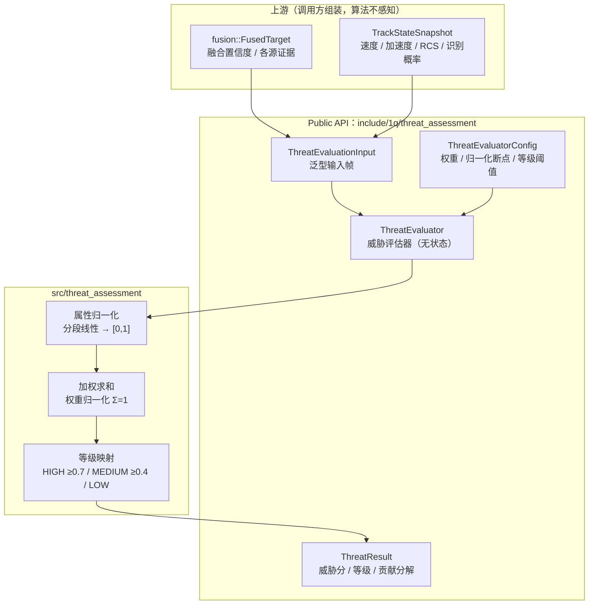

# Threat Assessment 设计

`threat_assessment` 是**目标威胁评估算法面**（多属性决策：归一化加权和 MADM），
是行为组件层第三个跨业务可复用算法面（先例：`navigation`、`fusion`，
决策记录见 `docs/review/Bahavior.md` §4 与
`docs/review/threat_assessment_decision_2026-08-10.md`）。它把目标属性帧
（运动学 + 识别 + 融合证据）聚合为威胁分与威胁等级，供战术决策层消费。

心智模型：**态势 → 威胁**。每周期把一批 `ThreatEvaluationInput`（调用方按目标键
组装：速度/距离/加速度/RCS/类型概率/融合置信度）交给 `ThreatEvaluator::Evaluate`，
取回与输入顺序一致的威胁结果（[0,1] 威胁分 + 高/中/低等级 + 每属性贡献分解）。
评估器是**纯函数式**：无跨周期状态，同输入同输出。

## 关键定位

- **JDL 数据融合模型 Level 3**（威胁/影响评估）的库内落点——融合（Level 1-2 的
  关联+置信度聚合）之后的决策链一环；输入"证据侧"来自 `fusion::FusedTarget`
  （融合置信度、各源质量），"属性侧"通常来自 `airborne_radar` 航迹快照
  （`TrackStateSnapshot`：速度/加速度/RCS/识别概率），由调用方组装为泛型输入帧。
- **算法不感知传感器与坐标系**：距离由调用方计算（目标到受保护资产/平台的斜距），
  与 `DetectionRecord` 泛型化同构；不引用 `fusion`、`airborne_radar` 任何类型。
- **选型依据**（双向评估结论，详见决策记录 §2-§5）：文献八大流派对比后选中
  归一化加权和——工程共识主流（TEWA 综述 Roux & van Vuuren 2007）、可解释
  （每属性贡献分解）、实时（O(n)）、无训练数据；D-S/贝叶斯/神经网络等列为非目标。
- **融合置信度消费方式（本库空白点结论）**：文献没有"融合器 [0,1] 置信度直接作
  威胁属性"的标准做法；本库将 `FusedTarget.confidence`（冻结公式，可 >1）钳制
  归一化到 [0,1] 后作为"证据强度"属性参与加权（决策记录 §3、algorithms.md 反直觉点）。
- 与 AR 决策层既有 `ThreatAssessmentEvaluator`（速度/RCS 阈值启发式）**并存不合并**：
  既有启发式服务单传感器路径，本算法面服务融合态势路径。

## 文档导航

- 模块边界、非目标、设计变更规则 → [boundaries.md](boundaries.md)
- 算法清单（归一化加权和、等级映射、反直觉点）与实现边界 → [algorithms.md](algorithms.md)

注：threat_assessment 不含 data-flow.md——它是无状态函数式算法面
（`Evaluate(inputs) → results`），没有数据流管线。

## 架构分层

读图方式：
1. 调用方只依赖 `ThreatEvaluator` 与三个公共值类型（聚合入口 `threat_assessment.hpp`）。
2. 输入是**调用方组装的泛型帧**：融合输出给证据侧，航迹快照给属性侧，距离由调用方算。
3. 评估无状态：归一化 → 加权 → 映射三级管线，逐输入独立。

跨模块公共规则见 `docs/common/contract.md`（threat_assessment 不参与三层输出模型
与传感器周期语义，与 fusion 一致）。
